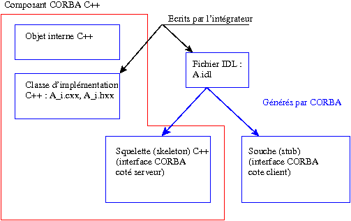

.. _secaccescorba:

Component with remote access (through CORBA)
================================================
Principle
----------
The interfaces necessary to “see” an internal object like a remote component are based on the definition of a “contract” that 
specifies the services proposed by a component and the mode of accessing these services (input and output parameters, exceptions returned).

These declarations are contained in an **IDL file** that is used as a reference to define the interface code at the component end 
and at the clients end of the component.  Examples are given later.  The designer of the component starts from the IDL file and 
develops a server end interface to set up communication between the network (through CORBA) and the internal object.  
The designer of each client starts from the IDL file and develops an interface to set up communication between the 
network (through CORBA) and the component user code.

  .. _figaccescorba2:

  .. image:: images/accesCorbaIDL.png
     :align: center

  .. centered::   Access from CORBA

IDL file
-----------
The first step is for the component developer to define a list of proposed services and the method of calling them, in 
a file called the IDL file.  This file contains data structures declarations and classes (“interface” in the CORBA terminology) in 
a language defined by the CORBA (IDL) standard.  
`OMG IDL Syntax and Semantics <http://doc.ece.uci.edu/CORBA/formal/01-12-07.pdf>`_ [IDL]_ is a reference document on the IDL language syntax.

**Note**  
  This language is similar to a sub-set of the C++ and java languages.  CORBA defined its own interface language to achieve 
  transparency relative to client and server implementation languages.  A client written with a programming language can connect 
  through CORBA to a server implemented in another language.  The only condition is that there are two CORBA ORBs (or systems) 
  interfaced with languages used in the server and the client.  There are ORBs capable of managing many 
  languages (C, C++, java, python, etc.).  A single ORB (omniORB) was chosen within SALOME, making it possible to use clients 
  and servers written in C++ or in python indifferently.

Example 6 (Part 1)
^^^^^^^^^^^^^^^^^^^^^^^
An IDL file is written to access objects (C++) in the alglin class from CORBA (see the ``alglin.hxx`` file in Example 1 and 
other examples).  The corresponding IDL file may for example contain:  

.. _alglin.idl:

``alglin.idl``

.. include:: ./exemples/exemple6/alglin.idl
   :literal:

**Comments**

#. The IDL file begins with the ``module Distant {`` line.  Whenever possible, it is recommended that interface declarations 
   should be contained within a module.
#. The ``vecteur`` class of the C++ version does not have to be declared in IDL.  The IDL language has a base type (``sequence <double>``) 
   that can manage a simple vector.

Example 7 (Part 1)
^^^^^^^^^^^^^^^^^^^^^^^
An IDL file is constructed to access (python) objects in the FreeFem class from CORBA (see ``FreeFem.py``, Example 4 and 
subsequent examples).  The corresponding IDL file may for example contain:

.. _freefem.idl:

``FreeFem.idl``

.. include:: ./exemples/exemple7/FreeFem.idl
   :literal:

Server end interface
----------------------
A server end interface has to be developed from the IDL file.  The principle consists of defining an object communicating 
firstly with the internal object and secondly with the CORBA communication layer.  It will be written in a manner that will 
depend on the implementation language of the internal object (C++ or python).

.. _interfacec++:

C++ server interface
^^^^^^^^^^^^^^^^^^^^^

.. centered::   CORBA C++ interface generation

When the internal object is written in C++ (or it has a C++ higher layer), a C++ implementation class will have to be 
defined at the server end that

- is derived from the ``POA_<module name>::<idl class name>`` class (class generated by the system starting from the IDL file)
- is derived from the ``PortableServer::ServantBase`` class (class provided by the system, that provides a reference 
  counter to the implementation class)
- defines methods corresponding to the methods and attributes of the IDL class 
- has a pointer to the internal object as an attribute.

**Note**  
  The final point above can be replaced by:

.. epigraph::

   is derived from the class of the internal object

  The first version is recommended in preference, because it is easier to implement.

**Important**:  Most CORBA implementations can generate skeletons of implementation classes.  It is strongly recommended 
that this feature should be used to facilitate writing implementation classes.

In the case of omniORB::

   omniidl -bcxx -Wbexample <nom>.idl

(note the –Wbexample option) generates a ``<name>_i.cc`` file that contains the implementation class and an example of 
the main program at the server end.  This file then has to be “cleaned” (keeping the method call prototypes) and completed.  
Methods for implementation classes receive and return CORBA objects.  Therefore, if necessary, each method must:

- convert CORBA objects in input into C++ objects (or into simple types)
- call the method(s) of the internal object
- convert the C++ objects resulting from the methods of the internal object into CORBA objects

.. _implc++:

Example 6 (continued)
^^^^^^^^^^^^^^^^^^^^^^^
Consider an example consisting of a server end implementation class that calls objects in the ``alglin`` class from CORBA:

.. _alglini.hxx:

``alglin_i.hxx``

.. include:: ./exemples/exemple6/alglin_i.hxx
   :literal:

.. _alglini.cxx:

``alglin_i.cxx``

.. include:: ./exemples/exemple6/alglin_i.cxx
   :literal:

**Note**  
  Note that the ``create_vector`` and ``destroy_vector`` functions are not exported in IDL, because a standard CORBA type 
  is used (``sequence<double>``).

Python server interface
^^^^^^^^^^^^^^^^^^^^^^^^
This case is similar to the previous case.  It can be simpler (it is not always necessary to include input and output 
parameter conversion phases).

  .. _interfacepython:

  .. image:: images/objCorbapy.png
     :align: center

  .. centered::   Generation of the python CORBA interface

**Note**  
  This is due to the fact that python is not as strongly typed as C++:  a python function can be executed if the input parameters 
  possess all methods and attributes called in the function.  This is the case if the methods in the implementation class have 
  the same signatures as methods in the internal object class, as in example 7 below.

Example 7 (continued)
^^^^^^^^^^^^^^^^^^^^^^^^^
We will consider an example consisting of the python implementation class at the server end used to call objects in 
the ``FreeFem`` class from CORBA:

.. _freefemi.py:

``FreeFem_i.py``

.. include:: ./exemples/exemple7/FreeFem_i.py
   :literal:

Client interface
----------------
The client end interface code can be written in any language (provided that there is a CORBA implementation in this 
language), independently of the language(s) used at the server end.

Essentially, it is necessary:

- during compilation, to have the CORBA interface generated at the client end (generally, CORBA generates the two 
  interfaces at the client and server ends simultaneously) and to integrate it into the client code,
- during execution, retrieve the CORBA reference of the server end component,
- call component methods on this CORBA reference.

Example 8
^^^^^^^^^
In the context of SALOME, there is no need to write clients for user components.  However, consider a C++ client example 
and a python client example in the CORBA AlgLin class:

``client.cxx``

.. include:: ./exemples/exemple8/client.cxx
   :literal:

``client.py``

.. include:: ./exemples/exemple8/client.py
   :literal:

