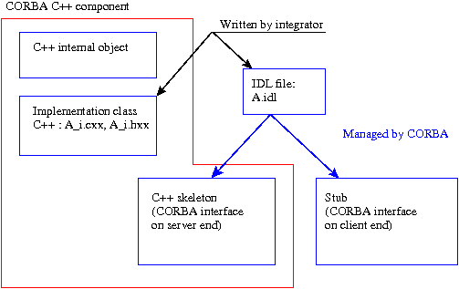

.. _secaccescorba:

Composant à accès distant (via CORBA)
=====================================

Principe
--------

Les interfaces nécessaires pour "voir" un objet interne comme un composant
distant reposent sur la définition d'un "contrat" qui précise les services
proposés par un composant et le mode d'accès à ces services  (paramètres
d'entrée et de sortie, exceptions renvoyées).    

Ces déclarations sont contenues
dans un **fichier IDL** qui sert de référence  pour définir le code d'interface
côté composant et côté clients du composant. Des  exemples sont donnés plus
loin.    A partir du fichier IDL, le concepteur du composant développe une
interface  côté serveur pour faire communiquer le réseau (via CORBA) et l'objet
interne.    A partir du fichier IDL, le concepteur de chaque client développe
une interface  pour faire communiquer le réseau (via CORBA) et le code
utilisateur  du composant.

  .. _figaccescorba2:

  .. image:: images/accesCorbaIDL.png
     :width: 62ex
     :align: center

  .. centered::   Accès depuis CORBA

Fichier IDL
-----------

La première étape consiste, pour le développeur du composant à définir  dans un
fichier dit fichier IDL, la liste des services proposés et leur  mode d'appel.
Ce fichier contient des déclarations de structures de données et des  classes
("interface" dans la terminologie CORBA) dans un langage  défini par la norme
CORBA (IDL). Un document de référence sur la syntaxe du  langage IDL est `OMG
IDL Syntax and Semantics <http://doc.ece.uci.edu/CORBA/formal/01-12-07.pdf>`_
[IDL]_.    

**Remarque**
  Ce langage est proche d'un sous-ensemble des langages C++ et java.
  CORBA  a défini son propre langage d'interface pour assurer la transparence par
  rapport aux langages d'implémentation des clients et serveurs.    Un client
  écrit avec un langage de programmation peut se connecter   à travers CORBA, à un
  serveur implémenté dans un autre langage. La seule  condition est que l'on
  dispose de 2 ORB (ou systèmes)   CORBA interfacés aux langages utilisés dans le
  serveur  et le client. Pour de nombreux langages (C, C++, java, python, ...),
  il existe des ORB capables de les gérer.    Au sein de Salomé, on a choisi un
  ORB unique, omniORB, qui permet d'utiliser  des clients et des serveurs écrits
  indifféremment en C++ ou en python.

Exemple 6 (1ère partie)
^^^^^^^^^^^^^^^^^^^^^^^

On construit un fichier IDL pour accéder depuis CORBA à des objets (C++)  de la
classe alglin (voir fichier ``alglin.hxx`` d'Exemple 1  et suivants).
Le fichier IDL correspondant contiendra par exemple :

.. _alglin.idl:

``alglin.idl``

.. include:: ./exemples/exemple6/alglin.idl
   :literal:

**Commentaires**

  #. Le fichier IDL commence par la ligne ``module Distant {``.  Autant que
     possible, on conseille d'encadrer les déclarations  d'interfaces dans un module.

  #. La classe ``vecteur`` de la version C++ n'a pas besoin d'être  déclarée dans
     l'IDL. Le langage IDL possède en effet un type de base  (``sequence <double>``)
     capable de gérer un vecteur simple.

Exemple 7 (1ère partie)
^^^^^^^^^^^^^^^^^^^^^^^

On construit un fichier IDL pour accéder depuis CORBA à des objets (python)  de
la classe FreeFem (voir ``FreeFem.py``, Exemple 4 et  suivants)      Le
fichier IDL correspondant contiendra par exemple :

.. _freefem.idl:

``FreeFem.idl``

.. include:: ./exemples/exemple7/FreeFem.idl
   :literal:

Interface côté serveur
----------------------

A partir du fichier IDL, il faut développer une interface côté serveur.    Le
principe consiste à définir un objet communicant avec l'objet interne  d'une
part et avec la couche de communication CORBA d'autre part.    L'écriture
dépendra du langage d'implémentation de l'objet interne  (C++ ou python).

.. _interfacec++:

Interface serveur C++
^^^^^^^^^^^^^^^^^^^^^

.. centered::   Génération d'interface C++ CORBA

Lorsque l'objet interne est écrit en C++ (ou possède une couche  supérieure
C++), il faut définir une classe d'implémentation C++ côté serveur qui

* dérive de la classe ``POA_<nom module>::<nom classe idl>``  (classe générée
  par le système à partir du fichier IDL),

* dérive de la classe ``PortableServer::RefCountServantBase``  (classe fournie
  par le système, qui muni la classe d'implémentation  d'un compteur de
  référence),

* définit des méthodes correspondant aux méthodes et attributs de  la classe
  IDL,

* possède en attribut un pointeur vers l'objet interne.

**Remarque**
  Le dernier point ci-dessus peut être remplacé par :

.. epigraph::

   dérive de la classe de l'objet interne.

  On conseille plutôt la première version qui est plus simple à mettre en oeuvre.

**Important** : La plupart des implémentations CORBA peuvent  générer des squelettes de classes
d'implémentations. On conseille vivement  d'utiliser cette possibilité pour
faciliter l'écriture des classes d'implémentation.    

Dans le cas d'omniORB, la commande    ::

   omniidl -bcxx -Wbexample <nom>.idl

(remarquer l'option -Wbexample) génère un fichier ``<nom>_i.cc`` qui   contient
la classe d'implémentation et un exemple de programme principal  côté serveur.
Il faut alors "nettoyer" ce fichier (en conservant  les prototypes d'appel des
méthodes) et le compléter.    Les méthodes des classes d'implémentation
reçoivent et renvoient des objets  CORBA. Il faut donc, si nécessaire, que
chaque méthode :

* convertisse les objets CORBA en entrée en objets (ou en type simples) C++

* appelle la (ou les) méthodes de l'objet interne

* convertisse les objets C++, résultats des méthodes de l'objet interne  en
  objets CORBA

.. _implc++:

Exemple 6 (suite)
^^^^^^^^^^^^^^^^^

Donnons comme exemple, une classe d'implémentation côté serveur qui permette
d'appeler depuis CORBA les objets de la classe ``alglin`` :

.. _alglini.hxx:

``alglin_i.hxx``

.. include:: ./exemples/exemple6/alglin_i.hxx
   :literal:

.. _alglini.cxx:

``alglin_i.cxx``

.. include:: ./exemples/exemple6/alglin_i.cxx
   :literal:

**Remarque**
  Notons que les fonctions ``create_vector`` et ``destroy_vector``  ne sont pas
  exportées dans l'IDL, puisqu'on utilise un type CORBA standard
  (``sequence<double>``.

Interface serveur python
^^^^^^^^^^^^^^^^^^^^^^^^

Ce cas est similaire au précédent. Il peut
être plus simple (il n'est pas  toujours nécessaire d'inclure les phases de
conversion des paramètres d'entrée  et de sortie).

  .. _interfacepython:

  .. image:: images/objCorbapy.png
     :width: 61ex
     :align: center

  .. centered::   Génération d'interface python CORBA

**Remarque**
  Ceci est dû au fait que python est moins fortement typé que C++ : une fonction
  python peut s'exécuter si les paramètres d'entrée possèdent toutes les méthodes
  et attributs appelés dans la fonction.    C'est le cas, si les méthodes de la
  classe d'implémentation ont les mêmes  signatures que des méthodes de la classe
  de l'objet interne, comme dans l'exemple 7 ci-après.

Exemple 7 (suite)
^^^^^^^^^^^^^^^^^

Donnons comme exemple, une classe d'implémentation python côté serveur   qui
permette  d'appeler depuis CORBA les objets de la classe ``FreeFem`` :

.. _freefemi.py:

``FreeFem_i.py``

.. include:: ./exemples/exemple7/FreeFem_i.py
   :literal:

Interface client
----------------

Le code d'interface côté client peut être écrit dans n'importe quel langage
(pourvu que l'on dispose d'une implémentation CORBA dans ce langage),
indépendamment du ou des langages utilisés côté serveur.    

Essentiellement, il faut :

* lors de la compilation, faire générer l'interface CORBA côté client  (en
  général, CORBA génère simultanément les 2 interfaces côté client et  serveur) et
  l'intégrer dans le code client,

* lors de l'exécution, récupérer la référence CORBA du composant  côté serveur,

* appeler sur cette référence CORBA, les méthodes du composant.

Exemple 8
^^^^^^^^^

Dans le cadre de Salomé, l'écriture de clients n'est pas nécessaire  pour les
composants utilisateur. Donnons cependant  un exemple de client C++ et un
exemple de client python de la classe  CORBA AlgLin :

``client.cxx``

.. include:: ./exemples/exemple8/client.cxx
   :literal:

``client.py``

.. include:: ./exemples/exemple8/client.py
   :literal:

