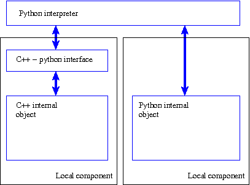
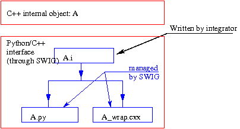

.. _secacceslocal:

Component with local access
==============================
Principle
-------------
As mentioned in the :ref:`secetapes` chapter, the internal object built in the :ref:`seccompinterne` chapter can be manipulated 
from a local python interpreter according to the following scheme.

.. _figacceslocal2:

.. centered::   Access from a local python interpreter

In the case of a C++ internal object, a python/ C++ interface has to be written to obtain a local component.  
The next section describes how this interface is written.  Nothing needs to be done in the case of a python internal 
object:  the python internal object can be used as a local component.

Starting from a python internal object
------------------------------------------
There is no need to introduce an additional interface if the internal object is implemented as a python object.

Starting from a C++ internal object
------------------------------------------
A python/C++ interface has to be used before a C++ object can be used from a python interpreter.  This interface can be 
coded by the integrator or it can be generated (semi-) automatically using tools such as swig [SWIG]_ or boost [BOOST]_.  
This document describes how the interface is generated using swig, through a simple example.  Refer to the swig 
documentation, or even the python documentation, for processing of special cases.

Swig interface file
^^^^^^^^^^^^^^^^^^^^^^^^
The standard procedure to use swig is to write an **interface file** (terminating with ``.i``).  This interface file 
is very similar to a C++ interface file (for example see ``vecteur.hxx`` or ``FreeFem.hxx``).  It contains all C++ 
declarations (structures, functions, classes, constants, etc.) that the integrator wants to “export” to the python level.  
Only the public part of classes can be indicated in the interface file for C++ classes.  Examples will be given later.
 
Process for generating the C++ / python interface code
^^^^^^^^^^^^^^^^^^^^^^^^^^^^^^^^^^^^^^^^^^^^^^^^^^^^^^^^^
**Rule**  
  Extensions to the python language written in the C / C++ / f77 language (compiled languages other than python) must be compiled 
  in the form of dynamic libraries (``.so`` under unix, ``.dll`` under windows).  These extensions will be loaded from the python 
  interpreter using the import command.

Therefore, all components to be integrated will be compiled in the form of a dynamic library, which will mean a particular 
procedure for the use of debugging tools (see below).  The various operations to be carried out and the files involved in the 
process are shown diagrammatically on the following figure.

.. _processusswig:

.. centered::   Interface through swig

Example 5 (first version)
^^^^^^^^^^^^^^^^^^^^^^^^^^^^
If it is required to access the ``alglin`` class from a local python interpreter, an interface file will be written with type:

.. _alglin.i.v1:

``alglin.i``

.. include:: ./exemples/exemple5/v1/alglin.i
   :literal:

The different lines mean::

   %module AlgLinModule

Defines the name of the python module.  We will write ``import AlgLinModule``, to import the definitions of the component 
from a python interpreter. ::

   %{
   #include "alglin.hxx"
   %}

The C++ declarations that the C++ / python interface code will need will have to be written between the ``%{`` and ``%}`` 
lines (otherwise the C++ file generated by swig will not compile).  Typically, the interface file of the C++ internal 
object constructed in the previous chapter will be included here.

::

   class alglin {
   public:
     alglin ();
     ~alglin ();
     void      addvec (vecteur *C, vecteur *A, vecteur *B);
     double    prdscl (vecteur *A, vecteur *B);
     vecteur * create_vector (long n);
     void      destroy_vector (vecteur *V);
   
   };

The remainder of the ``alglin.i``. file includes an indication about the classes and definitions that are to be 
exported to the python interpreter.  Example use of the generated interface:

.. include:: ./exemples/exemple5/v1/sortie.txt
   :literal:

**Notes**

  #. A constructor (``alglin()`` ) and a destructor (``~alglin()`` ) have been introduced that were not in the declaration of 
     the C++ class (file ``alglin.hxx``).  This constructor and this destructor are not necessary in the C++ class of the internal 
     object (the internal object does not need to be initialised when it is created and does not manage the C++ dynamic memory).  
     In this case, the compiler provides a default constructor and destructor.  On the other hand, a constructor and a destructor 
     **must be** explicitly declared for the swig interface file so that python can manage the C++ memory correctly (i.e. the internal 
     C++ object is also created / deleted “cleanly” when a python object is created / deleted).
  #. Note that the definition of the ``vector`` structure/class is not explicitely described in the ``alglin.i`` interface file. ``Vector`` 
     type objects will be seen from the python interpreter as “black box” objects (their type and memory location are known, but 
     associated methods / attributes are not known). The following error message will be produced if an attempt is made to call 
     a method on a vector object:

.. include:: ./exemples/exemple5/v1/sortie2.txt
   :literal:

.. epigraph::

   The second version of this example (below) will correct this problem.

   .. % 

Example 5 (second version)
^^^^^^^^^^^^^^^^^^^^^^^^^^^^
The first version of the example suffers from two defects (among others) concerning vector type objects:

- there is no access to methods nor to attributes of objects in the vector class (see the second comment above)
- nothing is provided to initialise/modify the coefficients contained in a vector object.

Swig enriches the ``alglin.i`` interface file to add missing functions:

.. _alglin.i.v2:

``alglin.i (version 2)``

.. include:: ./exemples/exemple5/v2/alglin.i
   :literal:

**Note**  
  Unlike the previous version, there is the declaration of the vector class, which for example provides access to the size of vectors 
  and to a “handle” to coefficients (but not to coefficients individually).  The third version will correct this defect.  
  An example use of the component (and the limitation on access to vectors) is given below:

.. include:: ./exemples/exemple5/v2/sortie.txt
   :literal:

Example 5 (third version)
^^^^^^^^^^^^^^^^^^^^^^^^^^^^^
The second version of the example makes it possible to “see” vector type objects but only at the “surface”.  In particular, there is 
no individual access to coefficients from the python interpreter.  By adding utility functions (``__setitem__`` and ``__getitem__``) 
into the ``alglin.i`` interface, the third version makes it possible to (partially) simulate genuine coefficient vectors from the python layer.

**Note**: We have also added an ``__str__`` display function that displays the list of coefficients of v, when 
``print v`` is executed from the interpreter.

.. _alglin.i.v3:

``alglin.i (version 3)``

.. include:: ./exemples/exemple5/v3/alglin.i
   :literal:

The following contains an example use of the component (including access to vectors):

.. include:: ./exemples/exemple5/v3/sortie.txt
   :literal:

