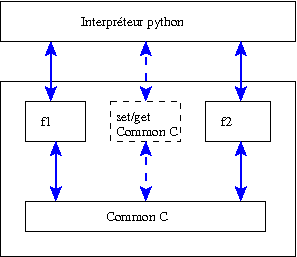

Appendix:  processing of fortran commons and C / C++ global variables
========================================================================
Fortran common
--------------
This section is the result of studies carried out by Marc Boucker, Alexandre Douce, Céline Béchaud and Marc Tajchman 
(for further details, see [COMMON]_). We do not aim to present a complete state of possible situations in this description.  
The fortran 77 codes that are to be controlled from the python interpreter or from Corba / SALOME often define memory zones 
shared between the different fortran functions, called “common”.  
For example, functions ``f1`` and ``f2`` use the same memory zone ``a`` in common ``C``. 

.. _f1:

``f1.f``

.. include:: ./exemples/exemple11/v1/f1.f
   :literal:

.. _f2:

``f2.f``

.. include:: ./exemples/exemple11/v1/f2.f
   :literal:

If the two functions are contained in the same component and common ``C`` is not used by functions of other components, the 
common is not visible from outside the component and “everything takes place properly” (see 
figure :ref:`Using a common in a component <figcommon0>`).  If the component designer wants to allow common to be read or 
written from the python and/or CORBA layer, he will easily be able to write access functions (for example ``setCommon`` and 
``getCommon`` functions in the following example).

``common.f``

.. include:: ./exemples/exemple11/v1/common.f
   :literal:

.. _figcommon0:

.. centered:: Using a common in a component

The following is an example encapsulation in C++, then in python (through swig):

``f.hxx``

.. include:: ./exemples/exemple11/v1/f.hxx
   :literal:

``modf.i``

.. include:: ./exemples/exemple11/v1/modf.i
   :literal:

A practical example:

.. include:: ./exemples/exemple11/v1/resultats.txt
   :literal:

If common ``C`` is used in several dynamic libraries, management is more difficult.  In general, it is impossible 
to assume that the common used by each library is located at the same memory address.  There are two typical 
situations that can arise:

#. The two components are installed locally from the same python interpreter:

     .. _figcommon1:

     .. image:: images/common1.png
        :align: center

     .. centered:: Using a common shared between two libraries – Local version

#. The two components are installed in different memory zones (on the same machine or on different machines) through 
   the SALOME mechanism (containers):

     .. _figcommon2:

     .. image:: images/common2.png
        :align: center

     .. centered:: Using a common shared between two libraries – distributed version

Synchronization functions are necessary in both cases (for example using functions to read / write commons 
from the python and/or SALOME command layer).  The adaptation to the case of two local components loaded from a 
python interpreter is written as follows:
 
#. For the first component:

   ``f1.hxx``

   .. include:: ./exemples/exemple11/v2/f1.hxx
      :literal:

   ``modf1.i``

   .. include:: ./exemples/exemple11/v2/modf1.i
      :literal:

#. For the second component:

   ``f2.hxx``

   .. include:: ./exemples/exemple11/v2/f2.hxx
      :literal:

   ``modf2.i``

   .. include:: ./exemples/exemple11/v2/modf2.i
      :literal:

#. Read and write functions for the common will be included in each component.

A practical example

.. include:: ./exemples/exemple11/v2/resultats.txt
   :literal:

In summary, if an existing code comprising commons has to be broken down into several components, it is possible to either:

- modify the code by removing the commons and transferring information through lists of function parameters;
- write functions to provide read/write access to the commons and use these read/write functions from layers higher 
  than components, so as to synchronize the internal states of the different components.
 
The first solution requires that in-depth action is taken in the fortran code, while the second requires that the 
user explicitely synchronises commons in the different components.  It is strongly recommended that commons should not be 
used in new fortran codes.

C/C++ global variables
------------------------
The situation is similar to the case of commons:  each component will have its own set of global variables.  
A method is necessary to assure that these different sets of variables are consistant.

