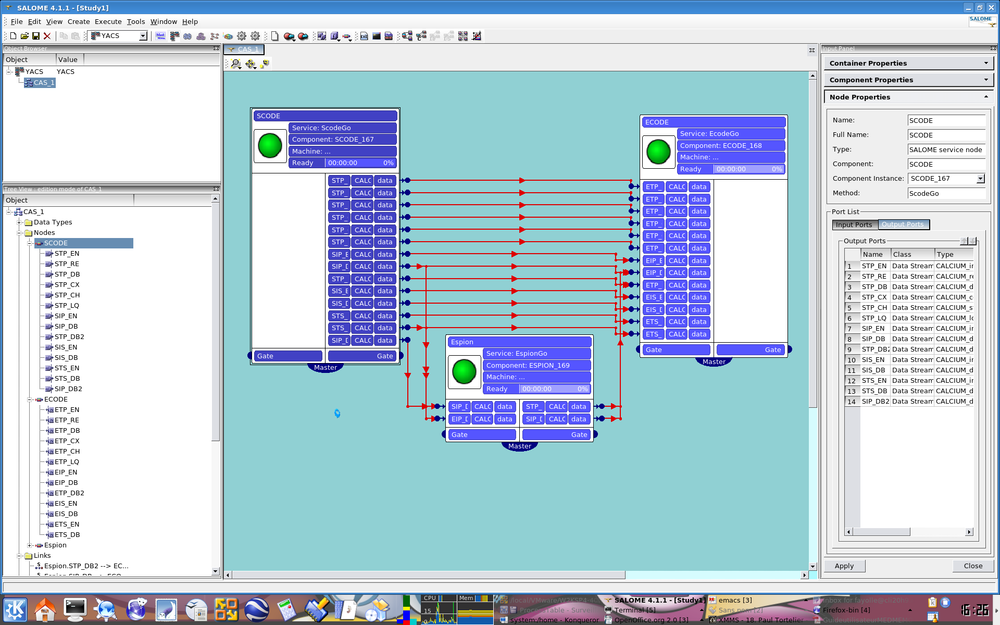

Guide de mise en oeuvre d'un couplage CALCIUM dans SALOME
==========================================================

Ce manuel ne se substitue pas au manuel CALCIUM et n'explique donc que succinctement l'utilisation des primitives, il convient de se rapporter aux notes HI-26/03/007/A et HI-76/96/009/B pour plus d'informations à ce sujet.

L'évolution du produit CALCIUM vers CALCIUM dans SALOME
-------------------------------------------------------

Cette section explique les raisons de l'évolution du produit CALCIUM vers CALCIUM dans SALOME. Après une brève présentation des avantages et inconvénients du produit CALCIUM existant, la deuxième section présente l'implémentation de CALCIUM dans SALOME en utilisant les ports DSC. La dernière section expose l'utilisation conjointe des ports CALCIUM et du superviseur YACS.

Le produit CALCIUM existant
'''''''''''''''''''''''''''

Le produit CALCIUM permet la mise en oeuvre rapide de couplages de codes Fortran/C/C++ de façon simple et peu intrusive. Les responsables des codes intervenant dans le couplage distinguent les données d'intérêt général par la définition de points de connexion d'entrés et de sorties. Le responsable du couplage global définit le nombre d'exécutions simultanées des différents codes et les liens de transmission entre les points de connexion de ces instances d'exécution. Cette description s'appelle le schéma de couplage et est stockée dans un fichier de couplage.

Les points de connexion sont typés par des types simples (entier, flottant, double, booléens, chaîne) et fonctionnent selon un mode temporel ou itératif. Les données produites sont estampillées par une date ou un numéro d'itération. La production et la lecture de données se font dans les codes respectivement par appel aux primitives d'écritures ou de lectures. La production est indépendante des demandes sur les points de connexion en lecture (asynchronisme).

Lorsque des données sont demandées pour une date ultérieure aux données déjà produites, les instances lectrices attendent sur les primitives de lectures bloquantes ou reçoivent un code indiquant l'absence de donnée en mode non bloquant. Lorsque des données sont demandées à une date encadrée par les estampilles de données déjà produites, le lecteur a la possibilité d'obtenir des données interpolées (L0 et L1) en mode temporel.  S'il se trouve que le/s lecteur/s attendent des données qui ne seront jamais produites, le couplage se trouve en inter-blocage. CALCIUM détecte cette situation et propose soit de stopper l'exécution du couplage soit d'extrapoler les données demandées afin de débloquer la situation. Cette gestion dépend du mode d'utilisation de CALCIUM : mode de production ou mode debug.

En effet, le produit CALCIUM possède depuis sa version 3 deux modes de fonctionnement. Le premier dit mode debug, seul mode disponible des versions antérieures, possède  un processus coupleur par lequel toutes les données transitent. Dans le second, dit mode de production, les instances de codes communiquent directement entre elles. En mode debug, le débit de transfert est limité par la capacité du lien réseau du coupleur à gérer les accès simultanés. Dans ce mode, le coupleur doit stocker une copie de chaque donnée reçue afin de pouvoir les délivrer au moment voulu et être capable de détecter une situation d'inter blocage. Le mode de production permet un transfert de données dont les performances ne sont pas limitées par la capacité des liens entrant et sortant du coupleur puisqu'il n'existe plus. Ce mode a cependant les limitations suivantes : pas de détection d'inter blocage (mais gestion d'un timeout), fonctionnement local des requêtes de retour en arrière, pas de mode d'exécution pas à pas et pas de gestion dynamique de couplage.

Les ports CALCIUM dans SALOME
'''''''''''''''''''''''''''''

Une expérimentation d'utilisation de l'outil CALCIUM existant (en mode de production) dans SALOME a permis de mettre en place plusieurs couplages lors de l'école d'été 2004. Elle a montré la pertinence de faire cohabiter des  ports de type datastream avec les ports dataflow/control flow de SALOME. Elle a cependant nécessité une modification spécifique localisée dans la procédure de lancement CALCIUM et mis en valeur les limitations suivantes :

* Nécessité d'utiliser un container différent par service utilisant CALCIUM (même pour les services d'un même composant ( CALCIUM n'est pas multithread safe )

* Ré exécutions successives du couplage difficiles (nécessité de ne pas appeler MPI_FIN et problèmes liés à l'état de la machine virtuelle MPI)

* Le SUPERVISEUR SALOME n'a aucun contrôle sur l'exécution du couplage CALCIUM

* Pas d'extension possible des types CALCIUM transmis

* Cohabitations parfois difficiles de l'environnement MPI et de l'environnement CORBA

  

Le module KERNEL de SALOME V4 est pourvu de nouveaux ports de communications appelés ports DSC (Dynamic Software Component) permettant aux composants d'ajouter/supprimer dynamiquement de nouvelles interfaces accessibles à tous. La note ..... décrit l'utilisation/conception/utilité de ces nouveaux ports. Il existe deux classes de ports DSC, les ports qui fournissent une interface (ports provides) et les ports qui utilisent des interfaces (port uses).

Une implémentation de ports CALCIUM basée sur cette technologie est disponible depuis la version V4 du KERNEL de SALOME. Il est donc possible de réaliser des couplages CALCIUM par simples appels des primitives CALCIUM dans les services des composants. Cette implémentation reprend les fonctionnalités de CALCIUM dans son mode de production. L'utilisation de cette technologie nécessite uniquement le module KERNEL de SALOME. Cependant, à moins d'utiliser le superviseur YACS, l'utilisateur devra écrire un script python ou un service de composant pour charger les composants du couplage, les initialiser, connecter les différents ports, les configurer et lancer les services dans l'ordre adéquat.

Les ports CALCIUM/SALOME et le superviseur YACS :
'''''''''''''''''''''''''''''''''''''''''''''''''

Le superviseur YACS disponible depuis la version V4.1 de  SALOME gère tous types de ports DSC et en particulier les ports CALCIUM. Il décharge l'utilisateur de l'implémentation d'un script ou d'un service pour connecter et configurer les ports. Il contrôle la validité du schéma de calcul et lance les services conformément aux dépendances décrites. Il est possible de créer un schéma de calcul mixant des ports de type datastream (mode CALCIUM), dataflow (arrivée d'une donnée qui peut enclencher le démarrage d'un service) et control flow (déclenchement d'un service par la fin d'exécution d'un autre) et créer ainsi des schémas de calcul élaborés.

Le schéma de calcul ainsi créé peut se sauvegarder au format XML. Ce fichier représente l'équivalent du fichier de couplage CALCIUM pour la partie déclaration et paramétrage des liens, la déclaration des ports se faisant dans le fichier XML qui catalogue les ressources du composant.

La création d'un composant SALOME utilisant CALCIUM
---------------------------------------------------

L'utilisation de CALCIUM dans SALOME suppose l'existence de composants SALOME proposant des services à base de ports CALCIUM. Plusieurs choix sont possibles pour créer de tels composants :

*   Créer un module SALOME contenant des composants dont les services ont des ports CALCIUM,

*   Créer plusieurs modules SALOME contenant au moins un composant dont le/s service/s ont des ports CALCIUM.

  

La création d'un module SALOME consiste en la structuration sous forme d'une arborescence standardisée des fichiers d'entêtes, des sources, des bibliothèques et des ressources. Elle peut se faire à partir d'un module modèle (HELLO, pyHELLO) ou à partir d'un générateur de module, ModuleGenerator (cf.  http://pal.der.edf.fr/pal/projets/pal/superv/modulegenerator  ) par exemple.

La personnalisation du composant SALOME pour l'utilisation de ports CALCIUM consiste-en :

* l'inclusion d'un fichier déclarant les ports DSC dans le fichier IDL du composant,

* l'inclusion d'un fichier et la déclaration d'un héritage pour rendre notre composant supervisable,

* la création des ports CALCIUM utilisés dans la définition d'une méthode normalisée appelée init_service,

* la déclaration des ports CALCIUM du/es composant/s dans le fichier catalogue du module.

En utilisant le ModuleGenerator, la méthode init_service et le catalogue XML des services fournis par les composants sont générés automatiquement.

La déclaration IDL des composants utilisant des ports CALCIUM
'''''''''''''''''''''''''''''''''''''''''''''''''''''''''''''

Les ports étant dynamiquement déclarés dans le service init_service, les ports CALCIUM n'ont pas besoin d'être préalablement déclarés dans le fichier IDL. Il faut cependant inclure le fichier DSC_Engine.idl dans le/s fichier/s IDL des composants pour bénéficier des ports DSC.

Exemple du fichier CALCIUM_TESTS.idl du module CALCIUM_TEST définissant trois composants ECODE, SCODE, ESPION qui proposent chacun un unique service de lancement du code wrappé correspondant :

::

    #include "DSC_Engines.idl"
    
    /*! \file CALCIUM_TESTS.idl
      This file contains the first installation test of CALCIUM product.
      Each engine contains one service.
    */
    module CALCIUM_TESTS {
    
      interface ECODE : Engines::Superv_Component {
        void EcodeGo();
      };
    
      interface SCODE : Engines::Superv_Component {
        void ScodeGo();
      };
    
      interface ESPION : Engines::Superv_Component {
        void EspionGo();
      };
    
    };

La déclaration d'un composant C++ utilisant des ports CALCIUM
'''''''''''''''''''''''''''''''''''''''''''''''''''''''''''''

Dans le cas d'un composant wrapper (qui ne fait qu'appeler une implémentation d'une autre unité de compilation), un seul header est nécessaire :

#include "Superv_Component_i.hxx"

Ce fichier d'entête est nécessaire pour rendre notre composant supervisable et pour utiliser les ports DSC. Le composant héritera virtuellement de la classe Superv_Component_i.

Exemple du fichier de déclaration ECODE.hxx du composant ECODE :

::

    #ifndef _ECODE_HXX_
    #define _ECODE_HXX_
    
    #include "Superv_Component_i.hxx"
    //Header CORBA généré du module CALCIUM_TESTS
    #include "CALCIUM_TESTS.hh"
    
    //Interface du code wrappé, ici le code C ecode
    extern "C" { int ecode(void *); }
    
    class ECODE_impl :
      public virtual POA_CALCIUM_TESTS::ECODE, //Implémente l'interface CORBA du composant ECODE
      public virtual Superv_Component_i {                 //Rend le composant supervisable
    
    public :
      ECODE_impl(CORBA::ORB_ptr orb,              //Constructeur classique des composants SALOME
             PortableServer::POA_ptr poa,
             PortableServer::ObjectId * contId, 
             const char *instanceName, 
             const char *interfaceName);
      
      virtual ~ECODE_impl();
    
      CORBA::Boolean init_service(const char * service_name); //Initialisation du service EcodeGo()
      void EcodeGo();
    };
    
    extern "C"
    {
      PortableServer::ObjectId * ECODEEngine_factory(CORBA::ORB_ptr orb,
                             PortableServer::POA_ptr poa,
                             PortableServer::ObjectId * contId,
                             const char *instanceName,
                             const char *interfaceName);
    }
    
    #endif

La déclaration des ressources des composants (partie 1)
'''''''''''''''''''''''''''''''''''''''''''''''''''''''

Les composants publient les signatures de leurs services dans un fichier de ressources XML appelé le catalogue du module (ou catalogue de composants). Ce fichier peut être généré par le ModuleGenerator.

Extrait du catalogue CALCIUM_TESTSCatalog.xml concernant le composant ECODE :

Notre composant ECODE fournit un unique service EcodeGo() qui n'a ni de paramètres d'entrée ni de paramètres sortie.

Nous verrons dans la section création de ports CALCIUM que ce fichier de ressources sera complété de la déclaration des ports datastream.
::

    ....
      <component>
            <component-name>ECODE</component-name>
          ....
            <component-interface-list>
                <component-interface-name>ECODE</component-interface-name>
                <component-interface-comment></component-interface-comment>
                <component-service-list>
                    <component-service>
                        <!-- service-identification -->
                        <service-name>EcodeGo</service-name>
                         ...
                        <!-- service-connexion -->
                        <inParameter-list>
                        </inParameter-list>
                        <outParameter-list>
                        </outParameter-list>
                        <DataStream-list>
                         </DataStream-list>
                    </component-service>
                </component-service-list>
            </component-interface-list>
      </component>

La définition d'un composant utilisant les ports CALCIUM
''''''''''''''''''''''''''''''''''''''''''''''''''''''''

Le composant se charge de créer les ports dont il a besoin. L'étape de création d'un port CALCIUM consiste en l'appel de la méthode add_port fournie par l'héritage virtuel de la classe Superv_Component_i. Elle doit être effectuée avant le lancement du/des services utilisant le port. C'est la raison pour laquelle cette déclaration se trouve dans la méthode standard init_service(char * nom_du_service_a_initialiser). Il existe deux méthodes pour créer un port CALCIUM : la méthode create_calcium_port et la méthode add_port .

La création de ports CALCIUM par la méthode add_port
++++++++++++++++++++++++++++++++++++++++++++++++++++

Cette méthode est utilisée pour créer tout type de port DSC. Elle peut être utilisée pour créer les ports CALCIUM en particulier.

::

    add_port< typage_de_mon_port_fabriqué >(   "le type de port à fabriquer",
                                "provides"|”uses”,
                                "le nom du port")

*"le type de port à fabriquer"*  :

Cette chaîne indique à la fabrique de port DSC du module KERNEL le nom du type de port à créer. Pour CALCIUM, il s'agit des types :
  
“CALCIUM_integer”, “CALCIUM_real”, “CALCIUM_double”, “CALCIUM_logical”, “CALCIUM_complex”, “CALCIUM_string”
  

*"provides"|”uses”*  :

Cette chaîne indique s'il s'agit d'un port CALCIUM de sortie (uses) ou d'un port d'entrée provides. Noter que dans la sémantique DSC, c'est le port provides qui fournie une interface d'écriture utilisée par le port uses.

*"le nom du port"*  :

Le nom du port correspond au nom de la variable utilisée dans les primitives CALCIUM.

*Le typage_de_mon_port_fabriqué*  :

Ce type permet de typer le pointeur retourné par add_port. En ce qui concerne CALCIUM, il s'agit d'indiquer le typage correspondant au nom de type déjà indiqué à la fabrique compléter par l'information uses ou provides :

calcium_integer_port_provides ou calcium_integer_port_uses

calcium_real_port_provides ou calcium_real_port_uses

calcium_integer_port_provides ou calcium_integer_port_uses

calcium_integer_port_provides ou calcium_integer_port_uses

calcium_integer_port_provides ou calcium_integer_port_uses

calcium_string_port_provides ou calcium_string_port_uses

Extrait de la méthode init_service dans le fichier ECODE.cxx du composant ECODE :

::

    CORBA::Boolean ECODE_impl::init_service(const char * service_name) {
    
      CORBA::Boolean rtn = false;
      string s_name(service_name);
      
      if (s_name == "EcodeGo") {
    
        try {
      
        add_port<calcium_integer_port_provides>("CALCIUM_integer","provides","ETP_EN")->
          setDependencyType(CalciumTypes::TIME_DEPENDENCY);
     
         add_port<calcium_real_port_provides>("CALCIUM_real","provides","ETP_RE") ->
          setDependencyType(CalciumTypes::TIME_DEPENDENCY);
        
        add_port<calcium_double_port_provides>("CALCIUM_double","provides","ETP_DB")->
          setDependencyType(CalciumTypes::TIME_DEPENDENCY);
    
        add_port<calcium_complex_port_provides>("CALCIUM_complex","provides","ETP_CX")->
          setDependencyType(CalciumTypes::TIME_DEPENDENCY);
    
        add_port<calcium_string_port_provides>("CALCIUM_string","provides","ETP_CH")->
          setDependencyType(CalciumTypes::TIME_DEPENDENCY);
    
        add_port<calcium_logical_port_provides>("CALCIUM_logical","provides","ETP_LQ")->
          setDependencyType(CalciumTypes::TIME_DEPENDENCY);
     ....
        rtn = true;
        } catch ( const DSC_Exception & ex ) {
          std::cerr << ex.what() << std::endl;;
        }
      } //FIN (s_name == "Ecode")
    
      return rtn;
    }

La création de ports CALCIUM par la méthode create_calcium_port
+++++++++++++++++++++++++++++++++++++++++++++++++++++++++++++++

Cette méthode écrite spécialement pour la création de ports CALCIUM simplifie la création des ports. Elle est utilisée par le ModuleGenerator. Le paramètre “IN”|”OUT” indique s'il s'agit d'un port CALCIUM d'entrée ou de sortie. Le paramètre “T”|”I” indique le mode temporel ou itératif du port.

Extrait de la méthode init_service dans le fichier ECODE.cxx du composant ECODE :

::

    ECODE_i::init_service(const char * service_name) {
       CORBA::Boolean rtn = false;
       string s_name(service_name);
       if (s_name == "EcodeGo")   {
            try   {
                //initialisation CALCIUM ports IN
               create_calcium_port(this,"ETP_EN","CALCIUM_integer","IN","T");
               create_calcium_port(this,"ETP_RE","CALCIUM_real","IN","T");
               create_calcium_port(this,"ETP_DB","CALCIUM_double","IN","T");
               create_calcium_port(this,"ETP_CX","CALCIUM_complex","IN","T");
               create_calcium_port(this,"ETP_CH","CALCIUM_string","IN","T");
               create_calcium_port(this,"ETP_LQ","CALCIUM_logical","IN","T");
    ...      }
           catch(const PortAlreadyDefined& ex)   {
               std::cerr << "ECODE: " << ex.what() << std::endl;
               //Ports already created : we use them
            }
           catch ( ... )   {
               std::cerr << "ECODE: unknown exception" << std::endl;
            }
           rtn = true;
         }
       return rtn;
     }

La déclaration des ressources des composants  (partie 2)
''''''''''''''''''''''''''''''''''''''''''''''''''''''''

Le fichier XML de ressources des composants doit être complété pour déclarer l'existence de ports CALCIUM dans les différents composants. Le ModuleGenerator prend en compte les ports CALCIUM à la génération du catalogue du module.

Extrait du catalogue CALCIUM_TESTSCatalog.xml concernant le composant ECODE :

::

    .....           
                        <DataStream-list>
                           <inParameter>
                              <inParameter-name>ETP_EN</inParameter-name>
                              <inParameter-type>CALCIUM_integer</inParameter-type>
                              <inParameter-dependency>T</inParameter-dependency>
                           </inParameter>
                           <inParameter>
                              <inParameter-name>ETP_RE</inParameter-name>
                              <inParameter-type>CALCIUM_real</inParameter-type>
                              <inParameter-dependency>T</inParameter-dependency>
                           </inParameter>
                           <inParameter>
                              <inParameter-name>ETP_DB</inParameter-name>
                              <inParameter-type>CALCIUM_double</inParameter-type>
                              <inParameter-dependency>T</inParameter-dependency>
                           </inParameter>
    .....           
                        </DataStream-list>

La configuration d'un port CALCIUM
''''''''''''''''''''''''''''''''''

L'étape de configuration des ports reprend l'ensemble des paramétrages possibles des liens du fichier de couplage de CALCIUM hors SALOME. Cette étape peut être effectuée à la création du port dans le composant (méthode init_service), par un composant/script de paramétrage du couplage ou par le superviseur YACS. Cette étape permet d'indiquer pour chaque port de classe provides les caractéristiques suivantes :

* La dépendance temporelle/itérative des données reçues :

TIME_DEPENDENCY ou ITERATION_DEPENDENCY

* Le niveau de stockage des données (taille de la pile de l'historique) :

UNLIMITED_STORAGE_LEVEL (par défaut)

ou un entier strictement positif

* Le schéma temporel choisi pour définir la date utilisée dans les primitives (CPLxx) de lecture en mode temporel :

   * TI_SCHEM  (valeur par défaut) : Les valeurs de la variable d’entrée utilisée sont prises à l’instant correspondant au début du pas de temps en cours de calcul (cf. paramètre  **ti**  de CPLxx)

   * TF_SCHEM : Les valeurs de la variable d’entrée sont prises à l’instant correspondant à la fin du pas de temps en cours de calcul (cf. paramètre  **tf**  de CPLxx)

   * ALPHA_SCHEM : Les valeurs de la variable d’entrée sont prises à un instant égal à TF* *ALPHA* +TI * (1 *-ALPHA* ).  *ALPHA*  peut prendre des valeurs strictement comprises entre 0 et 1. La valeur 0 est remplacée par l’option TI_SCHEM et la valeur 1 est remplacée par l’option TF_SCHEM).

* Le type d'interpolation à utiliser pour un port en mode temporel :

L0_SCHEM,  L1_SCHEM

* Le type d'extrapolation à utiliser en cas de blocage/timeout :

E0_SCHEM, E1_SCHEM (non encore fonctionnel)

* La valeur du paramètre DELTAT qui indique si deux dates sont identiques.

  

L'ensemble des mots clés utilisés à la configuration des ports sont définis dans le namespace C++ CalciumTypes du fichier CalciumTypes.hxx.

La configuration au moment de la création du PORT
+++++++++++++++++++++++++++++++++++++++++++++++++

A la création d'un port, la méthode add_port renvoie un pointeur sur le port utile à sa configuration. Dans la méthode init_service, un exemple de configuration  consiste à indiquer si le port est en mode temporel ou itératif :

::

      add_port<calcium_integer_port_provides>("CALCIUM_integer","provides","ETP_EN")->
          setDependencyType(CalciumTypes::TIME_DEPENDENCY);

Voici les méthodes disponibles pour configurer les ports CALCIUM :

*   Positionner/Interroger le type de dépendance :

Le type de dépendance indique au port si les données sont estampillées par une date ou (exclusif)  un numéro d'itération. Le type de dépendance est par défaut indéfini (CalciumTypes::UNDEFINED_DEPENDENCY). Il est possible d'indiquer   CalciumTypes::TIME_DEPENDENCY ou  CalciumTypes::ITERATION_DEPENDENCY.

::

     void                      setDependencyType (DependencyType dependencyType);
     DependencyType getDependencyType () const;
    

*   Positionner/Interroger le niveau de stockage des données produites :

Le niveau de stockage de l'historique des données produites doit être supérieur ou égale à 1. Il est par défaut illimité  ( CalciumTypes::UNLIMITED_STORAGE_LEVEL). Il peut être nécessaire de l'abaisser afin de limiter la consommation mémoire de cas de couplage présentant de nombreuses itérations.

::

     void   setStorageLevel   (size_t storageLevel);
     size_t getStorageLevel   () const;

  

*   Positionner/Interroger le schéma temporel utilisé pour la définition de la date de lecture :

Le schéma temporel choisi pour définir la date utilisée dans les primitives de lecture en mode temporel est défini à CalciumTypes::TI_SCHEM par défaut. Il est également possible d'indiquer CalciumTypes::TF_SCHEM ou CalciumTypes::ALPHA_SCHEM.

::

      void                  setDateCalSchem   (DateCalSchem   dateCalSchem);
      DateCalSchem getDateCalSchem () const;

  

Si le schéma temporel utilisé est ALPHA_SCHEM, la méthode suivante permet d'indiquer la valeur d'ALPHA à utiliser. Alpha vaut zéro par défaut (équivaut à TI_SCHEM) et peut être positionné entre 0 et 1 compris.

::

    void     setAlpha(double alpha);
    double getAlpha() const ;

* Positionner/Interroger l'écart toléré pour que deux dates soient considérées identiques :

Deux dates T1 et T2 sont identiques si abs(T1-T2) < CalciumTypes::EPSILON. Epsilon vaut 1E-6 par défaut. Il est possible de le paramétrer sur chacun des ports  (0 <= deltaT <= 1).

::

      void     setDeltaT(double deltaT );
      double getDeltaT() const ;

* Positionner/Interroger le type d'interpolation temporelle à utiliser :

Lorsque qu'une demande de lecture est formulée pour une date T qui n'a pas été produite mais encadrée par les dates T1 (min) et T2(max) pour lesquelles des données ont déjà été produites, CALCIUM réalise par défaut une interpolation linéaire CalciumTypes::L1_SCHEM. L'utilisateur peut demander une “interpolation” en escalier CalciumTypes::L0_SCHEM.

::

      void setInterpolationSchem (InterpolationSchem interpolationSchem);
      InterpolationSchem getInterpolationSchem () const ;

* Positionner/Interroger le type d'extrapolation à utiliser :

Ce paramètre permet d'indiquer si l'on veut réaliser une extrapolation pour sortir d'un cas de blocage (un port qui attend une donnée qui ne sera jamais produite). La valeur par défaut est CalciumTypes::UNDEFINED_EXTRA_SCHEM. Les valeurs possibles sont EO_SCHEM (extrapolation en escalier) ou E1_SCHEM (extrapolation linéaire).

::

     void setExtrapolationSchem (ExtrapolationSchem extrapolationSchem);
     ExtrapolationSchem getExtrapolationSchem () const ;

La configuration par les propriétés des ports DSC
+++++++++++++++++++++++++++++++++++++++++++++++++

Cette section explique une utilisation avancée des propriétés des ports DSC pour réaliser l'étape de configuration des ports CALCIUM, elle peut être ignorée en cas d'une utilisation simple des ports CALCIUM.

Tous les ports DSC sont configurables par une liste de propriétés. Il est donc possible d'effectuer l'étape de configuration par un appel CORBA sur les ports concernés.

Les méthodes [set|get]properties des ports DSC manipulent une liste de paires avec une clé du nom de la propriété en première position et la valeur associée en seconde position :

Extrait du fichier SALOME_Component.idl du KERNEL de SALOME :
::

     struct KeyValuePair  {
        string key;
        any value;
      };
    typedef sequence<KeyValuePair> FieldsDict;
    void setProperties(in FieldsDict dico);
    FieldsDict getProperties();

CALCIUM déclare les types suivants dans le fichier Calcium_Ports.idl du KERNEL de SALOME :

::

    const long UNLIMITED_STORAGE_LEVEL = -70;   
    enum DependencyType { UNDEFINED_DEPENDENCY, TIME_DEPENDENCY, ITERATION_DEPENDENCY};
    enum DateCalSchem           { TI_SCHEM, TF_SCHEM , ALPHA_SCHEM};
    enum InterpolationSchem   { L0_SCHEM, L1_SCHEM };
    enum ExtrapolationSchem  { UNDEFINED_EXTRA_SCHEM, E0_SCHEM, E1_SCHEM};

Les propriétés reconnues sont donc les paires suivantes :
  
("StorageLevel", int > 0 )
  
("Alpha”, 0 <=  double <= 1 )
  
("DeltaT", 0 <= double <= 1 )
  
("DependencyType", enum CORBA DependencyType)
  
("DateCalSchem", enum CORBA DateCalSchem)
  
("InterpolationSchem",enum CORBA InterpolationSchem)
  
("ExtrapolationSchem",enum CORBA ExtrapolationSchem)

Exemple de configuration dynamique par un script python (extrait du fichier CAS_1.py):
::

    ...
    port1=ecode.get_provides_port("ETS_DB",0);
    myAny1_1=4
    port1.set_property("StorageLevel",any.to_any(myAny1_1))
    

Les méthodes get_provides_port et set_properties sont fournies par l'implémentation par défaut des composants SALOME supervisable.

La configuration dans le fichier XML de YACS
++++++++++++++++++++++++++++++++++++++++++++

Le module superviseur YACS est capable d'importer/exporter les schémas de calcul au format XML. On y trouve en particulier la déclaration des liens entre les ports des différentes instances des composants. Le GUI de YACS permet de générer toutes sortes de schémas de calcul et d'en lancer une exécution.

A l'heure actuelle le GUI de YACS 4.1.1 ne permet pas d'ajouter des propriétés aux ports CALCIUM. Il faudra donc les ajouter manuellement dans le fichier XML. Dans YACS la configuration des ports CALCIUM se fait en déclarant des propriétés sur les liens.

Extrait du schéma de calcul CAS_1.xml, premier cas test des fonctionnalités CALCIUM :

Exemple de configuration du port ETS_DB à un niveau d'historique de 4.
::

     <stream>
          <fromnode>SCODE</fromnode> <fromport>STS_DB</fromport>
          <tonode>ECODE</tonode> <toport>ETS_DB</toport>
          <property name="StorageLevel" value="4"/>
       </stream>
    

Les paires (clés,valeur) utilisées pour décrire les propriétés sont celles listées dans la section précédente.

Les appels aux méthodes CALCIUM
'''''''''''''''''''''''''''''''

L'API C/C++/Fortran de CALCIUM dans SALOME est globalement identique à celle du produit CALCIUM hors SALOME. Elle est désormais aussi disponible en Python.

L'API classique C/C++ est étendue d'une version zéro copie qui permet le transfert de données sans recopie intermédiaire.

Les développeurs C++ ont à leur disposition une API plus spécifique au C++ qui propose des paramètres de types plus adaptés au langage.

Il est également possible d'utiliser directement les ports DSC CALCIUM avec leurs types CORBA associés.

Appels CALCIUM classiques en C/C++/F/Python
+++++++++++++++++++++++++++++++++++++++++++

Qu'il s'agisse d'intégrer un code CALCIUM C/C++/Fortran existant dans la plate-forme SALOME ou de développer un nouveau composant CALCIUM, l'API classique de CALCIUM reste essentiellement la même.

Le code contenant les appels CALCIUM est soit directement écrit dans le service SALOME du composant en C++, soit accessible via un appel de procédure.

Dans le premier cas, le code doit être écrit en C/C++/Python car il n'existe pas de composant SALOME directement écrit en Fortran.

Dans le second cas, le service appelant doit transmettre le pointeur d'accès à son composant. En effet, à la différence de l'API CALCIUM hors SALOME, toutes les procédures ont comme premier argument le pointeur du composant détenteur des ports associés. Ceci permet à la bibliothèque CALCIUM d'identifier le composant détenteur des ports demandés  [1]_  .

Extrait de l'implémentation du service EcodeGo() (ECODE.cxx) appelant le code wrappé ecode(void * component) (Ecode.c) :

(Ce code peut être généré par le ModuleGenerator)

::

    void ECODE_impl::EcodeGo() {
      Superv_Component_i * component = dynamic_cast<Superv_Component_i*>(this);
      try {
        ecode(component);            
      } 
      catch ( const CalciumException & ex)
    ....
    }

Un code déjà écrit pour utiliser CALCIUM doit uniquement être adapté pour transmettre le pointeur de son composant en premier paramètre des appels aux procédures CALCIUM. En dehors de cette observation, le code reste identique au code CALCIUM initial.

Extrait de l'implémentation du code source CALCIUM appelé par le service (Ecode.c) :

::

    ...
    #include <calcium.h>
    ...
    int    ecode(void * component)
    {
    ...
    /*    Connexion au coupleur */
         info = cp_cd(component,nom_instance);
    
        info=
               cp_len(component,CP_TEMPS,&ti_re,&tf_re,&i,"ETP_EN",1,&n,EDATA_EN);
    ...
        info = cp_fin(component,CP_CONT);
    }

La procédure C ecode se connecte au coupleur CALCIUM via la procédure cp_cd puis formule une demande de lecture bloquante au port/au point de connexion ETP_EN selon un schéma temporel entre ti_re et tf_re. Une seule donnée est demandée, elle sera stockée dans le buffer EDATA_EN. La procédure se finie sur une déconnexion du coupleur en indiquant par le drapeau CP_CONT que les éventuels clients des ports associés à ecode recevront la dernière valeur connue en cas de nouvelles demandes de lecture. Si le drapeau CP_ARRET était utilisé, toute demande ultérieure de lecture sur les ports associés à ecode() sortirait en erreur.

En fortran le schéma est le même, voici un extrait du fichier Ecode.f :

::

        SUBROUTINE ECODE(compo)
        INCLUDE "calcium.hf"
    ...
         INTEGER                  compo
    ...
        CALL CPCD(compo,nom_instance, info)
    ...
        CALL CPLEN(compo,CP_TEMPS,ti_re,tf_re,i,'ETP_EN',1,n,EDATA_EN
         .             ,info)
    ...
         CALL CPFIN(compo,CP_CONT, info)

Appels CALCIUM C/C++ en mode zéro copie
+++++++++++++++++++++++++++++++++++++++

Les ports DSC CALCIUM de type provides (points de connexion CALCIUM d'entrée) conservent les données reçues à concurrence de l'historique demandé (illimité par défaut). Lorsque l'utilisateur formule une lecture pour des données déjà disponibles, le port recopie ces données dans le buffer fourni par l'utilisateur. Une API CALCIUM étendue propose à l'utilisateur de fournir un pointeur nul en place du pointeur de réception pré alloué afin d'obtenir directement un pointeur sur le buffer interne du port CALCIUM de classe provides. Ceci évite une recopie de taille potentiellement importante mais impose à l'utilisateur d'être vigilant sur les points suivants :

1. Le buffer obtenu doit être utilisé en lecture seule. A moins d'une utilisation particulière, toute modification du buffer serait répercutée lors de nouvelle demandes de lecture pour la même estampille ou lors d'un calcul d'interpolation mettant cette estampille en jeu.

2. Le buffer est soumis au niveau d'historique positionné pour le port. Si le niveau d'historique positionné pour le port entraîne la suppression de l'estampille et du buffer associé, l'utilisateur possédera un pointeur sur buffer invalide et son utilisation amènerait probablement à une corruption de la mémoire.

3. Le zéro copie n'est pas utilisé sur les entiers et les booléens car ces types n'existent pas en CORBA.

1. L'utilisateur doit appeler une seule fois la procédure CALCIUM de libération du pointeur obtenu. Ceci permet de libérer d'éventuels buffers créés pour les cas où le zéro copie n'est pas possible. Cela permet également de comptabiliser les références distribuées pour éviter une libération précoce (non encore implémenté).

  

L'API zéro copie consiste à appeler les procédures de lecture ecp_lxx en place de leur homologue cp_lxx et de passer l'adresse d'un pointeur dont la valeur est initialisée à zéro.

L'API des procédures d'écriture n'est pas modifiée car ces procédures fonctionnent toujours  en zéro copie. Si les composants émetteurs et récepteurs sont placés dans le même container, une recopie est provoquée à la réception des données pour éviter toute interaction entre le buffer de l'émetteur et celui du récepteur.

Extrait de l'implémentation zéro copie du code source CALCIUM appelé par le service (Ecode.c) :

::

        float *sav_EDATA_RE = _EDATA_RE; //Garde un ptr sur les données précédemment reçues
        _EDATA_RE = NULL;
        ti_re = 1.1;
        tf_re = 1.2;
        info = ecp_lre(component,CP_TEMPS,&ti_re,&tf_re,&i,"ETP_RE",0,&n,&_EDATA_RE);
        fprintf(file_2,"%f\n", _EDATA_RE[0]);
        ti_re = 0.0;
        tf_re = 1.0;
    
        ecp_lre_free(sav_EDATA_RE);
               ecp_lre_free(_EDATA_RE);

Appels CALCIUM avec API spécifique au C++
+++++++++++++++++++++++++++++++++++++++++

Les développeurs C++ ont à leur disposition une API spécifique qui propose des paramètres avec des types plus adaptés au langage.

Que ce soit en écriture ou en lecture et quel que soit le type de données transmises ; les estampilles en temps sont toujours de type double et les itérations toujours de type long. Les noms de variables sont des chaînes STL. Le nom des méthodes en lecture et en écriture est le même quel que soit le type de données manipulé. Le type de données est automatiquement trouvé, mis à part les complexes les logiques et les chaînes de caractères

::

      template <typename T1, typename T2> static void
      ecp_ecriture ( Superv_Component_i & component,  int const  & dependencyType,
             double const & t,  long const  & i,
             const   string & nomVar,  size_t bufferLength,  T1 const  & data ) 

::

      template <typename T1, typename T2 > static void
      ecp_lecture ( Superv_Component_i & component,   int    const  & dependencyType,
                   double & ti,  double const  & tf,  long & i,
                   const string  & nomVar,  size_t bufferLength,
                   size_t  & nRead,  T1 * &data )

Ces méthodes sont définies dans le fichier d'entête CalciumCxxInterface.hxx . L'utilisateur inclura donc la directive #include “CalciumCxxInterface.hxx” dans son code.

Remarque : Le fichier CalciumInterface.hxx doit être inclus une fois seulement car il déclare et définit des méthodes C++ template. Cela ne pose pas de problème à la compilation mais un problème de définitions multiples à l'édition des liens.

Pour les types CALCIUM entier, float ou double, il n'est pas nécessaire de préciser T1 et T2 car il existe une méthode en écriture et une méthode en lecture avec un paramètre template unique qui appelle leurs homologues avec la contrainte : T1==T2==<Type Des Données Utilisé>.

En ce qui concerne les complexes, il faut utiliser l'instantiation <float,cplx> et prendre à sa charge de multiplier le nombre de complexes par deux pour passer le paramètre bufferLength. Dans ce cas de figure, la seule différence par rapport à une utilisation de type float est le typage des ports utilisés calcium_complex_port_provides au lieu de calcium_real_port_provides.

Pour le type logique, l'instantiation se fait avec <int, bool>.

Pour les chaînes de caractères, l'instanciation est < char*, str >.  L'appel en lecture de chaînes de caractères ne nécessite pas le paramètre de longueur maximum de chaîne que l'on trouve dans l'API classique C/C++/Fortran.

Différences par rapport au produit CALCIUM hors SALOME
++++++++++++++++++++++++++++++++++++++++++++++++++++++

Seules les procédures de lecture/écriture ainsi que de connexion et déconnexion  sont implémentées. Les procédures d'effacement, de retour arrière, d'interrogation, de configuration dynamique et de debuggage ne sont pas implémentées.

Il est cependant possible de créer et connecter dynamiquement des composants qui lisent/écrivent sur les ports d'autres services de composants. Tout service SALOME utilisant les ports CALCIUM possède en quelque sorte les privilèges d'un espion (en mode de production).

Il est possible de relier plusieurs ports de sortie sur un même port d'entrée et un port de sortie à plusieurs ports d'entrée. Le premier cas n'était pas possible en CALCIUM hors SALOME.

La routine de connexion cp_cd ne renvoie pas de “nom d'instance”.

Les lectures/écritures sont implémentées en mode bloquant, le mode non-bloquant n'est pas encore implémenté.

Le nommage global/local du type AAAA.BBBB de CALCIUM hors SALOME n'existe pas. Il faut donc supprimer toute référence à ce type de nommage.

L'ensemble des ports créés par les différents services d'un même composant sont visibles/utilisables par tous ces services. Il n'est cependant pas conseillé de les utiliser de cette manière.

Le timeout utilisé pour la détection d'inter blocage ainsi que l'extrapolation ne sont pas encore implémentés.

Les ports fichiers ne sont pas implémentés, il existe cependant des ports DSC fichier dans SALOME.

Les ports non connectés ne provoquent pas d'anomalie à l'exécution du couplage sauf s'ils sont utilisés.

Les codes d'erreur CALCIUM renvoyés par les primitives sont ceux de CALCIUM hors SALOME. En utilisant l'API spécifique en C++, il est possible d'attraper les exceptions de classe CalciumException (CalciumException.hxx) qui contiennent le code d'erreur CALCIUM ainsi qu'un message explicatif. Le code d'erreur contenu dans l'exception s'obtient par appel à la méthode  CalciumTypes::InfoType getInfo()  . La classe CalciumException hérite également de l'exception C++  SALOME_Exception.

Il est nécessaire d'utiliser une option de compilation pour autoriser les exceptions C++ à traverser les codes C et Fortran appelés depuis le service du composant SALOME. Pour les compilateurs GNU, cette option est -fexceptions.

Les journaux générés par les containers SALOME contiennent des informations sur l'évolution des services utilisant CALCIUM. Un travail reste cependant à faire pour synthétiser plus clairement ces informations sous forme de fichiers trace CALCIUM.

Il est prévu d'étendre les types de données transmis à des types complexes comme des champs ou maillages MED.

Le lancement du couplage CALCIUM
--------------------------------

Il est possible de lancer le couplage CALCIUM de trois manières. La première consiste à utiliser uniquement le KERNEL de SALOME et gérer les instances de composants par un script python. La seconde consiste en la création d'un composant qui piloterait le couplage. La troisième consiste à utiliser le composant superviseur YACS avec ou sans son GUI.

La mise en place de l'environnement
'''''''''''''''''''''''''''''''''''

Quelle que soit la méthode choisie, il est nécessaire d'indiquer au module KERNEL l'existence de nouveaux modules à utiliser. Si l'ensemble des composants est au sein d'un même module, un seul module est à déclarer.

Cette étape n'est pas spécifique aux composants CALCIUM, elle est nécessaire pour tout composant SALOME.

Déclaration de <mon module>_ROOT_DIR
++++++++++++++++++++++++++++++++++++

Que ce soit dans un script shell  *envSalome.sh*  rassemblant l'ensemble des variables d'environnement utiles à SALOME ou dans la console de l'utilisateur, le module KERNEL se repose sur une variable <mon module>_ROOT_DIR pour localiser le répertoire d'installation du module <mon module>.

Exemple de déclaration du module CALCIUM_TESTS en bash :

::

    INSTALLROOT="/local/salome4.1.1/SALOME4/V4_1_1NoDebug"
    export CALCIUM_TESTS=${INSTALLROOT}/DEV/INSTALL/CALCIUM_TESTS
    

Dans le cadre d'une application SALOME (cf. documentation en ligne du module KERNEL définissant la notion d'application), l'outil appli_gen.py préparera l'environnement adéquat dans le répertoire env.d.

Chargement du module <mon module> au lancement de SALOME
++++++++++++++++++++++++++++++++++++++++++++++++++++++++

Afin de charger le module <mon module> au lancement de SALOME, deux solutions existent :

Déclaration dans le fichier SalomeApp.xml
#########################################

Il suffit de déclarer le nom de son module dans le paramètre modules du fichier SalomeApp.xml.

Voici un exemple pour le module CALCIUM_TESTS :

::

     <section name="launch">
     ....
     <parameter name="modules"    value="GEOM,SMESH,VISU,YACS,MED,CALCIUM_TESTS"/>
     ....
     </section>

Utilisation de l'option –-module
################################

Cette option permet de limiter le chargement des modules à la liste indiquée en ligne de commande (elle suppose que l'environnement de l'utilisateur indique la localisation des modules).

::

    ./runAppli  --module=YACS,CALCIUM_TESTS

Le lancement d'un couplage simple via un script python
''''''''''''''''''''''''''''''''''''''''''''''''''''''

La création des composants et la connexion de leurs ports peuvent être effectuées via une session salome python.

Le script CAS_1.py charge des instances des composants ECODE, SCODE et ESPION, connecte leurs ports, réalise les configurations nécessaires et s'occupe de lancer les exécutions.

Voici un extrait du fichier CAS_1.py :
::

    
    import LifeCycleCORBA
    import Engines
    import Ports
    import CALCIUM_TESTS
    import orbmodule
    import user
    
    import sys
    import threading
    from omniORB import any
    
    #Chargement des instances de composants via le LifeCycle
    lcc = LifeCycleCORBA.LifeCycleCORBA()
    ecode = lcc.FindOrLoad_Component('FactoryServer3', 'ECODE')
    ecode.init_service("EcodeGo")
    scode = lcc.FindOrLoad_Component('FactoryServer4', 'SCODE')
    scode.init_service("ScodeGo")
    
    #Affichage du contenu du Serveur de noms
    #Obtention d'une référence au gestionnaire de connexions
    clt=orbmodule.client()
    clt.showNS()
    connection_manager = clt.Resolve("ConnectionManager")
    
    #Création des liens CALCIUM via le gestionnaire de connexions
    connection_manager.connect(scode, "STP_EN",ecode, "ETP_EN")
    connection_manager.connect(scode, "STP_RE", ecode, "ETP_RE")
    connection_manager.connect(scode, "STP_DB", ecode, "ETP_DB")
    connection_manager.connect(scode, "SIP_EN", ecode, "EIP_EN")
    connection_manager.connect(scode, "SIP_DB", ecode, "EIP_DB")
    connection_manager.connect(scode, "SIS_EN", ecode, "EIS_EN")
    connection_manager.connect(scode, "SIS_DB", ecode, "EIS_DB")
    connection_manager.connect(scode, "STS_EN", ecode, "ETS_EN")
    connection_manager.connect(scode, "STS_DB", ecode, "ETS_DB")
    port1=ecode.get_provides_port("ETS_DB",0);
    myAny1_1=4
    port1.set_property("StorageLevel",any.to_any(myAny1_1))
    connection_manager.connect(scode, "STS_DB", ecode, "ETP_DB2")
    connection_manager.connect(scode, "STP_CX", ecode, "ETP_CX")
    connection_manager.connect(scode, "STP_CH", ecode, "ETP_CH")
    connection_manager.connect(scode, "STP_LQ", ecode, "ETP_LQ")
    #Création et connexion de l'espion
    #Il est possible de créer l'ESPION après le lancement des instances d'ECODE et d'SCODE, cependant les données produites avant sa connexion lui seront inconnues.
    espion = lcc.FindOrLoad_Component('FactoryServer5', 'ESPION')
    espion.init_service("EspionGo")
    
    connection_manager.connect(scode,  "STP_DB2", ecode, "ETP_DB2")
    connection_manager.connect(espion, "STP_DB2", ecode, "ETP_DB2")
    connection_manager.connect(scode,  "SIP_DB2", espion, "SIP_DB2")
    connection_manager.connect(espion, "SIP_DB" , ecode , "EIP_DB" )
    connection_manager.connect(scode,  "SIP_DB" , espion, "EIP_DB")
    
    #Si l'espion est lancé en dernier le CAS_1 passe mais le test 15 ne passe pas
    handler3=threading.Thread(target=espion.EspionGo)
    handler3.start()
    handler=threading.Thread(target=ecode.EcodeGo)
    handler.start()
    handler2=threading.Thread(target=scode.ScodeGo)
    handler2.start()
    
    handler.join()
    handler2.join()
    handler3.join()

Le lancement du script peut s'effectuer via la commande suivante :

::

    ./runAppli  -t --module=YACS,CALCIUM_TESTS -u <mon chemin d'accès au module CALCIUM_TESTS installé>/CALCIUM_TESTS/lib/python2.4/site-packages/salome/CAS_1.py

Le lancement du couplage via le GUI de YACS
'''''''''''''''''''''''''''''''''''''''''''

Si le catalogue du module contient la description des composants et de leurs services, il est aisé de constituer un schéma de couplage en insérant les services de composants que l'on veut lier.

Pour insérer un service, il suffit de cliquer droit /CAS_1/create a node/ create a node from catalog/ dans l'arbre d'édition du graphe.

Lier deux ports consiste en la sélection du port de sortie (dans l'arbre d'édition) suivie d'un clic droit sur la commande /add data link/, puis en la sélection du port d'entrée.

Dans la version V4.1.1 du GUI de YACS, il n'y a pas de contrôle de cohérence sur le branchement de type de ports CALCIUM incompatibles. Une erreur surviendra cependant à l'exécution.

Une fois le schéma créé, il est possible de l'exporter au format XML de schéma de couplage YACS (cf barre outils).

Voici un exemple graphique du schéma de couplage du premier cas test CALCIUM :

Une fois le schéma établi, il suffit de créer une exécution en cliquant droit sur /YACS/CAS_1/New Execution/. L'arbre d'étude devient arbre d'exécution où apparaît l'état des différents services. Une fois le lancement effectué (par pression sur le bouton adéquat dans la barre d'outil) les services sont dans l'état 'done' si tout s'est bien déroulé. Il est possible d'afficher le journal d'un container associé à l'exécution d'un service en cliquant droit sur le service intéressé et en sélectionnant /Node container Log/.  En cas d'erreur des rapports sont visualisables en sélectionnant /Error Details/ ou /Error Report/.

Il est possible de créer autant d'exécutions que nécessaire. Une modification du schéma d'édition ne modifie pas les schémas d'exécutions existants. Il faut recréer une exécution pour lancer le schéma modifié. Pour retrouver le schéma d'édition correspondant à un schéma d'exécution il faut cliquer droit et sélectionner /New Edition/.

Toute configuration de container est possible :

1. plusieurs services CALCIUM (d'un même composant ou de composants différents) couplés au sein d'un même container

2. plusieurs services CALCIUM (d'un même composant ou de composants différents) couplés au sein de containers différents

3. une configuration intermédiaire des deux cas précédents.

Limitations actuelles :

1. Il n'est pas possible d'avoir plusieurs services d'un même composant utilisant simultanément des ports CALCIUM distincts mais de même nom.

2. Il n'est pas possible de relancer une même exécution car la méthode init_service tente de créer des ports existants (il faut recréer une exécution ou modifier init_service de façon à mémoriser la création des ports).

Le lancement du couplage via YACS sans GUI
''''''''''''''''''''''''''''''''''''''''''

ANNEXE 1 : Création d'une application SALOME
--------------------------------------------

Exemple de commande invoquée pour créer une application SALOME après adaptation du fichier config_appli.xml :

::

    python DEV/INSTALL/KERNEL/bin/salome/appli_gen.py --prefix=/local/salome4.1.1_mine --config=/local/salome4.1.1/SALOME4/V4_1_1NoDebug/DEV/SRC/KERNEL_SRC_V4_1_0_maintainance/bin/config_appli.xml                   

ANNEXE 2 : Schéma de couplage, fichier XML YACS
-----------------------------------------------

Le fichier CAS_1.xml complet du schéma de couplage du cas test CALCIUM CAS_1 (Il peut être généré par le GUI de YACS) :

::

    <?xml version='1.0'?>
    <proc>
       <type name="Bool" kind="bool"/>
       <type name="Double" kind="double"/>
       <type name="Int" kind="int"/>
       <type name="String" kind="string"/>
       <objref name="CALCIUM_complex" id="IDL:Ports/Calcium_Ports/Calcium_Complex_Port:1.0"/>
       <objref name="CALCIUM_double" id="IDL:Ports/Calcium_Ports/Calcium_Double_Port:1.0"/>
       <objref name="CALCIUM_integer" id="IDL:Ports/Calcium_Ports/Calcium_Integer_Port:1.0"/>
       <objref name="CALCIUM_logical" id="IDL:Ports/Calcium_Ports/Calcium_Logical_Port:1.0"/>
       <objref name="CALCIUM_real" id="IDL:Ports/Calcium_Ports/Calcium_Real_Port:1.0"/>
       <objref name="CALCIUM_string" id="IDL:Ports/Calcium_Ports/Calcium_String_Port:1.0"/>
       <objref name="file" id="file"/>
       <container name="DefaultContainer">
          <property name="container_name" value=""/>
          <property name="cpu_clock" value="0"/>
          <property name="hostname" value=""/>
          <property name="isMPI" value="false"/>
          <property name="mem_mb" value="0"/>
          <property name="nb_component_nodes" value="0"/>
          <property name="nb_node" value="0"/>
          <property name="nb_proc_per_node" value="0"/>
          <property name="parallelLib" value=""/>
          <property name="workingdir" value=""/>
       </container>
       <service name="SCODE">
          <component>SCODE</component>
          <load container="DefaultContainer"/>
          <method>ScodeGo</method>
          <outstream name="STP_EN" type="CALCIUM_integer"/>
          <outstream name="STP_RE" type="CALCIUM_real"/>
          <outstream name="STP_DB" type="CALCIUM_double"/>
          <outstream name="STP_CX" type="CALCIUM_complex"/>
          <outstream name="STP_CH" type="CALCIUM_string"/>
          <outstream name="STP_LQ" type="CALCIUM_logical"/>
          <outstream name="SIP_EN" type="CALCIUM_integer"/>
          <outstream name="SIP_DB" type="CALCIUM_double"/>
          <outstream name="STP_DB2" type="CALCIUM_double"/>
          <outstream name="SIS_EN" type="CALCIUM_integer"/>
          <outstream name="SIS_DB" type="CALCIUM_double"/>
          <outstream name="STS_EN" type="CALCIUM_integer"/>
          <outstream name="STS_DB" type="CALCIUM_double"/>
          <outstream name="SIP_DB2" type="CALCIUM_double"/>
       </service>
       <service name="ECODE">
          <component>ECODE</component>
          <load container="DefaultContainer"/>
          <method>EcodeGo</method>
          <instream name="ETP_EN" type="CALCIUM_integer"/>
          <instream name="ETP_RE" type="CALCIUM_real"/>
          <instream name="ETP_DB" type="CALCIUM_double"/>
          <instream name="ETP_CX" type="CALCIUM_complex"/>
          <instream name="ETP_CH" type="CALCIUM_string"/>
          <instream name="ETP_LQ" type="CALCIUM_logical"/>
          <instream name="EIP_EN" type="CALCIUM_integer"/>
          <instream name="EIP_DB" type="CALCIUM_double"/>
          <instream name="ETP_DB2" type="CALCIUM_double"/>
          <instream name="EIS_EN" type="CALCIUM_integer"/>
          <instream name="EIS_DB" type="CALCIUM_double"/>
          <instream name="ETS_EN" type="CALCIUM_integer"/>
          <instream name="ETS_DB" type="CALCIUM_double"/>
       </service>
       <service name="Espion">
          <component>ESPION</component>
          <load container="DefaultContainer"/>
          <method>EspionGo</method>
          <instream name="SIP_DB2" type="CALCIUM_double"/>
          <instream name="EIP_DB" type="CALCIUM_double"/>
          <outstream name="STP_DB2" type="CALCIUM_double"/>
          <outstream name="SIP_DB" type="CALCIUM_double"/>
       </service>
       <stream>
          <fromnode>SCODE</fromnode> <fromport>STP_EN</fromport>
          <tonode>ECODE</tonode> <toport>ETP_EN</toport>
       </stream>
       <stream>
          <fromnode>SCODE</fromnode> <fromport>STP_RE</fromport>
          <tonode>ECODE</tonode> <toport>ETP_RE</toport>
       </stream>
       <stream>
          <fromnode>SCODE</fromnode> <fromport>STP_DB</fromport>
          <tonode>ECODE</tonode> <toport>ETP_DB</toport>
       </stream>
       <stream>
          <fromnode>SCODE</fromnode> <fromport>STP_CX</fromport>
          <tonode>ECODE</tonode> <toport>ETP_CX</toport>
       </stream>
       <stream>
          <fromnode>SCODE</fromnode> <fromport>STP_CH</fromport>
          <tonode>ECODE</tonode> <toport>ETP_CH</toport>
       </stream>
       <stream>
          <fromnode>SCODE</fromnode> <fromport>STP_LQ</fromport>
          <tonode>ECODE</tonode> <toport>ETP_LQ</toport>
       </stream>
       <stream>
          <fromnode>SCODE</fromnode> <fromport>SIP_EN</fromport>
          <tonode>ECODE</tonode> <toport>EIP_EN</toport>
       </stream>
       <stream>
          <fromnode>SCODE</fromnode> <fromport>SIP_DB</fromport>
          <tonode>ECODE</tonode> <toport>EIP_DB</toport>
       </stream>
       <stream>
          <fromnode>SCODE</fromnode> <fromport>SIP_DB</fromport>
          <tonode>Espion</tonode> <toport>EIP_DB</toport>
       </stream>
       <stream>
          <fromnode>SCODE</fromnode> <fromport>STP_DB2</fromport>
          <tonode>ECODE</tonode> <toport>ETP_DB2</toport>
       </stream>
       <stream>
          <fromnode>SCODE</fromnode> <fromport>SIS_EN</fromport>
          <tonode>ECODE</tonode> <toport>EIS_EN</toport>
       </stream>
       <stream>
          <fromnode>SCODE</fromnode> <fromport>SIS_DB</fromport>
          <tonode>ECODE</tonode> <toport>EIS_DB</toport>
       </stream>
       <stream>
          <fromnode>SCODE</fromnode> <fromport>STS_EN</fromport>
          <tonode>ECODE</tonode> <toport>ETS_EN</toport>
       </stream>
       <stream>
          <fromnode>SCODE</fromnode> <fromport>STS_DB</fromport>
          <tonode>ECODE</tonode> <toport>ETS_DB</toport>
          <property name="level" value="4"/>
       </stream>
       <stream>
          <fromnode>SCODE</fromnode> <fromport>STS_DB</fromport>
          <tonode>Espion</tonode> <toport>SIP_DB2</toport>
       </stream>
       <stream>
          <fromnode>SCODE</fromnode> <fromport>STS_DB</fromport>
          <tonode>Espion</tonode> <toport>EIP_DB</toport>
       </stream>
       <stream>
          <fromnode>SCODE</fromnode> <fromport>SIP_DB2</fromport>
          <tonode>Espion</tonode> <toport>SIP_DB2</toport>
       </stream>
       <stream>
          <fromnode>Espion</fromnode> <fromport>STP_DB2</fromport>
          <tonode>ECODE</tonode> <toport>ETP_DB2</toport>
       </stream>
       <stream>
          <fromnode>Espion</fromnode> <fromport>SIP_DB</fromport>
          <tonode>ECODE</tonode> <toport>EIP_DB</toport>
       </stream>
    </proc>
    

ANNEXE 3 : Génération d'un module CALCIUM
-----------------------------------------

Script ModuleGenerator complet pour créer un module CALCIUM_TESTS généré :
::

    from module_generator import Generator,Module,PYComponent,CPPComponent,Service,F77Component
    context={"update":1,
             "prerequisites":"/local/salome4.1.1/SALOME4/V4_1_1NoDebug/prerequis-V4_1_1NoDebug.sh",
             "kernel":"/local/salome4.1.1/SALOME4/V4_1_1NoDebug/DEV/INSTALL/KERNEL/"
             }
           
    c1=CPPComponent("ECODE",
                    services=[
        Service("EcodeGo",
                instream=[
        ("ETP_EN","CALCIUM_integer","T"),
        ("ETP_RE","CALCIUM_real","T"),
        ("ETP_DB","CALCIUM_double","T"),
        ("ETP_CX","CALCIUM_complex","T"),
        ("ETP_CH","CALCIUM_string","T"),
        ("ETP_LQ","CALCIUM_logical","T"),
        ("EIP_EN","CALCIUM_integer","I"),
        ("EIP_DB","CALCIUM_double","I"),
        ("ETP_DB2","CALCIUM_double","T"),
        ("EIS_EN","CALCIUM_integer","I"),
        ("EIS_DB","CALCIUM_double","I"),
        ("ETS_EN","CALCIUM_integer","T"),
        ("ETS_DB","CALCIUM_double","T") ],
                outstream=[],
                defs="extern \"C\" {\n\
    int ecode(void *); \n\
    }",
                body="\
                ecode(component);\
                "
                ,),
        ],
                    libs="",
                    rlibs=""
                    )
    
    c2=CPPComponent("SCODE",
                    services=[
        Service("ScodeGo",
                instream=[],
                outstream=[
        ("STP_EN","CALCIUM_integer","T"),
        ("STP_RE","CALCIUM_real","T"),
        ("STP_DB","CALCIUM_double","T"),
        ("STP_CX","CALCIUM_complex","T"),
        ("STP_CH","CALCIUM_string","T"),
        ("STP_LQ","CALCIUM_logical","T"),
        ("SIP_EN","CALCIUM_integer","I"),
        ("SIP_DB","CALCIUM_double","I"),
        ("STP_DB2","CALCIUM_double","T"),
        ("SIS_EN","CALCIUM_integer","I"),
        ("SIS_DB","CALCIUM_double","I"),
        ("STS_EN","CALCIUM_integer","T"),
        ("STS_DB","CALCIUM_double","T"),
        ("SIP_DB2","CALCIUM_double","I") ],
                defs="extern \"C\" {\n\
    int scode(void *); \n\
    }",
                body="\
                scode(component);\
                "
                ,),
        ],
                    libs="",
                    rlibs=""
                    )
    
    c3=CPPComponent("ESPION",
                    services=[
        Service("EspionGo",
                instream=[
        ("SIP_DB2","CALCIUM_double","I"),
        ("EIP_DB","CALCIUM_double","I")],
                outstream=[           
        ("STP_DB2","CALCIUM_double","T"),
        ("SIP_DB","CALCIUM_double","I") ],
                defs="extern \"C\" {\n\
    int espion(void *); \n\
    }",
                body="\
                espion(component);\
                "
                ,),
        ],
                    libs="",
                    rlibs=""
                    )
    
    
    m=Module("CALCIUM_TESTS",components=[c1,c2,c3],prefix="INSTALL")
    
    g=Generator(m,context)
    g.generate()
    ##g.bootstrap()
    ##g.configure()
    ##g.make()
    ##g.install()
    ##g.make_appli("appli",restrict=["KERNEL","GUI","YACS"])
    
.. [1]  La bibliothèque CALCIUM est partagée par plusieurs composants d'un même container, elle a donc besoin d'un pointeur sur le composant pour identifier les ports demandés.
