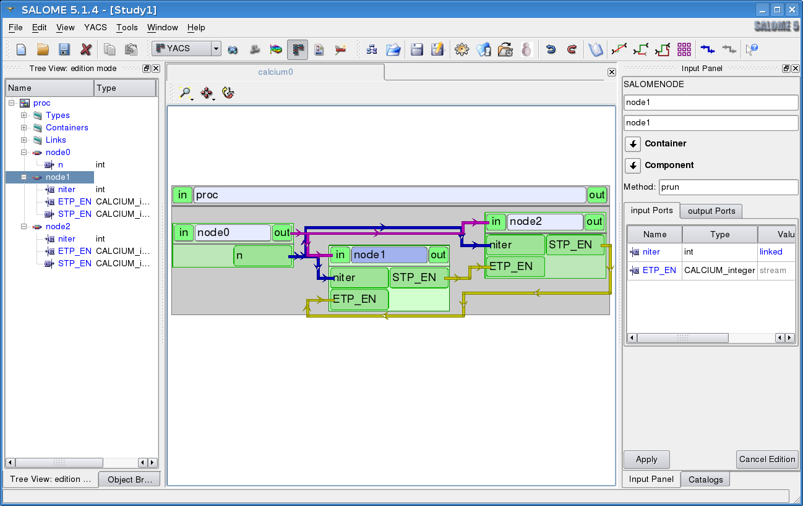

.. _calciumyacs:

From the old CALCIUM product to CALCIUM in SALOME
-------------------------------------------------------

This section describes why the CALCIUM product has been upgraded to CALCIUM in SALOME.  
After a brief presentation of the advantages and disadvantages of the existing CALCIUM product, the second section 
presents the implementation of CALCIUM in SALOME using the DSC ports.  
The final section describes the joint use of CALCIUM ports and the YACS supervisor.

The existing CALCIUM product
''''''''''''''''''''''''''''''
The CALCIUM product enables fast and easy coupling of Fortran / C / C++ codes in a simple and only slightly 
intrusive manner.  Persons responsible for codes used in coupling make a distinction between general interest 
data by the definition of input and output connection points.  The person responsible for global coupling defines 
the number of simultaneous executions of the different codes and transmission links between connection points of 
these execution instances.  This description is called the coupling scheme and is stored in a coupling file.

Connection points are typed by simple types (integer, floating point, double, booleans, chain) and operate based 
on the time or iterative mode.  The data produced are stamped by a date or an iteration number.  Data are 
produced and read in codes by a call to write or read primitives.  Production is independent of requests on 
read connection points (asynchronism).

When data are requested for a date later than the data already produced, read instances wait on blocking read primitives 
or receive a code indicating that there are no data in non-blocking mode.  When data are requested at a date surrounded 
by previously produced data stamps, the reader can obtain interpolated data (L0 and L1) in time mode.  Coupling is 
interlocked if the reader(s) is (are) waiting for data that will never be produced.  CALCIUM detects this situation 
and proposes either that the execution of coupling should be stopped or that the requested data should be extrapolated 
to unlock the situation.  This management depends on mode in which CALCIUM is being used (production mode or debug mode).

CALCIUM has had two operating modes since its version 3.  The first called debug mode was the only mode available in 
earlier versions, and has a coupler process through which all data pass.  In the second so-called production mode, 
instances of codes communicate with each other directly.  In debug mode, the transfer flow is limited by the capacity 
of the coupler network link to manage simultaneous accesses.  In this mode, the coupler must store a copy of each 
received data so as to be able to deliver them at the required time and be capable of detecting an interlocked situation.  
Production mode enables a data transfer with performances that are not limited by the capacity of input and output 
links of the coupler because there is no longer a coupler.  However, this mode has the limitations that there is no 
detection of interlocking (but a timeout is managed), step back requests are controlled locally, there is no step 
by step execution mode and no dynamic management of coupling.

CALCIUM ports in SALOME
'''''''''''''''''''''''''''''
Several couplings were set up during the 2004 Summer school as a result of experimental use of the existing CALCIUM 
tool (in production mode) in SALOME.  It showed the relevance of getting datastream type ports to cohabit with 
SALOME dataflow / control flow ports.  However, it required a specific modification located in the CALCIUM start 
procedure and it highlighted the following limitations:

- the need to use a different container for each service using CALCIUM (even for services in the same 
  component (CALCIUM is not multithread safe)).
- successive re-executions of coupling are difficult (need to not call MPI_FIN and problems related to the state of 
  the MPI virtual machine)
- the SALOME SUPERVISOR has no control over execution of CALCIUM coupling
- no possible extension of transmitted CALCIUM types
- cohabitation of the MPI environment and the CORBA environment is sometimes difficult.

The SALOME KERNEL module is provided with new communication ports called DSC (Dynamic Software Component) ports 
that components use to dynamically add / delete new interfaces accessible to everyone.  
:ref:`progdsc` describes how these new ports are used / designed / and their usefulness.  
There are two classes of DSC ports, firstly ports that provide an interface (provides ports), and secondly ports 
that use the interfaces (uses ports).

An implementation of CALCIUM ports based on this technology has been available since SALOME KERNEL version V4.  
Therefore, CALCIUM couplings are possible simply by calling CALCIUM primitives in component services.  
This implementation reuses CALCIUM functions in its production mode.  Use of this technology only requires 
the SALOME KERNEL module.  However, unless the YACS supervisor is used, the user must write a python script or 
a component service to load and initialize the coupling components, connect the different ports and configure 
them, and start the services in the appropriate order.

CALCIUM / SALOME ports and the YACS supervisor
'''''''''''''''''''''''''''''''''''''''''''''''''
The YACS supervisor available in SALOME (since version V4.1) manages all types of DSC ports, and particularly CALCIUM  ports.  
It relieves the user from the need to implement a script or a service to connect and configure the ports.  It checks 
the validity of the calculation scheme and starts services in accordance with the described dependencies.  
A calculation scheme can be created mixing datastream type ports (calcium mode), dataflow ports (arrival of data that 
can trigger starting a service) and control flow ports (one service is started by the end of execution of another 
service), thus creating elaborated calculation schemes.

The calculation scheme thus created can be saved in the XML format.  This file represents the equivalent of the 
CALCIUM coupling file for the link declaration and parameter setting part, ports being declared in the XML file 
that catalogs component resources.

Creating a SALOME component using CALCIUM
---------------------------------------------------
The use of CALCIUM in SALOME assumes that SALOME components are available offering services based on CALCIUM ports.  
There are several choices for creating such components:

- Create a SALOME module containing components for which the services have CALCIUM ports
- Create several SALOME modules containing at least one component for which the service(s) have CALCIUM ports.

Creating a SALOME module consists of structuring header, source, library and resource files in the form of a standard 
directory structure.  It can be done from a model module (HELLO, PYHELLO), or from a module generator (for example :ref:`yacsgen`)

Customisation of the SALOME component for the use of CALCIUM ports consists of:

- including a file declaring DSC ports in the IDL file of the component,
- including a file and declaring an inheritance to make our component supervisable,
- creating CALCIUM ports used in the definition of a standard method called init_service,
- declaration of CALCIUM ports of the component(s) in the module catalog file.

By using YACSGEN, the init_service method and the XML catalog of services provided by components are generated automatically.

The IDL declaration of components using CALCIUM ports
'''''''''''''''''''''''''''''''''''''''''''''''''''''''''''''
Since ports are dynamically declared in the init_service method, CALCIUM ports do not need to be previously declared 
in the IDL file.  However, the DSC_Engine.idl file must be included in the components IDL file(s) to benefit from DSC ports.

Example of the CALCIUM_TESTS.idl file for the CALCIUM_TEST module defining the three ECODE, SCODE, ESPION components, each 
of which offers a unique service to start up the corresponding wrapped code:

::

    #include "DSC_Engines.idl"
    
    /*! \file CALCIUM_TESTS.idl
      This file contains the first installation test of CALCIUM product.
      Each engine contains one service.
    */
    module CALCIUM_TESTS {
    
      interface ECODE : Engines::Superv_Component {
        void EcodeGo();
      };
    
      interface SCODE : Engines::Superv_Component {
        void ScodeGo();
      };
    
      interface ESPION : Engines::Superv_Component {
        void EspionGo();
      };
    
    };

Declaration of a C++ component using CALCIUM ports
'''''''''''''''''''''''''''''''''''''''''''''''''''''''''''''
Only one header is necessary in the case of a wrapper component (that does nothing except to call an 
implementation of another compilation unit):

.. code-block:: cpp

  #include “Superv_Component_i.hxx”

This header file is necessary to make our component supervisable and to use DSC ports.  The component will 
virtually inherit the Superv_Component_i class.

Example ECODE.hxx declaration file for the ECODE component:

.. code-block:: cpp

    #ifndef _ECODE_HXX_
    #define _ECODE_HXX_
    
    #include "Superv_Component_i.hxx"
    //Header CORBA generated from the CALCIUM_TESTS module
    #include "CALCIUM_TESTS.hh"
    
    //Interface for the wrapped code, in this case C code ecode
    extern "C" { int ecode(void *); }
    
    class ECODE_impl :
      //Implements the CORBA interface for the ECODE component
      public virtual POA_CALCIUM_TESTS::ECODE,
      //Makes the component supervisable
      public virtual Superv_Component_i {
    
    public :
      //Classical SALOME component constructor
      ECODE_impl(CORBA::ORB_ptr orb,
             PortableServer::POA_ptr poa,
             PortableServer::ObjectId * contId, 
             const char *instanceName, 
             const char *interfaceName);
      
      virtual ~ECODE_impl();
    
      //Initialisation of the service EcodeGo()
      CORBA::Boolean init_service(const char * service_name);
      void EcodeGo();
    };
    
    extern "C"
    {
      PortableServer::ObjectId * ECODEEngine_factory(CORBA::ORB_ptr orb,
                             PortableServer::POA_ptr poa,
                             PortableServer::ObjectId * contId,
                             const char *instanceName,
                             const char *interfaceName);
    }
    
    #endif

Declaration of component resources (part 1)
'''''''''''''''''''''''''''''''''''''''''''''''''''''''
Components publish signatures of their services in an XML resource file called the module catalog (or components catalog).  
This file can be generated by YACSGEN.

Extract from the CALCIUM_TESTSCatalog.xml catalog concerning the ECODE component:

Our ECODE component provides a unique EcodeGo() service that has no input parameters and no output parameters.

The Creating CALCIUM ports section describes how this resource file will be extended by the declaration of datastream ports.

.. code-block:: xml

    ....
      <component>
            <component-name>ECODE</component-name>
          ....
            <component-interface-list>
                <component-interface-name>ECODE</component-interface-name>
                <component-interface-comment></component-interface-comment>
                <component-service-list>
                    <component-service>
                        <!-- service-identification -->
                        <service-name>EcodeGo</service-name>
                         ...
                        <!-- service-connexion -->
                        <inParameter-list>
                        </inParameter-list>
                        <outParameter-list>
                        </outParameter-list>
                        <DataStream-list>
                         </DataStream-list>
                    </component-service>
                </component-service-list>
            </component-interface-list>
      </component>

Definition of a component using CALCIUM ports
''''''''''''''''''''''''''''''''''''''''''''''''''''''''
The component creates the ports that it needs.  The step to create a CALCIUM port consists of calling the add_port method 
provided by the virtual inheritance from the Superv_Component_i class.  It must be done before the service(s) that use 
the port is (are) started.  This is why this declaration is located in the 
standard init_service(char * name_of_service_to_be_initialised) method.  There are two methods of creating a 
CALCIUM port, firstly the create_calcium_port method and secondly the add_port method.

Creating CALCIUM ports using the add_port method
++++++++++++++++++++++++++++++++++++++++++++++++++++
This method is used to create any type of DSC port.  It can be used to create CALCIUM ports in particular.

.. code-block:: cpp

     add_port< typing_of_my_fabricated_port >( "the type of port to be fabricated",
                                              "provides"|”uses”,
                                              "the port name")

*"the type of port to be fabricated"*:
  This string notifies the DSC port factory in the KERNEL module about the name of the type of port 
  to be created.  The following types are possible for CALCIUM:
  “CALCIUM_integer”, “CALCIUM_real”, “CALCIUM_double”, “CALCIUM_logical”, “CALCIUM_complex”,
  “CALCIUM_string”
*“provides”|”uses”*:
  This string indicates if it is a CALCIUM output (uses) port or an input provides port.  Note that in the DSC semantic, 
  the provides port provides a write interface used by the uses port.
*“the port name”*:
  The port name corresponds to the name of the variable used in CALCIUM primitives.
*typing_of_my_fabricated_port*:
  This type types the pointer returned by add_port.  The objective for CALCIUM is to indicate the typing corresponding to 
  the type name already given in the factory plus the uses or provides information:

  - calcium_integer_port_provides or calcium_integer_port_uses
  - calcium_real_port_provides or calcium_real_port_uses
  - calcium_double_port_provides or calcium_double_port_uses
  - calcium_string_port_provides or calcium_string_port_uses
  - calcium_complex_port_provides or calcium_complex_port_uses
  - calcium_logical_port_provides or calcium_logical_port_uses

Extract from the init_service method in the ECODE.cxx file for the ECODE component:

.. code-block:: cpp

    CORBA::Boolean ECODE_impl::init_service(const char * service_name) {
    
      CORBA::Boolean rtn = false;
      string s_name(service_name);
      
      if (s_name == "EcodeGo") {
    
        try {
      
        add_port<calcium_integer_port_provides>("CALCIUM_integer","provides","ETP_EN")->
          setDependencyType(CalciumTypes::TIME_DEPENDENCY);
     
         add_port<calcium_real_port_provides>("CALCIUM_real","provides","ETP_RE") ->
          setDependencyType(CalciumTypes::TIME_DEPENDENCY);
        
        add_port<calcium_double_port_provides>("CALCIUM_double","provides","ETP_DB")->
          setDependencyType(CalciumTypes::TIME_DEPENDENCY);
    
        add_port<calcium_complex_port_provides>("CALCIUM_complex","provides","ETP_CX")->
          setDependencyType(CalciumTypes::TIME_DEPENDENCY);
    
        add_port<calcium_string_port_provides>("CALCIUM_string","provides","ETP_CH")->
          setDependencyType(CalciumTypes::TIME_DEPENDENCY);
    
        add_port<calcium_logical_port_provides>("CALCIUM_logical","provides","ETP_LQ")->
          setDependencyType(CalciumTypes::TIME_DEPENDENCY);
     ....
        rtn = true;
        } catch ( const DSC_Exception & ex ) {
          std::cerr << ex.what() << std::endl;;
        }
      } //FIN (s_name == "Ecode")
    
      return rtn;
    }

Creating CALCIUM ports using the create_calcium_port method
+++++++++++++++++++++++++++++++++++++++++++++++++++++++++++++++
This method is specially written for the creation of CALCIUM ports, and simplifies the creation of ports.  
It is used by YACSGEN.  The “IN”|”OUT” parameter indicates whether it is a CALCIUM input or output port.  
The “T”|”I” parameter indicates the port mode, time or iterative.

Extract from the init_service method in the ECODE.cxx file for the ECODE component:

.. code-block:: cpp

    ECODE_i::init_service(const char * service_name) {
       CORBA::Boolean rtn = false;
       string s_name(service_name);
       if (s_name == "EcodeGo")   {
            try   {
                //initialisation CALCIUM ports IN
               create_calcium_port(this,"ETP_EN","CALCIUM_integer","IN","T");
               create_calcium_port(this,"ETP_RE","CALCIUM_real","IN","T");
               create_calcium_port(this,"ETP_DB","CALCIUM_double","IN","T");
               create_calcium_port(this,"ETP_CX","CALCIUM_complex","IN","T");
               create_calcium_port(this,"ETP_CH","CALCIUM_string","IN","T");
               create_calcium_port(this,"ETP_LQ","CALCIUM_logical","IN","T");
    ...      }
           catch(const PortAlreadyDefined& ex)   {
               std::cerr << "ECODE: " << ex.what() << std::endl;
               //Ports already created : we use them
            }
           catch ( ... )   {
               std::cerr << "ECODE: unknown exception" << std::endl;
            }
           rtn = true;
         }
       return rtn;
     }

Declaration of component resources (part 2)
''''''''''''''''''''''''''''''''''''''''''''''''''''''''
The XML component resource file must be completed to declare that CALCIUM ports exist in the different components.  
YACSGEN takes account of CALCIUM ports in the generation of the module catalog.

Extract from the CALCIUM_TESTSCatalog.xml catalog for the ECODE component:

.. code-block:: xml

    .....           
                        <DataStream-list>
                           <inParameter>
                              <inParameter-name>ETP_EN</inParameter-name>
                              <inParameter-type>CALCIUM_integer</inParameter-type>
                              <inParameter-dependency>T</inParameter-dependency>
                           </inParameter>
                           <inParameter>
                              <inParameter-name>ETP_RE</inParameter-name>
                              <inParameter-type>CALCIUM_real</inParameter-type>
                              <inParameter-dependency>T</inParameter-dependency>
                           </inParameter>
                           <inParameter>
                              <inParameter-name>ETP_DB</inParameter-name>
                              <inParameter-type>CALCIUM_double</inParameter-type>
                              <inParameter-dependency>T</inParameter-dependency>
                           </inParameter>
    .....           
                        </DataStream-list>

Configuring a CALCIUM port
''''''''''''''''''''''''''''''''''
The step to configure ports uses all possible link parameter settings in the CALCIUM coupling file outside SALOME.  
This step can be done when the port is created in the component (init_service method) by a coupling parameter 
setting component / script, or by the YACS supervisor.  This step indicates the following characteristics 
for each port in the provides class:

- time / iteration dependency of received data:
     TIME_DEPENDENCY or ITERATION_DEPENDENCY
- The data storage level (size of the history stack):
     UNLIMITED_STORAGE_LEVEL (by default) or a strictly positive integer
- The time scheme selected to define the date used in read primitives (CPLxx) in time mode:
 
   * TI_SCHEM (default value):  Values of the input variable used are taken at the time corresponding to the beginning of 
     the current time step in the calculation (see parameter **ti** of CPLxx)
   * TF_SCHEM:  Values of the input variable are taken at the time corresponding to the end of the current time step 
     in the calculation (see parameter **tf** of CPLxx)
   * ALPHA_SCHEM:  Values of the input variable are taken at an instant equal to TF * *ALPHA* + TI * (1 - *ALPHA*).  
     *ALPHA* can be equal to values strictly between 0 and 1.  The value 0 is replaced by the TI_SCHEM option and 
     the value 1 is replaced by the TF_SCHEM option).

- The interpolation type to be used for a port in time mode:
     L0_SCHEM, L1_SCHEM
- The extrapolation type to be used in the case of blockage / timeout:
     E0_SCHEM, E1_SCHEM (not yet functional)
- The value of the DELTAT parameter that indicates if two dates are identical.

All of the keywords used when the ports are configured are defined in the CalciumTypes C++ namespace in the CalciumTypes.hxx file.

Configuration when the PORT is created
+++++++++++++++++++++++++++++++++++++++++++++++++
When a port is created, the add_port method returns a pointer to the port useful to its configuration.  One example 
configuration in the init_service method consists of indicating if the port is in time dependency or iteration dependency mode:

.. code-block:: cpp

      add_port<calcium_integer_port_provides>("CALCIUM_integer","provides","ETP_EN")->
          setDependencyType(CalciumTypes::TIME_DEPENDENCY);

The following methods are available to configure CALCIUM ports:

* Set / Query the dependency type:

The dependency type informs the port if the data are stamped by a date or (exclusive) an iteration number.  The default 
dependency type is undefined (CalciumTypes::UNDEFINED_DEPENDENCY).  CalciumTYpes::TIME_DEPENDENCY or 
CalciumTypes::ITERATION_DEPENDENCY can be defined.

.. code-block:: cpp

     void setDependencyType (DependencyType dependencyType);
     DependencyType getDependencyType () const;
    

* Set / Query the storage level of the data produced:

The storage level in the history of data produced must be greater than or equal to 1.  By default it is 
unlimited (CalciumTypes::UNLIMITED_STORAGE_LEVEL).  It may have to be reduced, to limit memory consumption for the 
case of a coupling with many iterations.

.. code-block:: cpp

     void   setStorageLevel   (size_t storageLevel);
     size_t getStorageLevel   () const;

  
* Set / Query the time scheme used to define the read date:

The time scheme chosen to define the date used in read primitives in time mode is set to CalciumTypes::TI_SCHEM by default.  It is also possible to enter CalciumTypes::TF_SCHEM or CalciumTypes::ALPHA_SCHEM.

.. code-block:: cpp

      void                  setDateCalSchem   (DateCalSchem   dateCalSchem);
      DateCalSchem getDateCalSchem () const;

  
If the time scheme used is ALPHA_SCHEM, the next method is used to indicate the value of ALPHA to be used.  Alpha is equal to zero by default (equivalent to TI_SCHEM) and it can be set to between 0 and 1 inclusive.

.. code-block:: cpp

    void     setAlpha(double alpha);
    double getAlpha() const ;

* Set / Query the tolerated deviation within which two dates will be considered to be identical:

Two dates D1 and D2 are identical if abs(T1-T2) <CalciumTypes::EPSILON.  Epsilon is equal to 1E-6 by default.  
Parameters can be set for it on each port (0 <= deltaT <= 1).

.. code-block:: cpp

      void     setDeltaT(double deltaT );
      double getDeltaT() const ;

* Set / Query the type of time interpolation to be used:

When a read request is formulated for a date T that has not been produced but is surrounded by dates T1(min) and T2(max) for which data have already been produced, CALCIUM produces a CalciumTypes::L1_SCHEM linear interpolation by default.  The user can request a CalciumTypes::L0_SCHEM step “interpolation”.

.. code-block:: cpp

      void setInterpolationSchem (InterpolationSchem interpolationSchem);
      InterpolationSchem getInterpolationSchem () const ;

* Set / Query the type of the extrapolation to be used:

This parameter is used to indicate whether an extrapolation is required to exit from a blocking case (a port waiting for data that will never be produced).  The default value is Calcium-Types::UNDEFINED_EXTRA_SCHEM.  Possible values are EO_SCHEM (step extrapolation) or E1-SCHEM (linear extrapolation).

.. code-block:: cpp

     void setExtrapolationSchem (ExtrapolationSchem extrapolationSchem);
     ExtrapolationSchem getExtrapolationSchem () const ;

Configuration using properties of DSC ports
+++++++++++++++++++++++++++++++++++++++++++++++++
This section explains advanced use of the properties of DSC ports to perform the CALCIUM ports configuration step, it can 
be ignored if CALCIUM ports are used in a simple manner.

All DSC ports can be configured by a list of properties.  Therefore, the configuration step can be made using a CORBA call on the ports concerned.

The [set|get]_property methods of DSC ports manipulate a list of pairs with a key equal to the name of the property in 
the first position and the associated value in the second position.

Extract from the SALOME_Component.idl file of the SALOME KERNEL:

::

     struct KeyValuePair  {
        string key;
        any value;
      };
     typedef sequence<KeyValuePair> FieldsDict;
     void setProperties(in FieldsDict dico);
     FieldsDict getProperties();

CALCIUM declares the following types in the SALOME KERNEL Calcium_Ports.idl file:

::

    const long UNLIMITED_STORAGE_LEVEL = -70;   
    enum DependencyType { UNDEFINED_DEPENDENCY, TIME_DEPENDENCY, ITERATION_DEPENDENCY};
    enum DateCalSchem           { TI_SCHEM, TF_SCHEM , ALPHA_SCHEM};
    enum InterpolationSchem   { L0_SCHEM, L1_SCHEM };
    enum ExtrapolationSchem  { UNDEFINED_EXTRA_SCHEM, E0_SCHEM, E1_SCHEM};

Therefore, the recognised properties are the following pairs:

- (“StorageLevel”, int > 0 )
- (“Alpha”, 0 <= double <= 1 )
- (“DeltaT”, 0 <= double <= 1 )
- (“DependencyType”, enum CORBA DependencyType)
- (“DateCalSchem”, enum CORBA DateCalSchem)
- (“InterpolationSchem”,enum CORBA InterpolationSchem)
- (“ExtrapolationSchem”,enum CORBA ExtrapolationSchem)

Example dynamic configuration by a python script (extract from file CAS_1.py):

.. code-block:: python

    ...
    port1=ecode.get_provides_port("ETS_DB",0);
    myAny1_1=4
    port1.set_property("StorageLevel",any.to_any(myAny1_1))
    

The get_provides_port and set_property methods are provided by the default implementation of supervisable SALOME components.

The configuration in the YACS XML file
++++++++++++++++++++++++++++++++++++++++++++
The YACS supervisor module is capable of importing / exporting calculation schemes in the XML format.  In particular, this 
includes the declaration of links between the ports of the different component instances.  The YACS GUI generates all sorts of 
calculation schemes and starts their execution.

At the present time, properties cannot be added to CALCIUM ports with YACS GUI.  Therefore, they have to be added into 
the XML file manually.  In YACS, calcium ports are configured by declaring properties on the links.

Extract from the CAS_1.xml calculation scheme, first test case of CALCIUM functions:

Example configuration of the ETS_DB port at a history level of 4.

.. code-block:: xml

     <stream>
          <fromnode>SCODE</fromnode> <fromport>STS_DB</fromport>
          <tonode>ECODE</tonode> <toport>ETS_DB</toport>
          <property name="StorageLevel" value="4"/>
       </stream>
    

(Keys, value) pairs used to describe properties are as listed in the previous section. 
 
Calls to CALCIUM methods
'''''''''''''''''''''''''''''''
The CALCIUM C / C++ / Fortran API in SALOME is globally identical to the API for the CALCIUM product outside SALOME.  
It is now also available in Python.

See :ref:`calciumapi` for C and Fortran API documentation and :mod:`calcium` for Python API documentation.

The classical C / C++ API is extended by a zero copy version that transfers data without an intermediate copy.

C++ developers can use an API more specific to C++ that proposes parameter types more adapted to the language.

It is also possible to use CALCIUM DSC ports more directly with their associated CORBA types.

Classical CALCIUM calls in C / C++ / F / Python
+++++++++++++++++++++++++++++++++++++++++++++++++
The classical CALCIUM API remains essentially the same, regardless of whether the objective is to include an existing 
CALCIUM C / C ++ / Fortran code in the SALOME platform or to develop a new CALCIUM component.

The code containing CALCIUM calls is written directly in the SALOME service of the C++ component, or is accessible through a procedure call.

In the first case, the code must be written in C / C++ / Python because there is no SALOME component written directly in Fortran.

In the second case, the calling service must transmit the access pointer to its component.  Unlike the CALCIUM outside 
SALOME API, the first argument of all procedures is the pointer of the component that holds the associated ports.  
This enables the CALCIUM library to identify the component that holds the requested ports [1]_.

Extract from the implementation of the EcodeGo() (ECODE.cxx) service calling the ecode wrapped code (void* component)(Ecode.c):

(This code can be generated by YACSGEN)

.. code-block:: cpp

    void ECODE_impl::EcodeGo() {
      Superv_Component_i * component = dynamic_cast<Superv_Component_i*>(this);
      try {
        ecode(component);            
      } 
      catch ( const CalciumException & ex)
    ....
    }

A code already written to use CALCIUM only needs to be adapted to transmit the pointer of its component as a first 
parameter of calls to CALCIUM procedures.  Apart from this observation, the code remains exactly the same as the 
initial calcium code.

Extract from the implementation of the calcium source code applied by the service (Ecode.c):

.. code-block:: c

    ...
    #include <calcium.h>
    ...
    int    ecode(void * component)
    {
    ...
    /*    Connection to the coupler   */
        info = cp_cd(component,nom_instance);
    
        info= cp_len(component,CP_TEMPS,&ti_re,&tf_re,&i,"ETP_EN",1,&n,EDATA_EN);
    ...
        info = cp_fin(component,CP_CONT);
    }

The C ecode procedure connects to the CALCIUM coupler through the cp_cd procedure and then formulates a blocking read 
request to the ETP_EN port / connection point according to a time scheme between ti_re and tf_re.  Only one data is 
requested, it will be stored in the EDATA_EN buffer.  The procedure finishes when the coupler is disconnected, using 
the CP_CONT flag to indicate that any clients of ports associated with ecode will receive the most recent known value 
if there are any new read requests.  If the CP_ARRET flag was used, any subsequent read request on the ports associated 
with ecode() would exit in error.

The scheme is the same in fortran, the following is an extract from the Ecode.f file:

.. code-block:: fortran

        SUBROUTINE ECODE(compo)
        INCLUDE 'calcium.hf'
        INTEGER compo
        ----
        CALL CPCD(compo,nom_instance, info)
        ----
        CALL CPLEN(compo,CP_TEMPS,ti_re,tf_re,i,'ETP_EN',1,n,EDATA_EN,info)
        ----
        CALL CPFIN(compo,CP_CONT, info)
        ----

CALCIUM C/C++ calls in zero copy mode
+++++++++++++++++++++++++++++++++++++++
CALCIUM DSC ports of the provides type (CALCIUM entry connection points) keep the received data to be able to create the 
requested history (unlimited by default).  When the user formulates a read for data that are already available, the port 
copies these data into the buffer provided by the user.  An extended CALCIUM API allows the user to supply a null pointer 
to replace the pre-allocated reception pointer, so as to obtain a pointer to the internal buffer of the CALCIUM provides 
class port directly.  This prevents a potentially large copy, but it obliges the user to be vigilant on the following points:

1. The buffer obtained must be used in read only.  Unless it is used in a particular manner, any modification to the buffer 
   would be reflected in new read requests for the same stamp or during an interpolation calculation using this stamp.
2. The buffer is dependent on the history level set for the port.  If the history level set for the port is such that the 
   stamp and the associated buffer will be deleted, the user will have a pointer to an invalid buffer and its use would probably corrupt memory.
3. Zero copy is not used on integers and booleans because these types do not exist in CORBA.
4. The user must call the CALCIUM procedure once only to release the pointer obtained.  This releases any buffers created for 
   cases in which a zero copy is impossible.  This also helps to count distributed references to prevent early release (not yet implemented).

The zero copy API consists of calling ecp_lxx read procedures instead of their corresponding procedure cp_lxx and transferring 
the address of a pointer for which the value is initialized to zero.

The write procedures API is not modified because these procedures still operate in zero copy.  If the sender and receiver 
components are placed in the same container, a copy is triggered on reception  of data to prevent any interaction between 
the sender's buffer and the receiver's buffer.

Extract from the zero copy implementation of the CALCIUM source code called by the (Ecode.c) service:

.. code-block:: c

        float *sav_EDATA_RE = _EDATA_RE; //keep a ptr to previously received data
        _EDATA_RE = NULL;
        ti_re = 1.1;
        tf_re = 1.2;
        info = ecp_lre(component,CP_TEMPS,&ti_re,&tf_re,&i,"ETP_RE",0,&n,&_EDATA_RE);
        fprintf(file_2,"%f\n", _EDATA_RE[0]);
        ti_re = 0.0;
        tf_re = 1.0;
    
        ecp_lre_free(sav_EDATA_RE);
        ecp_lre_free(_EDATA_RE);

CALCIUM calls with API specific to C++
+++++++++++++++++++++++++++++++++++++++++
C++ developers can use a specific API that proposes parameters with types better adapted to the language.

Time stamps are always of the double type and iterations are always of the long type, regardless of whether it is in write or 
read and regardless of the type of transmitted data.  Variable names are STL strings.  The name of read and write methods is 
the same regardless of the type of data manipulated.  The type of data is found automatically, except for complex types, 
logical types and character strings.

.. code-block:: cpp

      template <typename T1, typename T2> static void
      ecp_ecriture ( Superv_Component_i & component,  int const  & dependencyType,
             double const & t,  long const  & i,
             const   string & nomVar,  size_t bufferLength,  T1 const  & data ) 

      template <typename T1, typename T2 > static void
      ecp_lecture ( Superv_Component_i & component,   int    const  & dependencyType,
                   double & ti,  double const  & tf,  long & i,
                   const string  & nomVar,  size_t bufferLength,
                   size_t  & nRead,  T1 * &data )

These methods are defined in the CalciumCxxInterface.hxx header file.  Therefore the user will include 
the ``#include ”CalciumCxxInterface.hxx”`` directive in the code.

Note:  the CalciumInterface.hxx file has to be included only once because it declares and defines C++ template methods.  
This does not create any problem with compilation, but there is a multiple definition problem during link editing.

But there is no need to specify T1 and T2 for integer, float or double CALCIUM types, because there is a write method 
and a read method with a single template parameter that calls their corresponding methods with the constraint T1==T2==<Type of Data Used>.

For complex types, the <float,cplx> instantiation has to be used and the number of complexes has to be multiplied by two to 
transfer the bufferLength parameter.  In this case, the only difference from use of the float type is the typing of the ports 
used, namely calcium_complex_port_provides instead of calcium_real_port_provides.

Instantiation for the logical type is done with <int, bool>.

Instantiation for character strings is <char*, str>.  The character strings can be read without giving the maximum string 
length parameter located in the classical C / C++ / Fortran API.

Differences from the CALCIUM product outside SALOME
++++++++++++++++++++++++++++++++++++++++++++++++++++++
All that are implemented are read / write procedures and connection/disconnection procedures. Step back, query, dynamic 
configuration and debugging procedures are not implemented.

However, it is possible to dynamically create and connect components that read/write on ports of other component services.  
Any SALOME service using CALCIUM ports has the privileges of a spy (in production mode).

Several output ports can be connected to the same input port and one output port can be connected to several input ports.  
The first case was not possible in CALCIUM outside SALOME.

Reads/writes are implemented in blocking mode;  non-blocking mode is not yet implemented.

All ports created by the different services of a single component are visible / usable by all these services.  
However, it is not recommended that they should be used in this way.

The extrapolation has not yet been implemented.

File ports have not yet been implemented, however there are some DSC file ports in SALOME.

Ports not connected do not cause any error in execution of coupling unless they are used.

CALCIUM error codes returned by primitives are the same as for CALCIUM outside SALOME.  By using the specific C++ API, 
CalciumException class exceptions (CalciumException.hxx) that contain the CALCIUM error code and an explanation message 
can be caught.  The error code contained in the exception is obtained by calling the CalciumTypes::InfoType getInfo() method.  
The CalciumException class also inherits from the C++ SALOME_Exception exception.

A compilation option has to be used to allow C++ exceptions to pass through the C and Fortran codes called from 
the SALOME component service.  This option for GNU compilers is -fexceptions.

Data type exchange will be extended to complex types such as MED fields or meshes.

Starting CALCIUM coupling
--------------------------------
CALCIUM coupling can be started in three different ways.  The first is to use the SALOME KERNEL only and to manage 
component instances by a python script.  The second is to create a component that would control coupling.  The third 
is to use the YACS supervisor component with or without its GUI.

Setting up the environment
'''''''''''''''''''''''''''''''''''
Regardless of what method is chosen, the KERNEL module has to be notified about the existence of new modules to be used.  
Only one module needs to be declared if all components are within the same module.

This step is no specific to CALCIUM components, it is necessary for all SALOME components.

Declaration of <my module>_ROOT_DIR
++++++++++++++++++++++++++++++++++++
The KERNEL module is based on a <my module>_ROOT_DIR variable in either a envSalome.sh shell script containing all environment 
variables useful to SALOME or in the user console, to locate the installation directory of the <my module> module.

Example declaration of the CALCIUM_TESTS module in bash:

.. code-block:: sh

    INSTALLROOT="/local/salome/SALOME5/V5NoDebug"
    export CALCIUM_TESTS=${INSTALLROOT}/DEV/INSTALL/CALCIUM_TESTS
    

The appli_gen.py tool will prepare the appropriate environment in the env.d directory for a SALOME application (see :ref:`appli`).

Loading the <my module> module when running SALOME 
++++++++++++++++++++++++++++++++++++++++++++++++++++++++
There are two solutions for loading the <my module> module when SALOME is run.

Declaration in the SalomeApp.xml file. 
#########################################
All that is necessary is to declare the name of its module in the modules parameter in the SalomeApp.xml file.

The following is an example for the CALCIUM_TESTS module:

.. code-block:: xml

     <section name="launch">
     ....
     <parameter name="modules"    value="GEOM,SMESH,VISU,YACS,MED,CALCIUM_TESTS"/>
     ....
     </section>

Using the --module option.  
################################
This option limits loading of modules to the list indicated in the command line (it assumes that the user’s environment 
indicates the location of the modules).

.. code-block:: sh

    ./runAppli  --module=YACS,CALCIUM_TESTS

Running a simple coupling through a python script
''''''''''''''''''''''''''''''''''''''''''''''''''''''
Components can be created and their ports can be connected using a Python SALOME session.
The script CAS_1.py loads instances of the ECODE, SCODE and ESPION components, connects their ports, makes the necessary 
configurations and starts executions.

The following is an extract from the CAS_1.py file that can be found in <path to CALCIUM_TESTS module>/CALCIUM_TESTS/lib/python2.4/site-packages/salome:

.. code-block:: python

    
    import LifeCycleCORBA
    import Engines
    import Ports
    import CALCIUM_TESTS
    import orbmodule
    import user
    
    import sys
    import threading
    from omniORB import any
    
    #Load component instances through the LifeCycle 
    lcc = LifeCycleCORBA.LifeCycleCORBA()
    ecode = lcc.FindOrLoad_Component('FactoryServer3', 'ECODE')
    ecode.init_service("EcodeGo")
    scode = lcc.FindOrLoad_Component('FactoryServer4', 'SCODE')
    scode.init_service("ScodeGo")
    
    #Display the content of the naming server
    #Obtain a reference to the connection manager

    clt=orbmodule.client()
    clt.showNS()
    connection_manager = clt.Resolve("ConnectionManager")
    
    #Create CALCIUM links through the connection manager
    connection_manager.connect(scode, "STP_EN",ecode, "ETP_EN")
    connection_manager.connect(scode, "STP_RE", ecode, "ETP_RE")
    connection_manager.connect(scode, "STP_DB", ecode, "ETP_DB")
    connection_manager.connect(scode, "SIP_EN", ecode, "EIP_EN")
    connection_manager.connect(scode, "SIP_DB", ecode, "EIP_DB")
    connection_manager.connect(scode, "SIS_EN", ecode, "EIS_EN")
    connection_manager.connect(scode, "SIS_DB", ecode, "EIS_DB")
    connection_manager.connect(scode, "STS_EN", ecode, "ETS_EN")
    connection_manager.connect(scode, "STS_DB", ecode, "ETS_DB")
    port1=ecode.get_provides_port("ETS_DB",0);
    myAny1_1=4
    port1.set_property("StorageLevel",any.to_any(myAny1_1))
    connection_manager.connect(scode, "STS_DB", ecode, "ETP_DB2")
    connection_manager.connect(scode, "STP_CX", ecode, "ETP_CX")
    connection_manager.connect(scode, "STP_CH", ecode, "ETP_CH")
    connection_manager.connect(scode, "STP_LQ", ecode, "ETP_LQ")
    #Create and connect the spy (espion) 
    #The ESPION can be created after the instances of ECODE and SCODE have been run,
    #however data produced before the connection will be lost
    espion = lcc.FindOrLoad_Component('FactoryServer5', 'ESPION')
    espion.init_service("EspionGo")
    
    connection_manager.connect(scode,  "STP_DB2", ecode, "ETP_DB2")
    connection_manager.connect(espion, "STP_DB2", ecode, "ETP_DB2")
    connection_manager.connect(scode,  "SIP_DB2", espion, "SIP_DB2")
    connection_manager.connect(espion, "SIP_DB" , ecode , "EIP_DB" )
    connection_manager.connect(scode,  "SIP_DB" , espion, "EIP_DB")
    
    #If the spy is run last, CAS_1 works but test 15 does not work
    handler3=threading.Thread(target=espion.EspionGo)
    handler3.start()
    handler=threading.Thread(target=ecode.EcodeGo)
    handler.start()
    handler2=threading.Thread(target=scode.ScodeGo)
    handler2.start()
    
    handler.join()
    handler2.join()
    handler3.join()

The script can be run using the following command:

.. code-block:: sh

  ./runAppli -t --module=YACS,CALCIUM_TESTS -u CAS_1.py

Running coupling through the YACS GUI
'''''''''''''''''''''''''''''''''''''''''''
If the module catalog contains the description of components and their services, it is easy to create a coupling scheme by 
inserting the services of components that are to be linked.

To insert a service, simply do a right click / CASE_1 / create a node / create a node from catalog / in the edit tree of the graph.

Linking two ports consists of selecting the output port (in the edit tree) and then doing a right click on the /add data link/ command, and then selecting the input port.

There is no consistency check on the branch of incompatible CALCIUM port types in current version of the YACS GUI.  However, an error will occur at the time of execution.

Once the scheme has been created, it can be exported in the YACS coupling scheme XML format (see toolbar).

The following is a graphic example of the coupling scheme for the first CALCIUM test case:

Once the scheme has been created, all that is necessary is to create an execution by doing a right click on /YACS/CAS_1/New Execution/.  
The study tree becomes the execution tree in which the state of the different services appears.  Once it has been 
run (by pressing the appropriate button in the tool bar), the services are in the ‘done’ state if everything took place correctly.  
The log of a container associated with execution of a service can be displayed by doing a right click on the service concerned 
and selecting /Node container Log/.  If an error occurs, reports are displayed by selecting /Error Details/ or /Error Report/.

As many executions as are necessary can be created.  Modifying the edit scheme does not modify existing execution schemes. 
One execution has to be recreated to start the modified scheme.  Do a right click and select /New Edition/ in order to find 
the edit scheme corresponding to an execution scheme again.

Any container configuration is possible:

1. several CALCIUM services (for one component or different components) coupled within a single container
2. several CALCIUM services (for one component or different components) coupled within different containers
3. an intermediate configuration between the previous two cases.

Current limitations:

1. It is impossible to have several services of a single component simultaneously using distinct CALCIUM ports with the same name.
2. It is not possible to restart the same execution because the init_service method will attempt to create existing 
   ports (an execution has to be created or init_service has to be modified so as to memorise the creation of ports).

Running coupling through YACS without GUI
''''''''''''''''''''''''''''''''''''''''''
To do this, you have to create a schema file in XML format (see :ref:`schemaxml`) and to execute it in console
mode (see :ref:`execxml`).

Setting up a timeout to interrupt execution in case of interlocking
'''''''''''''''''''''''''''''''''''''''''''''''''''''''''''''''''''''''
Sometimes (mainly during development phases), a calculation can ends up in a deadlock. A component waits for a data that 
another component must send but this component is also waiting and all these components are waiting in a loop, so the calculation
never ends : it's a deadlock.

There is no way in CALCIUM to detect this deadlock, but it is possible to set a timeout to go out of the deadlock. 
A timeout is a time in seconds. When a component waits longer than timeout, an error occurs and the calculation is interrupted.
The timeout can be specified by setting the environment variable DSC_TIMEOUT (export DSC_TIMEOUT=600, in bash to set a 10 minutes timeout).
It must be set before launching a SALOME session and is therefore globally used for all the calculations in the session. 
 
It is also possible to specify a timeout in the XML coupling file by way of a service node property (DSC_TIMEOUT) as in
the following example:

.. code-block:: xml

      <service name="canal" >
        <component>FLUIDE</component>
        <method>prun</method>
        <load container="A"/>
        <property name="DSC_TIMEOUT" value="20"/>
        <instream name="tpi" type="CALCIUM_real"/>
        <instream name="iconv" type="CALCIUM_integer"/>
        <outstream name="tfi" type="CALCIUM_real"/>
      </service>

As a consequence, the timeout will be active for all the services in the container of the service (container A in the example).

It is not yet possible to specify a timeout limited to one port or one link.

Creating a SALOME application
--------------------------------------------
Example command invoked to create a SALOME application after adapting the config_appli.xml file:

.. code-block:: sh

    python $KERNEL_ROOT_DIR/bin/salome/appli_gen.py --prefix=/local/salome5_my_appli \
                                                    --config=config_appli_mod.xml                   

Coupling scheme: example of YACS XML file
-----------------------------------------------
The complete CAS_1.xml file for the coupling scheme of the CALCIUM CAS_1 test case (it can be generated by the YACS GUI):

.. code-block:: xml

    <?xml version='1.0'?>
    <proc>
       <type name="Bool" kind="bool"/>
       <type name="Double" kind="double"/>
       <type name="Int" kind="int"/>
       <type name="String" kind="string"/>
       <objref name="CALCIUM_complex"
               id="IDL:Ports/Calcium_Ports/Calcium_Complex_Port:1.0"/>
       <objref name="CALCIUM_double"
               id="IDL:Ports/Calcium_Ports/Calcium_Double_Port:1.0"/>
       <objref name="CALCIUM_integer"
               id="IDL:Ports/Calcium_Ports/Calcium_Integer_Port:1.0"/>
       <objref name="CALCIUM_logical"
               id="IDL:Ports/Calcium_Ports/Calcium_Logical_Port:1.0"/>
       <objref name="CALCIUM_real" 
               id="IDL:Ports/Calcium_Ports/Calcium_Real_Port:1.0"/>
       <objref name="CALCIUM_string"
               id="IDL:Ports/Calcium_Ports/Calcium_String_Port:1.0"/>
       <objref name="file" id="file"/>
       <container name="DefaultContainer">
          <property name="container_name" value=""/>
          <property name="cpu_clock" value="0"/>
          <property name="hostname" value=""/>
          <property name="isMPI" value="false"/>
          <property name="mem_mb" value="0"/>
          <property name="nb_component_nodes" value="0"/>
          <property name="nb_node" value="0"/>
          <property name="nb_proc_per_node" value="0"/>
          <property name="parallelLib" value=""/>
          <property name="workingdir" value=""/>
       </container>
       <service name="SCODE">
          <component>SCODE</component>
          <load container="DefaultContainer"/>
          <method>ScodeGo</method>
          <outstream name="STP_EN" type="CALCIUM_integer"/>
          <outstream name="STP_RE" type="CALCIUM_real"/>
          <outstream name="STP_DB" type="CALCIUM_double"/>
          <outstream name="STP_CX" type="CALCIUM_complex"/>
          <outstream name="STP_CH" type="CALCIUM_string"/>
          <outstream name="STP_LQ" type="CALCIUM_logical"/>
          <outstream name="SIP_EN" type="CALCIUM_integer"/>
          <outstream name="SIP_DB" type="CALCIUM_double"/>
          <outstream name="STP_DB2" type="CALCIUM_double"/>
          <outstream name="SIS_EN" type="CALCIUM_integer"/>
          <outstream name="SIS_DB" type="CALCIUM_double"/>
          <outstream name="STS_EN" type="CALCIUM_integer"/>
          <outstream name="STS_DB" type="CALCIUM_double"/>
          <outstream name="SIP_DB2" type="CALCIUM_double"/>
       </service>
       <service name="ECODE">
          <component>ECODE</component>
          <load container="DefaultContainer"/>
          <method>EcodeGo</method>
          <instream name="ETP_EN" type="CALCIUM_integer"/>
          <instream name="ETP_RE" type="CALCIUM_real"/>
          <instream name="ETP_DB" type="CALCIUM_double"/>
          <instream name="ETP_CX" type="CALCIUM_complex"/>
          <instream name="ETP_CH" type="CALCIUM_string"/>
          <instream name="ETP_LQ" type="CALCIUM_logical"/>
          <instream name="EIP_EN" type="CALCIUM_integer"/>
          <instream name="EIP_DB" type="CALCIUM_double"/>
          <instream name="ETP_DB2" type="CALCIUM_double"/>
          <instream name="EIS_EN" type="CALCIUM_integer"/>
          <instream name="EIS_DB" type="CALCIUM_double"/>
          <instream name="ETS_EN" type="CALCIUM_integer"/>
          <instream name="ETS_DB" type="CALCIUM_double"/>
       </service>
       <service name="Espion">
          <component>ESPION</component>
          <load container="DefaultContainer"/>
          <method>EspionGo</method>
          <instream name="SIP_DB2" type="CALCIUM_double"/>
          <instream name="EIP_DB" type="CALCIUM_double"/>
          <outstream name="STP_DB2" type="CALCIUM_double"/>
          <outstream name="SIP_DB" type="CALCIUM_double"/>
       </service>
       <stream>
          <fromnode>SCODE</fromnode> <fromport>STP_EN</fromport>
          <tonode>ECODE</tonode> <toport>ETP_EN</toport>
       </stream>
       <stream>
          <fromnode>SCODE</fromnode> <fromport>STP_RE</fromport>
          <tonode>ECODE</tonode> <toport>ETP_RE</toport>
       </stream>
       <stream>
          <fromnode>SCODE</fromnode> <fromport>STP_DB</fromport>
          <tonode>ECODE</tonode> <toport>ETP_DB</toport>
       </stream>
       <stream>
          <fromnode>SCODE</fromnode> <fromport>STP_CX</fromport>
          <tonode>ECODE</tonode> <toport>ETP_CX</toport>
       </stream>
       <stream>
          <fromnode>SCODE</fromnode> <fromport>STP_CH</fromport>
          <tonode>ECODE</tonode> <toport>ETP_CH</toport>
       </stream>
       <stream>
          <fromnode>SCODE</fromnode> <fromport>STP_LQ</fromport>
          <tonode>ECODE</tonode> <toport>ETP_LQ</toport>
       </stream>
       <stream>
          <fromnode>SCODE</fromnode> <fromport>SIP_EN</fromport>
          <tonode>ECODE</tonode> <toport>EIP_EN</toport>
       </stream>
       <stream>
          <fromnode>SCODE</fromnode> <fromport>SIP_DB</fromport>
          <tonode>ECODE</tonode> <toport>EIP_DB</toport>
       </stream>
       <stream>
          <fromnode>SCODE</fromnode> <fromport>SIP_DB</fromport>
          <tonode>Espion</tonode> <toport>EIP_DB</toport>
       </stream>
       <stream>
          <fromnode>SCODE</fromnode> <fromport>STP_DB2</fromport>
          <tonode>ECODE</tonode> <toport>ETP_DB2</toport>
       </stream>
       <stream>
          <fromnode>SCODE</fromnode> <fromport>SIS_EN</fromport>
          <tonode>ECODE</tonode> <toport>EIS_EN</toport>
       </stream>
       <stream>
          <fromnode>SCODE</fromnode> <fromport>SIS_DB</fromport>
          <tonode>ECODE</tonode> <toport>EIS_DB</toport>
       </stream>
       <stream>
          <fromnode>SCODE</fromnode> <fromport>STS_EN</fromport>
          <tonode>ECODE</tonode> <toport>ETS_EN</toport>
       </stream>
       <stream>
          <fromnode>SCODE</fromnode> <fromport>STS_DB</fromport>
          <tonode>ECODE</tonode> <toport>ETS_DB</toport>
          <property name="level" value="4"/>
       </stream>
       <stream>
          <fromnode>SCODE</fromnode> <fromport>STS_DB</fromport>
          <tonode>Espion</tonode> <toport>SIP_DB2</toport>
       </stream>
       <stream>
          <fromnode>SCODE</fromnode> <fromport>STS_DB</fromport>
          <tonode>Espion</tonode> <toport>EIP_DB</toport>
       </stream>
       <stream>
          <fromnode>SCODE</fromnode> <fromport>SIP_DB2</fromport>
          <tonode>Espion</tonode> <toport>SIP_DB2</toport>
       </stream>
       <stream>
          <fromnode>Espion</fromnode> <fromport>STP_DB2</fromport>
          <tonode>ECODE</tonode> <toport>ETP_DB2</toport>
       </stream>
       <stream>
          <fromnode>Espion</fromnode> <fromport>SIP_DB</fromport>
          <tonode>ECODE</tonode> <toport>EIP_DB</toport>
       </stream>
    </proc>
    

Generating a CALCIUM module with YACSGEN: example
-----------------------------------------------------
Complete YACSGEN script to create a generated CALCIUM_TESTS module:

.. code-block:: python

    from module_generator import Generator,Module,Service
    from module_generator import PYComponent,CPPComponent,F77Component
    context={"update":1,
             "prerequisites":"/local/salome5/SALOME5/V5NoDebug/prerequis-V5NoDebug.sh",
             "kernel":"/local/salome5/SALOME5/V5NoDebug/DEV/INSTALL/KERNEL/"
             }
           
    c1=CPPComponent("ECODE",
                    services=[
        Service("EcodeGo",
                instream=[
        ("ETP_EN","CALCIUM_integer","T"),
        ("ETP_RE","CALCIUM_real","T"),
        ("ETP_DB","CALCIUM_double","T"),
        ("ETP_CX","CALCIUM_complex","T"),
        ("ETP_CH","CALCIUM_string","T"),
        ("ETP_LQ","CALCIUM_logical","T"),
        ("EIP_EN","CALCIUM_integer","I"),
        ("EIP_DB","CALCIUM_double","I"),
        ("ETP_DB2","CALCIUM_double","T"),
        ("EIS_EN","CALCIUM_integer","I"),
        ("EIS_DB","CALCIUM_double","I"),
        ("ETS_EN","CALCIUM_integer","T"),
        ("ETS_DB","CALCIUM_double","T") ],
                outstream=[],
                defs="""extern "C" {
    int ecode(void *);
    }""",
                body="""
                ecode(component);
                """
                ,),
        ],
                    libs="",
                    rlibs=""
                    )
    
    c2=CPPComponent("SCODE",
                    services=[
        Service("ScodeGo",
                instream=[],
                outstream=[
        ("STP_EN","CALCIUM_integer","T"),
        ("STP_RE","CALCIUM_real","T"),
        ("STP_DB","CALCIUM_double","T"),
        ("STP_CX","CALCIUM_complex","T"),
        ("STP_CH","CALCIUM_string","T"),
        ("STP_LQ","CALCIUM_logical","T"),
        ("SIP_EN","CALCIUM_integer","I"),
        ("SIP_DB","CALCIUM_double","I"),
        ("STP_DB2","CALCIUM_double","T"),
        ("SIS_EN","CALCIUM_integer","I"),
        ("SIS_DB","CALCIUM_double","I"),
        ("STS_EN","CALCIUM_integer","T"),
        ("STS_DB","CALCIUM_double","T"),
        ("SIP_DB2","CALCIUM_double","I") ],
                defs="""extern "C" {
    int scode(void *);
    }""",
                body="""
                scode(component);
                """
                ,),
        ],
                    libs="",
                    rlibs=""
                    )
    
    c3=CPPComponent("ESPION",
                    services=[
        Service("EspionGo",
                instream=[
        ("SIP_DB2","CALCIUM_double","I"),
        ("EIP_DB","CALCIUM_double","I")],
                outstream=[           
        ("STP_DB2","CALCIUM_double","T"),
        ("SIP_DB","CALCIUM_double","I") ],
                defs="""extern "C" {
    int espion(void *);
    }""",
                body="""
                espion(component);
                """
                ,),
        ],
                    libs="",
                    rlibs=""
                    )
    
    
    m=Module("CALCIUM_TESTS",components=[c1,c2,c3],prefix="INSTALL")
    
    g=Generator(m,context)
    g.generate()
    ##g.bootstrap()
    ##g.configure()
    ##g.make()
    ##g.install()
    ##g.make_appli("appli",restrict=["KERNEL","GUI","YACS"])
    
.. [1] The CALCIUM library is shared between several components in a single container, therefore it needs a pointer to the component to identify the requested ports.
 
