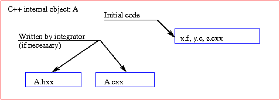

.. _seccompinterne:

Mise sous forme d'objet interne
===============================

.. index:: single: objet interne

Dans la suite de ce document, on supposera qu'un **objet interne** est un
**objet C++ ou python**   qui fournit une première interface au code initial.
Suivant la forme du code initial (binaire exécutable, librairie statique  ou
dynamique, fichiers sources f77, C, C++ ou python), cet objet aura  différentes
formes et la communication objet interne --- code initial  sera différente.

Méthodes et attributs de l'objet
--------------------------------

Dans chaque cas, il faudra définir les services et l'état interne   de l'objet
interne. En particulier :

* choisir les différents services de cet objet

* pour chaque service, définir les données d'entrée et de sortie

* pour chaque entrée et chaque sortie, définir le type de la donnée  et
  éventuellement les pré-conditions et post-conditions associées  (par exemple,
  donnée d'entrée positive)

* définir l'état interne de l'objet et éventuellement sa valeur  avant et après
  l'appel aux différents services

Les **services** seront implémentés sous forme de **méthodes publiques**  et
l'**état interne** sous forme d'**attributs**.    Si le concepteur de l'objet
désire permettre à l'utilisateur d'accéder  en lecture/écriture aux attributs,
il doit fournir des services accédant  à ces attributs.

Routines fortran77/fonctions C/classes C++
------------------------------------------

Principe
^^^^^^^^

Dans le cas de routines fortran77, de fonctions C et de classes C++,
l'intégrateur ajoutera simplement une enveloppe C++ autour de ces fonctions
(voir figure :ref:`Objet interne C++ <figobjetinterne>`), pour obtenir l'objet interne.    Chaque
méthode de l'objet

* extrait, si nécessaire, l'information des paramètres d'entrée,

* appelle la ou les routines internes concernées,

* met en forme les résultats de ces routines internes dans  les paramètres de
  sortie.

.. _figobjetinterne:

.. centered::
   Objet interne C++

.. _exemple1:

Exemple 1
^^^^^^^^^

Soient les routines fortran f77 suivantes effectuant des calculs d'algèbre
linéaire sur des tableaux unidimensionnels de flottants :

``addvec.f``

.. include:: ./exemples/exemple1/addvec.f
   :literal:

``prdscl.f``

.. include:: ./exemples/exemple1/prdscl.f
   :literal:

ainsi qu'une classe C++ simulant un type vecteur (très) rudimentaire :

.. _vecteur.hxx:

``vecteur.hxx (interface C++)``

.. include:: ./exemples/exemple1/exec2/vecteur.hxx
   :literal:

``vecteur.cxx (implémentation C++)``

.. include:: ./exemples/exemple1/exec2/vecteur.cxx
   :literal:

L'objet interne (i.e. la classe C++) dans l'exemple est :

``alglin.hxx``

.. include:: ./exemples/exemple1/exec2/alglin.hxx
   :literal:

``alglin.cxx``

.. include:: ./exemples/exemple1/exec2/alglin.cxx
   :literal:

**Remarques**

  #. Le choix des méthodes, du passage des paramètres et de leur type, est  laissé
     libre à l'intégrateur (conformément aux souhaits des utilisateurs  de l'objet).
     La correspondance entre les paramètres de l'objet interne  et ceux des routines
     du code initial est réalisée par l'implémentation (fichier  ``alglin.cxx``, ci-
     avant).

  #. En particulier, si des structures MED [MED]_ sont passées en argument
     d'entrée,   le fichier d'implémentation C++, sera chargé d'extraire et mettre en
     forme les informations à passer aux routines de calcul internes  (sous forme de
     tableaux simples et scalaires pour les routines  fortran internes).    Pour les
     arguments de sortie au format MED, les résultats des routines  internes seront
     introduites par l'implémentation dans les objets MED  à retourner.

Dans l'exemple ci-avant, remarquer :

* la declaration ``extern "C"`` devant les prototypes en C++   des fonctions
  fortran,

* le caractère "underscore" ajouté au nom C++ des fonctions  fortran,

* le mode de passage des arguments, la règle étant : sauf exceptions  (longueur
  des chaînes de caractères), on passe des pointeurs. Pour les  arguments
  scalaires, on passe l'adresse de ces scalaires; pour des  arguments pointeurs
  (tableaux), on passe les pointeurs tels quels.

L'objet interne  peut maintenant être utilisé dans un code C++ :

.. include:: ./exemples/exemple1/exec2/main_extraits.cxx
   :literal:

Références
^^^^^^^^^^

L'encapsulation C/fortran77 dans un code C++ suit la procédure standard
(formats des réels/entiers, nom des routines, passage des arguments).  A ce
sujet, on pourra consulter, par exemple,   [ForCpp]_ ou [ForCpp2]_.

Fonctions/Classes Python
------------------------

Principe
^^^^^^^^

Le principe d'encapsulation de fonctions/classes python dans un   objet interne
(python) est le même que dans le cas précédent.

  .. _figobjetinterne2:

  .. image:: images/objintpy.png
     :width: 54ex
     :align: center

  .. centered::
     Objet interne python

Exemple 2
^^^^^^^^^

Un exemple similaire au précédent part de fonctions python à encapsuler :

``func.py``

.. include:: ./exemples/exemple2/func.py
   :literal:

Il est facile d'intégrer ces fonctions dans une classe python :

``compo.py``

.. include:: ./exemples/exemple2/compo.py
   :literal:

**Remarque**
  En fait, il n'est même pas nécessaire d'enrober les fonctions python de
  ``func.py``, mais c'est plus "propre" (en particulier si  l'objet possède un
  état interne).    Le script ci-après permet d'utiliser l'objet interne python
  depuis un interpréteur python :

.. include:: ./exemples/exemple2/exmpl.py
   :literal:

Code initial sous forme d'exécutables
-------------------------------------

Principe
^^^^^^^^

Ce cas se rencontre lorsqu'on ne dispose pas des sources du code interne  (ou
lorsqu'on ne désire pas intégrer ces sources dans l'architecture  interne).
On supposera que le code est sous forme d'un binaire exécutable par  le système
d'exploitation.    Les communications avec le code peuvent se faire,

1. en entrée, soit :

   * par un ou plusieurs fichiers,
   * par la ligne de commande,
   * en répondant au clavier à des questions du code

2. en sortie, soit :

   * par un ou plusieurs fichiers,
   * à l'affichage écran.

La communication avec les exécutables se fait à l'aide des commandes
(disponibles en C++ et en python) :

* ``system`` : lancer un exécutable avec lequel on communique en entrée via
  fichiers ou la ligne de commande, en sortie, via fichiers;

* ``popen`` : mêmes fonctionnalités que le cas précédent, avec en plus la
  possibilité de   récupérer la sortie standard (écran) de l'exécutable.

Les commandes ci-dessus sont rangées par ordre de complexité croissante (on
conseille d'utiliser  autant que possible ``system``).

Exemple 3 : Objet interne python, connecté à des exécutables externes.    
^^^^^^^^^^^^^^^^^^^^^^^^^^^^^^^^^^^^^^^^^^^^^^^^^^^^^^^^^^^^^^^^^^^^^^^^

On désire utiliser
un objet "Systeme" qui possède 5 services :

* ``cd``, qui, à partir d'un chemin (chaîne de caractères), positionne  un
  répertoire courant,

* ``cp``, qui, à partir de 2 noms de fichiers, copie le premier  fichier sur le
  second dans le répertoire courant;

* ``touch``, qui, à partir d'un nom de fichier, met à jour la  date du fichier
  s'il existe, le crée sinon;

* ``rm``, qui, à partir d'un nom de fichier, détruit le fichier   dans le
  répertoire courant;

* ``dir``, qui liste les fichiers contenus dans le répertoire courant.

L'état interne de l'objet sera constitué du nom du répertoire courant  dans
lequel travailleront les services de l'objet  (qui est positionné  par le
service ``cd``).    

En python, la classe de l'objet pourrait s'écrire :

``systeme.py``

.. include:: ./exemples/exemple3/systeme.py
   :literal:

et son utilisation depuis l'interpréteur python :

.. include:: ./exemples/exemple3/use.py
   :literal:

**Remarques**

  #. Ceci est donné à titre d'exemple, python possède en standard  tout ce qu'il
     faut pour rendre ces services, sans passer par des commandes  systèmes
     (``system`` et ``popen``).

  #. L'exemple illustre le passage d'arguments d'entrées par la ligne   de
     commandes (noms passés en argument) et la "capture" des sorties écran  des
     exécutables extérieurs (``system`` ne permet pas de récupérer simplement  la
     sortie standard de la commande unix ``ls``, on utilise ``popen`` dans ce cas).

.. _exemple4:

Exemple 4 : Objet interne connecté à un exécutable externe.    
^^^^^^^^^^^^^^^^^^^^^^^^^^^^^^^^^^^^^^^^^^^^^^^^^^^^^^^^^^^^^^^^^^^^^^^^
Cet exemple montre une
interface (très) partielle d'un exécutable binaire *FreeFem* [FreeFem]_ sous la
forme d'un objet C++. L'interface donne  accès à la définition d'une géométrie
2D par sa frontière ainsi que la  résolution approchée d'une équation simple
(convection forcée) sur cette géométrie.    Les différentes méthodes de l'objet
interne sont :

* une méthode qui enregistre la géométrie du domaine,

* une méthode qui enregistre le champs de vitesse convectante,

* la méthode de calcul qui reçoit la condition initiale (sous   forme analytique
  --- chaîne de caractères), le pas de temps et le nombre  de pas de temps.

L'état interne de l'objet est constitué de la géométrie et du champs  de
vitesse.    La méthode de calcul crée un fichier à partir de ses paramètres et
de  l'état interne, puis lance une boucle de calcul (par un appel système).
Les résultats du calcul ne sont pas récupérés par l'objet.

**Remarques**

  #. Une encapsulation complète de FreeFem demanderait un effort beaucoup  plus
     important, ceci n'est qu'un exemple.

  #. On ne récupère pas ici de résultat dans l'objet C++ (l'évolution  est
     seulement visualisée par le moteur graphique interne de FreeFem).  Si on
     désirait le faire, il faudrait après  l'appel système, relire le fichier produit
     par le code externe, et  renvoyer les résultats sous forme compréhensible par
     l'utilisateur  de l'objet interne

Deux versions (C++ et python) sont listées ci-après.

.. _freefem.hxx:

``FreeFem.hxx``

.. include:: ./exemples/exemple4/FreeFem.hxx
   :literal:

``FreeFem.cxx``

.. include:: ./exemples/exemple4/FreeFem.cxx
   :literal:

``FreeFem.py``

.. include:: ./exemples/exemple4/FreeFem.py
   :literal:

L'utilisation depuis un code C++ ou un interpréteur python est similaire  dans
les 2 versions :

``version C++``

.. include:: ./exemples/exemple4/main.cxx
   :literal:

``version python``

.. include:: ./exemples/exemple4/useFreeFem.py
   :literal:

