:tocdepth: 3

A standard dataflow
-------------------
Let's consider a YACS schema containing Block, FOR loop and inline script nodes with data ports.

The first step is to import the schema from YACS XML file. One of the ways for the user to do it is to click on the **Import schema** button 
on the :ref:`schema`. Let's open legendre7.xml from YACS_SRC/src/yacsloader/samples directory.

After import operation, click on the **Fit All** button of the 2D Viewer. We have the following state of SALOME application.

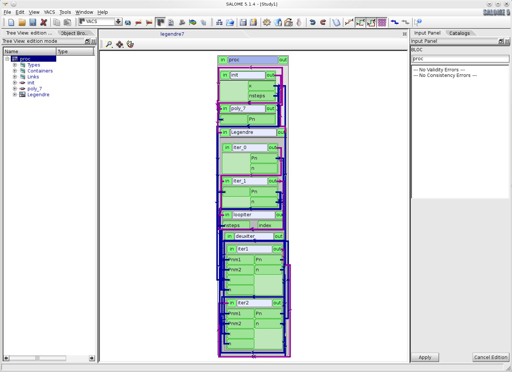

.. centered::
  **The result of legendre7.xml import**

For more convenient view of a schema representation in 2D Viewer the user can arrange nodes and links with help of 
the **arrange nodes recursion** command of the **proc** node context menu.
The result will be the following.

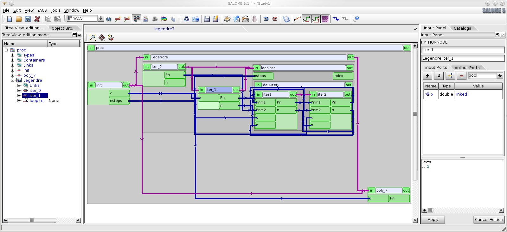

.. centered::
  **Representation of a schema after arrange nodes operation**

To change input value of the schemas' node it is needed to select this node either in schema 2D Viewer or in the Tree View of a schema. 
And after that change input ports values with help of corresponding controls on the property page of the selected node. 
But in our case, if we want to execute a body of the **loopiter** node 5 times we have to change the **nsteps** output port value of **init**
node from 3 to 5 with help of its property page (python editor), and press "Apply" button on the Input Panel schema 2D Viewer.

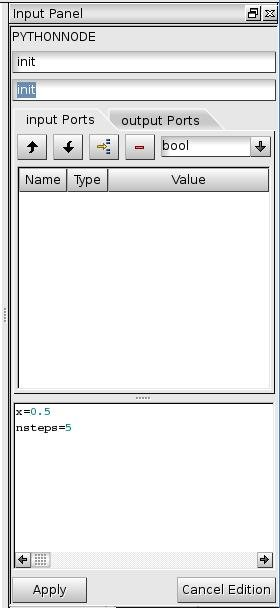

.. centered::
  **Property page of init node**

In order to execute this schema the user should create a run of the schema with help of **New execution** button on 
the :ref:`execution_toolbar`. After a new schema run has been created, schema run Tree View is constructed and schema run object 
is published in the Object Browser.

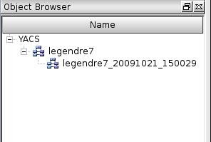

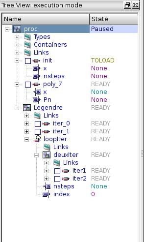

.. centered::
  **Object Browser content and schema run Tree View**

If the user selects schema object in the Tree View, Input Panel with schema property page is presented. Errors raised during 
create execution process are shown in the list box of schema property page in the run mode. In our case there is 
no error.

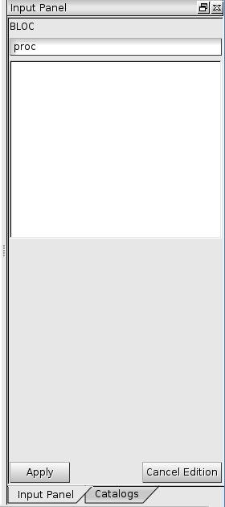

.. centered::
  **Schema property page in the run mode**

To use :ref:`breakpoints run mode <breakpoints_mode>` it is sufficient for the user to set breakpoints on nodes using check boxes 
in the run Tree View. Let's set one breakpoint - on **iter2** node inside **deuxIter** block.

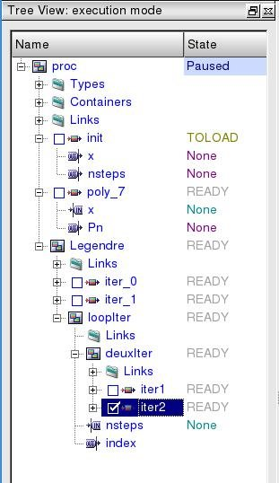

.. centered::
  **Set breakpoint in run Tree View**

Start execution with help of **Start/Resume** button on :ref:`execution_toolbar` in run mode. Execution is paused on the **iter2** node 
inside **deuxIter** block. The run Tree View displays states of nodes.

.. image:: images/functionality_list_104.jpg
  :align: center

.. centered::
  **Run Tree View of paused schema**

Now try to save execution state of the schema by clicking the **Save State** command in the YACS main menu or the **Save State** button in
the :ref:`execution_toolbar`. Save the current state of execution into /tmp/legendre7_exec_state.xml file.

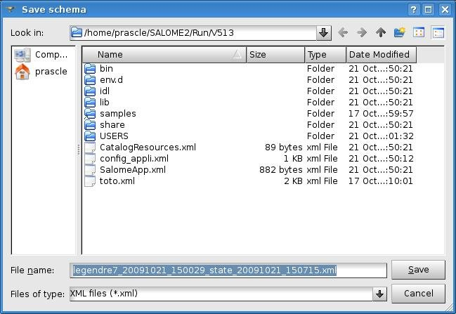

.. centered::
  **Save the current execution state of legendre7.xml schema**

Now execute the schema using **Start/Resume** button until the execution of the schema is finished, making sure that **loopiter** node 
had been executed 5 times.

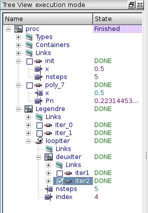

.. centered::
  **Execution of legendre7.xml schema is finished**

The user can check values of output ports with help of 'Output ports' table on the property page of a node.

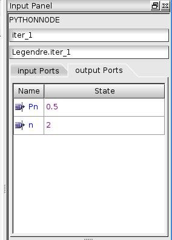

.. centered::
  **Output port values of iter_1 node**

Go back to edit mode and let's try to load saved execution state of legendre7.xml schema with the **Load previous state** button
in the :ref:`execution_toolbar`. After this operation run Tree View should be in the same state as at the moment of saving execution state.

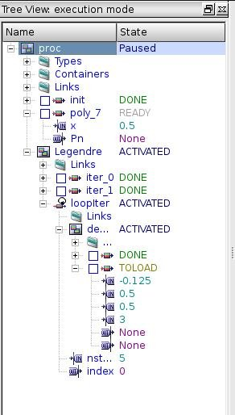

.. centered::
  **Run Tree View after load execution state**

Continue execution of the schema from the saved state and check values of output ports when execution is finished. They should be 
the same as obtained earlier during the first execution.

