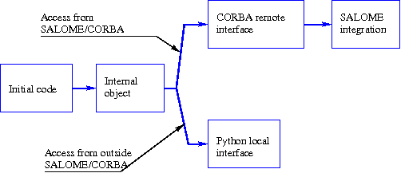

.. _secetapes:

Steps in integration of a component
========================================
Concept of component
-----------------------
There are many definitions of the software component.  We will use the following for SALOME:

**Component**

  A component is a software entity with the following characteristics and behaviours:

  - **physically identifiable**:  in other words a component is not a concept or a design “pattern”, but 
    is a “genuine” portion of binary code and can be directly executed (or interpreted) after deployment;
  - **composable**:  it must be possible to create a relation between a component and other components:  it has 
    one (or several) interfaces that interact like communication channels between components;
  - one component **interacts with the other components** only through its interface(s);
  - a component is **integrated into an application architecture** by a deployment process.  
    This deployment process is dependent on the hardware and software platform sub-tending the architecture

General scheme
--------------

.. index:: single: architecture

A calculation code is integrated in the form of a component in the PAL architecture in several steps, diagrammatically 
represented by the following figure:

.. centered:: Component integration phases

To use the component:

- locally through a python interpretor, a python interface needs to be written using tools such as **SWIG** [SWIG]_ or **Boost** [BOOST]_;
- remotely through CORBA [CORBA]_, a CORBA interface (IDL file, implementation class) must be written. SALOME offers services that can simplify the use of CORBA;
- through the SALOME application, files written according to the above point must be specialised and resource files, if any, must be specified (graphic and other).
 
Initial code
--------------
Specific cases may differ widely, depending on the form of the code to be integrated in SALOME.  
In this document, we will consider situations in which we initially have:

- a code in the form of one or several separate executables
- a set of f77 functions / C routines / C++ classes 
- a set of python scripts that can control f77 / C / C++ routines, functions or classes.

.. _compinterne:

Putting the initial code in the form of an internal object
----------------------------------------------------------------

.. index:: single: internal object

A first work to simplify the next phases consists of presenting the initial code in the form of a C++ or python object.

**internal object**

  This C++ or python object will be called "**internal object**" in this document.  It will be composed of 
  public or private methods and attributes (according to the standard object oriented terminology):

  .. index:: single: methods; public

  - **public methods** are calculation services that are to be made available to users of the internal object

  .. index:: single: attributes; public

  - **public attributes** are object data that are to be made available to users of this internal object

  .. index::
     single: methods; private
     single: attributes; private

  - **private methods and attributes** are services and data of the internal object that are not to be 
    made available to users of the internal object (and that will only be visible from other methods of this object).

.. index::
      single: internal state
      single: common fortran77
      single: global variables

**Notes**

1.  The “public/private” distinction is not really meaningful in Python, in which everything is public by default.
2.  The user sees the internal object as a set of public methods (e.g. calculation services) that delegate requests to the encapsulated code (see the :ref:`Internal object embedding the initial code <figinterne1>`, :ref:`Internal object communicating with an external code <figinterne2>` and :ref:`Initial code already in the form of an internal object <figinterne3>` figures)
3.  Attributes keep the “object memory” between 2 successive calls to object services (internal state, for example fortran77 common or C/C++ global variables [#f1]_).

.. index::
   single: service; internal object
   single: internal state

The first part of the work, a design step, consists of defining the services and the internal state of this object.  In particular:

- choose the different services,
- for each service, define input and output data,
- for each input and each output, define the data type and also the associated pre-conditions and post-conditions,
- define the internal state of the object and possibly its value before and after the call to the different services.

Depending on the case, the internal object may:

* “encompass” the initial code, this is the case for an initial code in the form of a library or for which the source code is available;

    .. _figinterne1:

    .. image:: images/objint1.png
         :align: center

    .. centered:: Internal object encompassing the initial code

* communicate with the source code through the operating system (Unix, Windows, etc.), this is the case for an initial code 
  in the form of a binary executable:

    .. _figinterne2:

    .. image:: images/objint2.png
         :align: center

    .. centered:: Internal object communicating with an external code

  **Note**:  The communication with the binary external code may be made through files, or for example through the command line.

* if the initial code is already in the form of a python class, there is nothing to be done.

    .. _figinterne3:

    .. image:: images/objint3.png
         :align: center

    .. centered:: Initial code already in the form of an internal object

Access from a local python interpreter
-----------------------------------------
The C++/python object constructed in the (:ref:`compinterne`) section may be embedded in a component manipulated from a 
local python interpreter as shown on the following figure.

.. _python_local:

.. image:: images/accesLocal.png
   :align: center

.. centered:: Access from a local python interpreter

It may or may not be necessary to provide an interface, depending on the type and implementation of the 
internal object (C++ or python).  Tools such as **swig** and **boost** can simplify this task [#f2]_.

Access from CORBA
------------------
An interface has to be provided to enable a remote access to the component through CORBA, independently of the access from 
a local python interpreter.  Operation of CORBA as a client-server is selected as shown in the figure 
:ref:`Access from CORBA <figaccescorba>`, which shows communication between a client and a server through CORBA.

**CORBA server**  
  A server is an executable, for the purposes of this document and in the SALOME environment.  
  It is connected to a communication channel called a CORBA bus that transmits requests to it and to which 
  the server returns the results of these requests.  A server can host several CORBA objects to which it delegates 
  execution of these requests.  The CORBA client-server relation is specified by an interface file called the **IDL file**.  
  This represents a contract between the component and the clients that use the component.

In this operating mode, the components will be CORBA objects.  The server – component relation will be specified 
in the :ref:`contfab` paragraph.

**Note**:  Requests cannot be executed correctly unless the client and the server respect the IDL file.  This is why 
in SALOME, the different IDL files are assembled in directories seen by all CORBA clients and servers.

.. _figaccescorba:

.. image:: images/accesCorba.png
   :align: center

.. centered:: Access from CORBA

The code integrator must provide a part of the component server interface in the form of a so-called **implementation** 
class (similar procedure in python and C++, at the server end).  The remainder of the interface is generated 
from the IDL interface file.  On the other hand, the CORBA interface is generated almost entirely at the client 
end (particularly if the client is written in Python).

Specific features of the SALOME environment
------------------------------------------------
SALOME services
^^^^^^^^^^^^^^^^^^
SALOME provides a number of services above CORBA that simplify its use.  For example:

Access to the naming service  
""""""""""""""""""""""""""""""
An IOR (CORBA reference) is a remote pointer, which is not always easy to handle.  The following is an example of an IOR::

   IOR:010000003400000049444c3a6174742e636f6d2f4174744e6f74696669
   636174696f6e2f4576656e744368616e6e656c466163746f72793a312e3000
   010000000000000026000000010100000a0000003132372e302e302e310006
   800e000000fedd112a3d000007ef0000000001

which has the following meaning::

   Type ID: "IDL:att.com/AttNotification/EventChannelFactory:1.0"
   Profiles: 1. IIOP 1.0 127.0.0.1 32774 POA(root) 0x00000001  (4 bytes)

With the CORBA naming service, the user can associate a name with this IOR.  SALOME provides a class (C++ or python) 
that makes it easy to use this association.

Standard data structures
"""""""""""""""""""""""""""""""""""""""""
In addition to CORBA data structures (scalar, character strings, vectors, generic structures) SALOME offers typical structures 
to represent meshes, support (parts of meshes) and value fields on these supports.  These structures are grouped under the 
name of the *data exchange model (MED)* [MED]_.

Use of the CORBA notification service
"""""""""""""""""""""""""""""""""""""""""
CORBA offers a service to send notifications (for example calculation progress).  SALOME offers features to make it easier 
for components to send messages and an events channel in which customers can monitor how component calculations are progressing.

A registry service
"""""""""""""""""""""""""""""""""""""""""
With this service, the customer can know all components to which he can send requests.

A modules catalog  
"""""""""""""""""""""""""""""""""""""""""
With this service, the User and SALOME can know the different available components with the different available 
services and the location of these components on disks on different machines.

A study management service
"""""""""""""""""""""""""""""""""""""""""
This service groups different items of information used or produced by components during a SALOME usage session (at the choice of the user).

Basic components
"""""""""""""""""""""""""""""""""""""""""
SALOME is a generic CAD-Calculation platform that offers CAD, mesh, display and calculation supervision components.

.. _contfab:

Containers and factories
^^^^^^^^^^^^^^^^^^^^^^^^^^
.. index::
   single: container
   single: factory 

SALOME is based on the concept of containers and factories.

**Container-factory**  
  A **container** is a CORBA server that hosts CORBA components and is responsible for the life cycle (load/unload, initialize) 
  of these components.  Each container contains a particular CORBA object called a factory, to which requests to load or unload 
  components can be sent.
 
Example  
"""""""
Assume that a client would like to use the services of a component named A in a container named B on a machine named M.  
The different arrows on the :ref:`Container, factory and components<figconteneur>` figure show the operation:

#.  The client contacts the SALOME kernel (on its machine) and asks the kernel to provide it with a reference to component A in a container B on a machine M.  The kernel searches if such a component is already referenced.
#.  If the component is not referenced, the SALOME kernel searches for container B on machine M.  If the container does not exist, SALOME creates it.  The kernel retrieves a reference on the “factory” object in container B.
#.  The “factory” object in container B dynamically loads the library containing the code of component A starting from the disk.
#.  The component is created and registered in the SALOME kernel, that forwards the reference on the component to the client.
#.  The client can issue requests to the component.

**Note**:  When a reference on a component has been obtained using the previous process (items 1 to 4), the client can keep it 
and issue requests to the component throughout the remainder of the calculation without repeating the same steps.  
In the current version of SALOME, an automatic restart procedure has not yet been set up for the case in which the component 
(or the container that contains it) is lost.

.. _figconteneur:

.. centered:: Container, factory and components

.. rubric:: Footnotes

.. [#f1] Appendix 1 contains some information about processing of Fortran common and C++ global variables.

.. [#f2] At the time of writing this document, the tool selected by SALOME is swig.  As long as the choice is not modified, it is not recommended that boost should be used to integrate components into SALOME (since interoperability of the two tools has not been tested).
