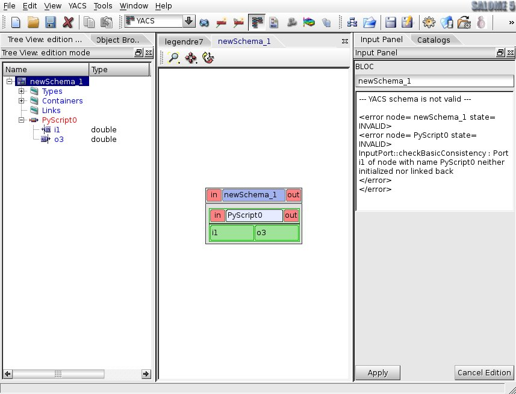
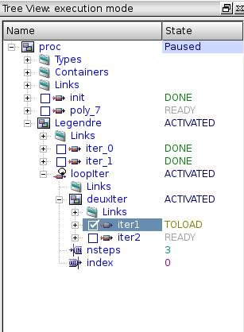
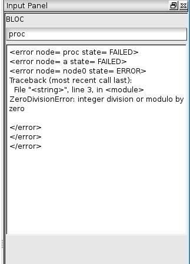
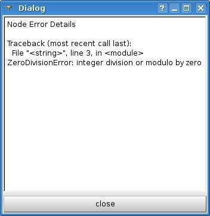
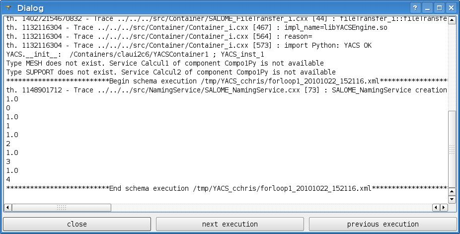
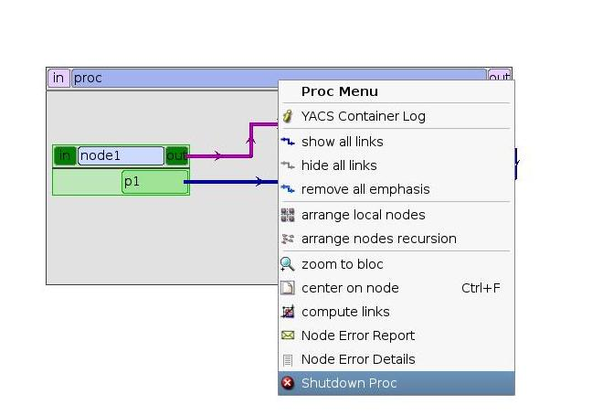
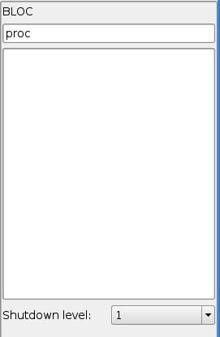

.. _execution:

Execution of a schema
=====================

In the frames of one YACS GUI session, YACS module allows the user to operate with several study documents (one per desktop). Each study 
may contain some schemas, but only one YACS engine instance exists per study.

.. _execute_schema:

Execute a schema
----------------
The user can execute a schema in different modes. Each of these modes can be chosen from :ref:`yacs_menu` of the YACS GUI in schema run mode. They are

+ **Without stop Mode** - execute a schema in a normal way,

.. _breakpoints_mode:

+ **Breakpoints Mode** - execution of a schema is paused on each breakpoint,

+ **Step by step Mode** - execute a schema step-by-step (i.e. node by node).

It's worth mentioning that for breakpoints mode it is suitable to use nodes' check boxes in the schema Tree View for run mode in order
to set a breakpoint on a node.

**Stop on error** option from :ref:`execution_toolbar` or from YACS main menu :ref:`yacs_menu` finishes execution of a schema if any error occurs. 
It's useful if a schema has some parallel chains of nodes which can be executed simultaneously, and the user wants to break execution process 
of the whole schema if only one of chains raise an error.

.. _start_resume:

In order to start/resume execution of a schema it is needed to choose **Start/Resume execution** item from YACS main menu :ref:`yacs_menu` or click 
corresponding button on :ref:`execution_toolbar`. This same command resumes schemas' execution, if it was paused earlier.

.. _pause_abort_reset:

The user can pause execution of a schema with help of **Suspend execution** item from YACS main menu :ref:`yacs_menu` or corresponding button 
on :ref:`execution_toolbar`. By analogy, **Abort execution** and **Restart execution** commands can be activated either from YACS
main menu or Execution toolbar. **Abort execution** command kills execution of a schema, and
**Restart execution** command restart execution after having reset nodes terminated with error to initial state.

In the frames of YACS GUI a preliminary step of checking schemas' validity before creating a schema run is performed. The user is 
informed by the system about all problems detected by this operation.

.. centered::
  **An example result of checking schemas' validity before create a schema run**

If a preliminary check is successfully done, schema run is created and then the user can start its execution in the chosen mode. Schema run 
is exported to an XML file and passed to YACS CORBA engine and executed there. YACS CORBA engine is also given a study ID.

For visual representation of execution state the following means are provided by YACS module.

+ **State of a node** - each state has its own color code at any moment of the execution. During the execution the background color of 
  the nodes' status is changed according to its execution status. In the YACS module for SALOME this color code is predefined. 
  The user has the possibility to specify it in the user preferences (see :ref:`set_user_preferences` section).

+ **Values of ports** are shown during the execution process either on ports inside Tree view or on nodes' property page.

More than that, schema Tree View in run mode shows information about the current execution state of the whole schema and the current 
execution state of each node.

.. centered::
  **The state of run Tree View during schemas' execution**

The selection of object in the run Tree View activates Input Panel with schema or node property page depending on the type of selected object.

.. centered::
  **Schema property page in run mode**

.. image:: images/functionality_list_82.jpg
  :align: center

.. centered::
  **Inline node property page in run mode**

The user can get a detailed information about errors (if any) occured during the execution process from list box on the schema run property page.

The user can get errors on one node by using the **Node Error Details** command from its context menu.

.. centered::
  **Error Details in an Inline node (zero division error)**

The **Node Error Report** command from the context menu gives the same information plus the status of the node.

For SALOME nodes, the **Node Container Log** command shows the associated container log as the node is executed in a remote process (container).

Lastly, the **YACS container log** command from the schema context menu shows the log of the YACS server where the user can find information
to solve problems encountered during the execution.

.. centered::
  **YACS container log**

.. _save_restore_execution_state:

Save/Restore execution state
----------------------------
If the current study contains an executable schema and the schema is in paused or stopped state, the user can save the current execution 
state of the schema for its further usage.

The user can save an execution state of the schema by choosing the **Save State** command from the YACS main menu :ref:`yacs_menu` or from 
the :ref:`execution_toolbar`. As a result of this operation, the dialog box similar to the standard SALOME GUI "Save file" dialog box 
is shown by YACS module. The user should select an XML file to save schemas execution state into and the current execution state of the 
schema is saved into the selected XML file.

Here is an example of XML file structure storing the current state of schemas' execution.

::

 <?xml version='1.0'?>
 <graphState>
  <node type='elementaryNode'>
    <name>poly_7</name>
    <state>READY</state>
    <inputPort>
      <name>x</name>
      <value><double>0.5</double></value>
    </inputPort>
  </node>
  <node type='elementaryNode'>
    <name><b>init</b></name>
    <state><b>DONE</b></state>
  </node>
  <node type='elementaryNode'>
    <name><b>Legendre.loopIter.deuxIter.iter1</b></name>
    <state><b>DONE</b></state>
    <inputPort>
      <name>Pnm1</name>
      <value><double>-0.4375</double></value>
    </inputPort>
    <inputPort>
      <name>Pnm2</name>
      <value><double>-0.289062</double></value>
    </inputPort>
    <inputPort>
      <name>x</name>
      <value><double>0.5</double></value>
    </inputPort>
    <inputPort>
      <name>n</name>
      <value><int>4</int></value>
    </inputPort>
  </node>
  <node type='elementaryNode'>
    <name><b>Legendre.loopIter.deuxIter.iter2</b></name>
    <state><b>TOACTIVATE</b></state>
    <inputPort>
      <name>Pnm1</name>
      <value><double>-0.289062</double></value>
    </inputPort>
    <inputPort>
      <name>Pnm2</name>
      <value><double>-0.4375</double></value>
    </inputPort>
    <inputPort>
      <name>x</name>
      <value><double>0.5</double></value>
    </inputPort>
    <inputPort>
      <name>n</name>
      <value><int>5</int></value>
    <inputPort>
  </node>
  <node type='bloc'>
    <name><b>Legendre.loopIter.deuxIter</b></name>
    <state><b>ACTIVATED</b></state>
  </node>
  <node type='forLoop'>
    <name><b>Legendre.loopIter</b></name>
    <state><b>ACTIVATED</b></state>
    <nbdone>1</nbdone>
    <nsteps>3</nsteps>
  </node>
  <node type='elementaryNode'>
    <name><b>Legendre.iter_1</b></name>
    <state><b>DONE</b></state>
    <inputPort>
      <name>x</name>
      <value><double>0.5</double></value>
    </inputPort>
  </node>
  <node type='elementaryNode'>
    <name><b>Legendre.iter_0</b></name>
    <state><b>DONE</b></state>
  </node>
  <node type='bloc'>
    <name><b>Legendre</b></name>
    <state><b>ACTIVATED</b></state>
  </node>
  <node type='proc'>
    <name><b>proc</b></name>
    <state><b>ACTIVATED</b></state>
  </node>
 </graphState>

XML file contains states of all schema nodes and the state of the whole schema.

If during saving the execution state into the XML file, problems with access rights or free space on a disk drive occur, YACS module 
cancels saving of the execution state and shows an error message.

To continue the execution later from saved state the user can restore execution state for the selected schema from an XML file with 
help from the :ref:`execution_toolbar`.

By default the **Save State** and **Load execution state** commands are applicable to the active schema.

.. _shutdown:

Schema shutdown
--------------------
In GUI, shutdown must be explicitly requested by the user by using the context menu of the schema (**Shutdown Proc** entry).

The shutdown level can be changed in the schema property page with the shutdown level combobox.

.. _create_new_edition:

Create new edition
------------------
In the run mode YACS GUI for SALOME provides the user with the possibility to create a copy of executed schema in order to do some 
modifications in it. This functionality is avalable with help of **Edit Again** command from YACS main menu :ref:`yacs_menu` in run mode of 
a schema or from corresponding button on the :ref:`execution_toolbar` in the same mode.

In such a case the user can done any modifications in the edition copy of the current schema run and after some corrections create a 
new run schema object corresponding to the modified version of the schema. It can be considered as a cyclic process of execution 
and correction of a schema.

