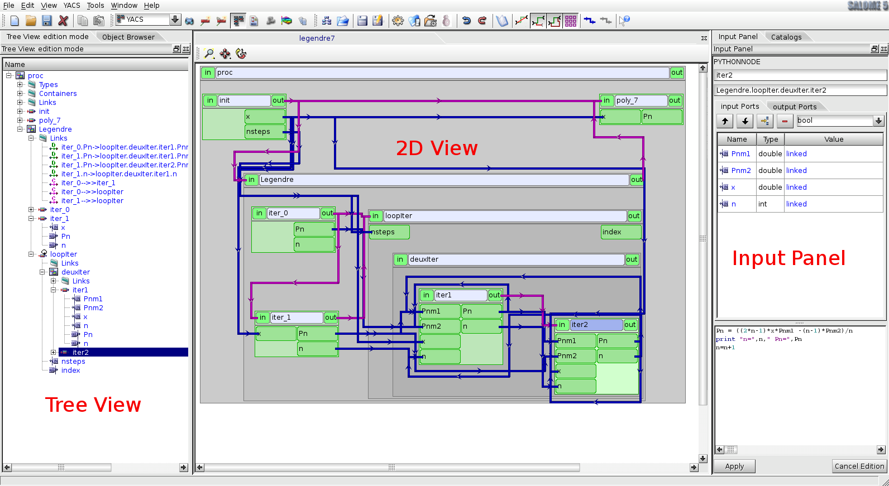

.. _gui:

*******************************************************
Using YACS with the graphical user interface (GUI)
*******************************************************

YACS GUI description
====================

.. _mainwindow:

.. centered::
  Main Window

The YACS GUI document contains several 2D and tree views, one of each per run of a schema. There are different view modes of the schema.
The SALOME Object browser is only used to publish the run of the schema as a whole, and under the run, 
the outputs of the run that are published for the use of other SALOME modules. During the schema design (edition),
a dedicated edition tree view of the YACS data structure is used for schema building.
Modifications are displayed on the 2D view.

Several executions (run) of the same schema can occur at the same time. Dedicated tree in run mode and 2D views are used for each run.
The run tree view is used to control the execution (stop, breakpoints) and the 2D view reflects the detailed current state of execution.

The Python Console and Log Window often present in other SALOME modules are not used in YACS, so, they are not present by default.

For the quick access to basic operations the system of context-dependent popup menu is supported.
Popup menu is called by click of the right button of the mouse on the selected object.

Drag and drop operations are often used in edition, between tree items and/or 2D items, for associations (link creation, for instance).

The main window look & feel is presented schematically below.
Note that SALOME Object browser and Schema tree view are regrouped under tabs by default.

.. toctree::
   :maxdepth: 1

   gui_components
   main_menu
   toolbars

.. raw:: LaTeX

   \clearpage

Functionality list
==================

Let's describe the principal functionalities of objects creation, edition, visualization and execution of the YACS module.

.. toctree::
   :maxdepth: 2

   operations
   modification
   representation
   execution

.. raw:: LaTeX

   \clearpage

YACS schema examples
====================

In this section we consider several examples of YACS schemas.

.. toctree::
   :maxdepth: 2

   scratch
   dataflow

