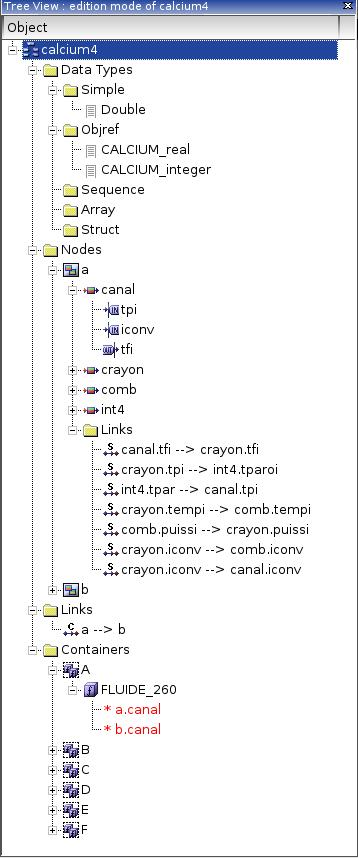
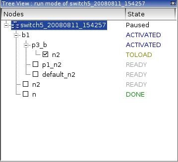
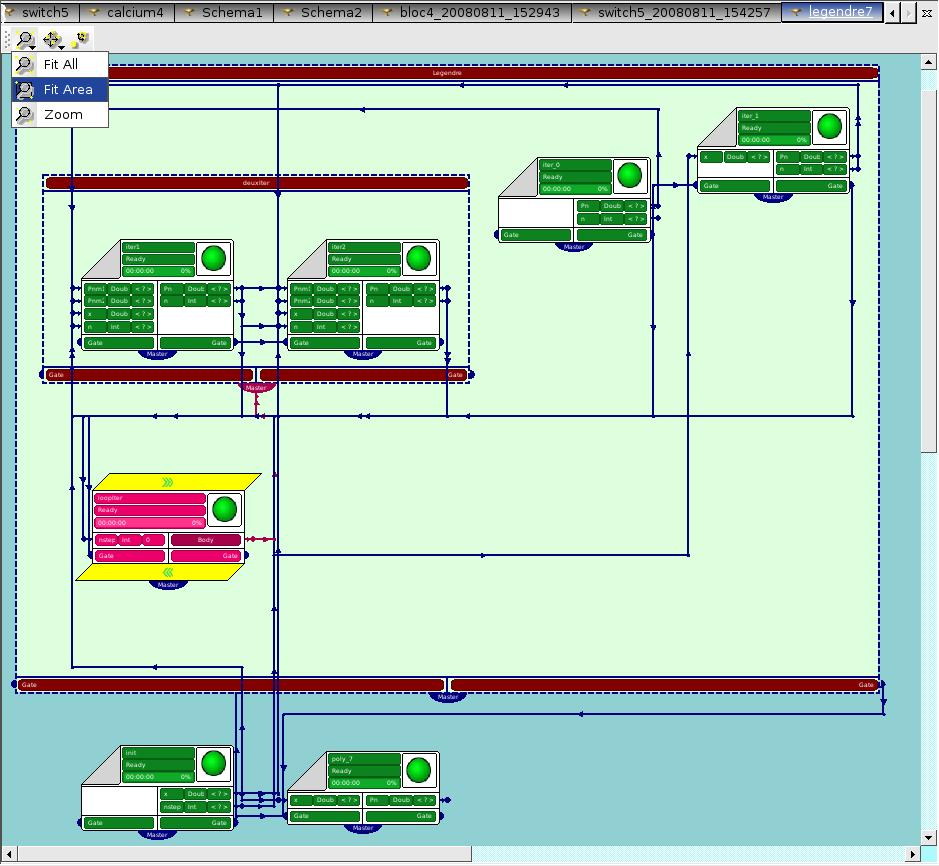
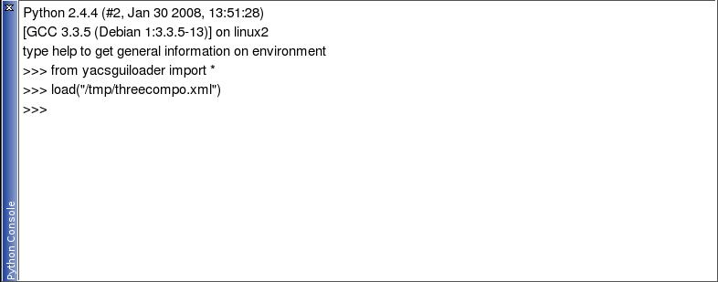
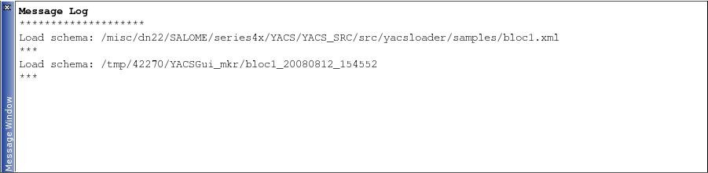

YACS GUI components
===================

.. _object_browser:

Object Browser
--------------
The Object Browser is a reusable SALOME GUI component. All schemas created or imported during working session will be referenced in it.

The SALOME Object Browser is only used to publish the run of the schema as a whole, i.e. just a name for the run, and under this name, the outputs of the run that are published in study for the use of other SALOME modules.

To see an example of the Object Browser data structure refer to the :ref:`mainwindow`.

.. _tree_view:

Tree View
---------
YACS data structure is represented in a dedicated tree view using tree-like style.

The dedicated tree view shows only one schema during edition, and only one run of a schema during execution. The informations displayed during edition and execution are not the same, and the specific actions (popup menu) on the items in the tree are also different. So, it is needed to distinguish the :ref:`run_mode` and the :ref:`edition_mode`.

.. _edition_mode:

Edition mode of the Tree View
~~~~~~~~~~~~~~~~~~~~~~~~~~~~~
The proposed YACS tree view organization in edition mode is shown on figure below.

The content of schema tree view in edition mode is updated automatically after each operation that affects the list of objects displayed in it. Each object presented in the edition tree view has its own icon to distinguish types of objects (in particular, it is important for types of nodes or links).

With help of edition tree view user can interact with objects using context dependent popup menu (see :ref:`activate_context_popup_menu` section). For example, commands such as "Display", "Erase", "Delete", etc. are accessible from that menu.

The description of each object type is given in the table below.

.. |container| image:: images/container.png

.. |block| image:: images/block_node.png
.. |switch| image:: images/switch_node.png
.. |loop| image:: images/loop_node.png
.. |node| image:: images/node.png

.. |control| image:: images/control_link.png
.. |data| image:: images/data_link.png
.. |stream| image:: images/stream_link.png

============================================================= ======================================= =====================================
**Object**                                                              **Icon**                          **Description** 
============================================================= ======================================= =====================================
Schema_Name [note_]                                             |schema|                               A schema object, which has the same name as a name of loaded XML file of a graph, or 'Schema1', 'Schema2', etc. if this is a new created schema. The corresponding object is published as SObject in Object Browser for normal operation of SALOMEDS study persistence. The study persistence consists in saving the xml file of the schema. 

Data Types                                                                                             A folder under which a list of data types defined in the schema is represented. 
Simple                                                                                                 A folder under which simple data types (Double, Int, String, Bool) are published. 
Objref                                                                                                 A folder under which object reference data types are published. Objref data type is a predefined YACS data type for reference objects. It is obtained from a Catalog of Data Types. 
Sequence                                                                                               A folder under which sequence data types are published. Sequence data type is a predefined YACS data type for sequence objects. 
Array                                                                                                  A folder under which array data types are published. Array data type is a predefined YACS data type for array objects. 
Struct                                                                                                 A folder under which struct data types are published. Struct data type is a predefined YACS data type for struct objects. 
Nodes                                                                                                  A folder under which a list of nodes included into the edited schema is represented.

Block_Name [note_]                                               |block|                               A block node object. This object is published as a label under the schema/another composed node object in which it includes. A block node object is created when the corresponding schema object containing this block node is imported or a new block node is created inside this schema. 

Loop_Name [note_]                                                |loop|                                A loop node object. This object is published as a label under the schema/another composed node object in which it includes. A loop node object is created when the corresponding schema object containing this loop node is imported or a new loop node is created inside this schema. 
Switch_Name [note_]                                              |switch|                              A switch node object. This object is published as a label under the schema/another composed node object in which it includes. A switch node object is created when the corresponding schema object containing this switch node is imported or a new switch node is created inside this schema. 
Node_Name [note_]                                                |node|                                An elementary node object. This object is published as a label under the schema or composed node object in which it includes. An elementary node object is created when the corresponding schema object containing this node is imported or a new elementary node is created inside this schema. 
Input_Port_Name                                                  |inport|                              An input port object. It is published in the edition tree view under the node which is belong to. 
Output_Port_Name                                                 |outport|                             An output port object. It is published in the edition tree view under the node which is belong to. 
============================================================= ======================================= =====================================

.. _description_of_link_objects:

Links, containers and components table.

============================================================= ======================================= =====================================
**Object**                                                              **Icon**                          **Description** 
============================================================= ======================================= =====================================
Links                                                                                                  A folder under which links are published. Links internal to a block (composed node) are represented under the block. Three kinds of links (control, dataflow, datastream) can be put directly into the 'Links' folder under the block if they exist. **NB!** A link is called internal to a block if it has its input and output on nodes inside the block. These concept and representation is convenient for cut and paste operations of block. 
Node_From_Name --> Node_To_Name                                  |control|                             A control link object with a symbolic name. This object is published as a label under the corresponding 'Links' folder. 
Node_From_Name.Port_From_Name --> Node_To_Name.Port_To_Name      |data|                                A data link object with a symbolic name. This object is published as a label under the corresponding 'Links' folder. 
Node_From_Name.Port_From_Name --> Node_To_Name.Port_To_Name      |stream|                              A datastream link object with a symbolic name. This object is published as a label under the corresponding 'Links' folder. 
Containers                                                                                             A folder under which a set of containers referenced from the currently edited schema is represented. 
Container_Name [note_]                                           |container|                           A container definition (not instanciated during the edition). This object is published as a label under Containers parent object, and gives acces by the corresponding property page to its properties (cf. SALOME life cycle CORBA & Container manager). 
SALOME_Component_Name [note_]                                    |component|                           A SALOME component instance definition (not instanciated during the edition). This object is published as a label under the container definition in which it includes. 
CORBA_Component_Name [note_]                                     |component|                           A CORBA component object, which has the same name as a name of created component. This object is published as a label under the 'Containers' folder directly. 
\*Node_Name                                                                                            A reference to the service node published above. This object is published under the component object from which its service is taken.
============================================================= ======================================= =====================================

.. _note:

.. note::
  The selection of an object in the Tree View displays its properties in the corresponding page of the Input Panel.

.. _run_mode:

Run mode of the Tree View
~~~~~~~~~~~~~~~~~~~~~~~~~

The run tree view shows the nodes and their hierarchy in the schema (same as in edition mode). Only the nodes are shown, with their current state of execution. The current execution state is updated by notification from execution engine.

There are three modes which are available in the run mode of the schema. They are the following.

#. **Without stop mode.** This is the simplest mode when the user don't influence on the execution flow of the schema.

#. **Breakpoints mode.** Before/during the execution of the schema it is possible to set breakpoints using checkboxes, but only on elementary nodes. In such a case the execution will be paused when checked node(s) will be ready to start.

#. **Step by step mode.** The execution of the schema is processed by steps, from one node to another, and paused after each subtask.

.. _viewer:

2D Viewer
---------
The user can display a presentation of the schema in the 2D Viewer based on the Qt drawing capabilities. The high-level 2D Viewer classes from SALOME GUI QxGraph package are used for this purpose. QxGraph classes also support interactive selection/hilighting in 2D View with the mouse, however selection capabilities will not be used in YACS GUI for SALOME 4.1.

.. _view_operations_toolbar:

The 2D Viewer has its own View Operations toolbar, which contains buttons for the following operations:

+ Fit All,

+ Fit Area,

+ Zoom,

+ Panning,

+ Global Panning,

+ Reset.

.. _input_panel:

Input Panel
-----------
The properties of each object type, such as container, component, schema, node and link (for the future version!), are displayed within the Input Panel placed in the right part of the desktop.

The Input Panel is a dock window and consists of the several property pages. Each property page allows seeing or modifying the properties of the object with the certain type (see :ref:`edit_object` section). The user can see property pages of the several types of objects at the same time (for example, property page for a service node and for a container).
The selection of an object either in the Tree View or 2D Viewer will display its property page in the Input Panel.

The content of Input Panels' property pages in edition mode of the schema is differ from the same one in run mode. There are more possibilities to edit objects' properties with help of Input Panel in edition mode than in run mode.

As an example, there are two property pages for inline script node on the pictures below: the first corresponds to the edition mode, and the second - to the run mode.

.. image:: images/input_panel_0.jpg
  :align: center
  :width: 47ex

.. centered::
  **Node property page in edition mode**

.. image:: images/input_panel_1.jpg
  :align: center
  :width: 47ex

.. centered::
  **Node property page in run mode**

Python Console
--------------
The Python Console permits the user to invoke some YACS functionality from Python, for example, import XML graph with old format (SALOME Supervisor) from Python Console. Example of usage:

Log Window
----------
The Log Window permits the user to follow the execution process of the schema. The YACS engine console output, including error messages, is redirected to the Log Window.

