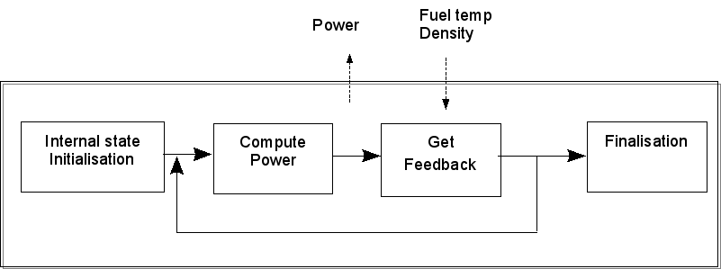
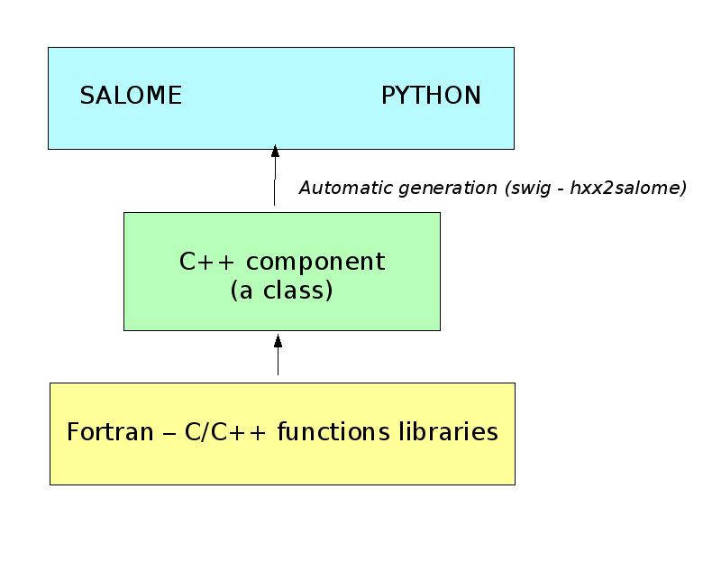
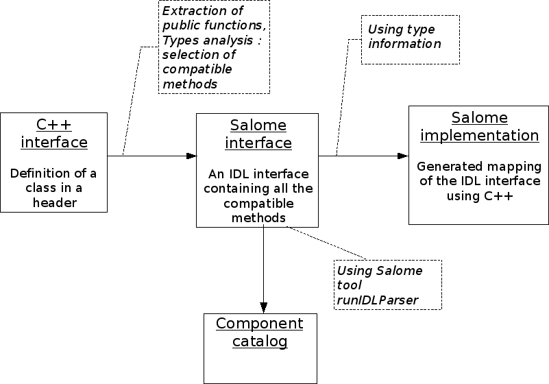
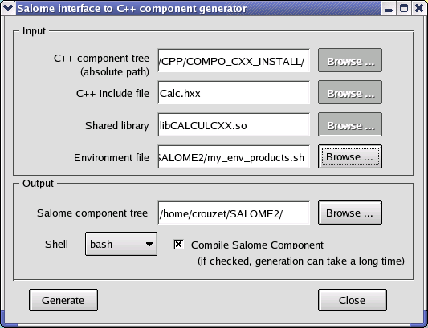

.. _hxx2salome:

hxx2salome : a SALOME component generator
==========================================

This document is the following of the HELLO component documentation [R1]_, which presented the basis for the implementation of a SALOME Component, and the CALCULATOR component documentation [H1]_, which introduced the use of MED within the SALOME context. These two examples showed that implementing a SALOME component doesn't require much imagination, it can be done by following some predefined rules. Thus, it is possible, provided a C++ standalone component, to wrap it into a SALOME Component automatically. This document presents hxx2salome, a prototype tool for automatic SALOME Component generation. This tool starts from the interface of a C++ component (an .hxx file), parse the public  API , and use the type information to generate the SALOME component (the  IDL  interface, and its implementation).

Getting started
---------------

In this chapter, we will create from scratch a new SALOME component that add and multiply integers, and compute a factorial. We suppose that  hxx2salome  (and the related tools  SA_new_component  and  SA_build ) have been installed in a directory called  $HXX2SALOME_ROOT_DIR , which is present in your  $PATH .

C++ component implementation
''''''''''''''''''''''''''''

The first thing to do is to implement the C++ engine that will perform the services. To do it, we use the  SA_new_cpp_component  tool:

::

    
    $ SA_new_cpp_component  CALC
    $ ls CALC_CPP_SRC/
    adm  archive  AUTHORS  build_configure  ChangeLog  configure.in.base
    Makefile.am  NEWS  README  rfind  root_clean  src
    

The   SA_new_cpp_component CALC  command has created a complete tree in directory  CALC_CPP_SRC  that allow you to build a C++ component with a  SWIG  python interface. Now we have to define the interface and implement it. For that, we edit and adapt the templates that have been generated in the source directory:

::

    
    $ cd CALC_CPP_SRC/src/CALC/CALC_CXX  # go in source dir
    $ vi CALC.hxx  # edit interface template and adapt it
    
    #ifndef _CALC_HXX_
    #define _CALC_HXX_
    
    class CALC
    {
    public:
        unsigned fact(unsigned n);
        int add(int n1, int n2);
        int mul(int n1, int n2);
    };
    
    #endif
    
    $ vi CALC.cxx # edit and adapt class implementation template
    
    #include "CALC.hxx"
    
    int CALCUL::add(int i1, int i2)
    {
        return i1+i2;
    }
    
    int CALCUL::mul(int i1, int i2)
    {
        return i1*i2;
    }
    
    unsigned CALCUL::fact(unsigned n)
    {
        unsigned fact=1;
        for (unsigned i=n; i!=1; --i)
            fact*=i;
        return fact;
    }
    

A template python test file was also generated, that can be callable both from python and from SALOME. You can if you wish edit it and add the tests you want:

::

    
    $ cd ../CALC_TEST
    $ vi CALC_test.py
    
    from os import getenv
    if getenv("SALOMEPATH"):
        import salome
        import CALC_ORB
        my_CALC = salome.lcc.FindOrLoadComponent("FactoryServer", "CALC")
        IN_SALOME_GUI = 1
    else:
        import CALCSWIG
        my_CALC=CALCSWIG.CALC()
    pass
    #
    #
    print "Test Program of CALC component"
    print "5 + 3 = ", my_CALC.add(5,3)
    print "5 * 3 = ", my_CALC.mul(5,3)
    print "5! = ", my_CALC.fact(5)
    

Only the last three lines were added, the beginning is part of generated template.

Compilation – Testing with python
'''''''''''''''''''''''''''''''''

It's time now to compile the component and test it. The component is built under Automake. The build procedure (build_configure, configure, make, make install) is explained in the  README  file. You can also use the  SA_build  tool:

::

    
    $ cd ../../../..   # go in father directory of CALC_CPP_SRC
    $ SA_build CALC_CPP_SRC
        ...
    $ ls
    CALC_CPP_BUILD  CALC_CPP_INSTALL  CALC_CPP_SRC
    
    $ ls  CALC_CPP_INSTALL  # check installation was done
    bin  include  lib
    
    # update pathes for component's use within python
    $ setenv PYTHONPATH \
    instalDir/bin/salome:instalDir/lib/salome:$PYTHONPATH   
    $ setenv LD_LIBRARY_PATH \
    instalDir/lib/salome:$LD_LIBRARY_PATH 
    
    $ python   # test component with python
    >>> import CALC_test
    Test Program of CALC component
    5 + 3 =  8
    5 * 3 =  15
    5! = 120

Before testing the component from python, it was necessary to update  LD_LIBRARY_PATH  and  PYTHON_PATH  environment variables.

SALOME component generation
'''''''''''''''''''''''''''

The C++ engine is finished, and tested - the final step is the integration inside SALOME. This is done  using  hxx2salome  tool (the options used here are explained in Chapter 8.2 – the tool also has a graphical interface):

::

    
    hxx2salome -c -e ${INTEGRATION_ROOT}/my_env_products.sh instalDir/CALC_CPP_INSTALL \
                CALC.hxx libCALCCXX.so ${INTEGRATION_ROOT}
       ...
    $ source ${INTEGRATION_ROOT}/my_env_products.sh
    $ runSalome –-modules=CALC   # launch salome with CALC compo
    
    >>> import CALC_test  # import test case from python console

The component can now be used inside SALOME, from the python embedded console, or from Supervision.

What is a C++ component?
------------------------

We explain in this paragraph what is meant by “C++ component” in this document. This definition is definitely not unique!

Let's first try to define more generally what components are. They are used to deliver reusable, “off-the-shelf” software unit for incorporation into large applications (such as frameworks) : a component can be deployed independently and is subject to third-party composition. Its aim is to improve efficiency for end-users. It has specified interfaces and explicit context dependencies only.   It encapsulates small-scale abstractions within a given domain.

A C++ component is a “high level” unit of reuse, based upon some source code libraries (developed in FORTRAN, C or C++). It takes the form of a C++ class. Its interface is the public API of this class, and is declared in an include file. It is designed to  collaborate  with other components . Therefore its API emphasizes the logical chains of computation a user can perform, and the data that may be exchanged with external world conform to standards (for example in the SALOME context: basic types, MED types and XDATA types).

For being more concrete, let's take the (simple) example of a steady-state neutronic component developed by CEA to work in collaboration with thermal-hydraulic and fuel-pin mechanics components. The interface of this component is:

::

    
     class CoreComponent
    {
    public:
        void start();
        void end();
        void compute_power(int nitermax=200,
                           double epsflux=1e-4,
                           double espeigenvalue=1e-4);
        const MEDMEM::MESH& DKCore_get_mesh();
        const MEDMEM::FIELD<double>* get_power();
        void feedback(const MEDMEM::FIELD<double>& Tcomb,
                      const MEDMEM::FIELD<double>& Dmod);
    }
    

It emphasizes the following chain of computation:

It is designed to exchange MED objects: export of the mesh used for computation, and the neutronic power field, and import of fuel temperature and moderator density fields for thermal-hydraulic feedback.

This component was implemented with a preexisting function library, that was used in a neutronic software context. The internal format for meshes and fields was converted in MED format for exchange purpose.

SALOME component architecture (insights)
----------------------------------------

The SALOME component architecture is based on  CORBA , and has been optimized for big data transfers. The key points of the architecture are:

* Distributed components with the appearance of proximity. There is no difference between local and distant objects, the network exchanges are done by the  CORBA  bus, or MPI or any other protocol, everything being totally transparent for the end user, who just has to call methods on his “apparently local” objects.

* Heterogeneities are hidden by  CORBA , which is multi-language and multi-platform!

* An open architecture, object oriented, facilitating evolutions and integration of new components.

* On top of the  CORBA  layer has been developed a specialized layer ( KERNEL ), which offers services like management of the components and their life cycle, persistence of  objects, resource management, logs and notification, supervision, and GUI .

* A common normalized data format for meshes an fields ( MED ), which facilitates exchanges between components and integration in the platform.

The components are usually developed with C++ or python – but this is not an obligation. For components based upon a C-compatible library of functions (Fortran, C, C++, ...), the proposed architecture is the following :

The low level libraries are wrapped in a high level C++ component, that is exported to Python using SWIG, and for distribution and coupling to SALOME using hxx2salome. Same scripts can be use in Python or within SALOME.

SALOME Component generation
---------------------------

In this chapter, we explain briefly the approach used to pass from a C++ component (as described in chapter 1) to a SALOME component.

A SALOME component is defined by its IDL interface (as explained in ...). It is then implemented using a target language, for example C++ (this step is called the IDL to C++ mapping).

Here we are doing the opposite! We have a C++ component with its interface (the definition of a class in a header), and we want to get a SALOME component (with its IDL interface, implemented using the C++ component). For doing this, we have to invert the IDL to C++ mapping. This is not feasible in a most general way (because of course user-defined C++ types don't have their counterpart in IDL). But if we restrict the C++ type to the mapping of the  IDL  types supported by SALOME, then we have a way to go back from C++ to IDL .

The operations performed for the SALOME component generation are summed up in the following figure:

After these operations, the generated files are inserted in a template SALOME module (basically a clone of the  CALCULATOR  component described in ...). We obtain that way a full module ready for compiling.

IDL definition
--------------

The   IDL  code generation is based upon the type analysis of the C++ public  API . Of course, generation can be done only if there is a  CORBA  equivalent type. This is the case for all basic types. It is also the case for the  MED  types, because a  CORBA  level was developed ( MESH ,  SUPPORT  and  FIELD  interfaces), and a Client level that allow to create local C++  MED  objects from  CORBA  objects. This last point is important for code generation, because it simplify it greatly! (The only thing to do is to create a client object and pass it to the C++  API ). The last supported types are vectors, they are treated using the Sender/Receiver mechanism of SALOME, thus optimizing the data transfer.

Correspondance for parameters
'''''''''''''''''''''''''''''

The following table resume all the supported C++ types for parameters,  and the associated IDL type:

=========================================== ============================= 
 *C++ Argument type*                        *IDL associated type*       
=========================================== ============================= 
 int                                        in long                     
 double                                     in double                   
 float                                      in float                    
 long                                       in long                     
 short                                      in short                    
 unsigned                                   in unsigned long            
 const char*                                in string                   
 const std::string&                         in string                   
 int&                                       out long                    
 double&                                    out double                  
 long&                                      out long                    
 short&                                     out short                   
 float&                                     out float                   
 unsigned&                                  out unsigned long           
 std::string&                               out string                  
 const MEDMEM::MESH&                        in SALOME_MED::MESH         
 const MEDMEM::MESH*                        in SALOME_MED::MESH         
 const MEDMEM::SUPPORT&                     in SALOME_MED::SUPPORT      
 const MEDMEM::SUPPORT*                     in SALOME_MED::SUPPORT      
 const MEDMEM::FIELD<double>*               in SALOME_MED::FIELDDOUBLE  
 const MEDMEM::FIELD<double>&               in SALOME_MED::FIELDDOUBLE  
 const std::vector<double>&                 in SALOME::SenderDouble     
 std::vector<double>*&                      out SALOME::SenderDouble    
 const std::vector< std::vector<double> >&  in SALOME::Matrix           
 MEDMEM::FIELD<double>*&                    out SALOME_MED::FIELDDOUBLE 
 const MEDMEM::FIELD<int>*                  in SALOME_MED::FIELDINT     
 const MEDMEM::FIELD<int>&                  in SALOME_MED::FIELDINT     
 const std::vector<int>&                    in SALOME::SenderInt        
 std::vector<int>*&                         out SALOME::SenderInt       
 MEDMEM::FIELD<int>*&                       out SALOME_MED::FIELDINT    
=========================================== ============================= 

As we can see,  **it is very important to take great care of the qualifiers used in the C++ interface**  because they are interpreted. The determination of the  ``in/out``  qualifier of  ``IDL``  parameters is based upon the  ``const``  and reference qualifier of C++ parameters. Basic types (passed by value in C++) are considered in parameters, references to basic types are considered out parameters. For user defined types, the  ``const``  qualifier is interpreted as in parameter, and reference to pointer as out parameter.

For simplification purpose, SALOME doesn't allow the use of  ``IDL inout``  parameters. For this reason,  **non const pointers or references are not treated** .

Correspondance for returned type
''''''''''''''''''''''''''''''''

The mapping between C++ returned types and their IDL counterpart is similar, except that we don't have to care about in/out qualifier! (The const and reference qualifier don't discriminate IDL type, but this information will nevertheless be useful when generating IDL implementation for memory management).

==================================== ========================= 
 *C++ returned type*                 *IDL associated type*   
==================================== ========================= 
 void                                void                    
 int                                 long                    
 double                              double                  
 float                               float                   
 long                                long                    
 short                               short                   
 unsigned                            unsigned long           
 const char*                         string                  
 char*                               string                  
 std::string                         string                  
 const MEDMEM::MESH&                 SALOME_MED::MESH        
 MEDMEM::MESH&                       SALOME_MED::MESH        
 const MEDMEM::MESH*                 SALOME_MED::MESH        
 MEDMEM::MESH*                       SALOME_MED::MESH        
 MEDMEM::SUPPORT*                    SALOME_MED::SUPPORT     
 const MEDMEM::FIELD<double>*        SALOME_MED::FIELDDOUBLE 
 const MEDMEM::FIELD<double>&        SALOME_MED::FIELDDOUBLE 
 MEDMEM::FIELD<double>*              SALOME_MED::FIELDDOUBLE 
 MEDMEM::FIELD<double>&              SALOME_MED::FIELDDOUBLE 
 std::vector<double>*                SALOME::SenderDouble    
 const MEDMEM::FIELD<int>*           SALOME_MED::FIELDINT    
 const MEDMEM::FIELD<int>&           SALOME_MED::FIELDINT    
 MEDMEM::FIELD<int>*                 SALOME_MED::FIELDINT    
 MEDMEM::FIELD<int>&                 SALOME_MED::FIELDINT    
 std::vector<int>*                   SALOME::SenderDouble    
 std::vector<std::vector<double> >*  SALOME::Matrix          
==================================== ========================= 

Example
'''''''
To finish, let's have a look on the IDL generated module corresponding to our neutronic component example:

::

    module CoreComponent_ORB
    {
      interface CoreComponent_Gen : Engines::EngineComponent,
                                    SALOME::MultiCommClass
      {
           void start();
           void end();
           void compute_power(in long nitermax,
                              in double epsflux,
                              in double espeigenvalue);
           SALOME_MED::MESH get_mesh();
           SALOME_MED::FIELDDOUBLE get_power();
           void set_feedback(in SALOME_MED::FIELDDOUBLE Tcomb,
                             in SALOME_MED::FIELDDOUBLE Dmod);
      };
    };

IDL Implementation
------------------

As explained in [R2]_ and [H2]_, the  IDL  implementation consists in writing a servant (an object that will perform the IDL contract). The source of this servant is composed in two files, named in SALOME by convention  <module_name>.hxx  and  <module_name>.cxx . The generated code for these two files is also based upon the type analysis of the C++ public  API  : for each C++ type, we know the  IDL  type that was associated (cf. Chapter 4), and consequently the code to generate. This code follows always the same scheme. We first generate the header  <module_name>.hxx , which contains the class declaration of the servant, and is imposed by the rules of the C++ mapping of CORBA.  We then generate  <module_name>.cxx, which contains the class definition. For each method, we proceed in three steps :

* Arguments processing : conversion of the types imposed by C++ mapping rules to the type of the C++ component. Of course, this conversion is always possible, because we have restricted the C++ component type to the one for which this operation is possible!

* Call of the C++ component : the call is performed with the converted types of step 1.

* Post treatment of the returned argument : This operation is the opposite of first step : the type of the parameters returned by the C++ component are converted to match the  C++ mapping rules.

This being abstract, let's examine the generated code for two of the CoreComponent example :

::

    const MEDMEM::FIELD<double>* get_power();
    void feedback(const MEDMEM::FIELD<double>& Tcomb,
                  const MEDMEM::FIELD<double>& Dmod);

IDL:

::

           SALOME_MED::FIELDDOUBLE get_power();
           void set_feedback(in SALOME_MED::FIELDDOUBLE Tcomb,
                             in SALOME_MED::FIELDDOUBLE Dmod);
    

CoreComponent_i.hxx:

::

    
    
        SALOME_MED::FIELDDOUBLE_ptr get_power();
      
        void set_feedback(
            SALOME_MED::FIELDDOUBLE_ptr Tcomb,
            SALOME_MED::FIELDDOUBLE_ptr Dmod);
    

CoreComponent_i.cxx:

::

    
    SALOME_MED::FIELDDOUBLE_ptr DKCORE_i::get_power()
    {
        beginService("DKCORE_i::get_power");
        BEGIN_OF("DKCORE_i::get_power");
    //  Call cpp component
        const MEDMEM::FIELD<double>* _rtn_cpp=cppCompo_->get_power();
    //  Post-processing & return
        MEDMEM::FIELDDOUBLE_i* _rtn_field_i=new MEDMEM::FIELDDOUBLE_i(
        const_cast<MEDMEM::FIELD<double>*>(_rtn_cpp),false);
        SALOME_MED::FIELDDOUBLE_ptr _rtn_ior = _rtn_field_i->_this();
        endService("DKCORE_i::get_power");
        END_OF("DKCORE_i::get_power");
        return _rtn_ior;
    }
    
    void DKCORE_i::set_feedback(
        SALOME_MED::FIELDDOUBLE_ptr Tcomb,
        SALOME_MED::FIELDDOUBLE_ptr Dmod)
    {
            beginService("DKCORE_i::set_feedback");
            BEGIN_OF("DKCORE_i::set_feedback");
    //      Arguments processing
            MEDMEM::FIELDClient<double> _Tcomb(Tcomb);
            MEDMEM::FIELDClient<double> _Dmod(Dmod);
    //      Call cpp component
            cppCompo_->set_feedback( _Tcomb, _Dmod);
    //      Post-processing & return
            endService("DKCORE_i::set_feedback");
            END_OF("DKCORE_i::set_feedback");
    }

The IDL generated part is driven by the tables given in Chapter 5.1 and 5.2.  You can check for example that   in SALOME_MED::FIELDDOUBLE  correspond in table 5.1 to C++ type  const MEDMEM::FIELD<double>&.

The  CoreComponent_i.hxx  interface is imposed by the CORBA norm (C++ mapping).

Finaly, the implementation of methods in  CoreComponent_i.cxx  is done in three steps. First step is argument processing : we convert the  Corba  types in order to call the C++ component. In set_feedback method, this consists in creating  FIELDClient  from the  received  FIELDDOUBLE_ptr . Second step is the call of C++ component method with converted types of step 1. Last step is to create  Corba  returned types from the types returned bu C++.  In get_power method, we wrap the returned  const MEDMEM::FIELD<double>*  in a  Corba  field  FIELDDOUBLE_ptr  .

A last word about memory management. The Corba field created in get_power method doesn't take ownership of the C++ field it wrap (false parameter in the constructor).  This is due to the fact that the C++ component method return a  **const**  field, thus indicating it owns the returned field. With a non const field, the Corba field would have get ownership (true parameter passed to the constructor), which means that deletion of Corba field causes deletion of C++ field).

Usage
-----

Installation
''''''''''''

The generator is a script file called  hxx2salome , written in bash, which manages:

* the code generation,

* the compilation of generated module,

* the update of SALOME environment file.

This script can be used without any compilation. A Graphical User Interface, named ghx2salome was developed (with Qt) to wrap the script, which need to be installed and compiled:

::

      
      cd <absolute path of HXX2SALOME>
      ./build_configure
      ./configure --prefix=<absolute path of HXX2SALOME>
      make
      make install
    

After installing, you have to set the environment variable  HXXTOSALOME_ROOT_DIR  to the bin directory that was installed and contains the  hxx2salome, SA_new_cpp_component, SA_build  scripts and the  ghx2salome  binary:

::

    setenv HXX2SALOME_ROOT_DIR=<absolute path of HXX2SALOME>/bin

You may finally also configure the hxx2salome script (it is not mandatory, but may facilitate usage). For configuring the script, you can set the two following variables defined at the beginning :

* ENVIRON_FILE  : SALOME environment file used for compilation. If present, hxx2salome will propose to compile new module (by sourcing  ENVIRON_FILE  file, and executing build_configure, configure, make & make install). It will also update this file with the new environment variable necessary to run generated module. This environment file can also be passed using  **-e**  option.

* CONFIGURE_OPTION  : options passed to configure (for example  --disable-debug  or  --enable-production  ). This one cannot be passed by argument to the script. Default is no option.

Running the script
''''''''''''''''''
The command to run the script is  (supposing  HXX2SALOME_ROOT_DIR  is in your  PATH ) :

::

    hxx2salome [OPTIONS] CPPdir CPP.hxx libCPP.so SALOMEdir

where the mandatory components are:

* CPPdir  : the installation directory (absolute path) of the c++ standalone component,

* CPP.hxx  : the header name of the component,

* libCPP.so  : the name of the shared library.

* SALOMEdir  : the directory where you want to install generated SALOME component.

(Of course,  CPP.hxx  and  libCPP.so  have to be found in  CPPdir )

In addition, you can use following options to transmit information to generator:

**-c**  : to compile the component after code generation,

**-l** : to launch SALOME with the component after compilation,

**-e**  : environment_file  : to specify an SALOME environment file to source (for compiling)

The script gives user information on what have been done (checking of arguments, extraction of public function, which public function is compatible or not, the generated IDL, ...) to allow to check validity.

Running the GUI
'''''''''''''''

The GUI allow you to select the arguments with a file browser – thus avoiding spelling mistakes in file names that cause script abortion. The command to start the GUI is  **gxx2salome** . It launch the following window :

Limitations – Advice
---------------------

* The standalone C++ component should have a default constructor (a constructor without arguments). This is because there is no mechanism to transmit arguments from SALOME to a user-defined component. If your component needs information to be valid, you have to split construction and initialization, by adding a method that does initialization.

* Only methods with compatible types (types listed in Chapter 5, for which a conversion from CORBA to C++ is available) are treated. If a method contains non compatible types, it is just ignored (it is not blocking, you'll just get a SALOME component without the non compatibles methods).

* Avoid inline functions inside the header. They are not treated! If you have inlined functions in your header, you can remove them – or create a clone of your header only for generation purpose, without inline functions.

* The name of the C++ component (the name of the class), which provide the name of the SALOME component, should be uppercase. This strange limitation is due to SALOME.

* Typedef in the header are prohibited!

* The const qualifiers should be carefully analyzed, it impact the way SALOME will manage memory. The critical case is if you have an internal field, and you (wrongly) return a non const pointer on it. Because the pointer is non const, it is considered that the SALOME component takes ownership of the field, and consequently will delete it after usage – thus invalidating an internal pointer of your C++ component. Crash is the most frequent issue of this case...

* Avoid including headers in your component interface. Use as much as possible forward declaration. This common C++ rule will reduce the dependencies and fasten compilation. The side effect for the generator is that if you include headers in your component interface  you'll have to indicate to the generator the paths where to find these included files.

* Avoid “using namespace” instruction in header (common C++ rule). MED and XDATA types should figure with the resolution operator. The generator doesn't recognize types if the namespace is not specified.

.. [H1] The MED Calculator component (N. Crouzet) (see :ref:`calculator`).

.. [H2] Integration of components into the SALOME environment (M. Tajchman) (see :ref:`components`)

