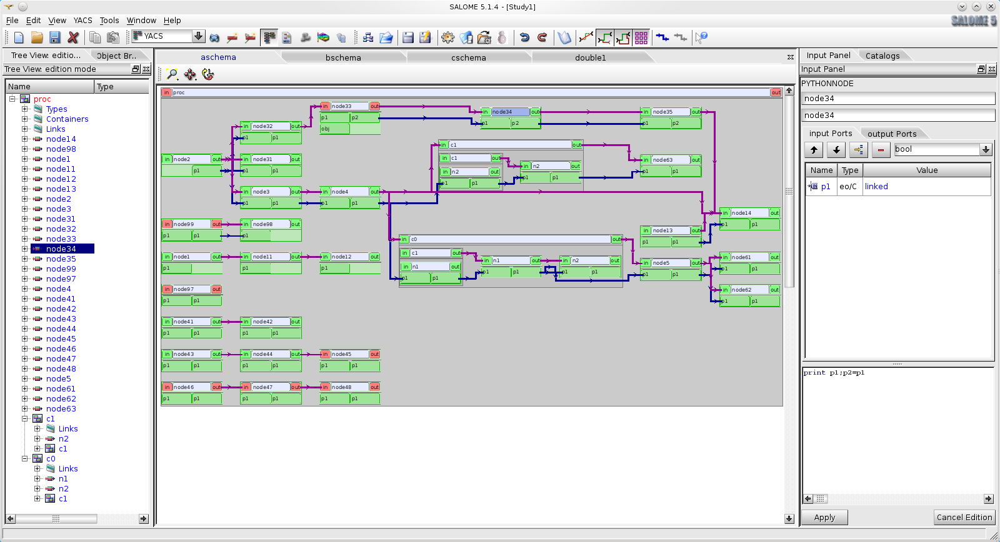

Introduction
----------------------
Le module YACS permet de construire et d'exécuter des schémas de calcul. Un schéma de calcul est un assemblage plus ou moins
complexe de composants de calcul (composants SALOME ou codes de calcul). 
Un schéma de calcul permet donc de définir un enchaînement ou un couplage de codes de calcul (voir :ref:`principes`).

   GUI YACS

La construction d'un schéma de calcul peut être réalisée soit au moyen d'un outil graphique (voir :ref:`gui`), 
soit en éditant directement un fichier XML (voir :ref:`schemaxml`) 
soit encore en utilisant une interface de programmation (API) en Python (voir :ref:`schemapy`).
Dans cette phase, on définit l'enchaînement des composants avec les flots de données associés.

L'exécution d'un schéma de calcul peut se faire à partir de l'outil graphique (voir :ref:`execution`) mais également 
en mode console (voir :ref:`execxml`) ou encore en utilisant l'interface Python (voir :ref:`execpy`).

L'exécution d'un schéma de calcul prend en charge :

 * le lancement et la distribution des composants,
 * la gestion de la distribution des données,
 * le suivi de l'exécution ,
 * l'éventuel arrêt/suspension/reprise de l'exécution.

Il est également possible d'exécuter un schéma de calcul en passant par un système de batch tel que LSF ou PBS (voir :ref:`batch`).

Enfin pour pouvoir coupler des codes de calcul avec YACS, il est indispensable de les transformer en composants SALOME. 
Dans sa plus grande généralité cette opération demande une bonne connaissance des principes de SALOME (voir :ref:`integration`).

Pour les codes de calcul en C++, l'outil :ref:`hxx2salome` permet d'automatiser, dans une grande mesure, cette opération.

Pour les codes de calcul en Fortran, C, Python, qui mettent en oeuvre du couplage de type CALCIUM, l'outil 
:ref:`yacsgen` permet de générer automatiquement l'enrobage SALOME nécessaire à partir d'une 
description succincte de l'interface de couplage retenue.

