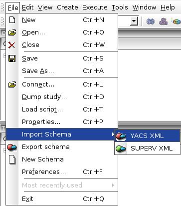
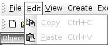
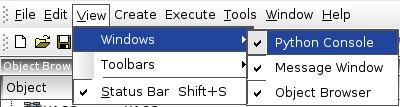
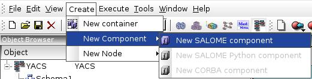
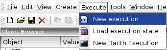
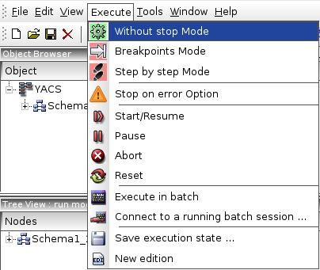
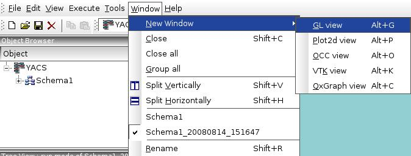
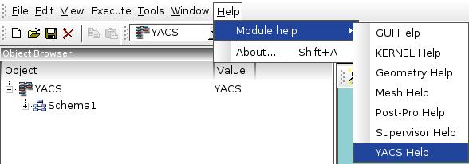

.. _main_menu:

Main Menu
=========

The menu bar is located on the upper part of the desktop window. Available commands depends on the current selected schema and its mode (edition, run). The menus are specific for each mode and rebuilt as soon as the user changes the current mode. Relevant commands also depends on the item selected in the schema tree view.

Menu bar configurations in edition and run modes are given below.

.. image:: images/main_menu_0.jpg
  :align: center
  :width: 40ex

.. centered::
  **Main Menu in edition mode**

.. centered::
  **Main Menu in run mode**

Let's consider the available menus in more detail.

.. _file:

File
----
File menu contains standard operations for creating, opening and saving documents as well as import and export operations. The YACS GUI document is saved in a HDF file with default extension \*.hdf.

If YACS module has been loaded File menu contains the following items:

+ Import Schema:

    + :ref:`import_yacs_schema`

    + :ref:`import_supervisor_graph`

+ :ref:`export_schema`

+ :ref:`create_new_schema`

Edit
----
Edit menu supports standard edition operations like copy/paste and undo/redo functionality. Cut, copy, paste, undo/redo should be available in edition mode only. ( **These items are not currently implemented, but will be available in the future version!** )

Other edition operations on different types of objects are available with help of corresponding Input Panel property pages. For more information about this topic see :ref:`edit_object` section.

The user can :ref:`delete_object` with help of corresponding context popup menu item in the edition Tree View.

View
----
View menu allows maintaining visibility of the different parts of the desktop like toolbars, status bar, Object Browser, Python Console, Log Window.

.. centered::
   **Python Console**

.. image:: images/main_menu_5.jpg
  :align: center
  :width: 41ex

.. centered::
  **Standard Toolbar**

.. _create_menu:

Create
------
Create menu contains a set of commands for creation of the YACS GUI objects. It is active only in the edition mode of a schema. Create menu contains the following items:

+ :ref:`create_container_definition`

+ :ref:`create_component_instance_definition`

+ :ref:`create_node`

.. image:: images/main_menu_7.jpg
  :align: center
  :width: 48ex

.. _execute:

Execute
-------
Execute menu contains a set of commands for execution of the YACS GUI schemas.

If the current mode is the edition mode of a schema, there is only possibility to create a schema run:

+ :ref:`execute_schema`

+ :ref:`save_restore_execution_state` (from a state of execution saved previously)

+ New Batch Execution ( **Will be available in the future version!** )

Execute menu is active only if we are in the run mode of a schema. Execute menu contains the following items:

+ Without stop Mode

+ Breakpoints Mode

+ Step by step Mode

+ Stop on error Option

+ Start/Resume

+ Pause

+ Abort

+ Reset

+ Execute in batch ( **Will be available in the future version!** )

+ Connect to a running batch session ... ( **Will be available in the future version!** )

+ Save execution state ...

+ New edition

Tools
-----
Tools menu provides two standard Salome useful tools such as XML catalog generator and registry display for supervision over component's processes.

.. image:: images/main_menu_10.jpg
  :align: center
  :width: 44ex

Window
------
Window menu contains commands to arrange already opened windows in a different ways (split horizontally or vertically) or to create a new window with predefined type.

Help
----
Help menu allows reading some basic information about application with help of 'About' dialog box and provides help for YACS module as HTML documents.

