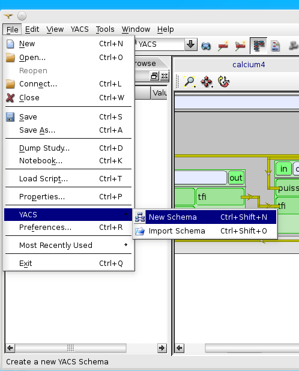
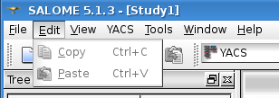
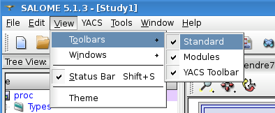
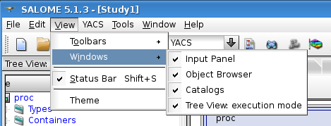
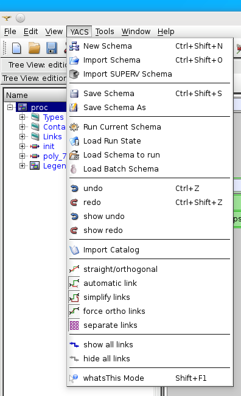
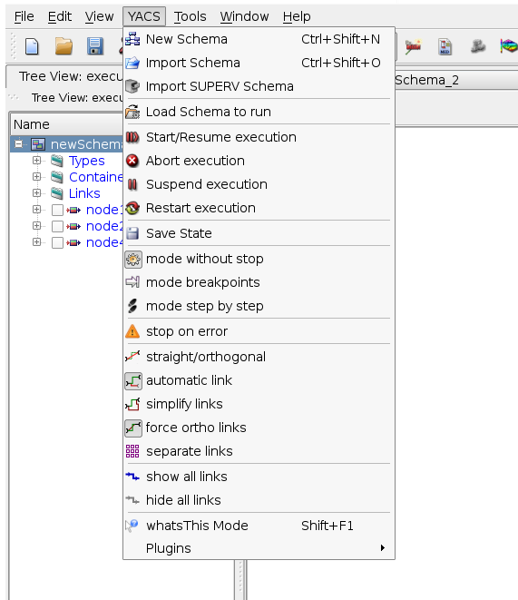
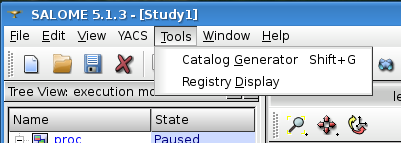
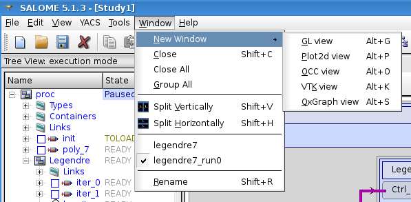

.. _main_menu:

Main Menu
=========

The menu bar is located on the upper part of the desktop window.

.. centered::
  **Main Menu**

Let's consider the available menus in more detail.

.. _file:

File
----
File menu contains standard operations for creating, opening and saving documents (SALOME studies) as well as schema creation or 
import operations. The SALOME study is saved in a HDF file with default extension \*.hdf. YACS Schema must be saved apart in XML files.

If YACS module has been loaded, File menu contains the following items:

+ YACS:

    + :ref:`create_new_schema`
    + :ref:`import_yacs_schema`

Edit
----
In SALOME, Edit menu contains standard edition operations like copy/paste and undo/redo functionality. 
In YACS module, Cut, copy and paste are available but only within context popup menus. Undo/redo are also available, in YACS menu and toolbar.
Cut, copy, paste and undo/redo are available in edition mode only.

Other edition operations on different types of objects are available with help of corresponding context popup menus or 
Input Panel property pages. For more information about this topic see :ref:`edit_object` section.

The user can :ref:`delete_object` with help of corresponding context popup menu item in the edition Tree View or 2D view.

View
----
View menu allows maintaining visibility of the different parts of the desktop like toolbars, status bar, Object Browser, 
Tree View, Catalogs, Input Panel.

.. centered::
  **Standard Toolbar**

.. centered::
  **Windows**

.. _yacs_menu:

YACS menu
---------
YACS menu contains a set of commands for creating opening and saving of YACS schemas, importing old SUPERV schemas, execute schemas, import catalogs, and set some specific behavior of 2D views.

When YACS is started, YACS menu contains the following items:

+ :ref:`create_new_schema` : create a new schema from scratch
+ :ref:`import_yacs_schema` : load a YACS schema saved on an XML file 
+ :ref:`import_supervisor_graph` : load a SUPERV schema saved on an XML file
+ Load a Schema in run mode (without edition)
+ What's this, detailled help on a few items

When the active schema is in edition mode, YACS menu contains the following items:

+ :ref:`create_new_schema` : create a new schema from scratch
+ :ref:`import_yacs_schema` : load a YACS schema saved on an XML file 
+ :ref:`import_supervisor_graph` : load a SUPERV schema saved on an XML file
+ Save Schema : save in the current opened file
+ :ref:`export_schema` : save with file dialog box to choose a new filename
+ :ref:`execute_schema` : switch from edition to run mode
+ :ref:`save_restore_execution_state` (from a state of execution saved previously)
+ Load a Schema in run mode (without edition)
+ Load a Schema to be executed on a batch system
+ Undo last edition (modification of nodes positions in 2D view are not undoable)
+ Redo last edition
+ Show the stack of undoable edition actions
+ Show the stack of redoable edition actions
+ Import Catalog : to import specific data types or nodes
+ Straight/Orthogonal : toggle between straight lines or orthogonal links
+ Automatic Links: toggle behaviour for automatic link reconstruction when 2D View layout changes
+ Simplify Links: toggle behaviour for link simplification (less segments)
+ Force Ortho Links: toggle behaviour on very simple links (2 segments becomes 3 orthogonals segments)
+ Separate Links: toggle behaviour to try to avoid or not superposition of links 
+ Show all links: some links may have been selectively hidden
+ Hide all links
+ What's this, detailled help on a few items

When the active schema is in execution mode, YACS menu contains the following items:

+ :ref:`create_new_schema` : create a new schema from scratch
+ :ref:`import_yacs_schema` : load a YACS schema saved on an XML file 
+ :ref:`import_supervisor_graph` : load a SUPERV schema saved on an XML file
+ :ref:`save_restore_execution_state` (from a state of execution saved previously)
+ Load a Schema in run mode (without edition)
+ :ref:`Start/Resume <start_resume>`
+ :ref:`Abort <pause_abort_reset>`
+ :ref:`Pause <pause_abort_reset>`
+ :ref:`Restart <pause_abort_reset>`
+ Save state
+ Mode without stop
+ Mode breakpoints
+ Mode step by step
+ Stop on error
+ Straight/Orthogonal : toggle between straight lines or orthogonal links
+ Automatic Links: toggle behaviour for automatic link reconstruction when 2D View layout changes
+ Simplify Links: toggle behaviour for link simplification (less segments)
+ Force Ortho Links: toggle behaviour on very simple links (2 segments becomes 3 orthogonals segments)
+ Separate Links: toggle behaviour to try to avoid or not superposition of links 
+ Show all links: some links may have been selectively hidden
+ Hide all links
+ What's this, detailled help on a few items

Tools
-----
Tools menu provides two standard Salome useful tools such as XML catalog generator and registry display for supervision over component's processes.

Window
------
Window menu contains commands to arrange already opened windows in a different ways (split horizontally or vertically) or to create 
a new window with predefined type.

Help
----
Help menu allows reading some basic information about application with help of 'About' dialog box and provides help for YACS module 
as HTML documents.

.. image:: images/main_menu_12.png
  :align: center

