Modification of a schema
========================

Create an object
----------------
YACS GUI uses the following approach for creation of all kinds of YACS objects:

#. Optionally, the user selects some item (or items) in the Tree View that acts as input parameter(s) for creation.

#. Then the user activates corresponding GUI command to create an object of required type.

#. The new object appears in the Tree View and 2D Viewer of a schema. In order to show Input Panel with the property page of a new created object the user should select a new created object in the Tree View or 2D Viewer of a schema. After that the user can modify properties of a new created object via the corresponding property page on the Input Panel.

More detailed information about the creation of certain objects types is given in sections below.

.. _create_new_schema:

Create a new schema
~~~~~~~~~~~~~~~~~~~
The YACS module provides the user with capabilities not only for modification, but also for creation of the graphs. The user can create a new schema by calling **New Schema** command from :ref:`file` or from the corresponding toolbar button on the :ref:`schema`.

.. image:: images/functionality_list_9.jpg
  :align: center
  :width: 13ex 

As a result of this operation, YACS module creates an empty instance of C++ schema object, new schema object is shown in the Object Browser and the Tree View is created for a new empty schema. The schema object is shown as a root of Tree View structure. Schema root object of the Tree View will be used as a parent for the schema sub-trees and all new objects added to the schema will appear under
these sub-trees.

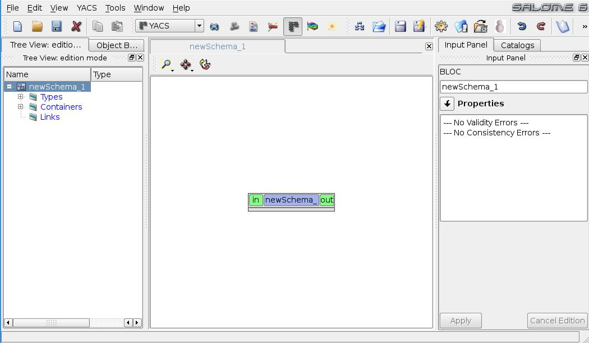

.. centered::
  **New created schema**

New schema object becomes the active one. In order to display Input Panel with schemas' property page containing properties of the schema the user should select schema root object in the Tree View. The property page of a schema allows the user to modify schemas' properties (see :ref:`pp_for_schema` section).

.. _create_container_definition:

Create a container definition
~~~~~~~~~~~~~~~~~~~~~~~~~~~~~
The command **New container** is accessible from :ref:`create_menu` or from the corresponding toolbar button on the :ref:`creation`.

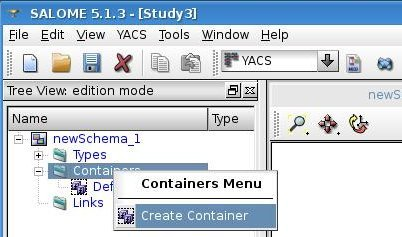

On this command call a SALOME container with a default name and default machine parameters is created.

As a result of container creation, YACS module creates a new container definition object and shows it in the Tree View under 'Containers' folder. It is used as a parent item for all component instances created in this container.

.. image:: images/functionality_list_12.jpg
  :align: center
  :width: 28ex 

As soon as user selects a container object in the Tree View, Input Panel containing property page of the selected container is shown (for the sample of the property page see :ref:`pp_for_container` section) and allows the user to modify its properties. In the container property page the user can specify parameters of a created container object,
such as the name of the container and machine parameters.

The user can delete the created container by choosing **Delete** item from container context popup menu in the Tree View (see :ref:`delete_object` section).

.. _create_component_instance_definition:

Create a component instance definition
~~~~~~~~~~~~~~~~~~~~~~~~~~~~~~~~~~~~~~
At the current moment YACS module provides a functionality to create one type of component instance definition: SALOME component instance definition.

The user can create a new SALOME component instance definition if at least one container definition is presented in the current study.

The command **New Component --> New SALOME component** is accessible from :ref:`create_menu` or from the corresponding toolbar button on the :ref:`creation`.

The creation of SALOME component instance definition can be also activated via **Create a component instance definition --> SALOME** item from SALOME container definition context popup menu in the Tree View of a schema.

Actual creation of Container and component are done by Container manager during execution.

A new SALOME component instance definition is shown in the Tree View under its container object.

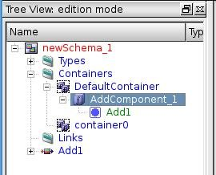

As soon as user selects a component instance definition in the Tree View, Input Panel containing property page of the component instance definition object is shown (for the sample of the property page see :ref:`pp_for_component_instance_definition` section) and allows the user to modify its properties.

The user can delete the created component by choosing **Delete** item from SALOME component instance definition context popup menu in the Tree View (see :ref:`delete_object` section).

.. _create_node:

Create a node
~~~~~~~~~~~~~
YACS module provides the user with a specific GUI commands for creation of each type of node.

At the current moment in the frames of the YACS module the user can create nodes of the following types:

Inline function
''''''''''''''''''

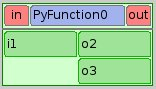

.. centered::
  **Inline function node with sample ports**

The node object can be created with help of **New Node --> Inline function** command from the :ref:`create_menu` or from the corresponding toolbar button on the :ref:`creation`.

.. image:: images/functionality_list_19.jpg
  :align: center
  :width: 25ex 

Inline script
''''''''''''''''''

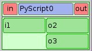

.. centered::
  **Inline script node with sample ports**

The node object can be created with help of **New Node --> Inline script** command from the :ref:`create_menu` or from the corresponding toolbar button on the :ref:`creation`.

.. image:: images/functionality_list_21.jpg
  :align: center
  :width: 25ex 

SALOME service
''''''''''''''''''

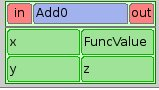

**SALOME service node with sample input ports values**
This type of node can be created with help of **From catalog** command from :ref:`create_menu` or :ref:`creation`.

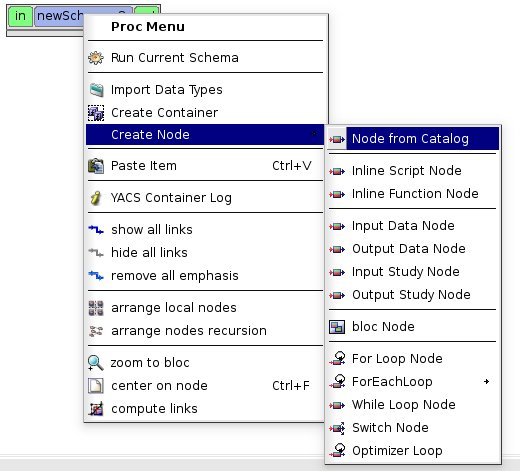

As a result of this command call the Input Panel with catalogs' properties is displayed. The displayed property page provides a user with the possibility to choose firstly a catalog type: **Session Catalog** or **Proc Catalog** (i.e. to fill catalog with types of nodes belonging to the predefined schema), and secondly - the type of node from the catalog to add it into the active schema. The
session catalog contains all SALOME components with its services.

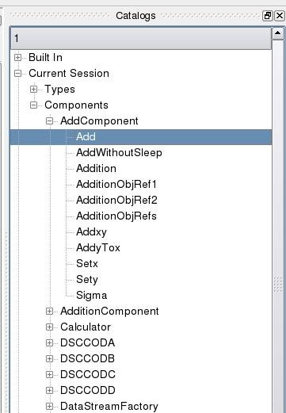

.. centered::
  **Create a node from session catalog**

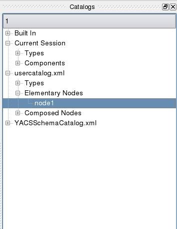

.. centered::
  **Create a node from proc catalog**

As a result of SALOME service node creation from session catalog, the content of schema Tree View is enlarged with a data type used by a new node, a new node object under **Nodes** folder, the **DefaultContainer** under **Containers** folder, the corresponding SALOME component instance definition and a reference to a new created service node under it.

.. centered::
  **Tree View of new empty schema**

.. image:: images/functionality_list_27.jpg
  :align: center
  :width: 36ex 

.. centered::
  **Tree View after SALOME service node creation**

CPP node
''''''''''''''''''

.. centered::
  **Sample CPP node from imported schema**

The node object can be created with help of **New Node --> CPP node** command from the :ref:`create_menu` or from the corresponding toolbar button on the :ref:`creation`.

Block
''''''''''''''''''

.. image:: images/functionality_list_30.jpg
  :align: center
  :width: 33ex 

.. centered::
  **Empty Block node**

The node object can be created with help of **New Node --> Block** command from the :ref:`create_menu` or from the corresponding toolbar button on the :ref:`creation`.

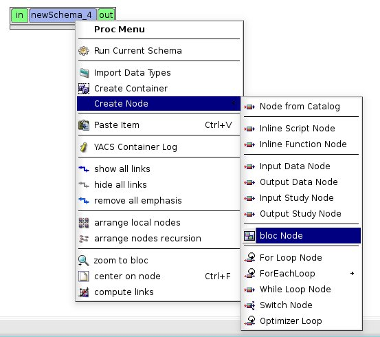

Child nodes of a block node can be created with help of sub-items of **Create a node** command from block node context popup menu in the Tree View.

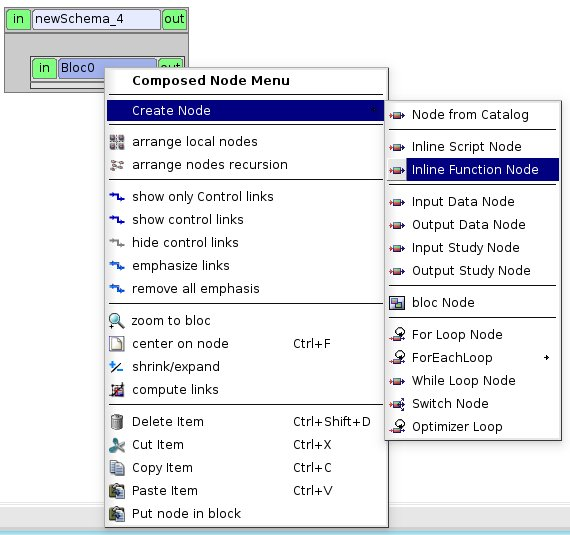

.. image:: images/functionality_list_33.jpg
  :align: center
  :width: 39ex 

.. centered::
  **Block node with inline function node as a child node**

FOR loop
''''''''''''''''''

.. image:: images/functionality_list_34.jpg
  :align: center
  :width: 38ex 

.. centered::
  **FOR loop node without a body (i.e. new created)**

The node object can be created with help of **New Node --> FOR loop** command from the :ref:`create_menu` or from the corresponding toolbar button on the :ref:`creation`.

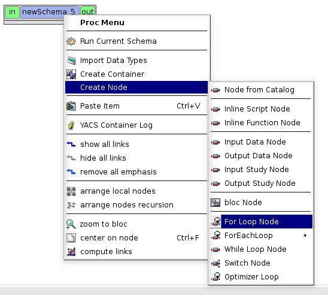

Body node of a FOR loop node can be created with help of sub-items of **Create a body** command from FOR loop node context popup menu in the Tree View.

.. image:: images/functionality_list_36.jpg
  :align: center
  :width: 59ex 

.. image:: images/functionality_list_37.jpg
  :align: center
  :width: 69ex 

.. centered::
  **FOR loop node with inline script node as a body**

FOREACH loop
''''''''''''''''''

.. image:: images/functionality_list_38.jpg
  :align: center
  :width: 38ex 

.. centered::
  **FOREACH loop node without a body (i.e. new created)**

The node object can be created with help of **New Node --> FOREACH loop** command from the :ref:`create_menu` or from the corresponding toolbar button on the :ref:`creation`.

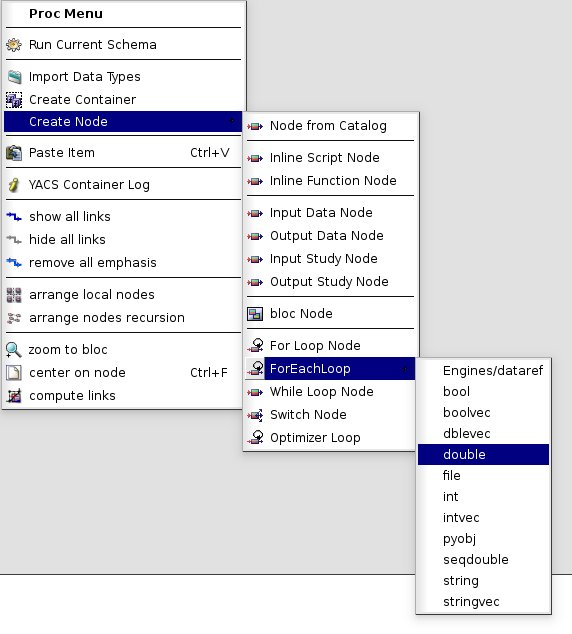

Body node of a FOREACH loop node can be created with help of sub-items of **Create a body** command from FOREACH loop node context popup menu in the Tree View.

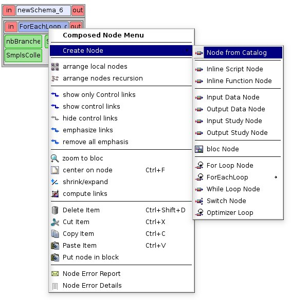

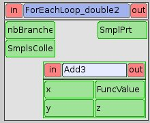

.. centered::
  **FOREACH loop node with SALOME service node as a body**

WHILE loop
''''''''''''''''''

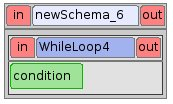

.. centered::
  **WHILE loop node without a body (i.e. new created)**

The node object can be created with help of **New Node --> WHILE loop** command from the :ref:`create_menu` or from the corresponding toolbar button on the :ref:`creation`.

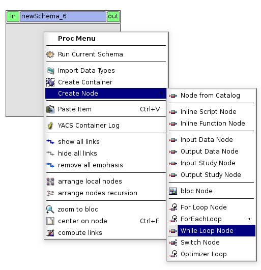

Body node of a WHILE loop node can be created with help of sub-items of **Create a body** command from WHILE loop node context popup menu in the Tree View.

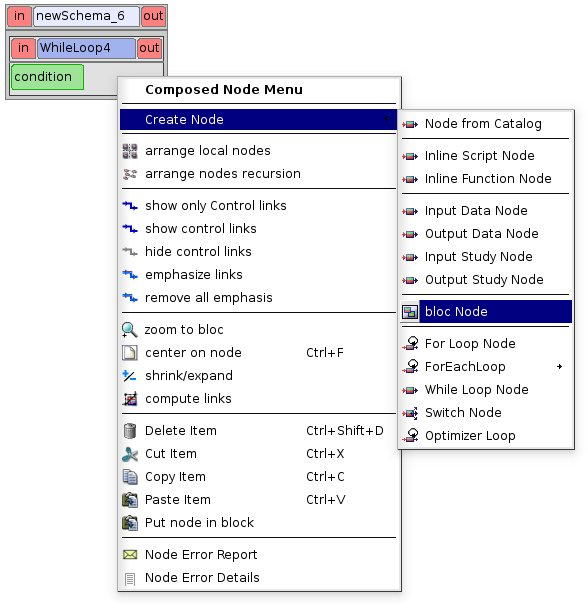

.. image:: images/functionality_list_45.jpg
  :align: center
  :width: 61ex 

.. centered::
  **WHILE loop node with Block node as a body**

SWITCH
''''''''''''''''''

.. image:: images/functionality_list_46.jpg
  :align: center
  :width: 35ex 

.. centered::
  **SWITCH node without any cases (i.e. new created)**

The node object can be created with help of **New Node --> SWITCH** command from the :ref:`create_menu` or from the corresponding toolbar button on the :ref:`creation`.

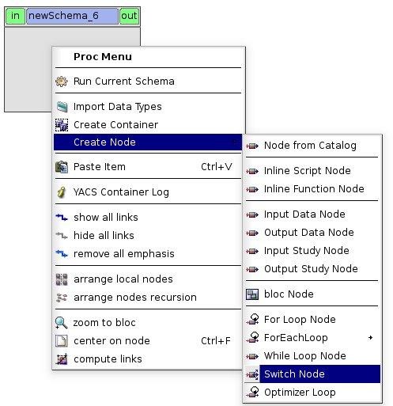

Body node of a SWITCH node can be created with help of sub-items of **Create a node** command from SWITCH node context popup menu in the Tree View.

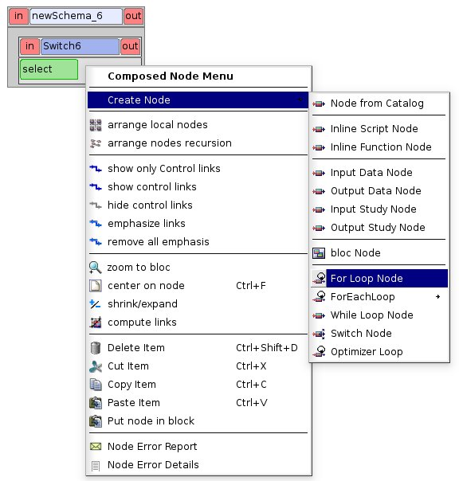

.. image:: images/functionality_list_49.jpg
  :align: center
  :width: 79ex 

.. centered::
  **SWITCH node with three cases**

The numbers of SWITCH node cases can be changed with help of functionality provided by the property page of SWITCH node (for the sample of the property page see :ref:`Property page for Switch node <pp_for_switch_node>` section).

Input data node
''''''''''''''''''

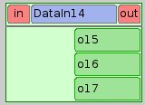

.. centered::
  **Input data node with sample ports**

The node object can be created with help of **New Node --> Input data node** command from the :ref:`create_menu` or from the corresponding toolbar button on the :ref:`creation`.

.. image:: images/functionality_list_51.jpg
  :align: center
  :width: 25ex 

Output data node
''''''''''''''''''

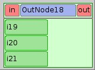

.. centered::
  **Output data node with sample ports**

The node object can be created with help of **New Node --> Output data node** command from the :ref:`create_menu` or from the corresponding toolbar button on the :ref:`creation`.

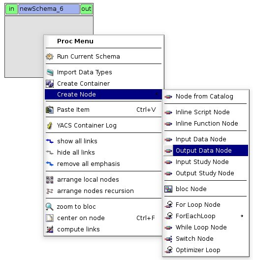

Input study node
''''''''''''''''''

.. image:: images/functionality_list_54.jpg
  :align: center
  :width: 34ex 

.. centered::
  **Input study node with sample ports**

The node object can be created with help of **New Node --> Input study node** command from the :ref:`create_menu` or from the corresponding toolbar button on the :ref:`creation`.

.. image:: images/functionality_list_55.jpg
  :align: center
  :width: 25ex 

Output study node
''''''''''''''''''

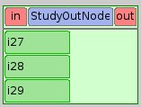

.. centered::
  **Output study node with sample ports**

The node object can be created with help of **New Node --> Output study node** command from the :ref:`create_menu` or from the corresponding toolbar button on the :ref:`creation`.

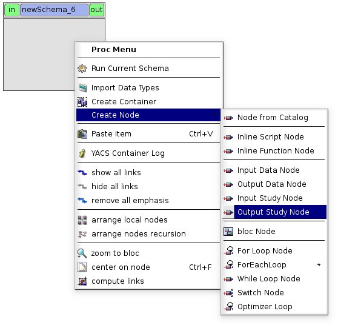

The creation of nodes can be also activated via context popup menus in the Tree View. To create a node the user should select object in the Tree View according to :ref:`Table 2 <Table_2>`.

As a result of node creation, YACS module creates a new node object with a default name and shows it in the Tree View (under the proper parent item) and in 2D Viewer. For service nodes the reference to the created service node is also published under the corresponding component instance definition in the Tree View. For any node object type, the default name has a form of "node_subtype_NNN", where
NNN is the smallest integer that produces a unique node name not yet in use.

The user can delete the created node by choosing **Delete** item from node context popup menu in the Tree View (see :ref:`delete_object` section).

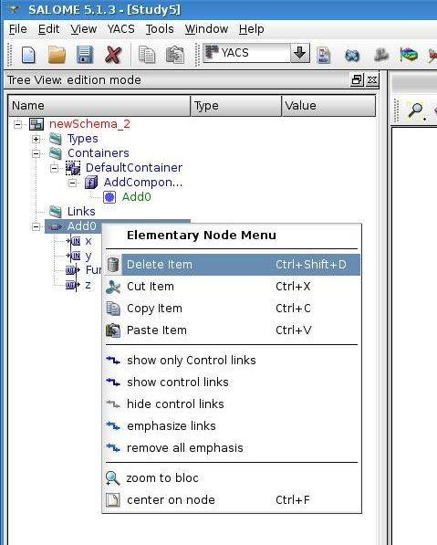

Create a link
~~~~~~~~~~~~~
Connecting nodes ports by links means transferring data from output port to input port of a next node. So, only output and input ports of different nodes can be connected by the link.

There are three types of links to connect nodes with each other in YACS GUI:

+ data flow link (between data ports),

+ data stream link (between stream ports),

+ control link (between gate ports).

The color code of data links differs from the same one of stream links and is taken from the user preferences (see :ref:`set_user_preferences` section).

The YACS GUI proposes to the user the several view modes of the schema in the 2D Viewer to choose which links he wants to see on the schemas' presentation (see :ref:`change_2d_representation_schema` section).

The link creation can be performed only between nodes including into the same schema object. Therefore, in such a case the schema should contain at least two nodes.

The user can create a link with help of context popup menu on the selected output port (for data flow and data stream links) or node (for control link creation) in the Tree View.

In the first case, after activation of a corresponding item from the output port context popup menu to create a data link the user should select the input port object in the Tree View. This input port is considered as the end of a new created data link. The output port on which the user called the context popup menu is the beginning of a new created link.

It's worth mentioning that there are two possibilities for the user to create data/datastream links with help of context popup menu on the output port selected in the Tree View:

.. image:: images/functionality_list_59.jpg
  :align: center
  :width: 32ex 

#. **Add dataflow link** popup menu item to add data (flow or stream) and control link simultaneously from the selected output port to the input port which will be selected later.

#. **Add data link** popup menu item to add a simple data link from the selected output port to the other (selected later) input port **without control link automatically added** . This functionality is needed inside loop nodes. The sample of data link described above is shown on the figure below.

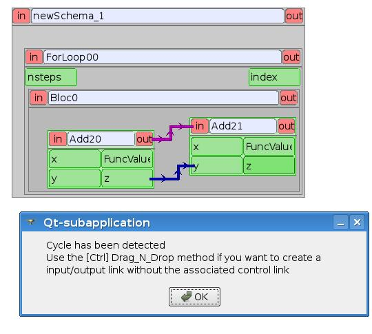

.. centered::
  **Data link sample**

In such a case it is needed to separate the flow of data from the flow of control.

In the second case, to create a control link the user should select the output node, activate **Add control link to other node** item from its context popup menu, and then select the input node object in the Tree View. The output gate port of the firstly selected node is considered as the beginning of a new created control link, and the input gate port of the secondly selected node - as the end of
a new link.

For more information about the context popup menus' commands to create a link object refer to :ref:`Table 2 <Table_2>`.

As a result of link creation, a valid link between ports is created. The link object is published in the Tree View in the **Links** folder under the corresponding schema object. The presentation of a new created link is shown in the 2D Viewer and colored with the color code according to links' type.

A new created link object has a default name, which contains names of "from" and "to" nodes and ports and cannot be changed by the user (see :ref:`description of link objects in the Tree View <description_of_link_objects>`).

The user can delete the created link by choosing **Delete** item from link context popup menu in the Tree View (see :ref:`delete_object` section).

.. _edit_object:

Edit an object
--------------
The edition of the object is one of basic point of modification operations as the creation or deletion. The YACS GUI proposes the edition of the object with help of the :ref:`input_panel`. For this purpose the user should select the object, which properties he wants to edit, in the Tree View.

As a result of this operation, Input Panel is updated and the property page of the selected object (and objects dependable from this one) is opened. Within the property page(s) the user can modify objects' parameters by typing in corresponding input fields or selecting an item in combo box input fields.

The user can confirm the modifications by pressing "Apply" button on the Input Panel or cancel modifications of the properties with help of "Close" button.

If the user finishes the edition process, YACS module updates (if its necessary) Tree View and/or 2D representation of the modified object.

If there is(are) no any object(s) selected in the Tree View, the Input Panel is hidden. It's worth mentioning that if the user selects something in the Tree View or 2D Viewer before applying the changes in the Input Panel, a warning message is shown informing the user that modifications of the object previously selected are about to be lost, and the user can either confirm the previously done
modifications or discard its before switching to another object.

.. _pp_for_container:

Property page for container
~~~~~~~~~~~~~~~~~~~~~~~~~~~
The property page for container definition is shown on the figure below.

.. image:: images/functionality_list_61.jpg
  :align: center
  :width: 38ex 

.. centered::
  **Container property page**

The property page for container allows modify the name and a set of machine parameters of the selected container object. At the beginning machine parameters initialized with the default values. The minimum set of the parameters, which the user have to specify in any case contains the host name. For other parameters its default values can be used. The user can select a host from a list obtained
with help of SALOME computational resource manager.

The user can apply modifications to the selected container object by pressing "Apply" button. In such a case YACS module changes properties of the selected container definition according to new values from the Input Panel and updates the Tree View if it is needed.

The user can cancel modifications of the container properties and return to its old values by pressing "Close" button in the Input Panel.

.. _pp_for_component_instance_definition:

Property page for component instance definition
~~~~~~~~~~~~~~~~~~~~~~~~~~~~~~~~~~~~~~~~~~~~~~~
The property page for SALOME/SALOME Python components is shown on the figure below.

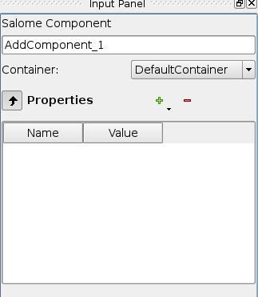

.. centered::
  **Property page for SALOME/SALOME Python component instance definition**

The page allows the user to change the container, in which a component is to be loaded. The user selects it in the list of available container definitions in the current schema.

In the Input Panel for SALOME/SALOME Python component instances the user can also see the type of the selected container object. This field is not editable and use only to provide information about component type.

The property page for CORBA component is shown on the figure below.

.. centered::
  **Property page for CORBA component instance definition**

The property page for CORBA component instance definition provides the user with the information about components' properties. There are no editable fields in such a property page.

The modification of the component instance definition properties can be confirmed by pressing "Apply" button on the Input Panel. In such a case YACS module changes properties of the selected component according to new values from the Input Panel and updates the Tree View if it is needed. For example, if the user changed the container for the selected SALOME component, the component object should
be republished in the Tree View: it should be moved under the new container object.

The user can discard modifications of the component instance definition properties and return to its old values by pressing "Close" button on the Input Panel.

.. _pp_for_schema:

Property page for schema
~~~~~~~~~~~~~~~~~~~~~~~~
The schema property page allows the user to specify

+ a name of the schema,

+ a current view mode of the schema (see :ref:`change_2d_representation_schema` section).

The property page for schema is shown on the figure below.

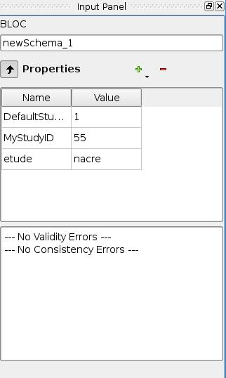

.. centered::
  **Property page for schema**

.. _pp_for_node:

Property page for node
~~~~~~~~~~~~~~~~~~~~~~
The content of the property page for node depends on the type of the node. Here are property page configurations for the different types of nodes.

Property page for inline nodes
'''''''''''''''''''''''''''''''''

The property page for **inline function** and **inline script** nodes is shown on the figure below.

.. image:: images/functionality_list_65.jpg
  :align: center
  :width: 65ex 

.. centered::
  **Property page for inline function and inline script nodes**

The pages allow the user to

    + specify a name of the node,

    + read a full name of the node (this field is read only and updated if the user changes the node name),

    + change the list of input and output ports (it is possible to set port name, choose port type and value type from the corresponding combo boxes, set input values for input port, if it is not linked, and put in study the output port (the last one will be available in the future version!)),

    + enter or modify a source code of Python function or script in the built-in Python code editor (syntax highlighting, text selection, cut/copy/paste mechanism, search for a string).

Property page for SALOME service and CPP nodes
''''''''''''''''''''''''''''''''''''''''''''''''''''''''
The property page for **SALOME service** and **CPP** nodes is shown on the figure below.

.. image:: images/functionality_list_66.jpg
  :align: center
  :width: 65ex 

.. centered::
  **Property page for SALOME service and CPP nodes**

The page allows the user to

    + change a name of the node,

    + read a full name of the node (this field is read only and updated if the user changes the node name) and its type,

    + read a name of existing component instance,

    + change a container with help of built-in property page for component instance definition,

    + change properties of the container definition (e.g. host name) with help of built-in property page for container,

    + read a name of method from the specified component, which will be executed by the node,

    + change values of input ports, if it is not linked, and put in study the output ports (the last one will be available in the future version!)

Property page for Block node
''''''''''''''''''''''''''''''''''''''''''''''''''''''''
The property page for **Block** node is shown on the figure below.

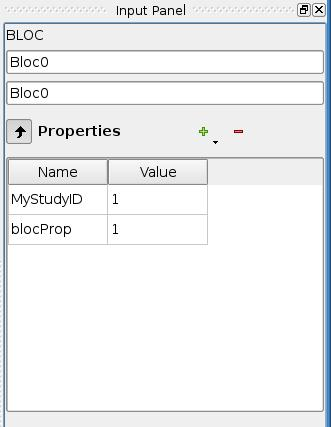

.. centered::
  **Property page for Block node**

The page allows the user to

    + change a name of the node,

    + read a full name of the node (this field is read only and updated if the user changes the node name),

    + specify the list of direct children nodes using "+" and "-" buttons and the selection control in the SWITCH cases table to pick needed node objects in the schema Tree View.

At the current moment only expanded view mode of Block node is available in YACS GUI, i.e. detailed view of Block node with its child nodes which can be a Block nodes too.

Property page for FOR loop node
''''''''''''''''''''''''''''''''''''''''''''''''''''''''
The property page for **FOR loop** node is shown on the figure below.

.. image:: images/functionality_list_68.jpg
  :align: center
  :width: 48ex 

.. centered::
  **Property page for FOR loop node**

The page allows the user to

    + change a name of the node,

    + read a full name of the node (this field is read only and updated if the user changes the node name),

    + specify the Integer value of the "nsteps" input port if it is not connected with a link,

    + read the name of the body node belonging to the same schema: read only field; body node is created by context menu on FOR loop node object in the Tree View.

At the current moment only expanded view mode of FOR loop node is available in YACS GUI, i.e. detailed view of FOR node with its body which can be a FOR loop node too.

Property page for FOREACH loop node
''''''''''''''''''''''''''''''''''''''''''''''''''''''''
The property page for **FOREACH loop** node is shown on the figure below.

.. image:: images/functionality_list_69.jpg
  :align: center
  :width: 48ex 

.. centered::
  **Property page for FOREACH loop node**

The page allows the user to

    + change a name of the node,

    + read a full name of the node (this field is read only and updated if the user changes the node name),

    + specify the Integer value of the "nbBranches" input port if it is not connected with a link,

    + specify the Sequence value of the "SmplsCollection" input port if it is not connected with a link,

    + read the name of the body node belonging to the same schema: read only field; body node is created by context menu on FOREACH loop node object in the Tree View.

  At the current moment only expanded view mode of FOREACH loop node is available in YACS GUI, i.e. detailed view of FOREACH node with its body which can be a FOREACH loop node too.

Property page for WHILE loop node
''''''''''''''''''''''''''''''''''''''''''''''''''''''''
The property page for **WHILE loop** node is shown on the figure below.

.. image:: images/functionality_list_67.jpg
  :align: center
  :width: 48ex 

.. centered::
  **Property page for WHILE loop node**

The page allows the user to

    + change a name of the node,

    + read a full name of the node (this field is read only and updated if the user changes the node name),

    + specify the Boolean value of the "condition" input port if it is not connected with a link,

    + read the name of the body node belonging to the same schema: read only field; body node is created by context menu on WHILE loop node object in the Tree View.

  At the current moment only expanded view mode of WHILE loop node is available in YACS GUI, i.e. detailed view of WHILE node with its body which can be a WHILE loop node too.

Property page for SWITCH node
''''''''''''''''''''''''''''''''''''''''''''''''''''''''
The property page for **SWITCH** node is shown on the figure below.

.. _pp_for_switch_node:

.. image:: images/functionality_list_70.jpg
  :align: center
  :width: 48ex 

.. centered::
  **Property page for SWITCH node**

The page allows the user to

    + change a name of the node,

    + read a full name of the node (this field is read only and updated if the user changes the node name),

    + specify the Integer value of the "select" input port if it is not connected with a link,

    + specify the number of cases ("+" and "-" buttons in the SWITCH cases table), presence of the default branch and nodes for each branch (using the selection control in the SWITCH cases table to pick needed node objects in the schema Tree View).

  At the current moment only expanded view mode of SWITCH node is available in YACS GUI, i.e. detailed view of SWITCH node with its body nodes which can be a SWITCH nodes too.

Property page for Input data node
''''''''''''''''''''''''''''''''''''''''''''''''''''''''
The property page for **Input data** node is shown on the figure below.

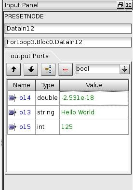

.. centered::
  **Property page for Input data node**

The page allows the user to

    + change a name of the node,

    + read a full name of the node (this field is read only and updated if the user changes the node name) and its type,

    + specify a file name,

    + change the list of output ports (it is possible to set port name, choose port type and value type from the corresponding combo boxes, set values for output ports and put its in study (the last one will be available in the future version!)).

Property page for Output data node
''''''''''''''''''''''''''''''''''''''''''''''''''''''''
The property page for **Output data** node is shown on the figure below.

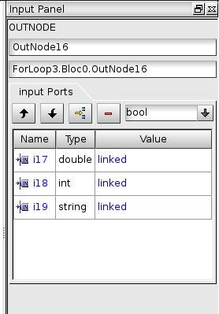

.. centered::
  **Property page for Output data node**

The page allows the user to

    + change a name of the node,

    + read a full name of the node (this field is read only and updated if the user changes the node name) and its type,

    + specify a file name,

    + change the list of input ports (it is possible to set port name, choose port type and value type from the corresponding combo boxes).

Property page for Input study node
''''''''''''''''''''''''''''''''''''''''''''''''''''''''
The property page for **Input study** node is shown on the figure below.

.. image:: images/functionality_list_74.jpg
  :align: center
  :width: 65ex 

.. centered::
  **Property page for Input study node**

The page allows the user to

    + change a name of the node,

    + read a full name of the node (this field is read only and updated if the user changes the node name) and its type,

    + specify a study ID and study name,

    + change the list of output ports (it is possible to set port name, choose port type and value type from the corresponding combo boxes, set values for output ports and put its in study (the last one will be available in the future version!)).

Property page for Output study node
''''''''''''''''''''''''''''''''''''''''''''''''''''''''
The property page for **Output study** node is shown on the figure below.

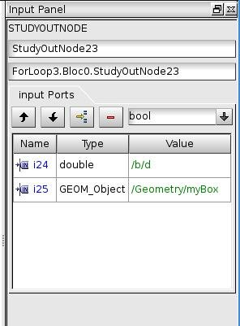

.. centered::
  **Property page for Output study node**

The page allows the user to

    + change a name of the node,

    + read a full name of the node (this field is read only and updated if the user changes the node name) and its type,

    + specify a study ID and study name,

    + change the list of input ports (it is possible to set port name, choose port type and value type from the corresponding combo boxes).

.. _delete_object:

Delete an object
----------------
The user can remove one or several objects from the current study.

To perform this operation the user should select object to be deleted in the Tree View and activates **Delete** item from its context popup menu.

With help of Tree View context popup menu the user can delete the following objects:

+ container,

+ component instance,

+ node,

+ link.

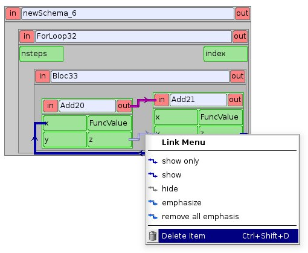

.. centered::
  **An example of link deletion using link context popup menu in the Tree View**

YACS module deletes the selected object with all sub-objects.

As the result of delete operation, the tree structure of the active schema in the Tree View and its representation in 2D Viewer are updated to reflect deletion of objects.

Input/output ports of inline nodes can be deleted by the user with help of the Input Panel for this type of nodes (see the corresponding paragraph from :ref:`pp_for_node` section).

