.. _modification:

Modification of a schema
========================

Create an object
----------------
YACS GUI uses the following approach for creation of all kinds of YACS objects:

#. Optionally, the user selects some item (or items) in the Tree View or in the 2D Viewer that acts as input parameter(s) for creation.
#. Then the user activates corresponding GUI command to create an object of required type.
#. The new object appears in the Tree View and 2D Viewer of a schema. In order to show Input Panel with the property page of a new 
   created object the user should select a new created object in the Tree View or 2D Viewer of a schema. After that the user can modify 
   properties of a new created object via the corresponding property page on the Input Panel.

More detailed information about the creation of certain objects types is given in sections below.

.. _create_new_schema:

Create a new schema
~~~~~~~~~~~~~~~~~~~
The YACS module provides the user with capabilities not only for modification, but also for creation of the graphs. The user can 
create a new schema by calling **YACS -> New Schema** command from :ref:`file` or from the corresponding toolbar button on the :ref:`schema`.

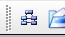

As a result of this operation, YACS module creates an empty instance of a schema object, new schema object is shown in the Object 
Browser and the Tree View is created for a new empty schema. The schema object is shown as a root of Tree View structure. Schema root 
object of the Tree View will be used as a parent for the schema sub-trees and all new objects added to the schema will appear under
these sub-trees.

.. image:: images/functionality_list_10.jpg
  :align: center

.. centered::
  **New created schema**

New schema object becomes the active one. In order to display Input Panel with schemas' property page containing properties of the 
schema the user should select schema root object in the Tree View. The property page of a schema allows the user to modify 
schemas' properties (see :ref:`pp_for_schema` section).

.. _create_container_definition:

Create a container definition
~~~~~~~~~~~~~~~~~~~~~~~~~~~~~
To create a container use the command **Create container** from the context menu of the folder **Containers** in the Tree View.

.. image:: images/functionality_list_11.jpg
  :align: center

On this command call a SALOME container with a default name and default machine parameters is created.

As a result of container creation, YACS module creates a new container definition object and shows it in the Tree View under 'Containers' folder. 
It is used as a parent item for all component instances created in this container.

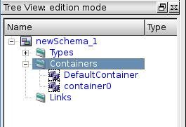

As soon as user selects a container object in the Tree View, Input Panel containing property page of the selected container is shown 
(for the sample of the property page see :ref:`pp_for_container` section) and allows the user to modify its properties. In the container 
property page the user can specify parameters of a created container object, such as the name of the container and machine parameters.

.. _create_component_instance_definition:

Create a component instance definition
~~~~~~~~~~~~~~~~~~~~~~~~~~~~~~~~~~~~~~
At the current moment YACS module does not provide a functionality to create directly component instance.
The component instances are created indirectly when nodes are created (see :ref:`create_node`).

When a component instance is created (following the creation of a node), a new SALOME component instance definition is shown in 
the Tree View under its container object.

.. image:: images/functionality_list_16.jpg
  :align: center

As soon as user selects a component instance definition in the Tree View, Input Panel containing property page of the component instance 
definition object is shown (for the sample of the property page see :ref:`pp_for_component_instance_definition` section).

.. _create_node:

Create a node
~~~~~~~~~~~~~
YACS module provides the user with a specific GUI command for creation of each type of node.

At the current moment in the frames of the YACS module the user can create nodes of the following types:

.. _inline_function:

Inline function
''''''''''''''''''

The node object can be created with help of **Create Node --> Inline Function Node** command from the Tree View context menu

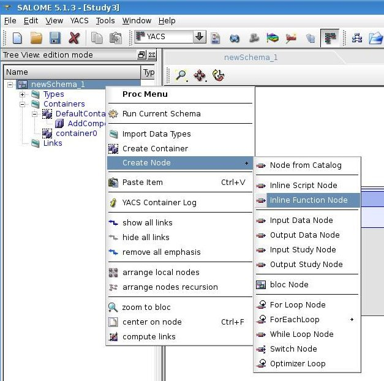

or from the 2D Viewer context menu. The context menu must be activated on the chosen parent node.

.. image:: images/functionality_list_19.jpg
  :align: center

as a result:

.. image:: images/functionality_list_18.jpg
  :align: center

.. centered::
  **Example of inline function node with ports**

Now, if you want to modify the settings of this node, use the associated panel :ref:`pp_for_inline_node`.

.. _inline_script:

Inline script
''''''''''''''''''

The node object can be created with help of **Create Node --> Inline Script Node** command from the Tree View context menu or 
from the 2D Viewer context menu. The context menu must be activated on the chosen parent node.

.. image:: images/functionality_list_21.jpg
  :align: center

as a result:

.. image:: images/functionality_list_20.jpg
  :align: center

.. centered::
  **Example of inline script node with ports**

Now, if you want to modify the settings of this node, use the associated panel :ref:`pp_for_inline_node`.

.. _salome_service:

SALOME service
''''''''''''''''''

This type of node can be created with help of **Create Node -> Node from Catalog** command from the Tree View context menu 
or from the 2D Viewer context menu.

The type of service node is chosen from the catalog of services available in the list of imported catalog, in the :ref:`catalogs_tree_view`.

.. image:: images/functionality_list_23.jpg
  :align: center

As a result of this command call the Input Panel with catalogs' properties is displayed. The displayed property page provides a user 
with the possibility to choose firstly a catalog type: **Current Session**, **Built In** or other imported catalog (i.e. to fill catalog 
with types of nodes belonging to a predefined schema), and secondly - the type of node from the catalog to add it into the active schema. The
**Current Session** catalog contains all SALOME components with its services.

.. note::

   To add a node from catalog to the schema, drag and drop it. Multiple selection is possible in the Catalog, so you can add several
   nodes to the schema with one drag and drop.

.. image:: images/functionality_list_24.jpg
  :align: center

.. centered::
  **Create a node from current session catalog**

.. image:: images/functionality_list_25.jpg
  :align: center

.. centered::
  **Create a node from a user catalog**

.. image:: images/functionality_list_22.jpg
  :align: center

.. centered::
  **Example of service node**

As a result of SALOME service node creation from **Current Session** catalog, the content of schema Tree View is enlarged with data types 
used by the new node, a new node object under **newSchema_1** folder, the corresponding SALOME component instance definition and a 
reference to a new created service node under it.

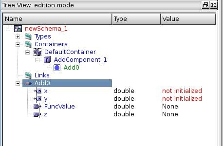

.. centered::
  **Tree View after SALOME service node creation**

Now, if you want to modify the settings of this node, use the associated panel :ref:`pp_for_salome_node`.

.. _block_node:

Block
''''''''''''''''''

The node object can be created with help of **Create Node --> bloc Node** command from the Tree View context menu or from 
the 2D Viewer context menu.

.. image:: images/functionality_list_31.jpg
  :align: center

as a result:

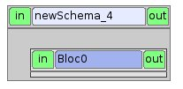

.. centered::
  **Empty Block node**

Child nodes of a block node can be created with help of sub-items of **Create Node** command from block node context popup menu in the 
Tree View or in the 2D Viewer.

.. image:: images/functionality_list_32.jpg
  :align: center

as a result:

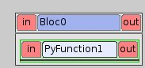

.. centered::
  **Example of Block node with inline function node as a child node**

.. _forloop_node:

For Loop
''''''''''''''''''

The node object can be created with help of **Create Node --> For Loop Node** command	from the Tree View context menu or from the 2D Viewer context menu.

.. image:: images/functionality_list_35.jpg
  :align: center

as a result:

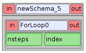

.. centered::
  **For Loop node without a body (i.e. newly created)**

Body node of a For Loop node can be created with help of sub-items of **Create Node** command from For Loop node context popup menu in the 
Tree View or in the 2D Viewer.

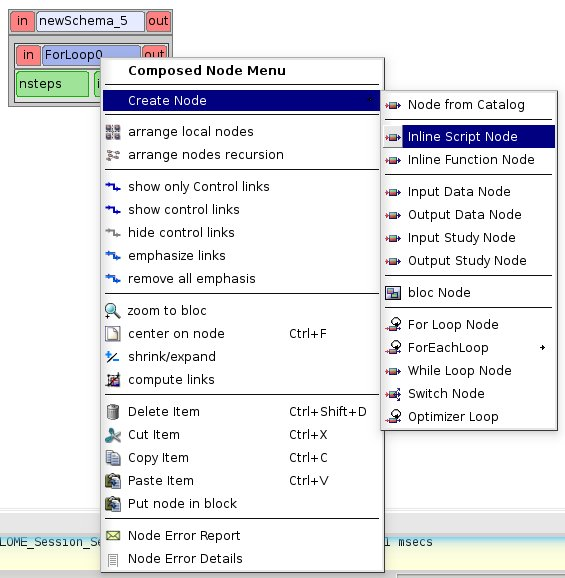

as a result:

.. image:: images/functionality_list_37.jpg
  :align: center

.. centered::
  **For Loop node with inline script node as a body**

.. _foreachloop_node:

ForEachLoop
''''''''''''''''''

The node object can be created with help of sub-items of **Create Node --> ForEachLoop** command from the Tree View context menu 
or from the 2D Viewer context menu. There is one sub-item for each data type known in the schema object. If you need another data type,
you'll have to import it in the schema. In this case we use a double data type as the main type of the loop.

.. image:: images/functionality_list_39.jpg
  :align: center

as a result:

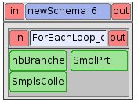

.. centered::
  **ForEachLoop (double) node without a body (i.e. new created)**

Body node of a ForEachLoop node can be created with help of sub-items of **Create Node** command from ForEachLoop node context popup menu in the 
Tree View or in the 2D Viewer.

.. image:: images/functionality_list_40.jpg
  :align: center

as a result:

.. image:: images/functionality_list_41.jpg
  :align: center

.. centered::
  **ForEachLoop node with SALOME service node as a body**

.. _whileloop_node:

While loop
''''''''''''''''''

The node object can be created with help of **Create Node --> While Loop Node** command from the Tree View context menu
or from the 2D Viewer context menu.

.. image:: images/functionality_list_43.jpg
  :align: center

.. image:: images/functionality_list_42.jpg
  :align: center

.. centered::
  **While loop node without a body (i.e. new created)**

Body node of a While Loop node can be created with help of sub-items of **Create Node** command from While Loop node context popup menu in the 
Tree View or in the 2D Viewer.

.. image:: images/functionality_list_44.jpg
  :align: center

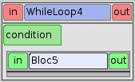

.. centered::
  **While Loop node with Block node as a body**

.. _switch_node:

Switch
''''''''''''''''''

The node object can be created with help of **Create Node --> Switch Node** command from the Tree View context menu
or from the 2D Viewer context menu.

.. image:: images/functionality_list_47.jpg
  :align: center

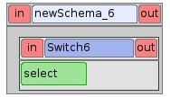

.. centered::
  **Switch node without any cases (i.e. new created)**

Body node of a Switch node can be created with help of sub-items of **Create Node** command from Switch node context popup menu in the 
Tree View or in the 2D Viewer.

.. image:: images/functionality_list_48.jpg
  :align: center

.. image:: images/functionality_list_49.jpg
  :align: center

.. centered::
  **Switch node with three cases**

The number of Switch node cases can be changed with help of functionality provided by the property page of Switch node (for the sample 
of the property page see :ref:`Property page for Switch node <pp_for_switch_node>` section).

.. _optimizerloop_node:

OptimizerLoop
''''''''''''''''''

The node object can be created with help of **Create Node --> Optimizer Loop** command from the Tree View context menu
or from the 2D Viewer context menu.

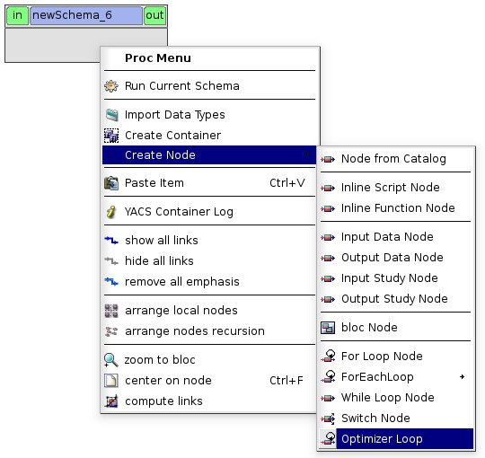

Body node of an Optimizer Loop node can be created with help of sub-items of **Create Node** command from Optimizer Loop node context popup menu in the
Tree View or in the 2D Viewer.

.. image:: images/functionality_list_47b.jpg
  :align: center

.. image:: images/functionality_list_47c.jpg
  :align: center

.. centered::
  **Optimizer Loop with one internal python node**

The parameters of the Optimizer Loop can then be modified with help of the functionality provided by the property page of Optimizer Loop node
(see :ref:`Property page for Optimizer Loop <pp_for_optimizer_node>` section).

.. _datain_node:

Input data node
''''''''''''''''''
The node object can be created with help of **Create Node --> Input Data Node** command from the Tree View context menu
or from the 2D Viewer context menu.

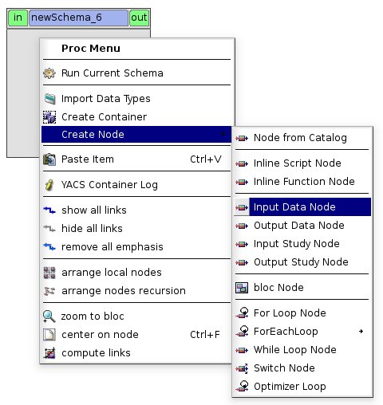

.. image:: images/functionality_list_50.jpg
  :align: center

.. centered::
  **Input data node with sample ports**

.. _dataout_node:

Output data node
''''''''''''''''''

The node object can be created with help of **Create Node --> Output Data Node** command from the Tree View context menu
or from the 2D Viewer context menu.

.. image:: images/functionality_list_53.jpg
  :align: center

.. image:: images/functionality_list_52.jpg
  :align: center

.. centered::
  **Output data node with sample ports**

.. _studyin_node:

Input study node
''''''''''''''''''

The node object can be created with help of **Create Node --> Input Study Node** command from the Tree View context menu
or from the 2D Viewer context menu.

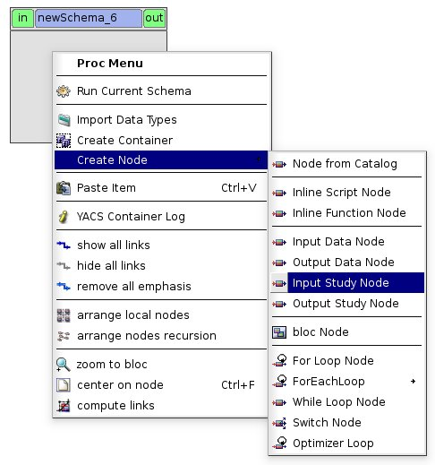

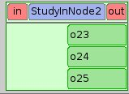

.. centered::
  **Input study node with sample ports**

.. _studyout_node:

Output study node
''''''''''''''''''

The node object can be created with help of **Create Node --> Output Study Node** command from the Tree View context menu
or from the 2D Viewer context menu.

.. image:: images/functionality_list_57.jpg
  :align: center

.. image:: images/functionality_list_56.jpg
  :align: center

.. centered::
  **Output study node with sample ports**

As a result of node creation, YACS module creates a new node object with a default name and shows it in the Tree View (under the proper 
parent item) and in 2D Viewer. For service nodes the reference to the created service node is also published under the corresponding 
component instance definition in the Tree View. For any node object type, the default name has a form of "node_subtypeNNN", where
NNN is the smallest integer that produces a unique node name not yet in use.

The user can delete the created node by choosing **Delete** command from node context popup menu in the Tree View or in the 2D Viewer 
(see :ref:`delete_object` section).

.. image:: images/functionality_list_58.jpg
  :align: center

Create a link
~~~~~~~~~~~~~
Connecting nodes ports by links means transferring data from output port to input port of a next node. So, in general, only output and input 
ports of different nodes can be connected by a link.

There are three types of links to connect nodes with each other in YACS GUI:

+ data flow link (between data ports),

+ data stream link (between stream ports),

+ control link (between gate ports).

The color code of data links differs from the same one of stream links and is taken from the user preferences (see :ref:`set_user_preferences` section).

The link creation can be performed only between nodes included into the same schema object. Therefore, in such a case the schema should 
contain at least two nodes.

The user can create a link by dragging the output port to connect and dropping it onto the input port. The action is the same
for data flow, data stream and control link. The action of drag-and-drop can be done in the Tree View or in the 2D Viewer.

The input port is considered as the end of the newly created link. The output port is the beginning of the newly created link.

.. image:: images/functionality_list_59.jpg
  :align: center

.. centered::
  **Drag-and-drop between Add16.z output port and Add17.x input port**

It's worth mentioning that there are two possibilities for the user to create data links with Drag-and-Drop:

#. **Add dataflow link** : standard Drag-and-Drop creates a data link and adds a control link between concerned nodes simultaneously

#. **Add data link** Drag-and-Drop with control key pressed creates a data link **without adding a control link**. This functionality is 
   needed inside loop nodes. An example of such a data link is shown on the figure below.

.. image:: images/functionality_list_60.jpg
  :align: center

.. centered::
  **Trying to create a dataflow link between Add21.z and Add20.x with a loop**

In such a case it is needed to separate the flow of data from the flow of control.

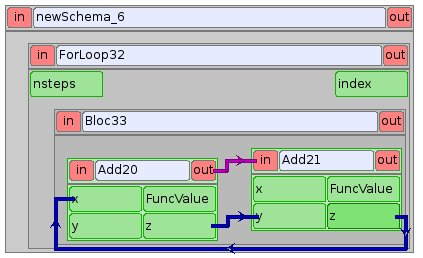

.. centered::
  **Create a simple data link with control key pressed**

To create a control link the user should use Drag-and-Drop between output gate port and input gate port. The output gate port is considered 
as the beginning of the newly created control link, and the input gate port as the end of the link.

As a result of link creation, a valid link between ports is created. The link object is published in the Tree View in the **Links** folder 
under the corresponding schema object. The presentation of a new link is shown in the 2D Viewer and colored with the color code according 
to links' type.

A new link object has a default name, which contains names of "from" and "to" nodes and ports and cannot be changed by the user 
(see :ref:`description of link objects in the Tree View <description_of_link_objects>`).

Each link has an associated property page that, in most cases, shows the link name. For datastream links (CALCIUM links), a properties
editor allows to set and modify link properties (see :ref:`datastreamlinks`).

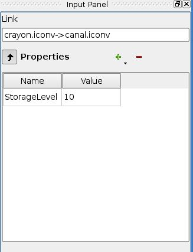

.. centered::
  datastream link properties editor

The user can delete a link by choosing **Delete** command from link context popup menu in the Tree View or in the 
2D Viewer (see :ref:`delete_object` section).

.. _edit_object:

Edit an object
--------------
The edition of an object is one of basic points of modification operations as the creation or deletion. The YACS GUI proposes the edition 
of an object with help of the :ref:`input_panel`. For this purpose the user should select the object, which properties he wants to edit, in 
the Tree View or in the 2D Viewer.

As a result of this operation, Input Panel is updated and the property page of the selected object (and objects dependable from this one) 
is opened. Within the property page(s) the user can modify objects' parameters by typing in corresponding input fields or selecting an item 
in combo box input fields.

The user confirm the modifications by pressing **Apply** button on the Input Panel. 
The **Cancel Edition** button can be used to cancel modifications that have not been already applied.

If the user finishes the edition process, YACS module updates (if it is necessary) Tree View and/or 2D representation of the modified object.

It's worth mentioning that if the user selects something in the Tree View or 2D Viewer before applying the changes in the Input Panel, 
the object background color is changed to yellow to remind applying the changes.

.. _pp_for_container:

Property page for container
~~~~~~~~~~~~~~~~~~~~~~~~~~~
The property page for container definition is shown on the figure below.

.. image:: images/functionality_list_61.jpg
  :align: center

.. centered::
  **Container property page**

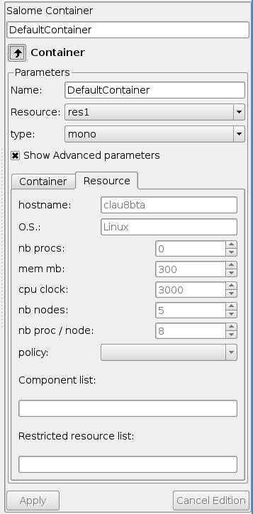

.. centered::
  **Container property page with advanced parameters shown**

The property page for container allows to modify the name and a set of machine parameters of the selected container object. 
At the beginning, machine parameters are initialized with the default values.
For most parameters, the default values can be used. The user can select a resource from a list obtained with help of SALOME resource manager
or use the **automatic** option to let SALOME selects computers. The user can only modify resource parameters (Resource tab) 
when the **automatic** option has been choosen. In that case, resource parameters are constraints used by the resource manager
to select the best resource for the container. In the other case (specific resource selected), the resource parameters come 
from the resource manager, are the effective ones and are only displayed.

The user can apply modifications to the selected container object by pressing **Apply** button. In such a case YACS module changes 
properties of the selected container definition according to new values from the Input Panel and updates the Tree View if it is needed.
The **Cancel Edition** button can be used to cancel modifications that have not been already applied.

.. _pp_for_component_instance_definition:

Property page for component instance definition
~~~~~~~~~~~~~~~~~~~~~~~~~~~~~~~~~~~~~~~~~~~~~~~
The property page for SALOME components is shown on the figure below.

.. image:: images/functionality_list_62.jpg
  :align: center

.. centered::
  **Property page for SALOME component instance definition**

In the Input Panel for SALOME component instances the user can see the name of the selected component object. 
This field is not editable and use only to provide information about component name.
It is also possible to change the associated container (container: combobox) and to add properties to the component instance. 
These properties are converted to environment variables when the schema is executed.

.. _pp_for_schema:

Property page for schema
~~~~~~~~~~~~~~~~~~~~~~~~
The schema property page allows the user to specify the name of the schema.

The property page for schema is shown on the figure below.

.. image:: images/functionality_list_64.jpg
  :align: center

.. centered::
  **Property page for schema**

It is possible to add properties to the schema. 
These are properties for all the nodes defined in the schema.

.. _pp_for_node:

Property page for node
~~~~~~~~~~~~~~~~~~~~~~
The content of the property page for node depends on the type of the node. Here are property page configurations for the different types of nodes.

.. _pp_for_inline_node:

Property page for inline nodes
'''''''''''''''''''''''''''''''''

The property pages for **inline function** and **inline script** nodes are shown on the figures below.

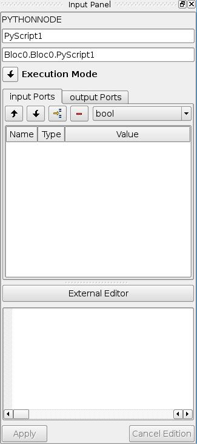

.. centered::
  **Property page for inline script nodes**

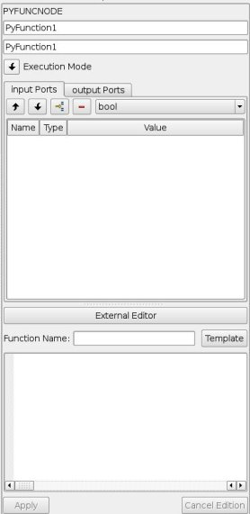

.. centered::
  **Property page for inline function nodes**

The pages allow the user to:

+ specify the name of the node,

+ read the full name of the node (this field is read only and updated if the user changes the node name),

+ change the list of input and output ports (it is possible to set port name, choose port type and value type from the corresponding 
  combo boxes, set input values for input port, if it is not linked),

+ change the name of the Python function ("Function Name" entry) to execute for Python function node only,

+ enter or modify a source code of Python function or script in the built-in Python code editor (syntax highlighting, text selection, 
  cut/copy/paste mechanism).

+ generate a template of the python function with the **Template** button when all ports are defined and the function name is set.

+ edit the python code with an external editor (**External Editor** button, if set in :ref:`user preferences <set_user_preferences>`).

An inline node can be executed in a remote container by setting its execution mode to **Remote** and selecting a container 
in the containers list.

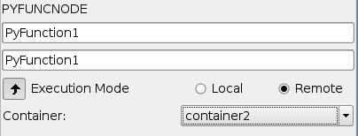

.. _pp_for_salome_node:

Property page for SALOME service
''''''''''''''''''''''''''''''''''''''''''''''''''''''''
The property page for **SALOME service** nodes is shown on the figure below.

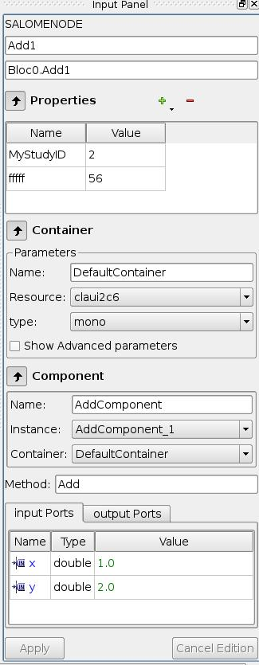

.. centered::
  **Property page for SALOME service nodes**

The page allows the user to:

+ change the name of the node,

+ read the full name of the node (this field is read only and updated if the user changes the node name) and its type,

+ read the name of the associated component instance,

+ change the associated component instance by selecting it in the list of available component instance definitions in the 
  current schema,

+ change the associated container with help of built-in property page for component instance definition. The user selects it in 
  the list of available container definitions in the current schema,

+ change properties of the associated container (e.g. host name) with help of built-in property page for container,

+ read the name of the method from the associated component, which will be executed by the node,

+ change values of input ports, if it is not linked,

+ change or add properties

Property page for Block node
''''''''''''''''''''''''''''''''''''''''''''''''''''''''
The property page for **Block** node is shown on the figure below.

.. image:: images/functionality_list_71.jpg
  :align: center

.. centered::
  **Property page for Block node**

The page allows the user to :

+ change the name of the node,

+ read the full name of the node (this field is read only and updated if the user changes the node name),

+ change or add properties. These are properties for all the nodes defined in the Block.

Property page for For Loop node
''''''''''''''''''''''''''''''''''''''''''''''''''''''''
The property page for **For Loop** node is shown on the figure below.

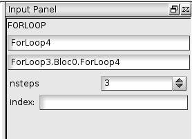

.. centered::
  **Property page for For Loop node**

The page allows the user to:

+ change the name of the node,

+ read the full name of the node (this field is read only and updated if the user changes the node name),

+ specify the value of the "nsteps" input port if it is not connected with a link,

Property page for ForEachLoop node
''''''''''''''''''''''''''''''''''''''''''''''''''''''''
The property page for **ForEachLoop** node is shown on the figure below.

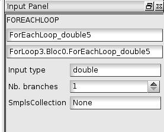

.. centered::
  **Property page for ForEachLoop node**

The page allows the user to:

+ change the name of the node,

+ read the full name of the node (this field is read only and updated if the user changes the node name),

+ read the input type of the loop (read only field),

+ specify the value of the "nbBranches" input port if it is not connected with a link,

+ specify the Sequence value of the "SmplsCollection" input port if it is not connected with a link,

Property page for While Loop node
''''''''''''''''''''''''''''''''''''''''''''''''''''''''
The property page for **While Loop** node is shown on the figure below.

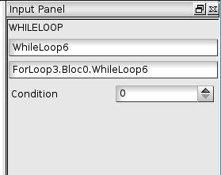

.. centered::
  **Property page for While Loop node**

The page allows the user to:

+ change the name of the node,

+ read the full name of the node (this field is read only and updated if the user changes the node name),

+ specify the Boolean value of the "condition" input port if it is not connected with a link,

Property page for Switch node
''''''''''''''''''''''''''''''''''''''''''''''''''''''''
The property page for **Switch** node is shown on the figure below.

.. _pp_for_switch_node:

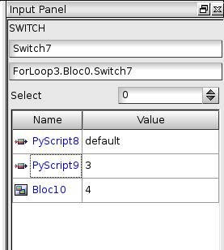

.. centered::
  **Property page for Switch node**

The page allows the user to:

+ change the name of the node,

+ read the full name of the node (this field is read only and updated if the user changes the node name),

+ specify the value of the "select" input port if it is not connected with a link,

+ change the case value (integer or "default") associated with child nodes.

.. _pp_for_optimizer_node:

Property page for Optimizer Loop node
''''''''''''''''''''''''''''''''''''''''''''''''''''''''
The property page for **Optimizer Loop** node is shown on the figure below.

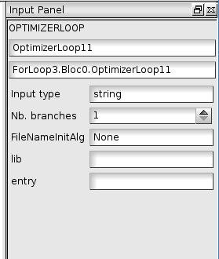

.. centered::
  **Property page for Optimizer Loop**

The page allows the user to:

- change the name of the node,
- read the full name of the node (this field is read only and updated if the user changes the node name),
- read the input data type (this field is read only and updated if the user changes the plugin),
- change the number of branches
- change the plugin : parameters lib and entry
- change the initialization file : parameter FileNameInitAlg

Property page for Input Data node
''''''''''''''''''''''''''''''''''''''''''''''''''''''''
The property page for **Input Data** node is shown on the figure below.

.. image:: images/functionality_list_72.jpg
  :align: center

.. centered::
  **Property page for Input Data node**

The page allows the user to:

+ change the name of the node,

+ read the full name of the node (this field is read only and updated if the user changes the node name) and its type,

+ change the list of output ports (it is possible to set port name, choose port data type from the corresponding 
  combo boxes, set values for output ports).

Property page for Output Data node
''''''''''''''''''''''''''''''''''''''''''''''''''''''''
The property page for **Output Data** node is shown on the figure below.

.. image:: images/functionality_list_73.jpg
  :align: center

.. centered::
  **Property page for Output Data node**

The page allows the user to:

+ change the name of the node,

+ read the full name of the node (this field is read only and updated if the user changes the node name) and its type,

+ change the list of input ports (it is possible to set port name, choose port data type from the corresponding combo boxes).

Property page for Input Study node
''''''''''''''''''''''''''''''''''''''''''''''''''''''''
The property page for **Input Study** node is shown on the figure below.

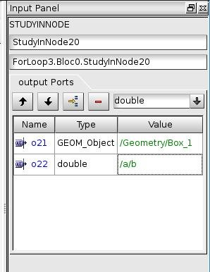

.. centered::
  **Property page for Input Study node**

The page allows the user to:

+ change the name of the node,

+ read the full name of the node (this field is read only and updated if the user changes the node name) and its type,

+ change the list of output ports. It is possible to set port name, choose port data type from the corresponding combo boxes, set 
  values for output ports. The values must be SALOME study paths.

Property page for Output Study node
''''''''''''''''''''''''''''''''''''''''''''''''''''''''
The property page for **Output Study** node is shown on the figure below.

.. image:: images/functionality_list_75.jpg
  :align: center

.. centered::
  **Property page for Output Study node**

The page allows the user to:

+ change the name of the node,

+ read the full name of the node (this field is read only and updated if the user changes the node name) and its type,

+ change the list of input ports. It is possible to set port name, choose port data type from the corresponding combo boxes and
  set values that must be SALOME study paths.

.. _delete_object:

Delete an object
----------------
The user can remove one or several objects from the current study.

To perform this operation the user should select object to be deleted in the Tree View or in the 2D Viewer and activates **Delete** item 
from its context popup menu.

With help of context popup menu the user can delete the following objects:

+ node,

+ link.

.. image:: images/functionality_list_76.jpg
  :align: center

.. centered::
  **An example of link deletion using link context popup menu in the 2D Viewer**

YACS module deletes the selected object with all sub-objects.

As the result of delete operation, the tree structure of the active schema in the Tree View and its representation in 2D Viewer 
are updated to reflect deletion of objects.

Input/output ports of inline nodes can also be deleted by the user with help of the Input Panel for this type of 
nodes (see the corresponding paragraph from :ref:`pp_for_node` section).

