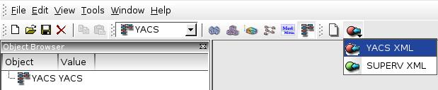
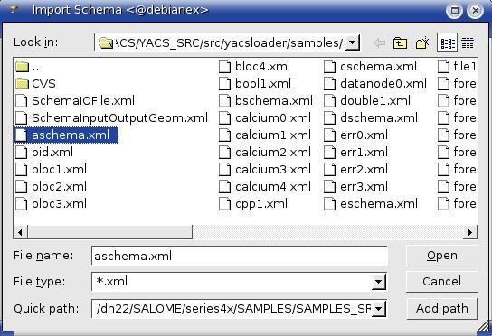
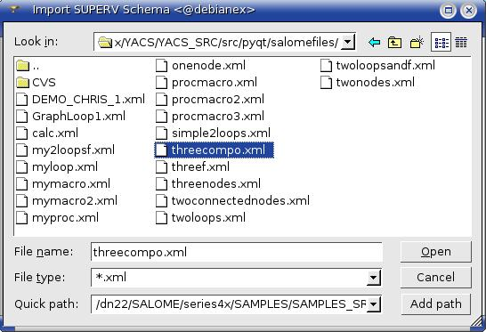
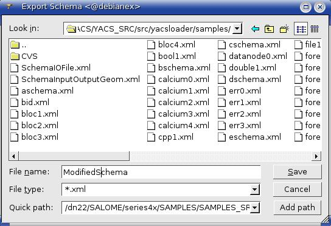
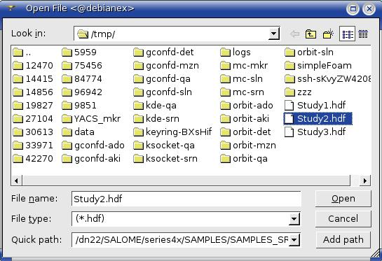
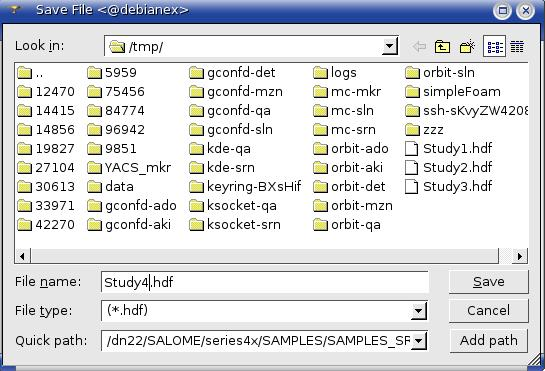
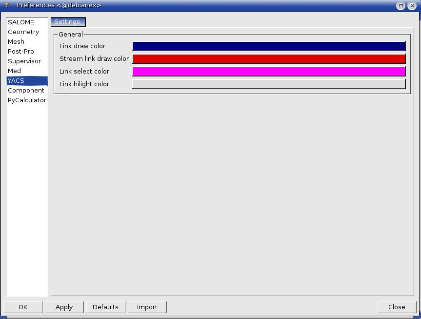
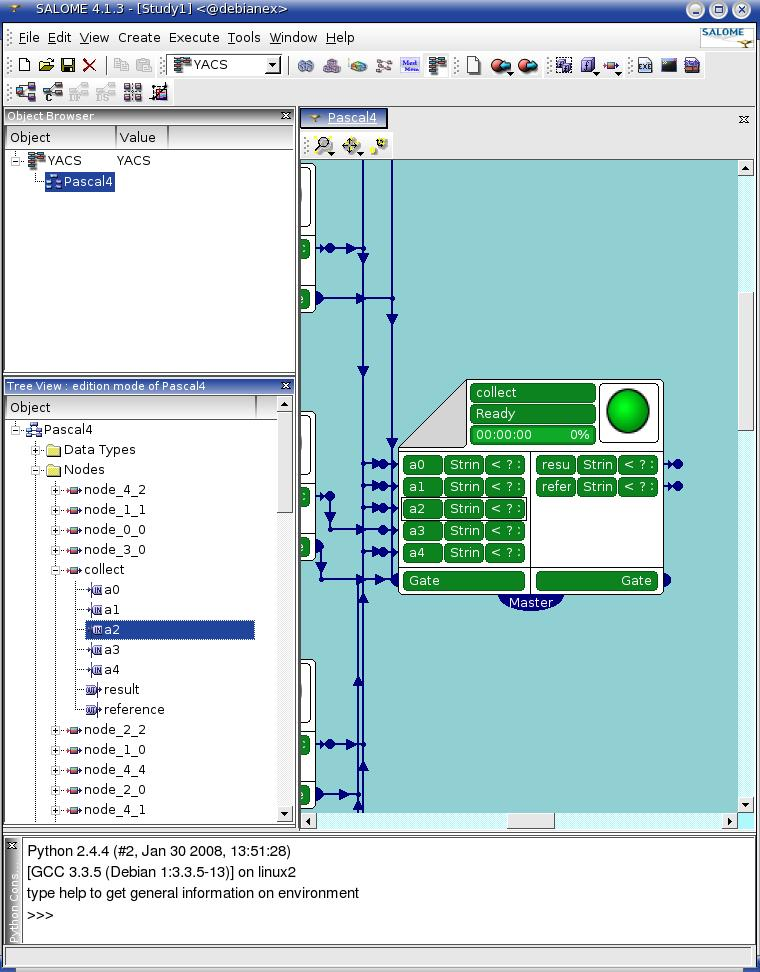
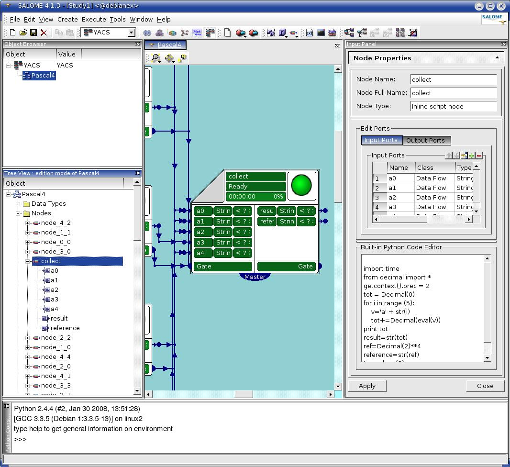
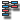

General operations
==================

Activate YACS module
--------------------
To work with YACS module the user can activate it in two ways:

#. by activating YACS item in :ref:`modules`,

#. by click YACS toolbar button on :ref:`modules`.

For the correct activation of YACS module it is necessary to install YACS GUI libraries and set YACS_ROOT_DIR environment variable pointed to the directory with installed binaries.

If there is no any study opened/created, during the YACS module activation the user has possibility to choose between opening an existing study and creating a new one. When YACS module has been activated, YACS GUI :ref:`main_menu` and :ref:`toolbars` corresponding to the state when no calculation schema is being edited or run are shown:

In such a case there are only possibilities for the user to create or import (YACS or SUPERV XML) a schema.

:ref:`object_browser` shows tree representation of YACS objects in the current study.

Import/Export a schema
----------------------
To display either in :ref:`viewer` or in the :ref:`object_browser` and :ref:`tree_view` and edit a schema the user can import the schemas' XML file. The modified schema object can be saved into the specified XML file with help of :ref:`export_schema` YACS GUI command.

.. _import_yacs_schema:

Import YACS calculation schema
~~~~~~~~~~~~~~~~~~~~~~~~~~~~~~
The command **Import Schema --> YACS XML** is accessible from :ref:`file` or from the corresponding toolbar button on the :ref:`schema`. On this command call a standard open file dialog box appears and lets user to select desirable YACS XML file.

.. centered::
  **Import YACS XML schema dialog**

Imported schema is shown as an entry in :ref:`object_browser`.

If a selected YACS XML file has incorrect structure, a part of a schema that has been imported successfully (before an error occurred) will be represented in :ref:`object_browser` and :ref:`viewer` and the user will be able to work with it. YACS GUI shows an error message with error description in such a
case.

Dimensions of drawing area occupied by a graph, positions and dimensions of node presentations, positions of internal link points and type of :ref:`change_2d_representation_schema` is retrieved from YACS XML file in order to correct 2D representation of the schema in the 2D Viewer.

.. _import_supervisor_graph:

Import SALOME Supervisor graph
~~~~~~~~~~~~~~~~~~~~~~~~~~~~~~
This operation is intended for importing an XML files containing description of calculation schema and having logical structure adopted by existing SALOME 4 Supervisor module. The command **Import Schema --> SUPERV XML** is available from :ref:`file` or from the corresponding toolbar button on the :ref:`schema`. On this command
call a standard open file dialog box appears and lets user to select desirable SUPERV XML file.

.. centered::
  **Import SUPERV XML schema dialog**

Imported schema is shown as an entry in Object Browser.

If a selected SUPERV XML file has incorrect structure, a part of a schema that has been imported successfully (before an error occurred) will be represented in Object Browser and 2D Viewer and the user will be able to work with it. YACS GUI shows an error message with error description in such a case.

After importing of the SUPERV XML file has been completed a 2D representation of the schema (nodes and links) is displayed in the 2D Viewer.

.. _export_schema:

Export a schema to a file
~~~~~~~~~~~~~~~~~~~~~~~~~
If user wants to store modifications done in the existing schema or save a new created graph into the YACS XML file, it is needed to make the schema active and choose the **Export schema** command from :ref:`file` or the corresponding toolbar button on the :ref:`schema`. As a result a standard save file dialog appears and lets
user to input or select desirable YACS XML file name to export the active schema in it.

.. centered::
  **Export schema dialog**

YACS module writes description of a schema and its child objects into an XML file. Additionally, schema 2D presentation data is saved in new created XML file.

Open/Save a study
-----------------
The user can start his work with the saved earlier study document. To open a saved study, the user has to activate common SALOME 4 GUI operation with help of **Open** command from :ref:`file` or **Open document** toolbar button on the :ref:`standard`. SALOME unpacks YACS XML files from the study. YACS module reads them and re-
creates the study structure. If XML files in a study have incorrect structure, YACS GUI says that the loaded study is incomplete by showing an error message.

.. centered::
  **Open a study dialog**

If the user finished his work, he can save a study for the future by calling **Save** command from :ref:`file` or **Save document** toolbar button on the :ref:`standard`. YACS module stores all schemas from the current study to XML files, which are then packed into a single HDF5 study file by SALOME.

.. centered::
  **Save a study dialog**

.. _set_user_preferences:

Set user preferences
--------------------
In the frames of the YACS module the user has a possibility to set his own preferences. There are the following preferences in the YACS GUI for SALOME 4.1:

+ Link draw color

+ Stream link draw color

+ Link select color

+ Link highlight color

These preferences can be set by the user with help of standard SALOME 4 GUI operation of editing preferences: **Preferences ...** command from :ref:`file`. But in versions after YASC GUI for SALOME 4.1 the set of preferences can be extended by colors for various node types and states during execution, by preferences for external Python code editor and probably some
others.

After the user changed the preferences in the Preferences dialog box for YACS module

..  :width: 86ex 

.. centered::
  **Preferences dialog for YACS module**

the system applies the new values of preferences to relevant objects immediately.

Select an object
----------------
Object Browser, Tree View and 2D Viewer provides user with the possibility to select an object. The user can select objects in 2D Viewer or Tree View. There is the mechanism to synchronize selection between 2D Viewer and Tree View in YACS module.

..  :width: 76ex 

.. centered::
  **Port selection**

In 2D Viewer the user can select/hilight nodes, ports and links. In the Tree View the user can select containers definitions, component instances definitions, nodes, ports, data types and links.

At the current moment YACS module supports only single selection, i.e. the user clicks on a single object with the mouse. However, the following kinds of interactive selection will be implemented in further versions:

+ **Multiple** - the user clicks on different objects while holding SHIFT key pressed. This type of selection is needed, for example, for creation of link between two ports selected in the Object Browser.

+ **With rectangle** - the user selects one or several objects by clicking first corner of a rectangle in 2D Viewer and dragging the mouse pointer to the opposite corner with the left mouse button pressed. All objects inside the rectangle become selected.

+ **SHIFT mode** - the user clicks on the same object or select object(s) with a rectangle holding SHIFT key pressed, and the system deselects objects that were selected and select objects that were not selected before.

The 2D Viewer displays selected/hilighted objects in a distinctive way that allows the user to identify the selected/hilighted objects easily.

The system state after interactive selection depends on the type of selected object(s):

+ **A single editable object is selected:** Input Panel is shown and contains property pages for the selected object and in some cases for its parent objects in a schema hierarchy. For instance, if an inline script node is selected either in 2D Viewer or in the Tree View, the property page for the selected node will be displayed in the Input Panel.

..  :width: 107ex

.. centered::
  **Node selection**

If the user selects SALOME service node, property pages for node, its component and container will be shown in the Input Panel.

+ **Several objects or a single object that has no editable properties is selected:** Input Panel is hidden.

+ **Nothing is selected:** Input Panel is hidden.

.. _activate_context_popup_menu:

Activate context popup menu
---------------------------
In the YACS module the user can perform a set of operations on the different types of objects shown in the Object Browser and Tree View of the schema with help of context popup menu. For this purpose, the user has to click the right mouse button in the Object Browser or in the Tree View of the schema to select the object and choose needed menu item from context popup menu, which contains commands
applicable to the current selection. For empty selection, only commands applicable to the window (Object Browser, schema Tree View or 2D Viewer) in general are shown in context menu:

+ Object Browser: **Refresh** and **Find** operations are available.

+ Schema Tree View: nothing.

+ 2D Viewer: **Change background color** operation is available.

When a single object is selected in the Object Browser, its context popup menu contains all operations applicable to objects of the given type. Additionally, it contains **Expand all** command for expanding all collapsed items in the selected objects' sub-tree.

Specific operations available for each type of objects selected in the Object Browser are given in the Table 1 below.

.. |schema| image:: images/schema.png

+---------------------------+-----------+---------------------------------------------------------------------------------+
| **Selected object type**  | **Icon**  |     **Available context menu commands**                                         |
+===========================+===========+=================================================================================+
| YACS root item            | |yacs|    | Standard Salome **Refresh** and **Find** popup menu items.                      |
+---------------------------+-----------+---------------------------------------------------------------------------------+
| Schema                    | |schema|  | **New execution** - create a run schema object.                                 |
|                           |           |                                                                                 |
|                           |           | **Load execution state** - restore execution state for the                      |
|                           |           | selected schema from an XML file. It is useful if the user                      |
|                           |           | wants to continue the execution from a state saved                              |
|                           |           | previously. For more detailed information see                                   |
|                           |           | :ref:`save_restore_execution_state` section.                                    |
|                           |           |                                                                                 |
|                           |           | Standard Salome **Refresh** and **Find** popup menu items.                      |
+---------------------------+-----------+---------------------------------------------------------------------------------+
|Execution (run) of a schema| |run|     | **New edition** - create a run schema copy for edition.                         |
|                           |           | For more detailed information see :ref:`create_new_edition`                     |
|                           |           | section.                                                                        |
|                           |           |                                                                                 |
|                           |           | Standard Salome **Refresh** and **Find** popup menu items.                      |
+---------------------------+-----------+---------------------------------------------------------------------------------+

.. centered::
  **Table 1. Context popup menus in the Object Browser**

When a single object is selected in the Tree View of a schema, its context popup menu contains all operations applicable to objects of the given type.

Specific operations available in the **edition mode** for each type of objects selected in the Tree View are given in the Table 2 below.

.. |container| image:: images/container.png
.. |component| image:: images/component.png
.. |block| image:: images/block_node.png
.. |switch| image:: images/switch_node.png
.. |loop| image:: images/loop_node.png
.. |node| image:: images/node.png
.. |inport| image:: images/in_port.png
.. |outport| image:: images/out_port.png
.. |control| image:: images/control_link.png
.. |data| image:: images/data_link.png
.. |stream| image:: images/stream_link.png

.. _Table_2:

+--------------------------------+-------------+-------------------------------------------------------------------------------------+
| **Selected object type**       | **Icon**    |     **Available context menu commands**                                             |
+================================+=============+=====================================================================================+
|Schema                          | |schema|    |                                                                                     |
|                                |             |**Export** - export the selected schema into the                                     |
|                                |             |YACS XML file.                                                                       |
|                                |             |                                                                                     |
|                                |             |**Create a Data Type** (further version) - create a user                             |
|                                |             |defined data type inside the schema.                                                 |
|                                |             |                                                                                     |
|                                |             |**Create a Container definition** - create an empty container                        |
|                                |             |with the default name **containerN** (where N = 0,1,2,...)                           |
|                                |             |inside the current schema.                                                           |
|                                |             |                                                                                     |
|                                |             |**Create a node** - menu which contains submenu for creation                         |
|                                |             |different types of nodes inside the current schema.                                  |
|                                |             |                                                                                     |
|                                |             |**Execute** - execute the selected schema, i.e. create a run                         |
|                                |             |schema object.                                                                       |
|                                |             |                                                                                     |
|                                |             |**Copy** (further version) - copy a schema with all its                              |
|                                |             |components to the buffer.                                                            |
|                                |             |                                                                                     |
|                                |             |**Paste** (further version) - paste items (if any) from the                          |
|                                |             |buffer into the current schema.                                                      |
|                                |             |                                                                                     |
|                                |             |**Display** (further version) - display the content of the                           |
|                                |             |selected schema in the 2D Viewer.                                                    |
|                                |             |                                                                                     |
|                                |             |**Erase** (further version) - close the 2D Viewer of the                             |
|                                |             |selected schema.                                                                     |
+--------------------------------+-------------+-------------------------------------------------------------------------------------+
|Data Types                      |             |**Edit** (further version) - gives the possibility to edit                           |
|                                |             |data types inside the current schema.                                                |
|                                |             |                                                                                     |
|                                |             |**Import a Data Type** - add a data type from the session                            |
|                                |             |catalog or data types catalog of another schema into the                             |
|                                |             |current schema.                                                                      |
+--------------------------------+-------------+-------------------------------------------------------------------------------------+
|Containers                      |             |**Create a Container definition** - create an empty container                        |
|                                |             |with the default name **containerN** (where N = 0,1,2,...)                           |
|                                |             |inside the current schema.                                                           |
+--------------------------------+-------------+-------------------------------------------------------------------------------------+
|SALOME container definition     | |container| |                                                                                     |
|                                |             |**Create a component instance definition --> SALOME** - create a new SALOME component|
|                                |             |and publish it in the Tree View.                                                     |
|                                |             |                                                                                     |
|                                |             |**Create a component instance definition --> SALOME Python** (further version) -     |
|                                |             |create a new SALOME Python component and publish it in the Tree View.                |
|                                |             |                                                                                     |
|                                |             |**Copy** (further version) - copy a container object.                                |
|                                |             |                                                                                     |
|                                |             |**Paste** (further version) - insert copied objects (if any SALOME components have   |
|                                |             |been copied) under the selected container.                                           |
|                                |             |                                                                                     |
|                                |             |**Delete** - delete a container object with all its content.                         |
+--------------------------------+-------------+-------------------------------------------------------------------------------------+
|SALOME component instance       | |component| |                                                                                     |
|                                |             |**Create a node --> From catalog** - create a SALOME service node within the active  |
|                                |             |schema and publish it in the Tree View. In such a case the type of service node is   |
|                                |             |chosen from the catalog of services available inside the selected component.         |
|SALOME Python component instance| |component| |                                                                                     |
|                                |             |**Create a node --> Service inline** (further version) - create a service inline     |
|                                |             |node within the active schema and publish it in the Tree View.                       |
|                                |             |                                                                                     |
|                                |             |**Copy** (further version) - copy a component object.                                |
|                                |             |                                                                                     |
|                                |             |**Delete** - delete a component object with all its content.                         |
+--------------------------------+-------------+-------------------------------------------------------------------------------------+
|CORBA component instance        | |component| |**Copy** (further version) - copy a component object.                                |
|                                |             |                                                                                     |
|                                |             |**Delete** - delete a component object with all its content.                         |
+--------------------------------+-------------+-------------------------------------------------------------------------------------+

Node objects.

+--------------------------------+-------------+-------------------------------------------------------------------------------------+
| **Selected object type**       | **Icon**    |     **Available context menu commands**                                             |
+================================+=============+=====================================================================================+
|Block node                      | |block|     |**Create a node** - menu which contains submenu for creation different types of      |
|                                |             |nodes inside the selected composed node.                                             |
|SWITCH node                     | |switch|    |                                                                                     |
|                                |             |**Create a loop** - menu which contains submenu for creation FOR, FOREACH or WHILE   |
|                                |             |loop nodes inside the corresponding level of the current schema hierarchy.           |
|                                |             |Such new created loop node has the selected node as a body.                          |
|                                |             |                                                                                     |
|                                |             |**Add to library** (further version) - save selected node to the selected directory  |
|                                |             |as XML file.                                                                         |
|                                |             |                                                                                     |
|                                |             |**Add control link to other node** - connect the selected node and the next selected |
|                                |             |node with the control flow link. The first selected node is the output node and the  |
|                                |             |second selected node is the input node for the new created control link.             |
|                                |             |                                                                                     |
|                                |             |**Copy** (further version) - copy the selected composed node object.                 |
|                                |             |                                                                                     |
|                                |             |**Delete** - delete the selected composed node object with all its content.          |
|                                |             |                                                                                     |
|                                |             |**Display** (further version) - display the composed node in the 2D Viewer.          |
|                                |             |                                                                                     |
|                                |             |**Erase** (further version) - erase the composed node from the 2D Viewer             |
+--------------------------------+-------------+-------------------------------------------------------------------------------------+
|FOR loop node                   | |loop|      |**Create a body** - menu which contains submenu for creation different types of      |
|                                |             |nodes inside the selected loop node. Such new created node becomes a body of the     |
|                                |             |selected loop node.                                                                  |
|FOREACH loop node               | |loop|      |                                                                                     |
|                                |             |**Create a loop** - menu which contains submenu for creation FOR, FOREACH or WHILE   |
|                                |             |loop nodes inside the corresponding level of the current schema hierarchy.           |
|                                |             |Such new created loop node has the selected node as a body.                          |
|WHILE loop node                 | |loop|      |                                                                                     |
|                                |             |**Add to library** (further version) - save selected node to the selected            |
|                                |             |directory as XML file.                                                               |
|                                |             |                                                                                     |
|                                |             |**Add control link to other node** - connect the selected node and the next selected |
|                                |             |node with the control flow link. The first selected node is the output node and      |
|                                |             |the second selected node is the input node for the new created control link.         |
|                                |             |                                                                                     |
|                                |             |**Copy** (further version) - copy the selected loop node object.                     |
|                                |             |                                                                                     |
|                                |             |**Delete** - delete the selected loop node object with all its content.              |
|                                |             |                                                                                     |
|                                |             |**Display** (further version) - display the loop node in the 2D Viewer.              |
|                                |             |                                                                                     |
|                                |             |**Erase** (further version) - erase the loop node from the 2D Viewer.                |
+--------------------------------+-------------+-------------------------------------------------------------------------------------+
|Node of any other type          | |node|      |**Create a loop** - menu which contains submenu for creation FOR, FOREACH or WHILE   |
|                                |             |loop nodes inside the corresponding level of the current schema hierarchy. Such new  |
|                                |             |created loop node has the selected node as a body.                                   |
|                                |             |                                                                                     |
|                                |             |**Add to library** (further version) - save selected node to the selected directory  |
|                                |             |as XML file.                                                                         |
|                                |             |                                                                                     |
|                                |             |**Add control link to other node** - connect the selected node and the next selected |
|                                |             |node with the control flow link. The first selected node is the output node and the  |
|                                |             |second selected node is the input node for the new created control link.             |
|                                |             |                                                                                     |
|                                |             |**Copy** (further version) - copy the selected node object.                          |
|                                |             |                                                                                     |
|                                |             |**Delete** - delete the selected node object.                                        |
|                                |             |                                                                                     |
|                                |             |**Display** (further version) - display the selected node in the 2D Viewer.          |
|                                |             |                                                                                     |
|                                |             |**Erase** (further version) - erase the selected node from the 2D Viewer.            |
+--------------------------------+-------------+-------------------------------------------------------------------------------------+

Port and link objects.

+--------------------------------+-------------+-------------------------------------------------------------------------------------+
| **Selected object type**       | **Icon**    |     **Available context menu commands**                                             |
+================================+=============+=====================================================================================+
|Input port                      | |inport|    |**Delete** - delete the selected input port object. This menu item is available only |
|                                |             |for input ports of non-service nodes.                                                |
+--------------------------------+-------------+-------------------------------------------------------------------------------------+
|Output port                     | |outport|   |**Add dataflow link** - add the data (flow or stream) / control link from the        |
|                                |             |selected port to the other (selected later).                                         |
|                                |             |                                                                                     |
|                                |             |**Add data link** - add a simple data link from the selected port to the other       |
|                                |             |(selected later) without control link automatically added. This functionality is     |
|                                |             |needed inside loop nodes.                                                            |
|                                |             |                                                                                     |
|                                |             |**Delete** - delete the selected output port object. This menu item is available     |
|                                |             |only for output ports of non-service nodes.                                          |
+--------------------------------+-------------+-------------------------------------------------------------------------------------+
|Control link                    | |control|   |**Delete** - delete the selected link object, update Tree View and 2D Viewer content |
|                                |             |according to this operation.                                                         |
|Data link                       | |data|      |                                                                                     |
|                                |             |                                                                                     |
|Datastream link                 | |stream|    |                                                                                     |
|                                |             |                                                                                     |
+--------------------------------+-------------+-------------------------------------------------------------------------------------+

.. centered::
  **Table 2. Context popup menus in the Tree View of a schema, edition mode**

There are no any popup menus available on the objects selected in the Tree View of a schema in the **run mode** .

.. _set_active_schema_or_run:

Set active schema or run of a schema
------------------------------------
Active schema is a YACS schema from the current study that is used implicitly in all YACS GUI operations working with a schema. Typically, a study can contain several YACS schemas and several executions (run) for a schema. For some YACS GUI operations such as creation of a node, it is convenient to add a new object (node) to the currently active schema.

YACS GUI allows the user to set a schema/run as active by double click on the schema/run object in the Object Browser or by switching between 2D Viewers showing different schemas/runs.

The active schema is used in creation/execution operations.

