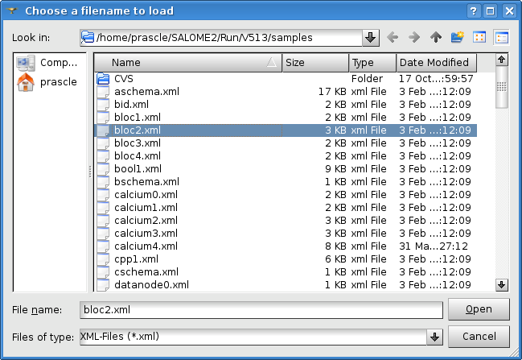
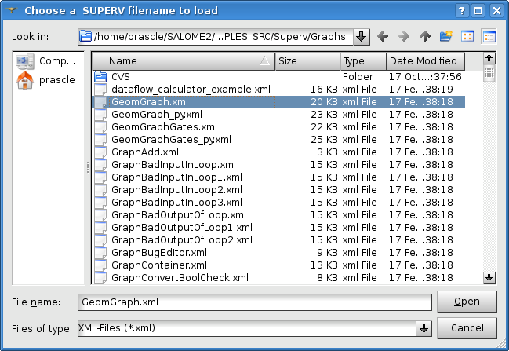
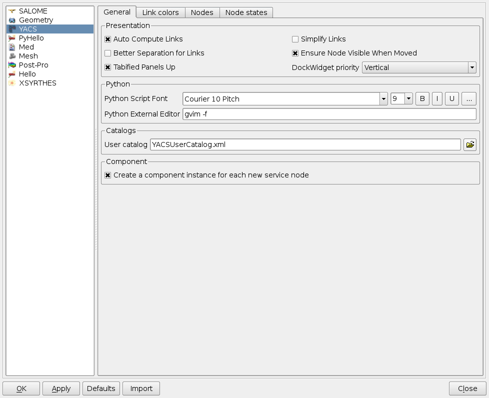
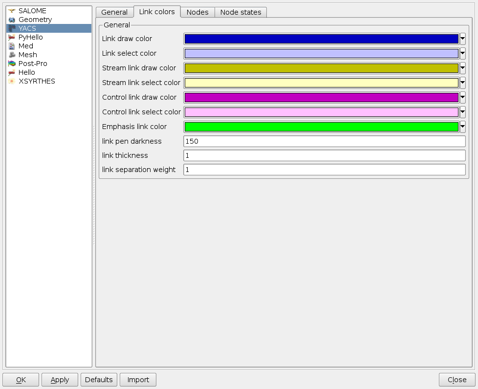
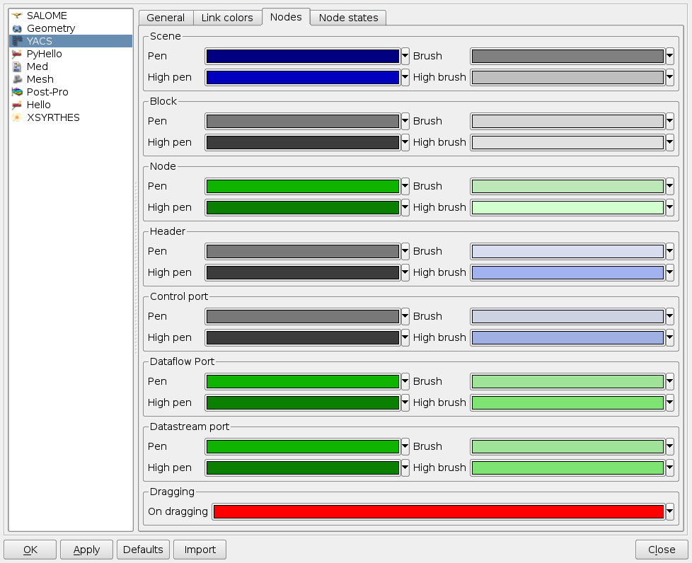
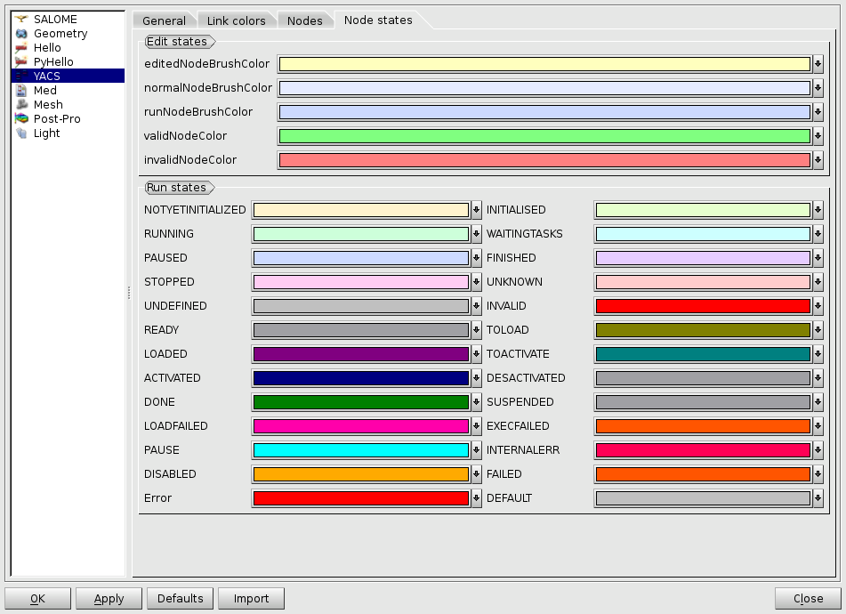
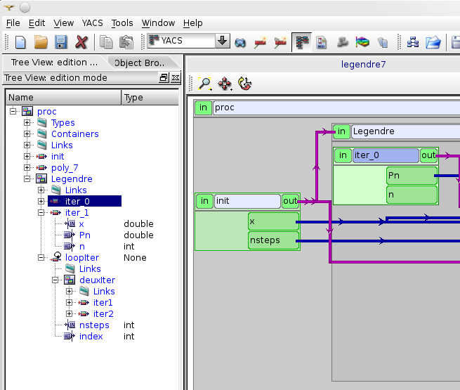
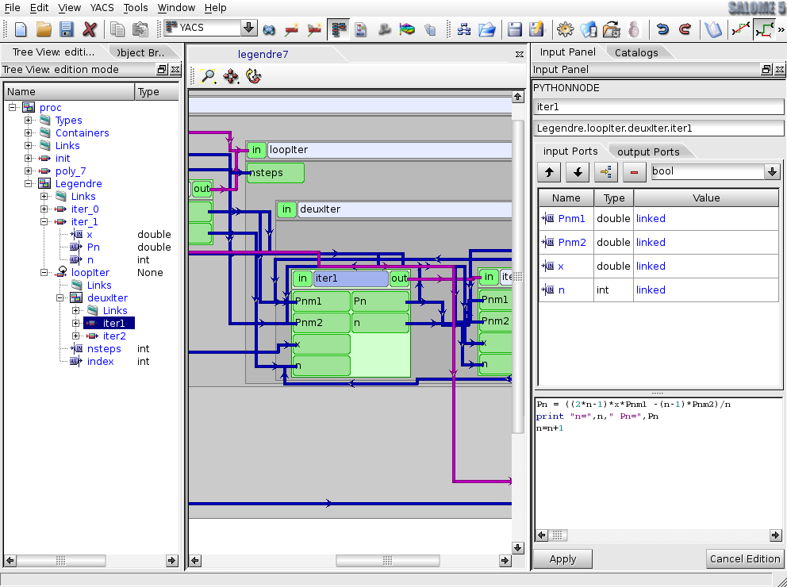

General operations
==================

Activate YACS module
--------------------
To work with YACS module the user can activate it in two ways:

#. by activating YACS item in :ref:`modules`,

#. by click YACS toolbar button on :ref:`modules`.

For the correct activation of YACS module it is necessary to install YACS GUI libraries and set YACS_ROOT_DIR environment variable 
pointed to the directory with installed binaries.

If there is no any study opened/created, during the YACS module activation the user has possibility to choose between opening 
an existing study and creating a new one. When YACS module has been activated, YACS GUI :ref:`main_menu` and :ref:`toolbars` 
corresponding to the state when no calculation schema is being edited or run are shown:

.. image:: images/functionality_list_0.png
  :align: center

In such a case there are only possibilities for the user to create or import (YACS or SUPERV XML) a schema.

:ref:`object_browser` shows tree representation of YACS objects in the current study.

Import/Export a schema
----------------------
To display either in :ref:`viewer` or in the :ref:`object_browser` and :ref:`tree_view` and edit a schema the user 
can import the schemas' XML file. The modified schema object can be saved into the specified XML file with 
help of :ref:`export_schema` YACS GUI command.

.. _import_yacs_schema:

Import YACS calculation schema
~~~~~~~~~~~~~~~~~~~~~~~~~~~~~~
The command **Import Schema --> YACS XML** is accessible from :ref:`file` or from the corresponding toolbar button 
on the :ref:`schema`. On this command call a standard open file dialog box appears and lets user to select desirable YACS XML file.

.. centered::
  **Import YACS XML schema dialog**

Imported schema is shown as an entry in :ref:`object_browser`.

If a selected YACS XML file has incorrect structure, a part of a schema that has been imported successfully (before an error occurred) 
will be represented in :ref:`object_browser` and :ref:`viewer` and the user will be able to work with it. YACS GUI shows an error 
message with error description in such a case.

Dimensions of drawing area occupied by a graph, positions and dimensions of node presentations, positions of internal link points 
and type of :ref:`change_2d_representation_schema` is retrieved from YACS XML file in order to correct 2D representation of the 
schema in the 2D Viewer.

.. _import_supervisor_graph:

Import SALOME Supervisor graph
~~~~~~~~~~~~~~~~~~~~~~~~~~~~~~
This operation is intended for importing an XML files containing description of calculation schema and having logical structure 
adopted by old SALOME 4 Supervisor module. The command **Import Schema --> SUPERV XML** is available from :ref:`file`. On this command
call a standard open file dialog box appears and lets user to select desirable SUPERV XML file.

.. centered::
  **Import SUPERV XML schema dialog**

Imported schema is shown as an entry in Object Browser.

If a selected SUPERV XML file has incorrect structure, a part of a schema that has been imported successfully (before an error occurred) 
will be represented in Object Browser and 2D Viewer and the user will be able to work with it. YACS GUI shows an error message with 
error description in such a case.

After importing of the SUPERV XML file has been completed a 2D representation of the schema (nodes and links) is displayed in the 2D Viewer.

.. _export_schema:

Export a schema to a file
~~~~~~~~~~~~~~~~~~~~~~~~~
If user wants to store modifications done in the existing schema or save a new created graph into the YACS XML file, it is needed to make 
the schema active and choose the **Export schema** command from :ref:`file` or the corresponding toolbar button on the :ref:`edition_toolbar`. 
As a result a standard save file dialog appears and lets user input or select desirable YACS XML file name to export the active schema in it.

.. centered::
  **Export schema dialog**

YACS module writes description of a schema and its child objects into an XML file. Additionally, schema 2D presentation data is saved 
in new created XML file.

Open/Save a study
-----------------
The user can start his work with the saved earlier study document. To open a saved study, the user has to activate common SALOME GUI 
operation with help of **Open** command from :ref:`file` or **Open document** toolbar button on the :ref:`standard`. SALOME unpacks 
YACS XML files from the study. YACS module reads them and recreates the study structure. If XML files in a study have incorrect 
structure, YACS GUI says that the loaded study is incomplete by showing an error message.

.. centered::
  **Open a study dialog**

If the user has finished his work, he can save a study by calling **Save** command from :ref:`file` or **Save document** toolbar button 
on the :ref:`standard`. YACS module stores all schemas from the current study to XML files, which are then packed into a single HDF5 study 
file by SALOME.

.. centered::
  **Save a study dialog**

.. _set_user_preferences:

Set user preferences
--------------------
In the frames of the YACS module the user has a possibility to set his own preferences. The preferences are regrouped in four tabs:

+ General: Font for Python script, user catalog loaded by default, external python editor if needed, arrangement mode for widgets, various options 
  for the display of links and the creation mode for service nodes.
+ Links colors
+ Nodes and ports colors
+ Node States Colors: in edition and execution

These preferences can be set by the user with help of standard SALOME GUI operation of
editing preferences: **Preferences ...** command from :ref:`file`.

After the user has changed the preferences in the Preferences dialog box for YACS module, the system applies the new values of 
preferences to relevant objects either immediately, or only to new instance of objects and, at least, when 
the schema or the study is saved and reopened.

.. centered::
  **Preferences dialog for YACS module, General tab**

.. centered::
  **Preferences dialog for YACS module, Link Color tab**

.. centered::
  **Preferences dialog for YACS module, Nodes tab**

.. centered::
  **Preferences dialog for YACS module, Node States tab**

Select an object
----------------
Object Browser, Tree View and 2D Viewer provides user with the possibility to select an object. The user can select objects 
in 2D Viewer or Tree View. Synchronisation beetwen Tree View, 2D Viewer and Input Panel is automatic.

.. centered::
  **Port selection**

In 2D Viewer the user can select/highlight nodes, ports and links. In the Tree View the user can select containers definitions, component 
instances definitions, nodes, ports, data types and links.

Today, YACS module supports only single selection, i.e. the user clicks on a single object with the mouse.

The 2D Viewer displays selected/highlighted objects in a distinctive way that allows the user to identify the selected/highlighted objects easily.

The system state after interactive selection depends on the type of selected object(s):

+ **A single editable object is selected:** Input Panel is shown and contains property pages for the selected object and in some 
  cases for its parent objects in a schema hierarchy. For instance, if an inline script node is selected either in 2D Viewer or in 
  the Tree View, the property page for the selected node will be displayed in the Input Panel.
  If the user selects SALOME service node, property pages for node, its component and container will be shown in the Input Panel.

.. centered::
  **Node selection**

+ **A single object that has no editable properties is selected:** Input Panel remains inchanged, with the previous selection.

.. _activate_context_popup_menu:

Activate context popup menu
---------------------------
In the YACS module the user can perform a set of operations on the different types of objects shown in the Object Browser and Tree 
View of the schema with help of context popup menu. For this purpose, the user has to click the right mouse button in the Object Browser 
or in the Tree View of the schema to select the object and choose needed menu item from context popup menu, which contains commands
applicable to the current selection. For empty selection, only commands applicable to the window (Object Browser, schema Tree View 
or 2D Viewer) in general are shown in context menu:

+ Object Browser: **Refresh** and **Find** operations are available.

+ Schema Tree View: not applicable, there is always an item selected.

+ 2D Viewer: nothing.

When a single object is selected in the **Object Browser**, its context popup menu contains all operations applicable to objects of 
the given type. Additionally, it contains **Expand all** command for expanding all collapsed items in the selected objects' sub-tree. 
There are currently no specific operation for YACS items in Object Browser popup menus.

By double click on a YACS item of the Object Browser (Schema in edition or execution), YACS switches to the corresponding context and 
synchronizes all corresponding views (Tree View, 2D View, Input Panel). Switching context is also possible via 2D Views tabs.

When a single object is selected in the **Tree View** of a schema, its context popup menu contains all operations applicable to objects 
of the given type.

.. _Table_2:

Specific operations available in the **edition mode** for each type of objects selected in the Tree View are given in the Table 2 below.

.. |schema| image:: images/schema.png

.. |component| image:: images/component.png

.. |loop| image:: images/loop_node.png

.. |inport| image:: images/in_port.png
.. |outport| image:: images/out_port.png

.. |data| image:: images/data_link.png

+--------------------------------+-------------+-------------------------------------------------------------------------------------+
| **Selected object type**       | **Icon**    |     **Available context menu commands**                                             |
+================================+=============+=====================================================================================+
|Schema                          | |block|     |                                                                                     |
|                                |             |**Run Current Schema** - execute the selected schema, i.e. create a run              |
|                                |             |schema object.                                                                       |
|                                |             |                                                                                     |
|                                |             |**Import a Data Type** - add a data type from the session                            |
|                                |             |catalog or data types catalog of another schema into the                             |
|                                |             |current schema.                                                                      |
|                                |             |                                                                                     |
|                                |             |**Create a Container definition** - create an empty container                        |
|                                |             |with the default name **containerN** (where N = 0,1,2,...)                           |
|                                |             |inside the current schema.                                                           |
|                                |             |                                                                                     |
|                                |             |**Create a node** - submenu for creation of different types of nodes                 |
|                                |             |inside the current schema. See :ref:`create_node`.                                   |
|                                |             |                                                                                     |
|                                |             |**Paste** - paste items (if any) from the                                            |
|                                |             |buffer into the current schema.                                                      |
|                                |             |                                                                                     |
|                                |             |**YACS Container log** - in Execution, shows the YACS Container Log, useful for      |
|                                |             |Python Nodes prints.                                                                 |
|                                |             |                                                                                     |
|                                |             |**Arrange Local Nodes** - Compute Nodes disposition whith GraphViz algorithm,        |
|                                |             |Without modification of internal disposition of children Blocs and other Composed    |
|                                |             |Nodes.                                                                               |
|                                |             |                                                                                     |
|                                |             |**Arrange Nodes Recursion** - Compute Nodes disposition whith GraphViz algorithm,    |
|                                |             |With recursion on children Blocs and other Composed Nodes.                           |
|                                |             |                                                                                     |
|                                |             |**Zoom to Bloc** - Center the 2D view on the Schema and resize the view to fit in    |
|                                |             |the screen                                                                           |
|                                |             |                                                                                     |
|                                |             |**Center on Node** - Center the 2D view on selected Node, without resizing.          |
|                                |             |                                                                                     |
|                                |             |**Shrink/Expand** - Fold/Unfold the selected Node. See :ref:`shrink_expand_nodes`.   |
|                                |             |                                                                                     |
|                                |             |**Shrink/Expand Children** - Fold/Unfold all direct Children Nodes of selected Node. |
|                                |             |See :ref:`shrink_expand_nodes`.                                                      |
|                                |             |                                                                                     |
|                                |             |**Shrink/Expand Elementary** - Fold/Unfold all Elementary Nodes of selected Node     |
|                                |             |recursively. See :ref:`shrink_expand_nodes`.                                         |
|                                |             |                                                                                     |
|                                |             |**Compute Links** - Recompute links, useful for large schemas, when automatic link   |
|                                |             |calculation have been deactivated, see :ref:`edition_toolbar`.                       |
|                                |             |                                                                                     |
+--------------------------------+-------------+-------------------------------------------------------------------------------------+
|Containers                      |             |                                                                                     |
|                                |             |**Create a Container definition** - create an empty container                        |
|                                |             |with the default name **containerN** (where N = 0,1,2,...)                           |
|                                |             |inside the current schema.                                                           |
+--------------------------------+-------------+-------------------------------------------------------------------------------------+
|SALOME component instance       | |component| |                                                                                     |
|                                |             |**Select a Component Instance** - When COMPONENT_INSTANCE_NEW is **deselected** in   |
|                                |             |preferences, this component instance is used for next SALOME service node creation   |
|                                |             |refering to the same Component type, until another component instance is selected.   |
|                                |             |If COMPONENT_INSTANCE_NEW is **selected**, this command has no effect, a new         |
|                                |             |component instance is always created with each SALOME service node creation.         |
+--------------------------------+-------------+-------------------------------------------------------------------------------------+
|Node Reference                  |             |                                                                                     |
|                                |             |**Select reference** - Select the corresponding node and synchronize all the views.  |
+--------------------------------+-------------+-------------------------------------------------------------------------------------+

Node objects.

+--------------------------------+-------------+-------------------------------------------------------------------------------------+
| **Selected object type**       | **Icon**    |     **Available context menu commands**                                             |
+================================+=============+=====================================================================================+
|Bloc Node                       | |block|     |                                                                                     |
|                                |             |                                                                                     |
|SWITCH Node                     | |switch|    |                                                                                     |
|                                |             |                                                                                     |
|FOR Loop Node                   | |loop|      |                                                                                     |
|                                |             |                                                                                     |
|FOREACH Loop Node               | |loop|      |                                                                                     |
|                                |             |                                                                                     |
|WHILE Loop Node                 | |loop|      |                                                                                     |
|                                |             |**Create a node** - submenu for creation of different types of nodes                 |
|                                |             |inside the current schema. See :ref:`create_node`.                                   |
|                                |             |                                                                                     |
|                                |             |**Arrange Local Nodes** - Compute Nodes disposition whith GraphViz algorithm,        |
|                                |             |Without modification of internal disposition of children Blocs and other Composed    |
|                                |             |Nodes.                                                                               |
|                                |             |                                                                                     |
|                                |             |**Arrange Nodes Recursion** - Compute Nodes disposition whith GraphViz algorithm,    |
|                                |             |With recursion on children Blocs and other Composed Nodes.                           |
|                                |             |                                                                                     |
|                                |             |**Zoom to Bloc** - Center the 2D view on the Schema and resize the view to fit in    |
|                                |             |the screen                                                                           |
|                                |             |                                                                                     |
|                                |             |**Center on Node** - Center the 2D view on selected Node, without resizing.          |
|                                |             |                                                                                     |
|                                |             |**Shrink/Expand** - Fold/Unfold the selected Node. See :ref:`shrink_expand_nodes`.   |
|                                |             |                                                                                     |
|                                |             |**Shrink/Expand Children** - Fold/Unfold all direct Children Nodes of selected Node. |
|                                |             |See :ref:`shrink_expand_nodes`.                                                      |
|                                |             |                                                                                     |
|                                |             |**Shrink/Expand Elementary** - Fold/Unfold all Elementary Nodes of selected Node     |
|                                |             |recursively. See :ref:`shrink_expand_nodes`.                                         |
|                                |             |                                                                                     |
|                                |             |**Compute Links** - Recompute links, useful for large schemas, when automatic link   |
|                                |             |calculation have been deactivated, see :ref:`edition_toolbar`.                       |
|                                |             |                                                                                     |
|                                |             |**Delete** - delete the selected composed node object with all its content.          |
|                                |             |                                                                                     |
|                                |             |**Cut** - cut item and keep it in a temporary buffer for paste elsewhere in the      |
|                                |             |current schema. **Warning! All links between this item and external node are lost!** |
|                                |             |                                                                                     |
|                                |             |**Copy** - keep a copy of the item in a temporary buffer for paste elsewhere in      |
|                                |             |the current schema.                                                                  |
|                                |             |                                                                                     |
|                                |             |**Paste** - paste items (if any) from the                                            |
|                                |             |buffer into the current schema.                                                      |
|                                |             |                                                                                     |
+--------------------------------+-------------+-------------------------------------------------------------------------------------+
| All other types of nodes       | |node|      |                                                                                     |
|                                |             |**Delete** - delete the selected composed node object with all its content.          |
|                                |             |                                                                                     |
|                                |             |**Cut** - cut item and keep it in a temporary buffer for paste elsewhere in the      |
|                                |             |current schema. **Warning! All links between this item and external node are lost!** |
|                                |             |                                                                                     |
|                                |             |**Copy** - keep a copy of the item in a temporary buffer for paste elsewhere in      |
|                                |             |the current schema.                                                                  |
|                                |             |                                                                                     |
|                                |             |**Paste** - paste items (if any) from the                                            |
|                                |             |buffer into the current schema.                                                      |
|                                |             |                                                                                     |
|                                |             |**Zoom to Bloc** - Center the 2D view on the Schema and resize the view to fit in    |
|                                |             |the screen                                                                           |
|                                |             |                                                                                     |
|                                |             |**Center on Node** - Center the 2D view on selected Node, without resizing.          |
|                                |             |                                                                                     |
|                                |             |**Shrink/Expand** - Fold/Unfold the selected Node. See :ref:`shrink_expand_nodes`.   |
|                                |             |                                                                                     |
+--------------------------------+-------------+-------------------------------------------------------------------------------------+

Port and link objects.

+--------------------------------+-------------+-------------------------------------------------------------------------------------+
| **Selected object type**       | **Icon**    |     **Available context menu commands**                                             |
+================================+=============+=====================================================================================+
|Input port                      | |inport|    |**Delete** - delete the selected input port object. This menu item is available only |
|                                |             |for input ports of non-service nodes.                                                |
+--------------------------------+-------------+-------------------------------------------------------------------------------------+
|Output port                     | |outport|   |**Delete** - delete the selected output port object. This menu item is available     |
|                                |             |only for output ports of non-service nodes.                                          |
+--------------------------------+-------------+-------------------------------------------------------------------------------------+
|Control link                    | |control|   |**Delete** - delete the selected link object, update Tree View and 2D Viewer content |
|                                |             |according to this operation.                                                         |
|Data link                       | |data|      |                                                                                     |
|                                |             |                                                                                     |
|Datastream link                 | |stream|    |                                                                                     |
|                                |             |                                                                                     |
+--------------------------------+-------------+-------------------------------------------------------------------------------------+

.. centered::
  **Table 2. Context popup menus in the Tree View or 2D View of a schema, edition mode**

The popup menus available on the objects selected in the Tree View or 2D View of a schema in the **run mode** does not include edition commands.

+--------------------------------+-------------+-------------------------------------------------------------------------------------+
| **Selected object type**       | **Icon**    |     **Available context menu commands**                                             |
+================================+=============+=====================================================================================+
|Schema                          | |block|     |                                                                                     |
|                                |             |                                                                                     |
|                                |             |**YACS Container log** - in Execution, shows the YACS Container Log, useful for      |
|                                |             |Python Nodes prints.                                                                 |
|                                |             |                                                                                     |
|                                |             |**Arrange Local Nodes** - Compute Nodes disposition whith GraphViz algorithm,        |
|                                |             |Without modification of internal disposition of children Blocs and other Composed    |
|                                |             |Nodes.                                                                               |
|                                |             |                                                                                     |
|                                |             |**Arrange Nodes Recursion** - Compute Nodes disposition whith GraphViz algorithm,    |
|                                |             |With recursion on children Blocs and other Composed Nodes.                           |
|                                |             |                                                                                     |
|                                |             |**Zoom to Bloc** - Center the 2D view on the Schema and resize the view to fit in    |
|                                |             |the screen                                                                           |
|                                |             |                                                                                     |
|                                |             |**Center on Node** - Center the 2D view on selected Node, without resizing.          |
|                                |             |                                                                                     |
|                                |             |**Shrink/Expand** - Fold/Unfold the selected Node. See :ref:`shrink_expand_nodes`.   |
|                                |             |                                                                                     |
|                                |             |**Shrink/Expand Children** - Fold/Unfold all direct Children Nodes of selected Node. |
|                                |             |See :ref:`shrink_expand_nodes`.                                                      |
|                                |             |                                                                                     |
|                                |             |**Shrink/Expand Elementary** - Fold/Unfold all Elementary Nodes of selected Node     |
|                                |             |recursively. See :ref:`shrink_expand_nodes`.                                         |
|                                |             |                                                                                     |
|                                |             |**Compute Links** - Recompute links, useful for large schemas, when automatic link   |
|                                |             |calculation have been deactivated, see :ref:`edition_toolbar`.                       |
|                                |             |                                                                                     |
+--------------------------------+-------------+-------------------------------------------------------------------------------------+
|Composed nodes                  |             |                                                                                     |
|                                |             |                                                                                     |
|                                |             |**YACS Container log** -  shows the YACS Container Log, useful for Python Nodes      |
|                                |             |prints.                                                                              |
|                                |             |                                                                                     |
|                                |             |**Arrange Local Nodes** - Compute Nodes disposition whith GraphViz algorithm,        |
|                                |             |Without modification of internal disposition of children Blocs and other Composed    |
|                                |             |Nodes.                                                                               |
|                                |             |                                                                                     |
|                                |             |**Arrange Nodes Recursion** - Compute Nodes disposition whith GraphViz algorithm,    |
|                                |             |With recursion on children Blocs and other Composed Nodes.                           |
|                                |             |                                                                                     |
|                                |             |**Zoom to Bloc** - Center the 2D view on the Schema and resize the view to fit in    |
|                                |             |the screen                                                                           |
|                                |             |                                                                                     |
|                                |             |**Center on Node** - Center the 2D view on selected Node, without resizing.          |
|                                |             |                                                                                     |
|                                |             |**Shrink/Expand** - Fold/Unfold the selected Node. See :ref:`shrink_expand_nodes`.   |
|                                |             |                                                                                     |
|                                |             |**Shrink/Expand Children** - Fold/Unfold all direct Children Nodes of selected Node. |
|                                |             |See :ref:`shrink_expand_nodes`.                                                      |
|                                |             |                                                                                     |
|                                |             |**Shrink/Expand Elementary** - Fold/Unfold all Elementary Nodes of selected Node     |
|                                |             |recursively. See :ref:`shrink_expand_nodes`.                                         |
|                                |             |                                                                                     |
|                                |             |**Compute Links** - Recompute links, useful for large schemas, when automatic link   |
|                                |             |calculation have been deactivated, see :ref:`edition_toolbar`.                       |
|                                |             |                                                                                     |
+--------------------------------+-------------+-------------------------------------------------------------------------------------+
|Elementary nodes                |             |                                                                                     |
|                                |             |                                                                                     |
|                                |             |**Node Error report** - shows the Node Error log                                     |
|                                |             |                                                                                     |
|                                |             |**Node Error details** - shows the Node Error log                                    |
|                                |             |                                                                                     |
|                                |             |**Node Container log** - shows the Node Container Log (only for services nodes)      |
|                                |             |                                                                                     |
|                                |             |**Zoom to Bloc** - Center the 2D view on the Schema and resize the view to fit in    |
|                                |             |the screen                                                                           |
|                                |             |                                                                                     |
|                                |             |**Center on Node** - Center the 2D view on selected Node, without resizing.          |
|                                |             |                                                                                     |
|                                |             |**Shrink/Expand** - Fold/Unfold the selected Node. See :ref:`shrink_expand_nodes`.   |
|                                |             |                                                                                     |
+--------------------------------+-------------+-------------------------------------------------------------------------------------+

.. centered::
  **Table 3. Context popup menus in the Tree View or 2D View of a schema, run mode**

.. _set_active_schema_or_run:

Set active schema or run of a schema
------------------------------------
Active schema is a YACS schema from the current study that is used implicitly in all YACS GUI operations working with a schema. 
Typically, a study can contain several YACS schemas and several executions (run) for a schema. For some YACS GUI operations such as 
creation of a node, it is convenient to add a new object (node) to the currently active schema.

YACS GUI allows the user to set a schema/run as active by double click on the schema/run object in the Object Browser or by switching 
between 2D Viewers showing different schemas/runs.

The active schema is used in creation/execution operations.

