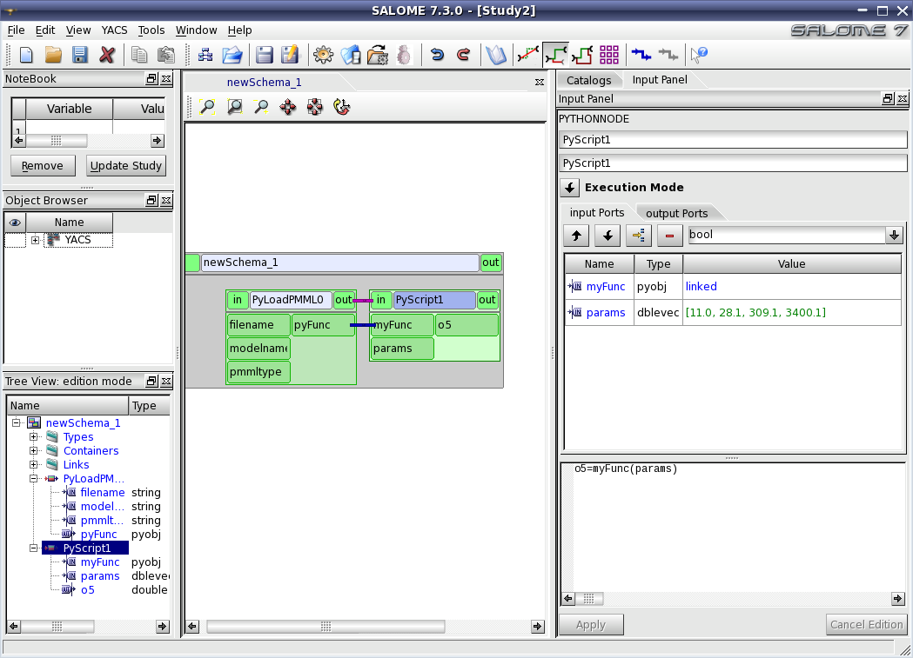

.. _pmml:

*******************************************************
Loading and executing a PMML file
*******************************************************

The Predictive Model Markup Language (PMML) is an XML-based file format developed by the Data Mining Group 
to provide a way for applications to describe and exchange models produced by data mining and machine learning 
algorithms.

Yacs provides an elementary python node called **PyLoadPMML** that generates an object of type **pyobj** 
from a model read in a PMML file.
This pyobj is a **PyFunction** that can be executed in a python node created by the user.

.. _pmmlModelTypes:

Authorized PMML model types
===================================

Node PyLoadPMML uses the swig/python interface to library libpmmlLib.so (Linux) or pmmllib.dll (Windows). 
This library handles :
   - **Neuronal Network** models and
   - **Linear Regression** models.

.. _pmmlPyLoadPMML:

Description of PyLoadPMML
===================================

   - **Input ports** 

================= ================= ========================================
Input port name     YACS type         Comment
================= ================= ========================================
filename            string            Name of the PMML file, 
                                      including its path if the file is 
                                      not in the current directory

modelname           string            Name of the model to load

pmmltype            string            Type of the model. Value is one of 
                                      kLR (linear regression) 
                                      or kANN (neural network)
================= ================= ========================================

   - **Output ports** 

================= ================= ========================================
Output port name    YACS type         Comment
================= ================= ========================================
pyFunc              pyobj             PyFunction representing the model 
                                      This function takes a vector of
                                      doubles as input parameter and
                                      returns a value of type double
================= ================= ========================================

.. _pmmlModelExecution:

Example of model execution
===================================

Create a YACS schema that uses node PyLoadPMML and add a python node that will execute the 
the pyfunction created by PyLoadPMML. The YACS schema with the execution python node code 
is shown below : 

The characteristics of the execution node are the following:

   - **Input ports** 

================= ================= ========================================
Input port name     YACS type         Comment
================= ================= ========================================
myFunc              pyobj             Linked to the PyFunction generated 
                                      by PyLoadPMML 

params              dblevec           Vector of doubles,
                                      input of the PyFunction
================= ================= ========================================

   - **Output ports** 

================= ================= ========================================
Output port name    YACS type         Comment
================= ================= ========================================
o5                  double            Result of the model execution 
================= ================= ========================================
