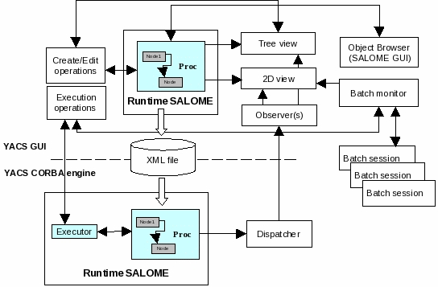

:tocdepth: 3

.. _principes:

YACS general principles
===============================
A calculation scheme is constructed based on the calculation node concept.  
A calculation node represents an elementary calculation that can be the local execution of a Python 
script or the remote execution of a SALOME component service.

The calculation scheme is a more or less complex assembly of calculation nodes.

This assembly is made by connecting input and output ports of these calculation nodes.

Data are exchanged between nodes through ports.  They are typed.

Composite nodes:  Block, Loop, Switch are used to modularise a calculation scheme and define 
iterative processes, parametric calculations or branches.

Finally, containers can be used to define where SALOME components will be executed (on a network or in a cluster).

.. _datatypes:

Data types
----------------------
Data exchanged between calculation nodes through ports are typed.  
There are four categories of types:  basic types, object references, sequences and structures.  
User types can be defined by combining these basic elements.  
Many types are predefined either by YACS or by the components used such as GEOM or SMESH.

Basic types
'''''''''''''''''''''
There are 5 basic types: int, double, bool, string and file. They are predefined by YACS.

================= =====================================
YACS type           Comment
================= =====================================
int                   for integers
double                for double reals
bool                  for booleans
string                for character strings
file                  for files
================= =====================================

Python generic type
...................

YACS adds a special type for exchanging generic Python objects between Python inline nodes (See :ref:`scriptnode` 
and :ref:`functionnode`). The type is named **pyobj** and uses the pickle module to exchange Python objects.
Consequently only Python objects that are pickable could be used for YACS **pyobj** ports.

It's forbidden to define the object's type into the node, it should be defined in an external Python module. To avoid
problems with YACS, you should add the module into your **PYTHONPATH** before launching SALOME.

Object references
''''''''''''''''''''''''''
Object references are used to type CORBA objects managed by SALOME components. In general, these types 
are defined by the components that use them. All that is necessary to define a YACS object reference type, is to 
give it a name and associate it with the CORBA Repository ID.  
Some examples of pre-defined types are given below.

================= ==============================
YACS type          CORBA Repository ID 
================= ==============================
Study               IDL:SALOMEDS/Study:1.0
SObject             IDL:SALOMEDS/SObject:1.0
GEOM_Shape          IDL:GEOM/GEOM_Object:1.0
MESH                IDL:SALOME_MED/MESH:1.0
FIELD               IDL:SALOME_MED/FIELD:1.0
================= ==============================

Simple or multiple inheritance relations can be defined between these types.  
The following gives an example of the MED component.

================= ============================== =====================================
YACS type          Base type                          CORBA Repository ID
================= ============================== =====================================
FIELDDOUBLE         FIELD                           IDL:SALOME_MED/FIELDDOUBLE:1.0
================= ============================== =====================================

.. _calciumtypes:

YACS also defines types for datastream ports:

================= =======================================================
YACS type               CORBA Repository ID
================= =======================================================
CALCIUM_integer    IDL:Ports/Calcium_Ports/Calcium_Integer_Port:1.0
CALCIUM_real       IDL:Ports/Calcium_Ports/Calcium_Real_Port:1.0
CALCIUM_double     IDL:Ports/Calcium_Ports/Calcium_Double_Port:1.0
CALCIUM_string     IDL:Ports/Calcium_Ports/Calcium_String_Port:1.0
CALCIUM_logical    IDL:Ports/Calcium_Ports/Calcium_Logical_Port:1.0
CALCIUM_boolean    IDL:Ports/Calcium_Ports/Calcium_Logical_Port:1.0
CALCIUM_complex    IDL:Ports/Calcium_Ports/Calcium_Complex_Port:1.0
================= =======================================================

A list of available types can be obtained by consulting catalogs of SALOME components:  GEOMCatalog.xml, 
SMESHCatalog.xml, MEDCalatog.xml, etc. These catalogs are in the XML format that is described in :ref:`schemaxml`.  
A view is also possible in the graphic user interface by viewing the components catalog.

Sequences
'''''''''''''''
A sequence type is used to type a list of homogenous elements.  The type contained in the list is the same for 
all elements.  A sequence type is defined by giving it a name and specifying the type of elements in the sequence.

The SALOME KERNEL defines sequence types for basic types.

================= ==============================
YACS type          Type of elements 
================= ==============================
dblevec               double
intvec                int
stringvec             string
boolvec               bool
================= ==============================

A sequence type can be defined for a sequence.  In this case, the element type is a sequence type.

Structures
''''''''''''''''
The structure type is used to type a data structured as a C structure.  This data contains named and typed members.  
A structure type is defined by giving it a name and specifying the list of members (name, type).

For example, the GEOM component defines a structure type with name “BCError” comprising a single member with name “incriminated” 
and type “ListOfLong”.  “ListOfLong” itself is a sequence of “int”.

Ports
-------------
A port can be considered as an interface of a node with the exterior.  There are three types of port:  control ports, 
data ports and datastream ports.  Each has different semantics.
 
Control ports
''''''''''''''''''''''''
This type of port is used to apply constraints on node execution chains.  An elementary or composite node 
usually has an input control port and an output control port.  A node for which the input control port is connected 
to the output control port of another node will not be executed until the second node is terminated.

Data ports
''''''''''''''''''''''''
This type of port is used to define data that will be used by a node when it is executed, and the data that will be produced 
by the node at the end of its execution.  A data port has a name, a direction (input, output) and the data contained in it 
have a type.  The order in which ports are defined is important because this order is used as the order of the arguments 
during the call for SALOME component services.

In general, an elementary calculation node is executed as follows:
 - control is given to the node through the input control port
 - input data are acquired by the node through the input data ports
 - the node is executed
 - output data are provided to output ports
 - control is returned by the node through the output control port.

An input data port can be initialized or connected to an output data port.

.. _datastreamports:

Datastream ports
''''''''''''''''''''''''
This type of port is used to exchange data during execution. Not all elementary nodes support this type of port.  
For the moment, this type of port is only supported by nodes related to SALOME components.  A datastream port has a name, 
a direction (input, output) and a type.  This type is not a data type directly but is rather the type of a CORBA object 
that manages the data exchange (see :ref:`progDSC` for further information on how to implement a datastream port).

It is not a simple task to implement a datastream port so SALOME provides a ready made port called CALCIUM datastream
port. It has been designed to ease scientific code coupling. You can see more about these ports in :ref:`calcium`.
Only a limited set of data types can be used to define these ports (see :ref:`CALCIUM types<calciumtypes>`).

A CALCIUM port can be configured by way of properties. A property is a pair (name, value), where name is the name of the property and value
is a character string that gives its value. Following is the list of properties supported by CALCIUM ports :

.. tabularcolumns:: |p{2.5cm}|p{3.5cm}|L|

================= ============================== =====================================
Property name      Default value                  Description
================= ============================== =====================================
DependencyType     TIME_DEPENDENCY                specify if data exchanged depend on time (TIME_DEPENDENCY) or on iteration (ITERATION_DEPENDENCY)
================= ============================== =====================================

Elementary calculation nodes
-------------------------------------
An elementary calculation node represents a particular calculation function (for example multiplication of 2 matrices).  
Every calculation node has a type. There can be one node type that executes a service of a SALOME component and another 
node type that executes a piece of Python script.  
Elementary calculation nodes are distributed into two categories: inline nodes that are executed mainly in the YACS coupler, 
and service nodes that are executed remotely and correspond to the use of SALOME components.

Every calculation node has a name used as an identifier. This identifier must be unique in its definition context. A context is 
defined by a calculation scheme or a composite node.

A calculation node has an input control port and an output control port. These control ports are connected through the control flow.

A calculation node usually has input and output data ports. The number and type of data ports is determined by the type of 
calculation node. These data ports are connected through the data flow.

A calculation node may have properties. A property is a pair (name, value), where name is the name of the property and value 
is a character string that gives its value.

.. _scriptnode:

Python script inline node
''''''''''''''''''''''''''''''
A Python script node executes the Python code in a context in which variables are present with a value equal to the content 
of input data ports when this execution is started. For example, if the node has an input data port named “matrix”, the 
variable “matrix” will be present in the execution context of the script and its value will be the content of the port with the 
same name. At the end of execution of the script, the output data ports will contain the values of variables with the same 
name present in the execution context. These variables must necessarily be present.

When this type of node is an internal node in a loop, the execution context is reinitialised for each iteration of the loop.

This type of node is executed mainly in the YACS process but it can be executed in remote 
processes (but only in YACS containers :ref:`containers`).

To create this type of node:

- from the GUI, see :ref:`inline_script`
- in a XML file, see :ref:`xml_script_node`
- from python interface, see :ref:`pyscript`

.. _functionnode:

Python function inline node
''''''''''''''''''''''''''''''
A Python function node executes a Python function, for which the arguments correspond to the node input data ports.  
The name of the function to be executed is given by a parameter of the node.  If such a node has 3 input data ports 
named 'a', 'b', 'c' and the name of the function is 'f', execution of the node will correspond to calling f(a,b,c) where a, b and c 
are the values of data ports with the same name.

Node output data are expected in return from the function in the form of a Python tuple. For example, if there are three 
output data ports named 'x', 'y', 'z', the function should terminate by "return x,y,z" where x, y and z are values 
for the output ports of the same name.

When this type of node is an internal node in a loop, the execution context is kept for every iteration of the loop, so 
that variables can be reused during iterations.

This type of node is executed mainly in the YACS process but it can be executed in remote 
processes (but only in YACS containers :ref:`containers`).

To create this type of node:

- from the GUI, see :ref:`inline_function`
- in a XML file, see :ref:`xml_function_node`
- from python interface, see :ref:`pyfunc`

.. _servicenode:

SALOME service node
''''''''''''''''''''''''''''''
A SALOME service node executes a service of a SALOME component. 
A service node can be defined in two ways:

 1. by indicating the component type (GEOM, SMESH, etc.) and the service to be executed
 2. by indicating an existing service node and the service to be executed

The second form exists because in some cases, it is required to use the state of the component at the end of execution of the 
first service to execute the second service. The state of the component is kept in a component instance that is created 
every time that the first form is used. If the second form is used, the existing instance is reused and a new component 
instance will not be created.

A service node has input and output data ports and it may also have input and output datastream ports.

A service node is loaded and executed on a SALOME container. This placement is managed using the YACS container concept 
(see :ref:`containers`) that is a slight abstraction of the SALOME container. 
Placement of the SALOME service can be managed by the same name to denote the YACS container on which it is to be placed. 
This is only possible with the first node definition form. If no placement information is given, the service will be placed 
on the default container of the SALOME platform:  FactoryServer container on the local machine.

The properties of a SALOME service node are converted into environment variables when the service is executed and can be retrieved
in the component with the method getProperties that returns an Engines::FieldsDict struct. The retrieved properties are the
properties of the node completed by the properties of the including Blocs.

To create this type of node:

- from the GUI, see :ref:`salome_service`
- in a XML file, see :ref:`xml_service_node`
- from python interface, see :ref:`pyservice`

SalomePython node
''''''''''''''''''''''''''''''
A SalomePython node is a Python function node to which YACS provides the information necessary to run SALOME 
components and execute their services (in the Python execution context).  It is the address of the container into 
which the component is to be loaded and executed.  This address is given in the "_container_from_YACS_" variable 
in the form <machine name>/<container name>. Therefore, parameters can be set for this node using container placement 
information like a SALOME service node.

Restriction:  this type of node cannot execute a SALOME service with datastream ports.  The node is seen by YACS 
as being a Python node.  Datastream ports are not managed.

Data nodes
''''''''''''''''''''''''''''''
A Data node is used to define data (DataIn node) or to collect results (DataOut node) of a calculation scheme.

DataIn node
...................
A DataIn node has output data ports only that are used to define input data for the calculation scheme. These data have a name (the port name), a type (the port type) and an initial value.

To create this type of node:

- from the GUI, see :ref:`datain_node`
- in a XML file, see :ref:`xml_datain`
- from python interface, see :ref:`py_datain`

DataOut node
...................
A DataOut node only has input data ports that are used to store output results from the calculation scheme.  These results have a name (the port name) and a type (the port type).  If the result is a file, a name can be given to the file into which the result file will be copied.

All values of node results can be saved in a file at the end of the calculation.

To create this type of node:

- from the GUI, see :ref:`dataout_node`
- in a XML file, see :ref:`xml_dataout`
- from python interface, see :ref:`py_dataout`

Study nodes
''''''''''''''''''''''''''''''
A Study node is used to relate the elements of a SALOME study to the data and results of a calculation scheme.

StudyIn node
...................
A StudyIn node has output data ports only. It is used to define data in the calculation scheme originating from a SALOME study. The associated study is given by its SALOME StudyID.

A port corresponds to data stored in the associated study.  The data has a name (the port name), a type (the port type), and a reference that gives the entry into the study.  This reference is either a SALOME Entry (for example 0:1:1:2) or a path in the SALOME study tree (for example, /Geometry/box_1).

To create this type of node:

- from the GUI, see :ref:`studyin_node`
- in a XML file, see :ref:`xml_studyin`
- from python interface, see :ref:`py_studyin`

StudyOut node
...................
A StudyOut node only has input data ports.  It is used to store results in a SALOME study.  The associated study is given by its SALOME StudyID.

A port corresponds to a result to be stored in an associated study.  The result has a name (the port name), a type (the port type), and a reference that gives the entry into the study.  This reference is either a SALOME Entry (for example 0:1:1:2) or a path in the SALOME study tree (for example, /Geometry/box_1).

The associated study may be saved in a file at the end of the calculation.

To create this type of node:

- from the GUI, see :ref:`studyout_node`
- in a XML file, see :ref:`xml_studyout`
- from python interface, see :ref:`py_studyout`

Connections
-----------------
Connections between input and output ports of elementary or composite nodes are made by creating links between these ports.

Control links
''''''''''''''''''''''''''''''
Control links are used to define an order in which nodes will be executed.  They relate an output port of one node to an input port of another node.  These two nodes must be defined in the same context.  The definition of the link consists simply of giving the name of the input side node and the name of the output side node.

Dataflow links
''''''''''''''''''''''''''''''
Dataflow links are used to define a dataflow between an output data port for one node and an input data 
port for another node.  There is no need for these nodes to be defined in the same context.  A dataflow link adds a control 
link between the two nodes concerned or between the appropriate parent nodes to respect the rule for definition of the 
control links.  The dataflow link guarantees consistency between the dataflow and the execution order.   
All that is necessary to define the link is to give the names of the input side node and port and the names of the output 
side node and port.  
The port types must be compatible (see :ref:`compatibility`).

Data links
''''''''''''''''''''''''''''''
In some cases (mainly loops), it is useful to be able to define dataflows without defining the associated control link 
as in the dataflow link.  The datalink is then used.  The definition is exactly the same as for the dataflow link.  
The port types must be compatible (see :ref:`compatibility`).

.. _datastreamlinks:

Datastream links
''''''''''''''''''''''''''''''
Datastream links are used to define a data stream between an output datastream port for one node and an input datastream port 
for another node.  These two nodes must be defined in the same context and it must be possible to execute them in parallel.  
Therefore, there must not be direct or indirect control link between them.  The link is defined by giving output node and port 
names and input node and port names.  The definition of the datastream links may be complemented by properties that 
define parameters of the behaviour of the DSC port that makes the data exchange (see :ref:`progDSC`).  
The port types must be compatible (see :ref:`compatibility`).

For CALCIUM datastream ports, links can be configured by way of properties that are listed here (more information about them
can be found in :ref:`calcium`):

.. tabularcolumns:: |p{3cm}|p{3cm}|L|

==================== ============================== =====================================
Property name          Default value                  Description
==================== ============================== =====================================
DateCalSchem           TI_SCHEM                       specify the temporal scheme (TI_SCHEM, TF_SCHEM, ALPHA_SCHEM) for ports with time dependency
StorageLevel           infinite                       specify the maximum number of data kept in the destination port
Alpha                  0.0                            specify the coefficient of the ALPHA_SCHEM
DeltaT                 1.e-6                          tolerance to check if two dates are identical
InterpolationSchem     L1_SCHEM                       specify the interpolation function (linear:L1_SCHEM or step:L0_SCHEM)
ExtrapolationSchem     not defined                    specify the extrapolation function (E0_SCHEM or E1_SCHEM) in case of timeout (not implemented)
==================== ============================== =====================================

As for other ports, CALCIUM port types must be compatible to be connected. But they must also have the same DependencyType 
property (see :ref:`datastreamports`).

.. _compatibility:

Compatibility of data types
'''''''''''''''''''''''''''''''''''''''''
A data, dataflow or datastream link may only be created if the data type of the output port is compatible with the data type 
of the input port.  There are three forms of compatibility:

 - identity of types (for example double -> double)
 - specialization of types (for example FIELDDOUBLE -> FIELD)
 - type conversion (for example int -> double)

Compatibility by conversion
......................................
Compatibility by conversion is applicable to basic types and to their derivatives (sequence, structure).  
The following conversions are accepted:

================= ============================== ====================================
YACS type          Conversion possible into              Comment
================= ============================== ====================================
int                 double
int                 bool                           true if int != 0 else false
================= ============================== ====================================

The conversion is also applicable to types constructed as a sequence of ints that may be converted into a 
sequence of doubles.  YACS controls the conversion.  This is also applicable to nested sequence of sequence, structure 
of structure, sequence of structure structures and types, etc.

Compatibility by specialization
......................................
The compatibility rule is expressed differently for data (or dataflow) links and datastream links.

For data (or dataflow) links, the type of output data port must be derived from (or identical to) the type of input 
data port.  For example, an output data port with a FIELDDOUBLE type may be connected to an input data port with 
the FIELD type because the FIELDDOUBLE type is derived from the FIELD type (where FIELD is the basic type of FIELDDOUBLE).

The rule for datastream links is exactly the opposite of the rule for data links:  the type of the input datastream port 
must be derived from the type of the output port.  
At the moment there is no derived datastream type.  Therefore the only applicable rule is identity of types.

Multiple links
'''''''''''''''''''
Control ports support 1 to N and N to 1 multiple links.

Data ports support 1 to N and N to 1 multiple links.  1 to N links do not create any problem.  N to 1 links should be used with 
caution, because the final result depends on the order in which the exchanges are made.  This type of link will be reserved 
for looping back in iterative loops.  In this case, the order in which exchanges are made is perfectly reproducible. 

Datastream ports also support 1 to N and N to 1 multiple links.  1 to N datastream links do not create any particular problems:  data 
exchanges are simply duplicated for all connected input ports.  However, data exchanges for N to 1 datastream links will be 
overlapped in the single input port.  The final result may depend on the order in which exchanges are made.

Composite nodes
--------------------------------
There are several types of composite nodes, namely block, loop and switch nodes.  
A composite node may contain one or several nodes of an arbitrary type (elementary or composite).  
By default, the set of node inputs and outputs making up the composite node are accessible from the outside.  
It can be said that composite node inputs are composed of the set of internal node inputs.  The same is applicable for outputs.  
This is the white box concept.

The Bloc node
''''''''''''''
This is a group of nodes with dependency links between internal nodes.  
The Bloc is a white box (internal nodes are visible).  
A calculation scheme is a Bloc.  The Bloc is manipulated in a manner similar to an elementary node.  
It is provided with a single input control port and a single output control port.  
Consequently, two blocks connected through a dataflow data link will be executed in sequence, all nodes in the 
first block will be executed before starting the second block.

A Bloc node may have properties. A property is a pair (name, value), where name is the name of the property and value 
is a character string that gives its value. The properties of a Bloc are inherited by the nodes in the Bloc.

To create this type of node:

- from the GUI, see :ref:`block_node`
- in a XML file, see :ref:`xml_block`
- from python interface, see :ref:`py_block`

The ForLoop node
'''''''''''''''''''''
A loop is used to make iterations on an internal node.  
This internal node may be a composite node or an elementary node.  
Some internal node outputs may be explicitly looped back onto inputs of this internal node.  
A ForLoop loop executes the internal node a fixed number of times.  This number is given by a data port in the loop 
named “nsteps” or by a parameter of the loop of the same name. The current step number is accessible through
an output port of the loop named "index".

To create this type of node:

- from the GUI, see :ref:`forloop_node`
- in a XML file, see :ref:`xml_forloop`
- from python interface, see :ref:`py_forloop`

The While node
''''''''''''''''''''
A While loop executes the internal node as long as a condition is true.  
The value of the condition is given by a data port of the loop named “condition”.

To create this type of node:

- from the GUI, see :ref:`whileloop_node`
- in a XML file, see :ref:`xml_whileloop`
- from python interface, see :ref:`py_whileloop`

The ForEach node
''''''''''''''''''''''
The ForEach node is also a loop, but it executes a loop body in parallel by iterating on one and only one data collection.  
A data collection is of the sequence type.  
An input data port of the ForEach node named “SmplsCollection” receives the data collection on which the loop iterates.
This data collection is typed.  The data type on which the loop iterates is unique.  The number of parallel branches managed 
by the loop is fixed by a parameter of the loop (input port named "nbBranches").  
If the collection size is 100 and this parameter is fixed at 25, the loop will execute 4 packets of 25 calculations in parallel.  
The internal node can access the current iteration of the data collection through the output data port from the loop named “evalSamples”.

Typed data collections can be constructed at the output from the loop.  All that is necessary is to connect an output data 
port of the internal node to an input data port of a node outside the loop. The loop automatically constructs the data collection.

To create this type of node:

- from the GUI, see :ref:`foreachloop_node`
- in a XML file, see :ref:`xml_foreachloop`
- from python interface, see :ref:`py_foreachloop`

The Switch node
''''''''''''''''''''''
The Switch node performs the conditional execution (among N) of a node (composite, elementary).  
These nodes must have a minimum number of compatible inputs and outputs.  
The switch condition (integer, real) is used to switch execution of one node among N.  
The switch condition is given by an input data port of the Switch node named “select” or by a parameter of this node with the same name.

If the nodes are terminal (nothing is executed from their outputs), they do not need to have compatible outputs.  
Output ports used at the node output must be compatible with each other (i.e. they must be derived from a common generic 
type that can be used by another input node).

To create this type of node:

- from the GUI, see :ref:`switch_node`
- in a XML file, see :ref:`xml_switch`
- from python interface, see :ref:`py_switch`

The OptimizerLoop node
'''''''''''''''''''''''''
This node can be used to build an optimization process.
It has one and only one internal node as all the loop nodes. It is the internal node that is "optimized".
The optimization algorithm must be defined by the user. The main idea behind is : the OptimizerLoop iterates until
the user optimization algorithm says the process is ended (convergence or error). At each iteration, the 
OptimizerLoop gives the data provided by the internal node to the algorithm. The algorithm returns a new sample
that is given by the OptimizerLoop to the internal node and so on until the end. In most optimization processes, the sample
is the variable (x) and the data that is returned by the internal node is the function to optimize (f(x)). Sometimes, the
gradient is also returned.

The definition of the optimization algorithm is done by way of plugin.
The plugin can be a C++ plugin implemented in a dynamic library (.so file) or a Python plugin implemented in a Python module (.py).
It is possible to implement two kinds of algorithm : synchronous or asynchronous.
The implementation of an optimization algorithm as a plugin is described in :ref:`optimizationplugin`.

The plugin is defined by 2 parameters :

- **lib** the file name of the dynamic library or of the Python module. The name of the dynamic library must be given without
  extension (.so) but the name of the Python must be given with extension (.py).
- **entry**, the name of an entry point in the dynamic library or in the Python module that will return the algorithm plugin
  factory (see :ref:`optimizationplugin` for more informations)

The node has five ports:

- **algoInit**, an input port that takes an object used for the initialization of the algorithm
- **evalSamples**, an output port that gives the samples in the optimization process
- **evalResults**, an input port that collects the results given by the internal node
- **nbBranches**, an input port that can be used to parallelize the optimization process as in the ForEach node (number of
  branches). Most of a time, the optimization process is sequential so the number of branches will be 1, but in some cases 
  it is possible to parallelize the process so the number  of branches will be greater than 1.
- **algoResults**, an output port that gives the results of the optimization algorithm

To create this type of node:

- from the GUI, see :ref:`optimizerloop_node`
- in a XML file, see :ref:`xml_optimizerloop`
- from python interface, see :ref:`py_optimizerloop`

.. _containers:

Containers
---------------------
The SALOME platform executes its components after loading them in containers.
A SALOME container is a process managed by the platform that may be executed
on any known resource.

**WARNING !** There are two types of containers in the Salome world that must
be clearly distinguished:

- YACS container, that will be explained extensively here.
- SALOME container which is a single process managed by the plateform that may
  be executed on any resource in the resource catalog of the current SALOME
  application. This single process can perform a set of jobs.

To avoid misleading, in this chapter, container word will be systematically explicited.

YACS containers are used in the definition of a scheme to define constraints
on the execution of the nodes of a YACS scheme. They are part of the scheme
as well as the nodes are.
Exactly one YACS container is attached to an elementary node.

The tasks (elementary nodes) that can be run remotely are ( or the tasks that
are attached to a YACS container are ) :

- Python script node.
- Python function node.
- Salome node.

So all elementary nodes of a scheme (whatever their types in the list above)
that can be executed remotely should be attached to a set of YACS container objects.

YACS containers can be seen as a placement request at edition time of a scheme.
**During the execution of a scheme, a YACS container is incarnated into one or
several SALOME containers** depending on the type of the YACS container.

Presently, there are 3 types of containers that incarnates the 3 different
mapping strategies between YACS containers and SALOME containers :

- *Mono YACS container* : The most simple. There is exactly one KERNEL container
  attached on one mono YACS container. **WARNING**, this type of YACS container
  can be dangerous into the context of foreach because several tasks can be
  invoked in parallel inside of a same process that can lead to problems if the
  service owning this YACS container is not thread safe. This type of YACS
  container leads to no special treatment from Executor point of view.
- *Multi YACS container* : There are as many SALOME containers as YACS component
  instances attached to it in the scheme.
  In the context of a foreach loop, it can lead to a pool of SALOME containers
  attached to a YACS container. This type of YACS container leads to no special
  treatment from Executor point of view.
- *HP YACS container* : HP stands for Homogeneous Pool of SALOME containers. A HP
  YACS container is mapped to a fixed size set of SALOME containers. This pool is
  homogeneous which means that each of the SALOME containers inside of the pool
  can be used indifferentely by the nodes attached to a same HP YACS container.
  Contrary to the 2 YACS container types above, the Executor is active with
  that type of YACS container by performing, if needed, a cutoff towards executed
  tasks list in READY state regarding the availability of different YACS
  HP containers.

To create containers from TUI, see :ref:`py_container_creation`.

All of these 3 types of YACS containers are sharing a common important features : set of properties.

Properties are a set of (key,value) pairs which are designed to be forwarded
directly to the KERNEL (expected "name" property and "attached_on_cloning"
property, see :ref:`containers_aoc_property`) when a task attached to the YACS
container has LOAD status during the execution of a scheme.

The array below presents extensively the list of available keys and
corresponding values expected that are common to 3 types of YACS container.
Those properties (excepted "name" and "attached_on_cloning" property) are the
way to specify the request to the KERNEL when the mapping will be requested by
the Executor of YACS.
For your information the dump in XML file of each YACS container object
contains exclusively those (key,value) pairs.

- To set properties from GUI to a YACS container, see :ref:`pp_for_container`.
- To set properties from python interface, see :ref:`py_container`.

.. note:: One important property is the "container_name" that must not be
          confused with the property "name".

          - "name" is relative to YACS container only (that will appear in the
            XML file)

          - "container_name" is a part of the request at run time when attaching
            SALOME container with YACS container. Warning, the behaviour of
            mapping is sensitive to the fact that "container_name" property is
            empty or not.

.. note:: HP YACS containers have 2 additionnal properties compared to Mono
          and Multi YACS Containers. The first one is the "SizeOfPool" that defines the
          size of the set of SALOME containers. The second one is "InitializeScriptKey"
          which contains the string of a python code that will be passed to each of the
          SALOME containers of the pool to initialize it (if necessary).

.. tabularcolumns:: |p{3cm}|p{3cm}|p{10cm}|

=================== ============= =============================================
Name                  Type            Type of constraint
=================== ============= =============================================
name                  string       if given imposes the resource to use. If not given, the resource manager will try
                                   to find the best resource according to the constraints given by the other attributes.
attached_on_cloning   bool         By default false for Multi and Mono YACS containers. Always true and not settable for HP containers. See :ref:`containers_aoc_property`
container_name        string       if given imposes the SALOME container name
hostname              string       if given imposes the machine (constraint used if name is not given)
policy               "best",       Choose the best or the first or the next in 
                     "first" or    the list of resources, once other criteria  
                     "cycl"        have been applied. By default, YACS uses the “altcycl” policy
                     "altcycl"     that selects the next resource in the list of known resources (constraint used if name is not given)
OS                    string       if given restricts the choice of the OS (constraint used if name is not given)
workingdir            string       if given specifies the execution directory.  
                                   By default, the YACS run directory will be used 
                                   on the local machine and the $HOME directory will be used on remote machines.
isMPI                 bool         indicates if the container has to support MPI
mem_mb                int          minimum requested memory size (constraint used if name is not given)
cpu_clock             int          minimum requested CPU speed (constraint used if name is not given)
nb_proc_per_node      int          number of processors by node (constraint used if name is not given)
nb_node               int          number of nodes (constraint used if name is not given)
nb_component_nodes    int          ??
parallelLib           string       ??
=================== ============= =============================================

When using the "best" policy, a price is computed for each resource based on some criteria and the resource with the best price is chosen.
The list of these criteria, from the most important to the least important, is:
 1. Number of processors (nb procs). For a resource, it is given by "nb_node" * "nb_proc_per_node".
 2. Number of nodes (nb nodes)
 3. Number of processors by node (nb proc/node)
 4. CPU frequency (cpu clock)
 5. Memory (mem mb)
Undefined criteria are ignored. The price of each criterion is:
 - the highest (3) if the expected value of the criterion is equal to the value of the criterion in the resource
 - medium (2) if the expected value of the criterion is less than the value of the criterion in the resource
 - the lowest (1) if the expected value of the criterion is higher than the value of the criterion in the resource

.. _containers_aoc_property:

Attached On cloning property
''''''''''''''''''''''''''''''

A specific chapter is dedicated to that property of YACS container. This property
is only used by YACS and it is not forwarded to KERNEL.
The value of this property is either False or True.
The property is writable and by default set to false for mono YACS containers
and multi YACS containers. For HP YACS containers this property is not writable
and set to true.
It controles the behaviour of the YACS container when cloning is triggered.

A cloning is triggered during execution of a scheme for ForEachLoop and
OptimizerLoop nodes of the scheme.
In fact, when a ForEachLoop or OpmizerLoop node is executed it immediatly
clones nbOfBranches times the node inside it (and performs right connections
on these copies) using Node::clone method that recursively creates a deep copy
of the node.

The question is : What is done for deep copied elementary nodes executed
remotely ? Do the copied node and base node share the same YACS container
object or is the copied node lying on a deep copy of the YACS container
of the base node ?

The "attached_on_cloning" property of YACS container is considered here.

- If false, a deep copy of YACS container is done when cloning the remotely
  executed node.
- If true, the cloned node and the node itself will share the same YACS
  container.

So it appears natural that HP YACS containers have this property set to true
because it is the aim of HP YACS container to share a same pool of workers
accross all the nodes especially in the ForEachLoop or OptimizerLoop context.

.. _catalogResources:

The resources catalog
''''''''''''''''''''''''''''''''''''''''''
The list of resources (machines and SALOME installations) known to SALOME is given in the resources catalog, the CatalogResources.xml file 
that must be located in the directory of the SALOME application used.  
This file is in the XML format.  Each resource is described with the **machine** tag that has several attributes that characterize it.

.. tabularcolumns:: |p{3cm}|p{3cm}|p{10cm}|

================================== =========================== ==============================================
Characteristic                         XML attribute               Description
================================== =========================== ==============================================
resource name                       name                       the resource name
computer name                       hostname                   the complete machine name:  this is the key that uniquely determines the machine
                                                               (for example : "nickel.ccc.cea.fr") 
access protocol                     protocol                   "ssh" (default), "rsh" or "sh"
Type                                type                       "single_machine" (default) or "cluster"
user name                           userName                   user name to be used to connect to the machine 
operating system                    OS
memory size                         memInMB
clock frequency                     CPUFreqMHz
Number of nodes                     nbOfNodes
Number of processors per node       nbOfProcPerNode
SALOME application                  appliPath                  directory of the SALOME application to be used on this machine
mpi implementation                  mpi                        indicates which MPI implementation is used on this machine
                                                               ("lam", "mpich1",
                                                               "mpich2", "openmpi")
batch manager                       batch                      if the machine has to be used through a batch system, gives the 
                                                               name of the batch manager
                                                               ("pbs", "lsf", "slurm").
                                                               No default.
Can Launch Batch Jobs               canLaunchBatchJobs         Indicate if the resource can be used to launch
                                                               batch jobs, through the JOBMANAGER module for
                                                               instance. It can be "false" (default) or
                                                               "true".
Can Run Containers                  canRunContainers           Indicate if the resource can be used to run
                                                               containers. It must be set to "true" if you
                                                               want to use this resource with YACS. It can be
                                                               "false" (default) or "true".
================================== =========================== ==============================================

The list of SALOME modules of the resource can also be indicated.  By default, SALOME assumes that all components 
requested by YACS are present.

If only some components are available within a resource, the list of components must be specified.
This list can be specified with the sub-tag **component** that has two attributes : **name** (the name of the component)
and **moduleName** (the name of the module) that is optional. You can use also the sub-tag **modules** that is provided
for compatibility with older versions. If the **modules** sub-tag is used, a component with the same name as
the moduleName attribute is added to the list.

The following is an example of a resource catalog:

.. code-block:: xml

  <!DOCTYPE ResourcesCatalog>
  <resources>
    <machine hostname="is111790" name="is111790" 
             OS="LINUX" CPUFreqMHz="2992" memInMB="1024" 
             protocol="rsh" type="single_machine"
             nbOfNodes="1" nbOfProcPerNode="1"
             canRunContainers="true">
    </machine>
    <machine hostname="is111915" name="is111915" 
             OS="LINUX" CPUFreqMHz="2992" memInMB="1024" 
             protocol="ssh" type="single_machine"
             nbOfNodes="1" nbOfProcPerNode="1" 
             appliPath="SALOME/Run"
             canRunContainers="true">
             <modules moduleName="GEOM"/>
             <component name="SMESH"/>
             <component name="VISU" moduleName="VISU"/>
    </machine>
  </resources>

.. _etats:

States of a node
-----------------------------
The possible states of a node when a calculation scheme is being edited are as follows:

=================== =============================================
State                 Comment
=================== =============================================
READY                The node is valid, ready to be executed   
INVALID              The node is invalid, the scheme cannot be executed
=================== =============================================

A node may be in the following states during execution of a calculation scheme:

=================== =============================================================
State                 Comment
=================== =============================================================
READY                the node is valid, ready to be executed
TOLOAD               the component associated with the node can be loaded
LOADED               the component associated with the node is loaded
TOACTIVATE           the node can be executed
ACTIVATED            the node is being executed
DONE                 execution of the node is finished with no error
ERROR                execution of the node is finished with error
FAILED               node in error because previous nodes were in error
DISABLED             execution of the node is disabled
PAUSE                execution of the node is paused
=================== =============================================================

.. _nommage:

Context sensitive naming of nodes
-------------------------------------
We have seen that elementary and composite nodes have a unique name in the definition context that corresponds 
to the parent node (calculation scheme or composite node).  Several sorts of naming are used to denote nodes in all 
possible situations:

 - local naming:  this is the name of the node in its definition context
 - absolute naming:  this is the name of the node seen from the highest level of the calculation scheme
 - relative naming:  this is the name of a node seen from a parent composite node.

The general rule is that absolute and relative names are constructed by concatenating local names of the node and 
its parents, and separating them with dots.

Consider the example of an elementary node with name “n” defined in a block name “b”, that is itself defined in a block name “c” 
itself defined at the highest level of the scheme. The local name of the node is “n”.  The absolute name is “c.b.n”.  
The relative name in block “c” is “b.n”.  

The same rule is applied for naming ports.  If node “n” has a port name “p”, then all that is necessary to obtain the port 
name is to add “.p” to the node name.

There is an exception to this rule that concerns the Switch node.  In this case, it is necessary to take account of case 
that is not a genuine node.  If it is said that block “b” in the previous example is a switch that has a case with a 
value of 1 and a default case, then the absolute name of node “n” in the case 1 will be “c.b.p1_n” and the absolute name of the node in 
the default case will be “c.b.default_n”.

Active study
--------------
A schema can be executed without using the SALOME study manager. But when a schema must be executed in the context
of a SALOME study, it is possible to specify the studyId to use.

The way to do that is to set the schema property **DefaultStudyID** to the study id.

In the GUI, this is set automatically to the current active studyId.
For execution in console mode, see :ref:`xml_active_study`

.. _errorreport:

Error report
-------------------
Every node has an associated error report if its state is INVALID, ERROR or FAILED.  This report is in the XML format.

Elementary nodes produce a simple report that contains a single (error) tag with 2 attributes:

- node:  that gives the node name
- state:  that indicates its state.

The tag content is the text of the error.  For a Python script node, this will usually be the traceback of the exception 
encountered.  For a service node, it will be either the content of a SALOME exception or the content of a CORBA exception.

Composite nodes produce a composite report contained in a tag with the same name (error) with the same two node and state 
attributes.  The tag contains all error reports for erroneous child  nodes.

The following shows an error report for a division by zero in a Python node contained in a loop:

.. code-block:: xml

  <error node= proc state= FAILED>
  <error node= l1 state= FAILED>
  <error node= node2 state= ERROR>
  Traceback (most recent call last):
    File "<string>", line 1, in ?
  ZeroDivisionError: integer division or modulo by zero
  
  </error>
  </error>
  </error>

Execution trace files
--------------------------
For each execution several trace files are produced:

- the ouput file of the YACS process that executes the scheme
- a trace file that reports all the events that have occured during the execution
- the output files of all launched containers

YACS process output file
''''''''''''''''''''''''''''''''''''''''''
In this file you will find all the outputs of the inline nodes and error reports (:ref:`errorreport`).
 
YACS events trace file
''''''''''''''''''''''''''''''''''''''''''
The file name is: traceExec_<scheme name>, in which <scheme name> is the name given to the scheme.

Each line of the file represents an event related to a node.  It contains two character strings.  
The first is the node name.  The second describes the event.

The following shows a trace for the same example as above::

  n load
  n initService
  n connectService
  n launch
  n start execution
  n end execution OK
  n disconnectService
  l1.node2 load
  l1.node2 initService
  l1.node2 connectService
  l1.node2 launch
  l1.node2 start execution
  l1.node2 end execution ABORT, Error during execution
  l1.node2 disconnectService

Container output file
''''''''''''''''''''''''''''''''''''''''''
In this file you will find all the outputs of the SALOME components (calculation codes).
Most of the time, the file name is : /tmp/<yacs pid>_<container name>_<container id>_<computer name>_<user name>.log, where:

- <yacs pid> is the id of the YACS process
- <container name> is the name given to the container in :ref:`containers`.
- <container id> is an internal id for the container
- <computer name> is the name of the computer on which the container runs
- <user name> is the login name of the user on the container computer

By default this file is put in the /tmp directory. It is possible to change that default by setting the SALOME_TMP_DIR environment
variable to a different location.

If the SALOME component uses CALCIUM datasream ports, this file will also contain a trace of all the calls
to the CALCIUM library.
This trace has the following form::

 Elapsed time |    Request |  Container         |   Instance | Port | Error | Infos
 34:54:23:112 |      CP_CD | clic6_23_B_0x1e080 | SOL_inst_1 |      |       |
 34:54:23:134 |      WRITE | clic6_23_B_0x1e080 | SOL_inst_1 | temp |       | i=0
 34:54:23:162 |      WRITE | clic6_23_B_0x1e080 | SOL_inst_1 |  tpi |       | i=0
 34:54:23:162 | BEGIN_READ | clic6_23_B_0x1e080 | SOL_inst_1 | puis |       | i=0
 34:54:23:174 |   END_READ | clic6_23_B_0x1e080 | SOL_inst_1 | puis |       | read i=0
 34:54:23:174 | BEGIN_READ | clic6_23_B_0x1e080 | SOL_inst_1 |  tfi |       | i=0

- column "Elapsed time" gives the elapsed time since a reference time that is given by the computer system (January 1, 1970 on Linux).
  The time format is: hours:minutes:seconds:milliseconds.
- column "Request" gives the name of the CALCIUM call.
- column "Container" gives the container identification (<computer name>_<yacs pid>_<container name>_<container_id>)
- column "Instance" gives the name of the SALOME component that has issued the call
- column "Port" gives the name of the port on which the request is done
- column "Error" gives the error description if there is one
- column "Infos" gives more information about the request or the error 

By default, the trace is produced in the container output file. It is possible to disable the trace by setting
the DSC_TRACELEVEL environment variable to 0 (export DSC_TRACELEVEL=0, for bash shell). It is also possible to redirect
the trace in an another file by setting the DSC_TRACE environment variable to 1 (export DSC_TRACE=1, for bash shell).
In this case the trace is written in a file with name : $SALOME_TMP_DIR/<container identification>.tce.

Schema shutdown
-----------------
When YACS executes a schema, it starts new containers or uses existing containers. When the execution is finished, YACS can shutdown (or stop)
containers but the user can control how these containers are shutdown.

There are several level of shutdown:

- level 0: nothing is shutdown
- level 1: shutdown all new containers not named by the user
- level 2: same as level 1 plus all new containers named by the user
- level 3: same as level 2 plus all existing containers used by the schema

To shutdown a schema:

- from GUI, see :ref:`shutdown`
- from console, see :ref:`xml_shutdown`

.. _archi:

YACS general architecture
------------------------------

YACS module implements API of a full SALOME module only for the schema execution.  The schema edition is done in the GUI process alone.  
For execution, YACS has a CORBA servant that implements Engines::EngineComponent CORBA interface (see SALOME KERNEL IDL interfaces).  
YACS GUI and YACS CORBA engine share YACS core libraries (engine and runtime): GUI uses them at schema design time, then a schema XML 
file is saved and passed to YACS CORBA API, and finally YACS core libraries execute the schema at YACS CORBA server side.

YACS GUI differs from standard full SALOME modules (such as Geometry or Mesh) in that it does not use SALOMEDS objects to create 
Object Browser representation of its data, and creates this representation in a way light SALOME modules do.  
This is done in order to avoid publishing lots of objects in SALOMEDS study just to create visual representation of data and 
thus to improve GUI performance.

YACS architecture scheme is shown on the picture below.

The YACS module is a SALOME module with one document (study) per desktop.

YACS is composed of several packages. The main things are mentioned in the next sections.

Bases package
'''''''''''''''''''''''
Bases package contains common base classes (exception, threads, etc.) and constants.

Engine package
'''''''''''''''''''''''
Engine package consists of calculation schema generic classes (calculation nodes, control nodes, control and data 
flow links, etc.). 

Engine is in charge to:

    * edit,
    * check consistency,
    * schedule,
    * execute

graphs independently from the context (i.e. Runtime) the graph is destined to run.

SALOME Runtime package
'''''''''''''''''''''''
Runtime package provides implementation of YACS generic calculation nodes for SALOME platform. 
Runtime exists in a given Context.  

Runtime is in charge to:

    * treat physically the basic execution of elementary tasks in a given context,
    * transfer data in this context,
    * perform the physical deployment of the execution.

Runtime simply appears in Engine as an interface that a concrete Runtime must implement to be piloted by Engine.

The SALOME Runtime implements following nodes:

    * Inline function node.  A function inline node is implemented by a Python function.
    * Inline script node.  A script inline node is implemented by a Python script.
    * Component service node.  This is a calculation node associated with a SALOME component service.
    * CORBA reference service node.  Reference service node for CORBA objects.  This is a node that executes a CORBA service.
    * CPP node.  This is a C++ node (in process component), i.e. local C++ implementation - single process.

XML file loader package
''''''''''''''''''''''''''''''''
This is XML reader for generic calculation schema.

XML file loader provides

    * a possibility to load a calculation schema in memory by reading and parsing a XML file describing it,
    * an executable named driver that can be used to load and execute (see :ref:`execxml`) a calculation 
      schema given as a XML file (see :ref:`schemaxml`).

GUI design
''''''''''''''''''''''''''''''''
Goals of Graphic User Interface design are the following:

    * Provide a general mechanism for the synchronisation of several views (tree views, 2D canvas views, edition dialogs).  
      For this goal, a subject/observers design pattern is used: several observers can attach or detach themselves to/from the subject.  
      The subject send update events to the lists of observers and does not know the implementation of the observers.  The observers 
      correspond to the different views in case of YACS.
    * Provide an interface of Engine for edition with a general mechanism for undo-redo.
    * Be as independent as possible of Qt (and SALOME) to allow a potential re-use of YACS GUI outside SALOME.

