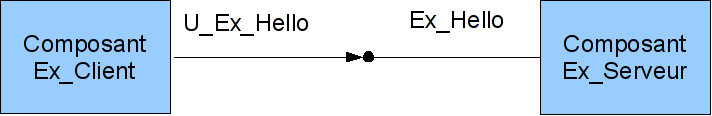

.. _progdsc:

Introduction au modèle de programmation DSC pour les composants Salomé
======================================================================

Cette introduction a pour objectif de fournir les notions essentielles pour utiliser 
l'extension DSC (Dynamic Software Component) dans des composants Salomé. Il est 
destiné aux développeurs d'applications Salomé qui doivent intégrer des codes de 
calculs sous la forme de composants Salomé ou de services du superviseur.

Le principe du modèle de programmation
----------------------------------------

Le modèle de programmation DSC est fourni par le noyau Salomé et est disponible 
non seulement pour les services mais aussi pour des composants Salomé sans supervision.
Une application Salomé qui souhaite utiliser l'extension DSC suit toujours ce principe :

1. Les différents programmes, codes, services qui composent l'application déclare 
   dans la phase d'initialisation les différents ports disponibles.
2. Ensuite le système (par exemple YACS ou un script utilisateur) connecte les 
   différents ports pour mettre en place les différentes communications entre les codes.
3. Les codes sont lancés. Lorsqu'ils souhaitent utiliser un de leur port DSC, le code 
   demande au système un pointeur vers son port. Le système vérifie alors que le port 
   a été bien connecté et/ou bien déclaré.
4. Les codes utilisent les ports DSC.

Apports de l'extension DSC
---------------------------------

Les apports principaux de l'extension DSC au modèle de programmation de Salomé sont les 
suivants:

1. Il permet de mettre en oeuvre les ports datastream dans Salomé.
2. Il permet d'utiliser l'outil de couplage Calcium au sein d'un schéma de calcul sans 
   dépendre de l'implémentation de Calcium hors Salomé. Une meilleure intégration de ce 
   type de ports est ainsi obtenue ainsi qu'une plus grande flexibilité dans les types de 
   données possibles.
3. Il offre la possibilité d'ajouter des ports de type interface dans des services.

Les ports de type interface
+++++++++++++++++++++++++++++

DSC permet d'ajouter des ports de type interface à des composants et donc à des 
services. Les ports datastream ne sont qu'une spécialisation de ces ports d'interfaces. 
Cette interface est décrite par le biais d'une interface CORBA. Elle doit donc être 
implémentée par un objet CORBA qui peut soit être le composant lui même ou un objet que 
le composant utilise.  A chaque port d'interface, des propriétés peuvent lui être 
attachées grace à un objet spécifique de configuration.

Les ports datastream Calcium
+++++++++++++++++++++++++++++

Le noyau Salomé propose une nouvelle implémentation des ports Calcium. Ces ports 
sont des ports d'interfaces, ils peuvent donc être utilisés comme les autres ports 
d'interfaces par le biais de l'API C++ ou ils peuvent être utilisés comme avec Calcium 
par le biais d'une interface C ou FORTRAN. Enfin, cette nouvelle implémentation a été 
réalisé avec le soucis de pouvoir porter une application Calcium très rapidement dans 
Salomé.

Les connexions entre les ports DSC
------------------------------------

Les ports DSC peuvent être entrant ou sortant. Les ports sortant sont appelés 
<< uses >> car ils permettent l'utilisation d'une interface externe au composant ou au 
service. Les ports entrant sont appelés << provides >> car ils fournissent l'implémentation 
de l'interface du port. 

Les ports des services sont décrits dans un fichier XML que le gestionnaire de 
catalogues lit lors de la création d'un schéma de calcul. En revanche les ports ne 
sont pas décrits dans la déclaration CORBA du service. C'est pourquoi ils sont créés 
et ajoutés dynamiquement lors de la création et de l'exécution du service (en comparaison
avec des modèles plus statiques tel que le CORBA Component Model). DSC ajoute des méthodes 
aux composants pour déclarer des ports d'interfaces.

::

  void add_provides_port(...);
  void add_uses_port(...);
  Ports::Port get_provides_port(...);
  uses_port get_uses_port(...);

Des méthodes sont fournies pour permettre la connexion de ports uses avec des ports 
provides du même type (c'est à dire de la même interface CORBA). De plus, DSC averti 
le code utilisateur des modifications des connexions des ses ports par le biais de méthodes 
de callback.

::

  void connect_provides_port(...);
  void connect_uses_port(...);
  boolean is_connected(...);
  void disconnect_provides_port(...);
  void disconnect_uses_port(...);
  void provides_port_changed(...);
  void uses_port_changed(...);

Les connexions entre les ports uses et provides permettent différentes combinaisons. Un port 
uses peut être connecté à plusieurs ports provides. De même un port provides peut être connecté 
à plusieurs ports uses. Enfin, les ports uses connaissent les ports provides auxquels ils 
s'adressent tandis que les ports provides ne connaissent pas à priori les ports uses qui les 
ont appelés (Il est évidemment possible de rajouter des informations applicatives).

Les deux couches de programmation
------------------------------------------------

Le modèle de composant DSC est divisé en deux parties : DSC_Basic et DSC_User. 

DSC_Basic est la couche basse de DSC. Elle fournit les fonctions de bases pour ajouter 
la notion de ports à un objet CORBA. Elle permet d'enregistrer les servants des ports provides,
déclarer des ports uses et les connecter. Il s'agit d'une couche dite basique car elle n'offre 
que peu de confort d'utilisation. Notamment, un port uses se présente sous la forme d'une 
séquence de références vers les ports provides auquel le port a été connecté. A charge à
l'utilisateur de gérer cette séquence et d'appeler manuellement les différentes ports provides 
lors de l'utilisation du port uses.

La couche DSC_User permet d'obtenir un plus haut niveau de programmation et d'encapsulation 
des ports. Tout d'abord, elle permet la création de services Salomé avec des ports datastream 
(ou d'interface) fournis par la plate-forme Salomé. Elle fournit une méthode d'initialisation 
que le superviseur va appeler avant l'exécution du service, méthode qui permet de déclarer 
correctement les ports des services. Enfin, elle offre une abstraction pour les ports uses et
provides. Les deux types de ports sont implémentés par des classes et l'utilisateur a ainsi
une vue uniforme des deux types ports : 2 classes (et non une séquence et une référence CORBA
comme dans la couche DSC_Basic). Un autre apport est la gestion automatique de la liste des 
ports provides connecté à un port uses. Le code utilisateur a une unique référence sur son 
port uses; à charge à l'implémentation du port uses de transmettre un appel vers les 
différentes connexions du port.

DSC par l'exemple
------------------------------------------------

Nous allons maintenant découvrir les principes de la programmation DSC par le biais de 
différents exemples.

Le premier exemple met en place un composant avec un port provides. 
Le deuxième exemple met en place un deuxième composant avec un port uses qui va être 
connecté au port provides de l'exemple Hello World.
Le troisième exemple montre comment utiliser les ports datastream dans des services.
Le quatrième exemple montre comment utiliser le système de fabrique des ports datastream 
pour ajouter sa propre famille dans le modèle de programmation.
Enfin le cinquième exemple montre comment utiliser la nouvelle implémentation Calcium dans le 
cadre de Salomé.

Les exemples ci-dessous montre des exemples de programmation des composants. En revanche,
ils ne contiennent pas tout le code, seule les nouvelles parties seront décrites dans ce 
document. Vous pourrez trouver tout le code des exemples dans le module Salomé DSC_EXEMPLE_SRC.

Les deux premiers exemples ont pour objectif de faire comprendre comment manipuler des ports 
DSC par le biais de la couche DSC_Basic.  En revanche, il faut étudier le troisième exemple 
pour pouvoir créer des services avec des ports DSC par le biais de la couche DSC_User.

Pour récupérer les exemples, il faut être autoriser à accéder à la base subversion du projet pal.
Il suffit ensuite dans un shell unix de taper la ligne suivante :

svn co svn://<nom>@nepal/PAL/DSC_EXEMPLES_SRC/trunk  DSC_EXEMPLES_SRC

Hello World
+++++++++++++

Les sources de cet exemple se trouve dans le répertoire src/Ex_Serveur.

L'objectif de cet exemple est de créer un composant qui fournit un port provides. 
La figure ci-dessous illustre ce que nous allons faire. Le composant s'appelle Ex_Serveur 
et il fournit un port provides nommé Ex_Hello. Ce port provides fournit l'interface HelloWorld.

.. image:: images/progdsc_img1.png

La première étape est de définir les interfaces du composant et l'interface du port :

::

 Interface HelloWorld : Ports::Port {
    void say_hello(in string name);
 };

 Interface Ex_Serveur : Engines::DSC {};

Le fichier IDL comprend tout d'abord la déclaration de l'interface du port provides que 
le composant va fournir. Il s'agit ici de l'interface HelloWorld. Cette interface est une
interface CORBA classique. En revanche, cette interface doit hériter de Ports ::Port pour
pouvoir être un port DSC. Le composant Ex_Serveur est aussi déclaré comme une interface CORBA 
qui hérite de l'interface Engines::DSC au lieu de Engines::Component. Il faut noter que le port
provides n'apparaît pas dans la définition IDL du composant. Le port est ajouté et déclaré 
dans les sources de l'implémentation du composant. Il est ajouté dynamiquement lors de 
l'exécution du composant.

Il s'agit maintenant d'implémenter le composant et le port provides. Le port provides est 
implémenté par le biais d'une classe C++ que nous appellerons HelloWorld_impl (voir dans 
les sources). Cette implémentation ne diffère en rien de celle d'un objet CORBA. Voici 
l'implémentation de la méthode say_hello :

::

 void 
 HelloWorld_i::say_hello(const char * name) { 
  std::cout << "Hello " << name << " ! " << std::endl;
 }

 
Il nous reste ensuite à implémenter le composant. Nous allons nous intéresser à la déclaration 
du port du composant et à la classe que le composant doit hériter. L'implémentation d'un 
composant (classe Ex_Serveur_i) qui veut utiliser des ports DSC doit hériter de la classe nommé 
Engines_DSC_i.. Bien entendu, elle doit aussi hériter de POA_Ex_Serveur.
Voici la déclaration de la classe Ex_Serveur_i :

::

 class Ex_Serveur_i :
  public Engines_DSC_i,
  public POA_Ex_Serveur
 {

  public:
    Ex_Serveur_i(CORBA::ORB_ptr orb,
		 PortableServer::POA_ptr poa,
		 PortableServer::ObjectId * contId, 
		 const char * instanceName, 
		 const char * interfaceName);

    virtual ~Ex_Serveur_i();
 ...
 };

Pour que le port provides soit utilisable, nous devons faire deux actions :
- Créer le port.
- Enregistrer le port dans le composant.

Pour réaliser ces deux étapes, nous ajoutons une méthode à la classe Ex_Serveur_i nommée 
register_ports() qui est appelé dans la fabrique du composant avant que celle-ci ne retourne 
la référence du composant au container. Cette méthode est implémentée de la façon suivante :

::

 void 
 Ex_Serveur_i::register_ports() {

 // Création du port provides
 _Ex_Hello_port = new HelloWorld_i();
 _Ex_Hello_port_properties = PortProperties_i();

 // Enregistrement du port provides
 add_provides_port(_Ex_Hello_port->_this(), 
		   "Ex_Hello",
		   _Ex_Hello_port_properties->_this());  
 }

La méthode commence par la création du port provides. Il s'agit ici de créer le servant de 
l'interface CORBA du port. Il faut aussi créer un objet pour les propriétés du port. Dans
cet exemple, l'objet par défaut est utilisé (fourni par le noyau). Ensuite le port est 
enregistré dans le composant par le biais de la méthode add_provides_port fourni par DSC.

Le fait d'hériter de Engines_DSC_i oblige le composant à implémenter deux méthodes qui se 
nomment provides_port_changed() et uses_port_changed(). Ces deux méthodes sont des callbacks 
que le système utilise pour avertir le composant lorsque les connexions de ses ports ont 
évolués. La méthode provides_port_changed() permet d'être averti lorsque quelqu'un se connecte 
ou se déconnecte sur un de ses ports provides. Le callback indique notamment combien de 
client utilise le port provides (argument connection_nbr). Pour cet exemple, nous ne tenons 
pas compte de cette information. La méthode uses_port_changed() a quand à elle la même 
fonction que provides_port_changed(), mais pour les ports uses. Nous verrons dans le deuxième
exemple ses spécificités.

La documentation des différentes méthodes Engines_DSC_i sont fournis dans la documentation 
Doxygen du noyau de Salomé.

Cet exemple peut être exécuté par le biais du fichier de test src/tests/test_Ex_Serveur.py 
dans l'intrepréteur Salomé en mode terminal. Ce script illustre l'utilisation des ports DSC :
 
::

 import LifeCycleCORBA
 import Engines
 import Ports
 import HelloWorld_idl

 lcc = LifeCycleCORBA.LifeCycleCORBA()
 component = lcc.FindOrLoad_Component('FactoryServer', 'Ex_Serveur')
 hello_port = component.get_provides_port("Ex_Hello", 0)
 hello_port.say_hello("andre")

Après la création du composant par le biais du LifeCycleCORBA, le script utilise la 
méthode get_provides_port pour obtenir une référence sur le port provides du composant.
La référence obtenue est ensuite utilisée pour exécuter la méthode say_hello du port.

Hello World Client
+++++++++++++++++++++

Les sources de cet exemple se trouve dans le répertoire src/Ex_Client et dans src/Ex_Serveur.

L'objectif de cet exemple est de créer un nouveau composant qui va utiliser le port Ex_Hello 
du précédent exemple par le biais d'un port uses.

Voici une figure qui représente l'application:

Le composant Ex_Client est décrit comme le composant Ex_Serveur dans le fichier IDL.
La seule différence est l'ajout dans son interface d'une méthode start(). Un composant 
ne contenant pas de fonction main lors de sa création, il nous faut une méthode pour lancer 
l'exécution du composant, d'où la définition de la méthode start. 

Voici la définition IDL du composant Ex_Client :

::

  Interface HelloWorld : Ports::Port {
      void say_hello(in string name);
  };

  Interface Ex_Serveur : Engines::DSC {};

  Interface Ex_Client : Engines::DSC {
      void start() ;
  } ;

Il faut maintenant implémenter le composant. Comme pour un port provides, un port uses 
doit être enregistré dans le composant avant qu'il ne soit utilisable par le composant. 
Un port uses correspond à une séquence de références vers les ports provides auxquels il 
a été connecté ; c'est pourquoi il n'est pas implémenté par une classe comme un port 
provides. En revanche, il est toujours possible d'ajouter des propriétés au port.
Voici le code de la méthode register_ports() pour le composant Ex_Client :

::

  void 
  Ex_Client_i::register_ports() {

    // Création de l'objet propriété pour le port uses.
    _U_Ex_Hello_port_properties = new PortProperties_i();

   // Ajout du port uses dans le composant
    add_uses_port("IDL:HelloWorld:1.0", 
     "U_Ex_Hello", 
     _U_Ex_Hello_port_properties->_this());

  }

Un port uses est associé à un type d'objet CORBA. La déclaration de ce type permet de 
vérifier si le port uses est connecté à un port provides compatible. Dans cet exemple, 
le type du port (déclaré dans l'IDL) est HelloWorld. CORBA propose pour chaque type IDL
une chaîne de caractère correspondant à ce type. Dans cet exemple il s'agit de :  
IDL:HelloWorld:1.0.

Il faut maintenant pouvoir utiliser le port uses. Pour cela, le composant demande au 
système de récupérer le port uses par le biais de la méthode get_uses_port(). Le port
prend la forme d'une séquence de référence sur les différents ports provides. Les références 
contenues dans cette séquence sont les ports provides auxquels le port uses a été connecté
à l'instant de l'appel de la méthode get_uses_port(). A chaque changement sur cette liste 
de référence, que ce soit un ajout ou un retrait, le système utilise la 
méthode use_port_changed() pour avertir le code utilisateur.

La méthode start() du composant Ex_Client va récupérer le port uses U_Ex_Hello et va 
appeler la méthode say_hello() sur la première référence. Voici le code de cette méthode :

::

  void 
  Ex_Client_i::start() {

   // Récupération du port ues U_Ex_Hello
   Engines::DSC::uses_port * uport = get_uses_port("U_Ex_Hello"); 

   // Récupération de la première référence de la séquence
   _Ex_Hello_provides_port =  HelloWorld::_narrow((* uport)[0]);

   // Appel de la méthode sur le port
   _Ex_Hello_provides_port->say_hello(_instanceName.c_str());
  }

Il faut noter qu'il faut transformer par le biais de la méthode _narrow les références 
contenues dans le port uses dans le type du port provides pour pouvoir utiliser le port provides.

Ports datastream et services
++++++++++++++++++++++++++++++

Les sources de cet exemple se trouve dans le répertoire src/Ex_ProducteurConsommateur.

L'objectif de cet exemple est double. Tout d'abord, l'exemple montre comment mettre en 
oeuvre un service qui veut utiliser des ports DSC. Ensuite, il montre comment utiliser 
les ports datastream inclus dans le noyau de Salomé. 

Cet exemple met en place deux services qui vont être connectés par un port datastream. 
Le service produit du composant Producteur va produire un flux de donnée, et le composant 
consomme du composant Consommateur va afficher des données. 

Le service produit se termine lorsqu'il a envoyé toutes les données qu'il doit produire.
Le nombre de données à produire est déterminé par le port dataflow nombre. Le service 
consommateur a quand à lui besoin de connaître combien de données il doit récupérer avant
de se terminer. Ce nombre est, comme pour le service produit, déterminé par le port dataflow
nombre.

Voici la définition IDL des deux composants :

::

  interface Producteur : Engines::Superv_Component {
    void produit(in long nombre);
  };

  interface Consommateur : Engines::Superv_Component {
    void consomme(in long nombre);
  };

Pour déclarer un composant qui va contenir des services utilisant des ports DSC, le composant 
doit hériter de l'interface Engines::Superv_Component et non plus de l'interface 
Engines::Component. En plus d'ajouter au composant l'interface de DSC,
Engines::Superv_Component ajoute la méthode init_service() qui est appelé par le
superviseur avant l'exécution du service. L'objectif de cette méthode est de permettre au 
concepteur du service d'initialiser les ports du service en vu de leur connexion avant le 
lancement effectif du service. Par rapport aux exemples précédents, init_service() a la même 
fonction que register_ports().

Il s'agit maintenant d'implémenter ces deux composants. La première différence avec un 
composant classique est qu'il faut hériter de la classe Superv_Component_i. De plus, il 
faut implémenter la méthode init_service().

Voici l'implémentation de la méthode init_service du composant Producteur : 

::

  CORBA::Boolean
  Producteur_i::init_service(const char * service_name) {
    CORBA::Boolean rtn = false;
    string s_name(service_name);
    if (s_name == "produit") {
      add_port("BASIC_short", "uses", "produit_port");
      rtn = true;
    }  
    return rtn;
  }

La couche DSC_User qui implémente la classe Superv_Component_i fournit de nouvelles méthodes 
pour l'ajout des ports uses et provides. Il s'agit des méthodes de la famille add_port (Voir 
la documentation doxygen de Salomé). Ces méthodes ont pour objectif de permettre la création 
et l'enregistrement d'un port du service en une seule étape. De plus, elles permettent 
d'utiliser les ports datastream prédéfinis dans le noyau Salomé. 

Dans le cas du service produit, nous avons choisi d'utiliser le port datastream BASIC_short. 
Lorsque le noyau Salomé fournit un port datastream, il fournit toujours l'implémentation pour 
le port provides et pour le port uses. La première partie du nom (BASIC) identifie la famille 
de port datastream (comme CALCIUM ou PALM par exemple). La deuxième partie du nom contient le 
type de donnée transmis, dans cet exemple, un short. Ce type de port constitue le premier 
paramètre de la méthode add_port. Les deux autres arguments sont le type de port DSC (uses ou 
provides) et le nom du port dans le composant.

Lorsqu'il va s'agir d'utiliser ce port dans le service, il va falloir, comme dans les exemples 
précédent, récupérer une référence sur le port. Pour cela de nouvelles méthodes nommées 
get_port sont disponibles (à l'image des add_port). Voici un exemple de code pour utiliser 
la méthode get_port :

::

  uses_port * my_port = NULL;
  get_port(my_port, "produit_port");
  if (my_port != NULL) {
   for (CORBA::Long i = 0; i < nombre; i++) {
     data_short_port_uses * the_port = dynamic_cast<data_short_port_uses * >(my_port);
        the_port->put(10);
   }
  }

La méthode get_port a deux arguments. Le premier va contenir un pointeur vers le port et le 
deuxième indique le nom du port demandé. Après l'appel de la méthode get_port, un pointeur 
générique est obtenu. On change ensuite son type avec le type de port attendu par le biais 
d'un dynamic_cast. Il est alors possible d'utiliser le port.

Pour permettre plus de commodité dans la programmation, la couche DSC_User propose plusieurs 
signatures pour les méthodes get_port et add_port. Par exemple, le composant Consommateur 
utilise les versions template de ces méthodes pour l'ajout et la récupération du code.

::

  data_short_port_provides * my_port = NULL;
  my_port = get_port<data_short_port_provides>("consomme_port");
  if (my_port != NULL)
  {
    for (CORBA::Long i = 0; i < nombre; i++) {
       cout << "Hello, I receive : " << my_port->get() << endl;
    }
  }

La liste des différents types de ports fournis par le Noyau de Salomé est disponible dans 
la documentation Doxygen du noyau Salomé.

Ajouter des ports datastream et/ou d'interfaces
+++++++++++++++++++++++++++++++++++++++++++++++++

Les sources de cet exemple se trouve dans le répertoire src/Ex_ProducteurConsommateur_Adv.

L'objectif de cet exemple est de montrer les mécanismes pour ajouter ces propres types de 
ports dans la couche DSC_User. Pour cela, cet exemple explique comment remplacer le port 
BASIC_short de l'exemple précédent par son propre port. Etant donné que cet exemple est 
quasiment identique au niveau des composants, nous nous intéresserons uniquement dans ce 
document à la déclaration et l'implémentation du port.

Une famille de port Datastream (ou d'interface) contient deux types d'objets différents:

1. Une fabrique.
2. L'implémentation des ports.

La couche DSC_User connaît les types de port Datastream par le biais du design pattern 
fabrique. Pour chaque famille, une fabrique est enregistrée à la création du composant. 
Elle est ensuite utilisée par le composant dans les méthodes add_port(...) pour créer et 
enregistrer les ports.

Tout d'abord, il faut déclarer dans un fichier IDL (MesPorts.idl dans l'exemple) son ou ses 
ports :

::

  module Ports {
    module Mes_Ports {
      interface Mon_Type_De_Port : Ports::Data_Port {
        boolean is_new_data_available();
      };
      interface Short_Mes_Ports : Mon_Type_De_Port {
        void put(in short data);
      };
    };
  };

Dans cet exemple on déclare un port : Short_Mes_Ports. Il s'agit d'un port qui permet 
d'envoyer un short, mais également qui peut être interrogé pour savoir si une nouvelle 
donnée est arrivée. En revanche la méthode get() n'est pas déclaré dans l'IDL (bien que 
ce soit possible) car elle uniquement destinée à être utilisé en local.

Il faut maintenant implémenter le type de port. Pour cela, il faut implémenter la fabrique 
et la partie uses et la partie provides du type de port.

Une fabrique de port est un objet qui implémente l'interface de la classe abstraite 
port_factory (voir la documentation Doxygen). La fabrique est appelée à chaque fois qu'un 
service ajoute un port dans le composant (uses ou provides). La fabrique est identifiée par
une chaîne de caractère qui l'identifie auprès du composant. L'enregistrement des fabriques 
doit se faire au plus tôt. C'est pourquoi les fabriques sont enregistrées dans le constructeur 
du composant.

La figure suivante montre l'enregistrement de la fabrique dans le composant ProducteurAdv :

::

  ProducteurAdv_i::ProducteurAdv_i(CORBA::ORB_ptr orb,
                                   PortableServer::POA_ptr poa,
                                   PortableServer::ObjectId * contId, 
                                   const char * instanceName, 
                                   const char * interfaceName) :
    Superv_Component_i(orb, poa, contId, instanceName, interfaceName)
  {
    _thisObj = this;
    _id = _poa->activate_object(_thisObj);

    register_factory("MESPORTS", new mes_ports_factory());
  }

Dans cet exemple, le nouveau type de port est identifié par la chaîne MESPORTS. Il faut 
noter qu'il est interdit d'utiliser le symbole << _ >> dans  le nom. En effet, il sert de 
séparateur entre le nom de la famille et le type du port dans la famille (Ex : MESPORTS_short).

Il reste à implémenter les ports. Pour chaque port défini dans l'IDL, il faut implémenter 
la partie uses port et la partie provides port. L'implémentation côté uses doit hériter de 
la classe uses_port. Du côté provides, il faut hériter de la classe provides_port.

Les classes uses_port et provides_port sont des classes abstraites. Elles proposent des 
méthodes qui permettent d'automatiser l'enregistrement et la gestion des ports. Dans la couche 
DSC_Basic, c'est le développeur du composant qui doit implémenter ces mécanismes tandis que 
dans la couche DSC_User c'est au développeur des ports de se charger de ces fonctionnalités.

Les méthodes sont les suivantes :

::

  Pour le côté uses : 

  virtual const char * get_repository_id() = 0;

  virtual void uses_port_changed(Engines::DSC::uses_port * new_uses_port,
                                     const Engines::DSC::Message message) = 0;

  Pour le côté provides :

  virtual Ports::Port_ptr get_port_ref() = 0;

  virtual void provides_port_changed(int connection_nbr,
                                         const Engines::DSC::Message message) {};

Du côté uses, il y a tout d'abord la méthode get_repository_id(). Elle permet d'obtenir 
le typecode CORBA du port. Il s'agit de fournir la même information que le premier argument 
de add_uses_port de la couche Basic. La méthode uses_port_changed(…) permet au port d'être 
averti des nouvelle connexions avec des port provides et de gérer la liste des connexions.

Du côté provides, get_port_ref() permet d'obtenir une référence CORBA sur le servant. Enfin 
la méthode provides_port_changed(…) peut être surdéfini si le port provides utilise 
l'information provenant des connexions/déconnexions.

Dans l' exemple, le port provides est implémenté par la classe data_short_mes_ports_provides 
et  le port uses est implémenté par la classe data_short_mes_ports_uses.

                                         
