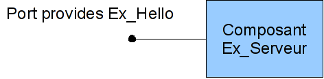

.. _progdsc:

Introduction to the DSC programming model for SALOME components
======================================================================

The purpose of this introduction is to provide essential concepts about how to use the DSC (Dynamic Software Component) 
extension in SALOME components.  It is intended for SALOME application developers who need to integrate calculation 
codes in the form of SALOME components or supervisor services.

The principle of the programming model
----------------------------------------
The DSC programming model is provided by the SALOME kernel and is available not only for services but also for 
SALOME components without supervision.  A SALOME application that would like to use the DSC extension always 
follows this principle:

1. The different programs, codes and services that make up the application declare the various available ports 
   during the initialization phase.
2. The system (for example YACS or a user script) then connects the different ports to set up the different 
   communications between the codes.
3. The codes are run.  When they want to use one of their DSC ports, the code asks to the system for a pointer 
   to its port. The system then checks that the port has been properly connected and/or properly declared.
4. The codes use the DSC ports.

Benefits of the DSC extension
---------------------------------
The main benefits of the DSC extension to the SALOME programming model are as follows:

#. It enables use of datastream ports in SALOME
#. It enables use of the Calcium coupling tool in a calculation scheme without depending on the implementation of 
   Calcium outside SALOME.  This results in better integration of this type of port, and greater flexibility in possible data types.
#. It offers the possibility of adding interface type ports into services.

Interface type ports
+++++++++++++++++++++++++++++
DSC can add interface type ports to components and therefore to services.  The datastream ports are nothing more 
than a specialization of these interface ports.  This interface is described through a CORBA interface.  
Therefore it must be implemented by a CORBA object that may be either the component itself or an object that the 
component uses.  Properties may be attached to each interface port through a specific configuration object.

Calcium datastream ports
+++++++++++++++++++++++++++++
The SALOME kernel proposes a new implementation of Calcium ports.  These ports are interface ports, therefore they can 
be used like other interface ports by means through the C ++ API, or they can be used in the same way as with Calcium 
through a C or FORTRAN interface.  Finally, this new implementation was made with the objective of being able to port a 
Calcium application into SALOME very quickly.

Connections between DSC ports
------------------------------------
DSC ports may be input or output ports.  Output ports are called <<uses>> because they enable the use of an interface 
external to the component or the service.  Input ports are called <<provides>> because they provide the implementation 
of the port interface.

Service ports are described in an XML file that the catalog manager reads during creation of a calculation scheme.  
On the other hand, ports are not described in the CORBA declaration of the service.  This is why they are created and 
added dynamically when the service is created and executed (in comparison with more static models like the CORBA Component Model).  
DSC adds methods to components to declare interface ports.

::

  void add_provides_port(...);
  void add_uses_port(...);
  Ports::Port get_provides_port(...);
  uses_port get_uses_port(...);

Methods are provided to enable the connection of uses ports with provides ports of the same type (in other words 
with the same CORBA interface).  Furthermore, DSC notifies the user code about modifications to connections of 
its ports through callback methods.

::

  void connect_provides_port(...);
  void connect_uses_port(...);
  boolean is_connected(...);
  void disconnect_provides_port(...);
  void disconnect_uses_port(...);
  void provides_port_changed(...);
  void uses_port_changed(...);

Different combinations of connections between uses ports and provides ports are possible.  A uses port may be connected 
to several provides ports.  Similarly, a provides port may be connected to several uses ports.  Finally, uses ports know 
the provides ports that they address, while a priori provides ports do not know the uses ports that called 
them (obviously, application information can be added).

The two programming layers
------------------------------------------------
The DSC component model is divided into two parts:  DSC_Basic and DSC_User.

DSC_Basic is the lower layer of DSC.  It provides the basic functions to add the concept of ports to a CORBA object.  
It can be used to record servants of provides ports, declare uses ports and connect them.  It is a so-called basic layer 
because it does not provide much user convenience.  In particular, a uses port is in the form of a sequence of references 
to provides ports to which the uses port has been connected.  The user is responsible for managing this sequence and 
manually calling the different provides ports when uses ports are being used.

The DSC_User layer give a higher programming and encapsulation level of ports.  Firstly, it enables the creation of 
SALOME services with datastream (or interface) ports supplied by the SALOME platform.  It provides an initialisation 
method that the supervisor will call before the service is executed, which makes it possible to declare service ports 
correctly.  Finally, it offers abstraction for uses and provides ports.  The two types of ports are implemented 
by classes and the user thus has a uniform view of the two port types:  2 classes (and not one sequence and 
one CORBA reference as in the DSC_Basic layer).  Another benefit is the automatic management of the list of provides ports 
connected to a uses port.  The user code has a unique reference on its uses port;  the uses port implementation is then 
responsible for transmitting a call to the different port connections.

DSC through examples
------------------------------------------------
We will now discover the principles of DSC programming through different examples.

The first example sets up a component with a provides port.  The second example sets up a second component 
with a uses port that will be connected to the provides port in the Hello World example.  
The third example shows how datastream ports are used in services.  
The fourth example shows how the datastream ports factory system is used to add its own family in the programming model.  
Finally, the fifth example shows how the new Calcium implementation is used in the SALOME context.

The following examples show examples of component programming.  On the other hand, they do not contain the entire code, this 
document only describes the new parts.  The entire code for the examples is contained in the SALOME DSC_EXAMPLE_SRC module.

The first two examples are intended to help understand how the DSC ports are manipulated through the DSC_Basic layer.  
On the other hand, the third example will have to be studied to see how services can be created with DSC ports through the DSC_User layer.

Access to the subversion base of the pal project must be authorised before the examples can be retrieved.  
Then type the following line in a Unix shell::

  svn co svn://<nom>@nepal/PAL/DSC_EXEMPLES_SRC/trunk  DSC_EXEMPLES_SRC

Hello World
+++++++++++++

The sources for this example are given in the src/Ex_Serveur directory.

The objective of this example is to create a component that provides a provides port.  The following figure 
illustrates the procedure.  The component is called Ex_Serveur and it provides a provides port named Ex_Hello.  
This provides port provides the HelloWorld interface.

The first step is to define interfaces of the component and the port interface:

::

 Interface HelloWorld : Ports::Port {
    void say_hello(in string name);
 };

 Interface Ex_Serveur : Engines::DSC {};

The IDL file comprises firstly the declaration of the provides port interface that the component will provide.  
In this case it is the HelloWorld interface.  This interface is a classical CORBA interface.  On the other hand, this 
interface must inherit from Ports::Port if it is to be a DSC port.  The Ex_Serveur component is also declared 
as a CORBA interface that inherits from the Engines::DSC interface instead of Engines::EngineComponent.  
Note that the provides port does not appear in the IDL definition of the component.  The port is added and 
declared in implementation sources of the component.  It is added dynamically when the component is executed.
 
The objective now is to implement the component and the provides port.  The provides port is implemented 
through a C++ class that we will call HelloWorld_impl (see in the sources).  This implementation is in no way 
different from the implementation of a CORBA object.  See the implementation of the say_hello method:

::

 void 
 HelloWorld_i::say_hello(const char * name) { 
  std::cout << "Hello " << name << " ! " << std::endl;
 }

 
The next step is to implement the component.  We will be interested in the declaration of the component port 
and the class that the component must inherit.  The implementation of a component (Ex_Serveur_i class) that wants 
to use DSC ports must inherit from the class named Engines_DSC_i.  Obviously, it must also inherit from POA_Ex_Serveur.  
See the declaration for Ex_Serveur_i class:

::

 class Ex_Serveur_i :
  public Engines_DSC_i,
  public POA_Ex_Serveur
 {

  public:
    Ex_Serveur_i(CORBA::ORB_ptr orb,
                 PortableServer::POA_ptr poa,
                 PortableServer::ObjectId * contId, 
                 const char * instanceName, 
                 const char * interfaceName);

    virtual ~Ex_Serveur_i();
 ...
 };

Two actions have to be performed before the provides port can be used:

1. Create the port 
2. Save the port in the component.

These two steps are implemented by adding a method called register_ports() to the Ex_Serveur_i class that is 
called in the component factory before the factory returns the reference of the component to the container.  
This method is implemented as follows:

::

 void 
 Ex_Serveur_i::register_ports() {

 // Create the provides port
 _Ex_Hello_port = new HelloWorld_i();
 _Ex_Hello_port_properties = new PortProperties_i();

 // Save the provides port
 add_provides_port(_Ex_Hello_port->_this(), 
                   "Ex_Hello",
                   _Ex_Hello_port_properties->_this());  
 }

The method begins with creation of the provides port.  The objective is to create the servant of the CORBA 
interface of the port.  An object also has to be created for port properties.  The default object is used in 
this example (supplied by the kernel).  The port is then registered in the component through the 
add_provides_port method provided by DSC.

The fact of inheriting from Engines_DSC_i obliges the component to implement two methods that are called 
provides_port_changed() and uses_port_changed().  These two methods are callbacks that the system uses to notify 
the component when the connections of its ports have changed.  With the provides_port_changed() method, a warning 
can be obtained when someone connects or disconnects on one of its provides ports.  
In particular, the callback indicates how many clients use the provides port (connection_nbr argument).  
This information is not used in this example.  The uses_port_changed() method performs the same function as 
the provides_port_changed() function, but for uses ports.  The specific features will be described in the second example.

The documentation for the different Engines_DSC_i methods are provided in the Doxygen documentation of the SALOME kernel.

This example can be executed through the src/tests/test_Ex_Serveur.py test file, in the SALOME interpreter in terminal mode.  
This script illustrates the use of DSC ports:

::

 import LifeCycleCORBA
 import Engines
 import Ports
 import HelloWorld_idl

 lcc = LifeCycleCORBA.LifeCycleCORBA()
 component = lcc.FindOrLoad_Component('FactoryServer', 'Ex_Serveur')
 hello_port = component.get_provides_port("Ex_Hello", 0)
 hello_port.say_hello("andre")

After the component has been created through LifeCycleCORBA , the script uses the get_provides_port method 
to obtain a reference on the provides port of the component.  
The reference obtained is then used to execute the say_hello method for the port.

Client Hello World 
+++++++++++++++++++++
The sources in this example are located in the src/Ex_Client directory and in src/Ex_Serveur.

The purpose of this example is to create a new component that will use the Ex_Hello port in the previous example, through a uses port.

The following figure represents the application:

.. image:: images/progdsc_img2.png
     :align: center

The Ex_Client component is described in the same way as the Ex_Serveur (Ex_Server) component in the IDL file.  
The only difference is that a start() method is added in its interface.  Since a component does not contain a 
main function when it is created, a method to start execution of the component is required, which is why the 
start method is defined.

The following is the IDL definition of the Ex_Client component:

::

  Interface HelloWorld : Ports::Port {
      void say_hello(in string name);
  };

  Interface Ex_Serveur : Engines::DSC {};

  Interface Ex_Client : Engines::DSC {
      void start() ;
  } ;

The component now has to be implemented.  As for a provides port, a uses port must be recorded in a component before 
it can be used by the component. The uses port corresponds to a sequence of references to the provides ports to which 
it has been connected:  this is why it is not implemented by a class like a provides port.  On the other hand, it is 
always possible to add properties to the port.  
The code for the register_ports() method for the Ex_Client component is given below:

::

  void 
  Ex_Client_i::register_ports() {

    // Create the properties object for the uses port.
    _U_Ex_Hello_port_properties = new PortProperties_i();

   // Add the uses port into the component
    add_uses_port("IDL:HelloWorld:1.0", 
     "U_Ex_Hello", 
     _U_Ex_Hello_port_properties->_this());

  }

A uses port is associated with a CORBA object type.  Declaration of this type verifies if the uses port is 
connected to a compatible provides port.  In this example, the type of port (declared in the IDL) is HelloWorld.  
CORBA proposes a character string corresponding to this type for each IDL type.  
In this example, it is IDL:HelloWorld:1.0.

We now need to be able to use the uses port.  To achieve this, the component asks the system to retrieve 
the uses port using the get_uses_port() method.  The port is in the form of a reference sequence on the different 
provides ports.  The references contained in this sequence are the provides ports to which the uses port has been 
connected at the time that the get_uses_port() was called.  The system uses the use_port_changed() method to 
notify the user code every time that this reference list is changed to include an addition or a removal.

The Ex_Client component start() method will retrieve the U_Ex_Hello uses port and will call the say_hello() method 
on the first reference.  The code for this method is given below:

::

  void 
  Ex_Client_i::start() {

   // Retrieve the uses port U_Ex_Hello
   Engines::DSC::uses_port * uport = get_uses_port("U_Ex_Hello"); 

   // Retrieve the first reference in the sequence
   _Ex_Hello_provides_port =  HelloWorld::_narrow((* uport)[0]);

   // Call the method on the port
   _Ex_Hello_provides_port->say_hello(_instanceName.c_str());
  }

Note that the _narrow method has to be used to transform the references contained in the uses port 
into the provides port type, before the provides port can be used.

Datastream ports and services
++++++++++++++++++++++++++++++
The sources in this example are located in the src/Ex_ProducteurConsommateur directory.

There are two purposes to this example.  Firstly, the example shows how a service that wants to use DSC ports 
is implemented.  It then shows how datastream ports included in the SALOME kernel are used.

This example sets up two services that will be connected through a datastream port.  The "produit" service of the 
"Producteur" component will produce a dataflow, and the "consomme" service of the "Consommateur" component will display data.

The "produit" service terminates when it has sent all data that it has to produce.  The number of data to be produced 
is determined by the "nombre" dataflow port.  The "consommateur" service needs to know how many data it has to retrieve before 
it can terminate.  As for the product service, this number is determined by the "nombre" dataflow port.

The following is the IDL definition of the two components:

::

  interface Producteur : Engines::Superv_Component {
    void produit(in long nombre);
  };

  interface Consommateur : Engines::Superv_Component {
    void consomme(in long nombre);
  };

In order to declare a component that will contain services using DSC ports, the component must inherit 
from the Engines::Superv_Component interface and no longer from the Engines::EngineComponent interface. 
In addition to adding the DSC interface to the component, Engines::Superv_Component adds the 
init_service() method that the supervisor calls before the service is executed. The purpose of this 
method is to enable the service designer to initialise ports for the service for connection before 
the service is actually started. init_service() performs the same function as register_ports() in 
the previous examples.

The next step is to implement these two components.  The first difference from a classical component is that it 
must inherit from the Superv_Component_i class. It must also implement the init_service() method.

The following is the implementation of the init_service method for the "Producteur" component:

::

  CORBA::Boolean
  Producteur_i::init_service(const char * service_name) {
    CORBA::Boolean rtn = false;
    string s_name(service_name);
    if (s_name == "produit") {
      add_port("BASIC_short", "uses", "produit_port");
      rtn = true;
    }  
    return rtn;
  }

The DSC_User layer that implements the Superv_Component_i class provides new methods for adding uses and provides ports.  
They are methods of the add_port family (See the SALOME doxygen documentation).  The purpose of these methods 
is to enable creation and recording of a service port in a single step.  They also enable the use of 
datastream ports predefined in the SALOME kernel.

We chose to use the BASIC_short datastream port for the "produit" service.  When the SALOME kernel provides 
a datastream port, it always provides the implementation for the provides port and for the uses port.  
The first part of the name (BASIC) identifies the datastream port family (for example like CALCIUM or PALM).  
The second part of the name contains the transmitted data type, in this case a short.  This port type forms 
the first parameter of the add_port method.  The other two arguments are the type of DSC port (uses or provides) 
and the name of the port in the component.

When the objective is to use this port in the service, it will be necessary to retrieve a reference on the port, in the 
same way as in the previous examples.  New methods (like add_port) called get_port are available for this purpose.  
The following is an example of code to use the get_port method:

::

  uses_port * my_port = NULL;
  get_port(my_port, "produit_port");
  if (my_port != NULL) {
   for (CORBA::Long i = 0; i < nombre; i++) {
     data_short_port_uses * the_port = dynamic_cast<data_short_port_uses * >(my_port);
        the_port->put(10);
   }
  }

The get_port method has two arguments.  The first will contain a pointer to the port and the second indicates 
the requested port name.  A generic pointer is obtained after calling the get_port method.  The next step 
is to change its type with the expected port type through a dynamic_cast.  The port can then be used.

The DSC_User layer offers several signatures for the get_port and add_port methods, to make programming 
more convenient.  For example, the "Consommateur" component uses the template versions of these methods 
to add and retrieve code.

::

  data_short_port_provides * my_port = NULL;
  my_port = get_port<data_short_port_provides>("consomme_port");
  if (my_port != NULL)
  {
    for (CORBA::Long i = 0; i < nombre; i++) {
       cout << "Hello, I receive : " << my_port->get() << endl;
    }
  }

The list of the different port types supplied by the SALOME kernel is available in the 
Doxygen documentation for the SALOME kernel.

Add datastream ports and/or interfaces
+++++++++++++++++++++++++++++++++++++++++++++++++
The sources for this example are located in the src/Ex_ProducteurConsommateur_Adv directory.

The purpose of this example is to show mechanisms used to add your specific types of ports into 
the DSC_User layer.  To do this, this example explains how to replace the BASIC_short port in the previous 
example by its own port.  Considering that the components in this example are practically identical, we will 
only describe the declaration and implementation of the port in this document.

A Datastream port (or interface) family contains two different types of objects:

1.  A factory
2.  The implementation of ports

The DSC_User layer knows the types of Datastream ports through the factory pattern design.  
For each family, a factory is recorded when the component is created.  It is then used by 
the component in the add_port(...) methods to create and save ports.

Firstly, its port(s) must be declared in an IDL file (MesPorts.idl in the example):

::

  module Ports {
    module Mes_Ports {
      interface Mon_Type_De_Port : Ports::Data_Port {
        boolean is_new_data_available();
      };
      interface Short_Mes_Ports : Mon_Type_De_Port {
        void put(in short data);
      };
    };
  };

In this example, a port is declared:  Short_Mes_Ports.  This is the port that is used to send a short, but 
that can also be queried to find out if new data have arrived.  On the other hand, the get() method has not 
been declared in the IDL (although it is possible) because it is intended to be used locally.

The next step is to implement the port type.  This is done by implementing the factory and the uses part 
and the provides part of the port type.

A port factory is an object that implements the interface of the port_factory abstract class (see the Doxygen documentation).  
The factory is called every time that a service adds a port in the component (uses or provides).  
The factory is identified by a character string that identifies it to the component.  The factories 
must be recorded as early as possible.  This is why factories are recorded in the component constructor.

The following figure shows how the factory is registered in the ProducteurAdv component:

::

  ProducteurAdv_i::ProducteurAdv_i(CORBA::ORB_ptr orb,
                                   PortableServer::POA_ptr poa,
                                   PortableServer::ObjectId * contId, 
                                   const char * instanceName, 
                                   const char * interfaceName) :
    Superv_Component_i(orb, poa, contId, instanceName, interfaceName)
  {
    _thisObj = this;
    _id = _poa->activate_object(_thisObj);

    register_factory("MESPORTS", new mes_ports_factory());
  }

In this example, the new port type is identified by the MESPORTS string.  Note that the <<_>> symbol 
may not be used in the name.  It is used as a separator between the family name and the port type in the family (Eg: MESPORTS_short).

The next step is to implement the ports.  The uses port part and the provides port part have to be implemented 
for each port defined in the IDL.  The implementation at the uses end must inherit from the uses_port class.  
At the provides end, it must inherit from the provides_port class.

The uses_port and provides_port classes are abstract classes.  They propose methods to automate registering 
and management of ports.  The component developer must implement these mechanisms in the DSC_Basic layer, while 
the ports developer is responsible for these functions in the DSC_User layer.

The following methods are used:

::

  For the uses end:

  virtual const char * get_repository_id() = 0;

  virtual void uses_port_changed(Engines::DSC::uses_port * new_uses_port,
                                     const Engines::DSC::Message message) = 0;

  For the provides end:

  virtual Ports::Port_ptr get_port_ref() = 0;

  virtual void provides_port_changed(int connection_nbr,
                                         const Engines::DSC::Message message) {};

The first step at the uses end is to use the get_repository_id() method.  This obtains the CORBA typecode of the port.  
The objective is to provide the same information as the first add_uses_port argument in the Basic layer.  
The uses_port_changed(...) method enables the port to be notified about new connections with the provides port 
and to manage the list of connections.

At the provides end, get_port_ref() obtains a CORBA reference on the servant.  Finally, the provides_port_changed(...) method 
can be overdefined if the provides port uses the information originating from connections / disconnections.

In the example, the provides port is implemented by the data_short_mes_ports_provides class and 
the uses port is implemented by the data_short_mes_ports_uses class.

