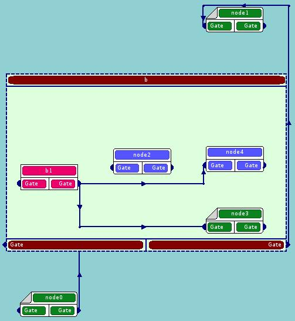

Representation of a schema
==========================

.. _change_2d_representation_schema:

Change 2D representation of a schema
------------------------------------
The schema consists of several nodes of control and computation types. These nodes have input and output data, stream and control ports. Connecting these ports by links means transferring data from output port to input port of a next node.

At the current moment YACS GUI for SALOME 4.1 provides the user with two view modes of a schema.

.. _full_view_of_a_schema:

+ **Full view.** Nodes are "fully" displayed, with all ports and information labels. All links between connected ports are shown.

.. image:: images/functionality_list_77.jpg
  :align: center

.. centered::
  **Full view of a schema**

.. _control_view_of_a_schema:

+ **Control view.** Only control links between connected ports are shown. presentation of nodes are simplified in order to show only the name of a node and its input/output gate ports.

.. centered::
  **Control view of a schema**

It's worth mentioning about two additional view modes of a schema which is planned to implement in the future version of YACS module.

+ **Data Flow view.** Only data links between connected ports are shown.

+ **Data Stream view.** Only stream links between connected ports are shown.

To change the current view mode of the active schema the user should activate Input Panel with the :ref:`pp_for_schema`, choose **Full** or **Control** view mode inside the "View Mode" radio button group and press "Apply" button on the Input Panel. The easier way to change view mode of the active schema is to click **Full View** or **Control View**
buttons on the :ref:`visualization`.

Within YACS module the user also can zoom-in and zoom-out 2D schema presentation interactively with the mouse, fit 2D presentation of a schema into 2D Viewer bounds ("Fit all" operation) and pan content of 2D Viewer ("Panning" operation) interactively with the mouse. These commands are accessible from :ref:`View Operations toolbar <view_operations_toolbar>`.

.. _auto-arrange_nodes:

Auto-arrange schema nodes
-------------------------
It is a very useful operation, because of it simplifies the schema presentation in the schema 2D Viewer and makes it easier for the user perception. This operation is applicable to the whole graph.

The auto-arrange graph nodes operation can be performed with help of **Arrange nodes** command from :ref:`visualization` and is applicable to the active schema (see :ref:`set_active_schema_or_run` section). YACS module arranges graph nodes automatically with help of an algorithm bases
on the usage of dot algorithm from Graphviz C API library.

.. _rebuild_links:

Rebuild links between nodes
---------------------------
It is a very useful operation, because of it simplifies the schema presentation in the schema 2D Viewer and makes it easier for the user perception. This operation constructs links in orthogonal mode.

The rebuild links between nodes operation can be performed with help of **Rebuild links** command from :ref:`visualization` and is applicable to the active schema (see :ref:`set_active_schema_or_run` section). YACS GUI rebuilds graph links automatically with help of LineConn2D algorithm
already implemented by OCC.

