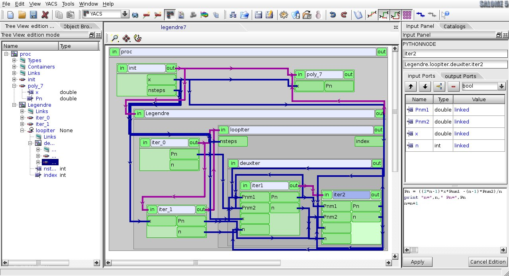
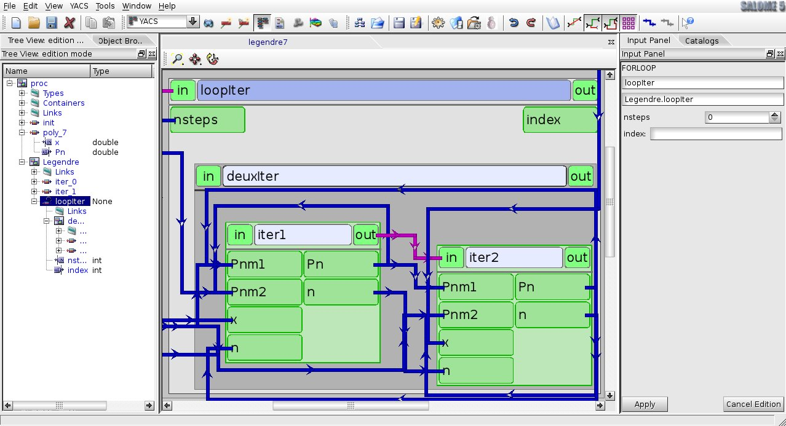

Representation of a schema
==========================

.. _change_2d_representation_schema:

Change 2D representation of a schema
------------------------------------
The schema consists of several nodes of control and computation types. These nodes have input and output data, stream and control ports. 
Connecting these ports by links means transferring data from output port to input port of a next node.

At the current moment YACS GUI for SALOME provides the user with only one view mode of a schema.

.. _full_view_of_a_schema:

+ **Full view.** Nodes are "fully" displayed, with all ports and information labels. All links between connected ports are shown.

.. centered::
  **Full view of a schema**

Within YACS module the user can zoom-in and zoom-out 2D schema presentation interactively with the mouse, 
fit 2D presentation of a schema into 2D Viewer bounds (**Fit all** operation) and pan content of 2D Viewer (**Panning** operation) 
interactively with the mouse. 
These commands are accessible from :ref:`View Operations toolbar <view_operations_toolbar>`.

The user can also use the mouse wheel button to zoom in and out and the arrow key for panning.

The user can also zoom inside a composed node by using the **zoom to bloc** command from the node context menu.

.. centered::
  **A zoom inside loopIter composed node**

Use **Fit all** operation to go back to full view.

.. _auto-arrange_nodes:

Auto-arrange schema nodes
-------------------------
It is a very useful operation, because it simplifies the schema presentation in the schema 2D Viewer and makes it easier for the user perception. 
This operation is applicable to the whole schema (**arrange nodes recursion** command from the schema context menu) or only to some parts
of the schema (**arrange local nodes** command from a composed node context menu).

.. _rebuild_links:

Rebuild links between nodes
---------------------------
It is a very useful operation, because it simplifies the schema presentation in the schema 2D Viewer and makes it easier for the user perception. 
This operation constructs links in orthogonal mode.

The rebuild links between nodes operation is performed automatically when **automatic link** option is activated in the YACS main menu or
in the toolbar :ref:`edition_toolbar`. To force links computation, use the **compute links** command from the node context menu.

The user can change the links representation with the options **simplify links** which tries to make the links as direct as possible with
a slight CPU cost and **separate links** which tries to avoid links superposition with again a CPU cost.

.. _shrink_expand_nodes:

Shrink/Expand nodes
-------------------
This functionality allows folding/unfolding any node(s) in order to decrease the schema size. 
It can be useful if user deals with a large schema that contains a lot of number of nodes.

There are 3 possible ways to make the schema more compact:

+ call **shrink/expand** context menu or **double mouse click** on any node to fold/unfold this node;

+ call **shrink/expand children** context menu or  **Ctrl + double mouse click** on any composed node to fold/unfold all direct children nodes of selected node;

+ call **shrink/expand elementary** context menu or  **Ctrl + Shift + double mouse click** on any composed node to fold/unfold all elementary nodes of selected node recursively.

