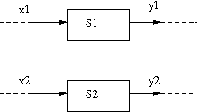

SALOME component
================
Principle
-----------
A SALOME component is a CORBA component as described in the previous chapter, using services of the SALOME kernel.  
This component also has to be “declared” to SALOME (i.e. SALOME resource files need to be supplied or completed with 
information about this component).  The following operations need to be carried out:

1. adapt the IDL file
2. declare the component to the SALOME modules catalog
3. modify the implementation class (C++ or python) to

   - monitor adaptation of the IDL file (point 1)
   - enable supervision of the component by SALOME, in the different component services 
   - prepare use of the notification service (send messages to monitor execution of calculations in the component) – optional (but useful)
4. Declare any graphic resources

IDL file
-----------
Principle
^^^^^^^^^^^^
The IDL description is similar to the description of a standard CORBA component with the following special features:

- the component must form part of the basic ``Engines`` module (CORBA)
- the component must inherit from the SALOME basic component:  ``Engines::EngineComponent`` (defined in the IDL ``“SALOME_Component.idl”`` file)
- the services of the component may have ``in``, ``out`` parameters and /or a return value, but no ``inout`` parameters.

**Notes**

#.  The ``Engines`` module includes all SALOME components other than the SALOME central components
#.  The ``Engines::EngineComponent`` basic component avoids the need to redefine common services (stop, restart, etc.) for each 
    component added to the system
#.  This is not a limitation, an ``inout`` parameter can be decoupled into an ``in`` parameter and an ``out`` 
    parameter (in any case, this is the form in which python clients will see it).

Example 9 (start)
^^^^^^^^^^^^^^^^^
We will reuse the ``alglin.idl`` file and adapt it:

``alglin.idl``

.. include:: ./exemples/exemple9/alglin.idl
   :literal:

**Note**  
  It is important to take care when structures are defined in the IDL (like the ``vecteur`` structure in ``algin.idl``). 
  The chosen name ``vecteur`` might be “reserved” by another SALOME component.
 
Example 10 (start)
^^^^^^^^^^^^^^^^^^
Similar modifications are made on the IDL ``FreeFem.idl`` file:

``FreeFem.idl``

.. include:: ./exemples/exemple10/FreeFemComponent.idl
   :literal:

Registration into the modules catalog
--------------------------------------------
Before they can be used in SALOME, components must be registered in one of the SALOME modules catalogs.  This catalog is 
distributed in several files (general catalog, user catalog).  It will be assumed that the component will be declared in 
a user's personal catalog.  The component catalog file is an XML file that contains:

#. the list of services of the component and their parameters
#. the name of the file containing the icon of the component, version information, comments, default service, etc. (this information is optional).

This catalog can be completed by hand or a utility supplied by SALOME can be used that generates information in 
point 1 above (nevertheless, this file must be edited to enter information in point 2).  This tool is available in 
the SALOME graphic interface (``Tools->Catalog Generator`` menu) indicating the name of the catalog (XML file) and 
the name of the IDL file of the component.

C++ implementation class
---------------------------
**In this section, it will be assumed that the IDL file defines a CORBA class: A and that the C++ implementation class A_impl will be used.**

Making conforming with the component IDL
^^^^^^^^^^^^^^^^^^^^^^^^^^^^^^^^^^^^^^^^^^
Proceed as follows to adapt the standard CORBA / C++ implementation classes (as seen in the previous chapter):

#. Insert the ``SALOMEconfig.h`` file that contains a number of useful definitions to make the code of the implementation
   class independent from the CORBA version used::

            #include <SALOMEconfig.h>

#. then insert the ``SALOME_Component_i.hxx`` file that contains the interface of the C++ implementation class of the SALOME basic component::

            #include "SALOME_Component_i.hxx"

#. for the CORBA class that is implemented, add the following line::

            #include CORBA_SERVER_HEADER(A)

   ``CORBA_SERVER_HEADER`` is a macro defined in ``SALOMEconfig.h`` that makes CORBA inclusion file names independent 
   from the CORBA implementation used.

#. for each CORBA class used in the implementation class, add the following line::

            #include CORBA_CLIENT_HEADER(<CORBA class name>)

   ``CORBA_CLIENT_HEADER`` is a macro defined in ``SALOMEconfig.h`` that makes CORBA inclusion file names independent 
   from the CORBA implementation used.

#. derive the implementation class from the class of the basic SALOME component::

      class A_impl :
           public POA_Engines::A,
           public Engines_Component_i {

#. define the (sole) constructor as follows in the C++ header file (.hxx)::

           A_impl(CORBA::ORB_ptr orb,
                  PortableServer::POA_ptr poa,
                  PortableServer::ObjectId * contId, 
                  const char *instanceName,
                  const char *interfaceName);

   and in the C++ implementation file (.cxx)::

           A_impl:: A_impl
                     (CORBA::ORB_ptr orb,
                      PortableServer::POA_ptr poa,
                      PortableServer::ObjectId * contId, 
                      const char *instanceName, 
                      const char *interfaceName) :
                Engines_Component_i(orb, poa, contId, 
                                    instanceName, interfaceName)
           {
             _thisObj = this ;
             _id = _poa->activate_object(_thisObj);
           }

   This constructor may possibly be responsible for creation and initialisation of the internal object associated with the CORBA component.

#. If structures are defined by the IDL file in the Engines module, adapt declarations of the implementation class methods.

The above example illustrates the modifications made on example 6.
 
.. _remsuper:

Enable component supervision
^^^^^^^^^^^^^^^^^^^^^^^^^^^^^^^^^^^^^
The following needs to be inserted in each service of the component (i.e. in each method of the implementation class 
called during a CORBA request), before the component can be controlled from supervision.

- at the beginning, the instruction::

     beginService(<nom du service>);

- at the end, the instruction::

     endService(<nom du service>);

These two instructions notify the SALOME supervision that the component service has actually received the CORBA request (beginService) 
and that execution of the service has actually terminated (endService).

**Note**  
  Put beginService and endService in the methods of the implementation class of a component declares to SALOME that the component 
  is "supervisable”.  This is not an assurance that this component can be used without precautions in the case in which the 
  component has an internal state modified by one or more services.

  **Example**:  
    Consider a component with an internal variable ``Quantity`` and two services:

    * ``S1(x):  Quantity = Quantity + x;``   returns ``Quantity`` and
    * ``S2(x) :  Quantity = Quantity * x ;``  returns ``Quantity``.

    *A priori*, it is impossible to know the value of ``Quantity`` after the calculation graph on the following figure has been executed.

.. _figpara:

.. centered::
     Calculation graph containing parallel branches

Using the notification
^^^^^^^^^^^^^^^^^^^^^^^^^^^^^^
The constructor of the implementation class must be modified as follows, so as to signal use of the notification (that will 
cause opening of a connection to an events channel)::

        A_impl:: A_impl
                  (CORBA::ORB_ptr orb,
                   PortableServer::POA_ptr poa,
                   PortableServer::ObjectId * contId, 
                   const char *instanceName, 
                   const char *interfaceName) :
             Engines_Component_i(orb, poa, contId, 
                                 instanceName, interfaceName, 1)
        {
          _thisObj = this ;
          _id = _poa->activate_object(_thisObj);
        }

in which the parameter “1” has been added to the end of the call to the ``Engines_Component_i`` of the constructor.  
The component can then use the instruction::

   void sendMessage(const char *event_type, const char *message);

to send messages indicating progress with the calculation or an abnormal situation, etc.  These messages will be visible to the 
SALOME user.  The first parameter indicates the message type (“warning”, “step”, “trace”, “verbose”), and the second parameter 
indicates the message contents (character string).

Connection to the “factory” object of a container
^^^^^^^^^^^^^^^^^^^^^^^^^^^^^^^^^^^^^^^^^^^^^^^^^^^^^
A “C” function has to be provided with an imposed name and code, for a component to be loaded and initialised by a container::

   extern "C"
   {
     PortableServer::ObjectId * <nom du composant>Engine_factory(
                                  CORBA::ORB_ptr orb,
                                  PortableServer::POA_ptr poa,
                                  PortableServer::ObjectId * contId,
                                  const char *instanceName,
                                  const char *interfaceName)
     {
       <classe d'implementation> * O
         = new <classe d'implementation>(orb, poa, contId, 
                                         instanceName, interfaceName);
       return O->getId() ;
     }
   }

``<component name>`` (or CORBA class name, ``A`` in this case) and ``<implementation class>`` (``A_impl`` here) are specific 
to each component.  This function is called by the container when a component is loaded.  It creates a CORBA object that 
will receive requests to the component and will forward them to the different services of the component.

Example 9 (continued)
^^^^^^^^^^^^^^^^^^^^^^^^^^^^^
We will use the implementation files ``algin_i.hxx`` and ``algin_i.cxx`` again and adapt them:

``alglin_i.hxx``

.. include:: ./exemples/exemple9/alglin_i.hxx
   :literal:

``alglin_i.cxx``

.. include:: ./exemples/exemple9/alglin_i.cxx
   :literal:

Python implementation class
------------------------------
**In this section, it is assumed that the IDL file defines a CORBA class: B and that we will use the python implementation class: B.**  

The procedure is similar to the case of the C++ server interface:

Making conforming with the component IDL
^^^^^^^^^^^^^^^^^^^^^^^^^^^^^^^^^^^^^^^^^^

#. import the class of the basic component::

      from SALOME_ComponentPy import *

#. derive the implementation class from the class of the basic SALOME component::

      class B(Engines__POA.B,
              SALOME_ComponentPy_i):

#. The constructor of the implementation class must begin by::

          def __init__(self, orb, poa, this, containerName,
                       instanceName, interfaceName):
              SALOME_ComponentPy_i.__init__(self, orb, poa, this, 
                                            containerName, instanceName, 
                                            interfaceName, False)

Enable supervision of the component
^^^^^^^^^^^^^^^^^^^^^^^^^^^^^^^^^^^^^
Before the component can be controlled from supervision, the following have to be inserted in each service of the 
component (i.e. in each method of the implementation class called during a CORBA request).

* at the beginning, the instruction::

     beginService(<service name>);

* at the end, the instruction::

     endService(<service name>);

These two instructions notify the SALOME supervision that the component service has actually received the CORBA 
request (beginService) and that execution of the service has actually terminated (endService). 
Same comment as in the C++ case (:ref:`remsuper`).

Using the notification
^^^^^^^^^^^^^^^^^^^^^^^^^^^^^^
The implementation class constructor should be modified as follows to signal use of the notification::

       def __init__(self, orb, poa, this, containerName,
                    instanceName, interfaceName):
           SALOME_ComponentPy_i.__init__(self, orb, poa, this, 
                                         containerName, instanceName, 
                                         interfaceName, True)

in which the parameter “1” is added to the end of the call to the ``SALOME_ComponentPy_i`` of the constructor.  
The component can then use the following instruction::

   sendMessage(event_type, message);

to send messages providing information about progress with the calculation or an abnormal situation, etc.  
These messages will be visible to the SALOME user.  The first parameter indicates the message 
type (“warning”, “step”, “trace”, “verbose”), and the second parameter indicates the message contents (character string).

Example 10 (continued)
^^^^^^^^^^^^^^^^^^^^^^^^^^^
Consider the ``FreeFem.py`` implementation file and adapt it:

``FreeFemComponent.py``

.. include:: ./exemples/exemple10/FreeFemComponent.py
   :literal:

Using the SALOME compilation and execution environment
-----------------------------------------------------------------------
Autotools like SALOME will be used.

Using data structures provided by SALOME or returned by the component
---------------------------------------------------------------------------------------
This part will be done with reference to CORBA [CORBA]_ specifications, and particularly IDL specifications – languages [LANG]_ 
or the different CORBA manuals, for example [HENVIN]_ (C++) and [PyCorba]_ (python).

Meshes and MED fields
^^^^^^^^^^^^^^^^^^^^^^^
This part will be done with reference to MED and MEDMemory documentation [MEDDoc]_ and [MEDMemory]_.

