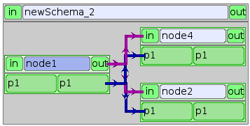

.. _schemaxml:

Définition d'un schéma de calcul au format XML
=================================================
Un fichier XML qui décrit un schéma de calcul peut contenir les informations suivantes:

   * des définitions de types de données
   * des définitions de containers
   * des définitions de noeuds de calcul élémentaires
   * des définitions de noeuds composés
   * des définitions de connexions entre noeuds
   * des initialisations 

La présentation de ces définitions sera faite progressivement. On commence
dans un premier temps par :

  - la définition des types de données 
  - la définition d'un sous ensemble de noeuds élémentaires
  - la définition des connexions non datastream
  - la définition des noeuds composés

Dans un deuxième temps, on ajoute des compléments sur :

  - la définition des containers
  - la définition des propriétés de noeuds
  - la définition des connexions datastream
  - la définition du reste des noeuds élémentaires

Un schéma de calcul est défini en utilisant le tag XML proc.
Le schéma de calcul le plus simple est le suivant::

  <proc>
  </proc>

Il ne contient aucune définition et ne fait rien. 

Définition des types de données
---------------------------------
Il n'est pas possible de définir de types de base autres que ceux existants.
Tous les types de base sont prédéfinis par YACS.
Il est cependant possible de définir des alias. Par exemple, un alias pour
le type double s'écrira::

  <type name="mydble" kind="double"/>

On peut ensuite utiliser mydble à la place de double.

Référence d'objet
'''''''''''''''''''''
La forme la plus simple pour définir un type référence d'objet est::

  <objref name="mesh"/>

L'attribut name du tag objref donne le nom du nouveau type.
La forme complète pour définir ce type serait::

  <objref name="mesh" id="IDL:mesh:1.0/>

où id est le repository id CORBA de l'objet SALOME correspondant. Cet attribut
a une valeur par défaut qui est IDL:<nom du type>:1.0. 

Pour définir un type référence d'objet dérivé d'un autre type, il suffit
d'ajouter le nom du ou des types de base.
Par exemple, pour un type dérivé de mesh, on écrira::

  <objref name="refinedmesh">
    <base>mesh</base>
  </objref>

Si on a plusieurs types de base, on écrira::

  <objref name="refinedmesh">
    <base>mesh</base>
    <base>unautretype</base>
  </objref>

On peut, comme pour CORBA, utiliser des namespaces pour définir les types.
Par exemple, si le type mesh SALOME est défini dans le namespace myns, on écrira::

  <objref name="myns/mesh"/>

Séquence
''''''''''
Pour définir une séquence de double, on écrira::

  <sequence name="myseqdble" content="double"/>

Tous les attributs du tag sequence sont obligatoires. L'attribut name
donne le nom du nouveau type. L'attribut content donne le nom du type
des éléments de la séquence.
On peut définir une séquence de séquence par::

  <sequence name="myseqseqdble" content="myseqdble"/>

On peut également définir une séquence de références d'objet par::

  <sequence name="myseqmesh" content="refinedmesh"/>

Structure
'''''''''''''
Pour définir une structure, on utilise un tag struct avec des sous tags member
pour la définition des membre de la structure.
Voici un exemple de définition::

    <struct name="S1" >
      <member name="x" type="double"/>
      <member name="y" type="int"/>
      <member name="s" type="string"/>
      <member name="b" type="bool"/>
      <member name="vd" type="dblevec"/>
    </struct>

Le tag member a 2 attributs obligatoires : name qui donne le nom du membre
et type qui donne son type. Le tag struct a un attribut obligatoire name
qui donne le nom du type.

Définition des noeuds de calcul élémentaires
-----------------------------------------------
Noeud script Python
'''''''''''''''''''''
Pour définir un noeud inline script Python on utilise le tag inline avec le sous tag
script comme dans l'exemple suivant::

    <inline name="node1" >
      
      <outport name="p1" type="int"/>
    </inline>

L'attribut name (obligatoire) du tag inline est le nom du noeud.
Le script Python est donné au moyen du sous tag code. On met autant de lignes code
que nécessaire. Si le script contient des caractères inhabituels on peut utiliser
une section CDATA. Ceci permet également de n'utiliser qu'un tag code pour un script complet.
Par exemple::

  

Le script calcule la variable p1 que l'on veut mettre en variable de sortie du noeud.
Le port de sortie "p1" du noeud est défini avec le sous tag outport. Ce tag a 2 attributs
obligatoires : name qui donne le nom du port et type qui donne le type de données
supporté. Ce type doit être déjà défini.
Pour ajouter un port de données d'entrée, on utilisera le tag inport à la place 
du tag outport.

Un exemple de noeud avec des ports d'entrée et de sortie::

         <inline name="node1" >
           
           <inport name="p1" type="int"/>
           <outport name="p1" type="int"/>
         </inline>

Maintenant le noeud reçoit p1 comme variable d'entrée, lui ajoute 10 et l'exporte 
comme variable de sortie.

Noeud fonction Python
''''''''''''''''''''''''
Pour définir un noeud fonction Python on utilise le tag inline et le sous tag function
comme dans l'exemple suivant:: 

    <inline name="node1" >
      <function name="f">
        <code>def f(p1):</code>
        <code>  p1=p1+10</code>
        <code>  return p1</code>
      </function>
      <inport name="p1" type="int"/>
      <outport name="p1" type="int"/>
    </inline>

L'attribut name (obligatoire) du tag inline est le nom du noeud.
Par rapport au noeud script Python seule la partie exécution change (tag function
à la place du tag script).
Le tag function a un attribut obligatoire name qui donne le nom de la fonction à
exécuter. Le corps de la fonction est donné avec les tags code comme pour le script.

Noeud de service SALOME
''''''''''''''''''''''''''
Comme il est dit dans :ref:`principes`, on a deux façons de décrire un noeud 
de service SALOME.

La première forme de définition utilise le tag service et les sous tags component
et method comme dans l'exemple suivant::

    <service name="node4" >
      <component>AddComponent</component>
      <method>Add</method>
      <inport name="x" type="double"/>
      <inport name="y" type="double"/>
      <outport name="FuncValue" type="double"/>
      <outport name="z" type="double"/>
    </service>

L'attribut obligatoire name du tag service donne le nom du noeud.
Le tag component donne le nom du composant SALOME à utiliser et method
le nom du service à exécuter. Ici on veut exécuter le service Add du
composant AddComponent que l'on trouve dans les composants exemples
de SALOME.

La deuxième forme de définition utilise le tag service et les sous tags node
et method comme dans l'exemple suivant::

  <service name="node5" >
    <node>node4</node>
    <method>Setx</method>
    <inport name="x" type="double"/>
  </service>

Le tag node référence le noeud node4 précédemment défini de façon à utiliser
la même instance de composant pour noeud4 et noeud5.

Définition des connexions
-----------------------------
Dans tout ce qui suit concernant les connexions et les initialisations de port,
on est amené à identifier un noeud origine et/ou un noeud cible. Dans tous
les cas, le nom qui sera utilisé est le nom relatif du noeud par rapport
au contexte de définition de la connexion.

Lien de contrôle
''''''''''''''''''
Un lien de contrôle est défini en utilisant le tag control comme dans l'exemple
suivant::

 <control> 
   <fromnode>node1</fromnode> 
   <tonode>node2</tonode> 
 </control>

Le sous tag fromnode donne le nom du noeud qui sera exécuté avant le noeud
dont le nom est donné par le sous tag tonode.

Lien dataflow
''''''''''''''''
Un lien dataflow est défini en utilisant le tag datalink comme dans l'exemple 
suivant::

  <datalink> 
    <fromnode>node1</fromnode> <fromport>p1</fromport>
    <tonode>node2</tonode> <toport>p1</toport>
  </datalink>

Les sous tags fromnode et fromport donne le nom du noeud et du port de données
sortant qui sera connecté au noeud et au port dont les noms sont donnés pat les
sous tags tonode et toport.
L'exemple de lien ci-dessus dit que la variable de sortie p1 du noeud node1
sera envoyé au noeud node2 et utilisée comme variable d'entrée p1.

Lien data
''''''''''
Un lien data est défini en utilisant le même tag datalink mais en ajoutant
l'attribut control avec false comme valeur. Exemple::

  <datalink control="false"> 
    <fromnode>node1</fromnode> <fromport>p1</fromport>
    <tonode>node2</tonode> <toport>p1</toport>
  </datalink>

Le lien dataflow ci-dessus peut donc être aussi écrit comme suit::

  <control> 
    <fromnode>node1</fromnode> 
    <tonode>node2</tonode> 
  </control>
  <datalink control="false"> 
    <fromnode>node1</fromnode> <fromport>p1</fromport>
    <tonode>node2</tonode> <toport>p1</toport>
  </datalink>

.. _initialisation:

Initialisation d'un port de données d'entrée
-----------------------------------------------
Pour initialiser un port de données d'entrée avec des constantes on utilise le tag parameter
et les sous tags tonode, toport et value.
Le tag toport donne le nom du port d'entrée du noeud de nom tonode à initialiser. 
La constante d'initialisation est donnée par le tag value. 
La constante est encodée en utilisant la convention de codage XML-RPC (http://www.xmlrpc.com/).

Exemple d'initialisation::

    <parameter>
      <tonode>node1</tonode> <toport>p1</toport>
      <value><string>coucou</string></value>
    </parameter>

On initialise le port p1 du noeud node1 avec une constante de type chaine de 
caractères ("coucou").

Voici quelques exemples d'encodage XML-RPC:

============================ ==============================================
Constante                       Encodage XML-RPC
============================ ==============================================
string "coucou"                ``<string>coucou</string>``  
double 23.                      ``<double>23</double>``        
entier 0                       ``<int>0</int>``
booléen true                   ``<boolean>1</boolean>``
fichier                        ``<objref>/tmp/forma01a.med</objref>``
liste d'entiers                :: 

                               <array> <data>
                               <value><int>1</int> </value>
                               <value><int>0</int> </value>
                               </data> </array>
structure (2 membres)          ::

                               <struct> 
                               <member> <name>s</name>
                               <value><int>1</int> </value>
                               </member>
                               <member> <name>t</name>
                               <value><int>1</int> </value>
                               </member>
                               </struct>

============================ ==============================================

Premier exemple à partir des éléments précédents
------------------------------------------------------
Il est maintenant possible de définir un schéma de calcul complet
avec des définitions de noeuds, des connexions et des initialisations. ::

  <proc>
    <inline name="node1" >
      
      <inport name="p1" type="int"/>
      <outport name="p1" type="int"/>
    </inline>
    <inline name="node2" >
      
      <inport name="p1" type="int"/>
      <outport name="p1" type="int"/>
    </inline>
    <service name="node4" >
        <component>ECHO</component>
        <method>echoDouble</method>
        <inport name="p1" type="double"/>
        <outport name="p1" type="double"/>
    </service>
    <control> 
      <fromnode>node1</fromnode> <tonode>node2</tonode> 
    </control>
    <control> 
      <fromnode>node1</fromnode> <tonode>node4</tonode> 
    </control>
    <datalink> 
      <fromnode>node1</fromnode> <fromport>p1</fromport>
      <tonode>node2</tonode> <toport>p1</toport>
    </datalink>
    <datalink> 
      <fromnode>node1</fromnode> <fromport>p1</fromport>
      <tonode>node4</tonode> <toport>p1</toport>
    </datalink>
    <parameter>
      <tonode>node1</tonode> <toport>p1</toport>
      <value><int>5</int></value>
    </parameter>
  </proc>

Le schéma comprend 2 noeuds python (node1, node2) et un noeud SALOME (node4). 
Les noeuds node2 et node4 peuvent être exécutés en parallèle comme on peut le 
voir sur le diagramme ci-dessous.

Définition de noeuds composés
-----------------------------------
L'étape suivante est la définition de noeuds composés soit pour modulariser le schéma (Bloc)
soit pour introduire des structures de contrôle (Loop, Switch).

Bloc
''''''''
Tous les éléments de définition précédents (à l'exception des types de données) peuvent être
mis dans un noeud Bloc. Pour créer un Bloc, il suffit d'utiliser un tag bloc avec un attribut name
obligatoire qui portera le nom du bloc. Ensuite, on ajoute des définitions dans ce tag et on obtient
un noeud composé qui est un Bloc. 

Voici un exemple de Bloc qui reprend une partie de l'exemple ci-dessus::

  <bloc name="b">
    <inline name="node1" >
      
      <inport name="p1" type="int"/>
      <outport name="p1" type="int"/>
    </inline>
    <service name="node4" >
        <component>ECHO</component>
        <method>echoDouble</method>
        <inport name="p1" type="double"/>
        <outport name="p1" type="double"/>
    </service>
    <control> 
      <fromnode>node1</fromnode> <tonode>node4</tonode> 
    </control>
    <datalink> 
      <fromnode>node1</fromnode> <fromport>p1</fromport>
      <tonode>node4</tonode> <toport>p1</toport>
    </datalink>
  </bloc>

Ce bloc peut maintenant être connecté à d'autres noeuds comme un simple noeud élémentaire.
Il faut respecter quelques règles :

  - il n'est pas possible de créer un lien de contrôle qui traverse la frontière d'un bloc
  - il est possible de créer des liens data qui traverse la frontière aussi bien en entrée
    qu'en sortie à condition d'utiliser un nommage contextuel (voir :ref:`nommage`)

ForLoop
'''''''''''

Une ForLoop est définie en utilisant un tag forloop. Ce tag a un attribut obligatoire name qui porte le nom du noeud
et un attribut facultatif nsteps qui donne le nombre de tours de boucle à exécuter. Si cet attribut n'est pas spécifié,
le noeud utilisera la valeur donnée dans son port d'entrée de nom nsteps.
Le tag forloop doit contenir la définition d'un et d'un seul noeud interne qui peut être un noeud élémentaire 
ou un noeud composé. On peut imbriquer des ForLoop sur plusieurs niveaux, par exemple. Si on veut avoir 
plus d'un noeud de calcul dans la ForLoop, il faut utiliser un Bloc comme noeud interne.

Passons à un exemple::

    <forloop name="l1" nsteps="5">
      <inline name="node2" >
        
        <inport name="p1" type="int"/>
        <outport name="p1" type="int"/>
      </inline>
    </forloop>

On fait ici une boucle qui exécutera 5 tours sur un noeud script python.
Les règles à respecter pour la création de liens sont les mêmes que pour les blocs. Pour faire des calculs
itératifs, il faut pouvoir connecter un port de sortie d'un noeud interne avec un port d'entrée de
ce même noeud interne. On utilise pour ce faire un lien data qui est défini dans le contexte du
noeud ForLoop.

Voici un exemple avec rebouclage sur le port p1::

  <forloop name="l1" nsteps="5">
      <inline name="node2" >
        
        <inport name="p1" type="int"/>
        <outport name="p1" type="int"/>
      </inline>
      <datalink control="false">
        <fromnode>node2</fromnode> <fromport>p1</fromport>
        <tonode>node2</tonode> <toport>p1</toport>
      </datalink>
  </forloop>

Enfin si le nombre de pas de la boucle est calculé, on utilisera le port d'entrée nsteps de la boucle
comme dans l'exemple suivant::

    <inline name="n" >
      
      <outport name="nsteps" type="int"/>
    </inline>

    <forloop name="l1" >
      <inline name="node2" >
        
        <inport name="p1" type="int"/>
        <outport name="p1" type="int"/>
      </inline>
    </forloop>

    <datalink> 
      <fromnode>n</fromnode><fromport>nsteps</fromport>
      <tonode>l1</tonode> <toport>nsteps</toport> 
    </datalink>

WhileLoop
''''''''''''
Une WhileLoop est définie en utilisant le tag while. Il a un seul attribut obligatoire name qui porte le
nom du noeud. Le port d'entrée de nom "condition" doit être connecté pour que la boucle soit valide.

Voici un exemple de boucle while qui incrémente la variable p1 jusqu'à ce qu'elle dépasse la valeur 40::

  <while name="l1" >
    <bloc name="b">
      <inline name="node2" >
        
        <inport name="p1" type="int"/>
        <outport name="p1" type="int"/>
        <outport name="condition" type="bool"/>
      </inline>
      <datalink control="false">
        <fromnode>node2</fromnode> <fromport>p1</fromport>
        <tonode>node2</tonode> <toport>p1</toport>
      </datalink>
    </bloc>
  </while>
  <datalink control="false">
    <fromnode>l1.b.node2</fromnode> <fromport>condition</fromport>
    <tonode>l1</tonode> <toport>condition</toport>
  </datalink>
  <parameter>
    <tonode>l1.b.node2</tonode> <toport>p1</toport>
    <value><int>23</int> </value>
  </parameter>

On peut bien sûr définir des boucles while imbriquées.

Boucle ForEach
''''''''''''''''
Une boucle ForEach est définie en utilisant le tag foreach. Il a 2 attributs obligatoires :
name qui porte le nom du noeud ForEach et type qui donne le type des éléments de la collection sur lequel 
la boucle va itérer. Un troisième attribut facultatif nbranch permet de fixer le nombre de branches
parallèles que la boucle va gérer. Si cet attribut n'est pas fourni, il faut connecter le port de données
d'entrée de la boucle nbBranches.
Le tag foreach doit contenir la définition d'un et d'un seul noeud interne (élémentaire ou composé).

Voici un exemple minimal de boucle ForEach::

    <inline name="node0" >
      
      <outport name="p1" type="dblevec"/>
    </inline>
    <foreach name="b1" nbranch="3" type="double" >
      <inline name="node2" >
        <function name="f">
            <code>def f(p1):</code>
            <code>  p1= p1+10.</code>
            <code>  print p1</code>
            <code>  return p1</code>
        </function>
        <inport name="p1" type="double"/>
        <outport name="p1" type="double"/>
      </inline>
    </foreach>
    <inline name="node1" >
      
      <inport name="p1" type="dblevec"/>
    </inline>
    <datalink>
      <fromnode>node0</fromnode><fromport>p1</fromport>
      <tonode>b1</tonode> <toport>SmplsCollection</toport>
    </datalink>
    <datalink>
      <fromnode>b1</fromnode><fromport>SmplPrt</fromport>
      <tonode>b1.node2</tonode> <toport>p1</toport>
    </datalink>
    <datalink>
      <fromnode>b1.node2</fromnode><fromport>p1</fromport>
      <tonode>node1</tonode> <toport>p1</toport>
    </datalink>

Un premier noeud script Python construit une liste de double. Cette liste sera utilisée par la boucle ForEach
pour itérer (connexion au port d'entrée SmplsCollection). Le noeud interne de la boucle est un noeud fonction
Python qui ajoute 10 à l'élément qu'il traite. Enfin les résultats sont collectés et reçus par le noeud Python
node1 sous la forme d'une liste de doubles.

Switch
''''''''''
Un noeud Switch est défini avec le tag switch. Il a un seul attribut obligatoire name qui porte le nom du noeud.
Chaque cas est défini avec le sous tag case. Le cas par défaut est défini avec le sous tag default.
Le tag case a un attribut obligatoire id qui doit être un entier. 
Le tag default n'a aucun attribut.

Un exemple minimal de switch::

    <inline name="n" >
        
        <outport name="select" type="int"/>
    </inline>

    <switch name="b1">
      <case id="3">
        <inline name="n2" >
          
          <inport name="p1" type="double"/>
          <outport name="p1" type="double"/>
        </inline>
      </case>
      <default>
        <inline name="n2" >
          
          <inport name="p1" type="double"/>
          <outport name="p1" type="double"/>
        </inline>
      </default>
    </switch>

    <control> <fromnode>n</fromnode> <tonode>b1</tonode> </control>
    <datalink> <fromnode>n</fromnode><fromport>select</fromport>
               <tonode>b1</tonode> <toport>select</toport> </datalink>
    <parameter>
        <tonode>b1.p3_n2</tonode> <toport>p1</toport>
        <value><double>54</double> </value>
    </parameter>
    <parameter>
        <tonode>b1.default_n2</tonode> <toport>p1</toport>
        <value><double>54</double> </value>
    </parameter>

Définition de containers
--------------------------------
Les containers YACS doivent être définis juste après avoir défini les types de données
avant la définition des noeuds de calcul. Un container est défini en utilisant le tag conatiner.
Ce tag a un seul attribut obligatoire qui est le nom du container.
Les contraintes sur le placement du container sont spécifiées au moyen de propriétés définies
avec le sous tag property. Ce tag a 2 attributs obligatoires name et value qui donnent le nom
de la contrainte et sa valeur sous forme de chaine de caractères.

Voici un exemple de container défini par l'IHM graphique::

   <container name="DefaultContainer">
     <property name="container_name" value="FactoryServer"/>
     <property name="cpu_clock" value="0"/>
     <property name="hostname" value="localhost"/>
     <property name="isMPI" value="false"/>
     <property name="mem_mb" value="0"/>
     <property name="nb_component_nodes" value="0"/>
     <property name="nb_node" value="0"/>
     <property name="nb_proc_per_node" value="0"/>
     <property name="parallelLib" value=""/>
     <property name="workingdir" value=""/>
   </container>

Une fois que les containers sont définis, on peut placer des composants SALOME sur ce container.
Il suffit d'ajouter cette information dans la définition du noeud de service SALOME en utilisant 
le sous tag load. Ce tag a un seul attribut obligatoire de nom container qui donne le nom du container
sur lequel le composant SALOME sera placé.

Si on veut placer le service SALOME défini plus haut sur le container DefaultContainer, on écrira::

    <service name="node4" >
      <component>AddComponent</component>
      <load container="DefaultContainer"/>
      <method>Add</method>
      <inport name="x" type="double"/>
      <inport name="y" type="double"/>
      <outport name="FuncValue" type="double"/>
      <outport name="z" type="double"/>
    </service>

Les propriétés de noeuds
-----------------------------
On peut définir des propriétés pour tous les noeuds élémentaires ou composés.
Cependant elles ne sont réellement utiles que pour les noeuds de service SALOME.

Une propriété se définit en ajoutant un sous tag property dans la définition d'un noeud.
Le tag property a 2 attributs obligatoires name et value qui portent le nom de la propriété
et sa valeur sous la forme d'une chaine de caractères.

Exemple avec un noeud de service SALOME::

    <service name="node4" >
      <component>AddComponent</component>
      <method>Add</method>
      <property name="VERBOSE" value="2" />
      <inport name="x" type="double"/>
      <inport name="y" type="double"/>
      <outport name="FuncValue" type="double"/>
      <outport name="z" type="double"/>
    </service>

Dans le cas d'un noeud de service SALOME la propriété est transmise au composant
et, par défaut, positionnée en tant que variable d'environnement.

Les connexions datastream
----------------------------
Les connexions datastream ne sont possibles que pour des noeuds de service SALOME comme
on l'a vu dans :ref:`principes`. Il faut tout d'abord définir les ports datastream dans
le noeud de service.
Un port datastream d'entrée se définit avec le sous tag instream. Ce tag a 2 attributs
obligatoires : name qui donne le nom du port et type qui donne le type de données
supporté (voir :ref:`principes` pour les types datastream).
Pour définir un port datastream sortant, on utilise le tag outstream à la place de instream.
Pour définir une propriété associée au port, on utilise le sous tag property avec ses deux attributs
name et value. Pour avoir la liste des propriétés possibles, voir la documentation CALCIUM.

Voici un exemple de définition de noeud de service SALOME avec des ports datastream. Il s'agit du 
composant DSCCODC que l'on peut trouver dans le module DSCCODES de la base EXAMPLES.
Les ports datastream sont de type entier avec dépendance temporelle. ::

    <service name="node1" >
      <component>DSCCODC</component>
      <method>prun</method>
      <inport name="niter" type="int"/>
      <instream name="ETP_EN" type="CALCIUM_integer">
        <property name="DependencyType" value="TIME_DEPENDENCY"/>
      </instream>
      <outstream name="STP_EN" type="CALCIUM_integer">
        <property name="DependencyType" value="TIME_DEPENDENCY"/>
      </outstream>
    </service>

Pour définir des liens datastream, on utilise le tag stream.
Les sous tags fromnode et fromport donne le nom du noeud et du port datastream
sortant qui sera connecté au noeud et au port dont les noms sont donnés pat les
sous tags tonode et toport.
Un lien datastream peut être paramétré avec des propriétés (voir la documentation CALCIUM). Une propriété
est définie avec le sous tag property.

Voici un exemple plus complet avec des liens datastream paramétrés. On a deux composants SALOME 
avec ports datastream de type entier, avec dépendance temporelle (TIME_DEPENDENCY). 
Les connexions datastream utilisent un schéma temporel explicite (TI_SCHEM). ::

    <service name="node1" >
      <component>DSCCODC</component>
      <method>prun</method>
      <inport name="niter" type="int"/>
      <instream name="ETP_EN" type="CALCIUM_integer">
        <property name="DependencyType" value="TIME_DEPENDENCY"/>
      </instream>
      <outstream name="STP_EN" type="CALCIUM_integer">
        <property name="DependencyType" value="TIME_DEPENDENCY"/>
      </outstream>
    </service>

    <service name="node2" >
      <component>DSCCODD</component>
      <method>prun</method>
      <inport name="niter" type="int"/>
      <instream name="ETP_EN" type="CALCIUM_integer">
        <property name="DependencyType" value="TIME_DEPENDENCY"/>
      </instream>
      <outstream name="STP_EN" type="CALCIUM_integer">
        <property name="DependencyType" value="TIME_DEPENDENCY"/>
      </outstream>
    </service>

    <stream>
      <fromnode>node2</fromnode> <fromport>STP_EN</fromport>
      <tonode>node1</tonode> <toport>ETP_EN</toport>
      <property name="DateCalSchem" value="TI_SCHEM"/>
    </stream>

    <stream>
      <fromnode>node1</fromnode> <fromport>STP_EN</fromport>
      <tonode>node2</tonode> <toport>ETP_EN</toport>
      <property name="DateCalSchem" value="TI_SCHEM"/>
    </stream>

D'autres noeuds élémentaires
--------------------------------
Noeud SalomePython
'''''''''''''''''''''''
Ce type de noeud se définit avec le tag sinline. Il a un attribut obligatoire name qui porte le nom
du noeud. Pour le définir, on utilise les mêmes sous tags que pour le noeud fonction Python : function
pour le code Python à exécuter, inport et outport pour définir ses ports de données entrants et sortants.
Pour définir le placement sur un container, on utilise le sous tag load comme pour le noeud de service
SALOME.

Voici un exemple d'appel du composant PYHELLO depuis un noeud SalomePython::

    <sinline name="node1" >
      <function name="f">
        <code>import salome</code>
        <code>salome.salome_init()</code>
        <code>import PYHELLO_ORB</code>
        <code>def f(p1):</code>
        <code>  print __container__from__YACS__</code>
        <code>  machine,container=__container__from__YACS__.split('/')</code>
        <code>  param={}</code>
        <code>  param['hostname']=machine</code>
        <code>  param['container_name']=container</code>
        <code>  compo=salome.lcc.LoadComponent(param, "PYHELLO")</code>
        <code>  print compo.makeBanner(p1)</code>
        <code>  print p1</code>
      </function>
      <load container="A"/>
      <inport name="p1" type="string"/>
    </sinline>

Le composant PYHELLO sera placé sur le container A. Le choix du container est du ressort de YACS.
Le résultat du choix est accessible dans la variable python __container__from__YACS__ et est utilisé
par le noeud pour charger le composant en utilisant le LifeCycle de SALOME.

Noeud DataIn
''''''''''''''''
Ce type de noeud se définit avec le tag datanode. Il a un attribut obligatoire name qui porte le nom
du noeud. Pour définir les données du noeud, on utilisera le sous tag parameter. Ce tag a deux 
attributs obligatoires name et type qui donnent respectivement le nom de la donnée et son type.
La valeur initiale de la donnée est fournie par le sous tag value du tag parameter en utilisant
l'encodage XML-RPC (voir :ref:`initialisation`)

Voici un exemple de noeud DataIn qui définit 2 données de type double (b et c) et
une donnée de type fichier (f)::

    <datanode name="a">
      <parameter name="f" type="file">
         <value><objref>f.data</objref></value>
      </parameter>
      <parameter name="b" type="double" ><value><double>5.</double></value></parameter>
      <parameter name="c" type="double" ><value><double>-1.</double></value></parameter>
    </datanode>

Noeud DataOut
''''''''''''''''
Ce type de noeud se définit avec le tag outnode. Il a un attribut obligatoire name et un attribut facultatif ref. 
L'attribut name porte le nom du noeud. L'attribut ref donne le nom du fichier dans lequel
les valeurs des résultats seront sauvegardées.
Pour définir les résultats du noeud, on utilisera le sous tag parameter. Ce tag a deux 
attributs obligatoires name et type qui donnent respectivement le nom du résultat et son type
et un attribut facultatif ref. Ce dernier attribut n'est utile que pour les résultats fichiers.
S'il est renseigné, le fichier résultat sera copié dans le fichier dont le nom est donné par l'attribut. Sinon
le fichier sera un fichier temporaire généralement localisé dans le répertoire /tmp (éventuellement
sur une machine distante).

Voici un exemple de noeud DataOut qui définit 5 résultats (a, b, c, d, f) de différents types (double,
int, string, vecteur de doubles, fichier) et écrit les valeurs correspondantes dans le fichier g.data.
Le fichier résultat sera copié dans le fichier local monfich::

        <outnode name="out" ref="g.data">
          <parameter name="a" type="double" />
          <parameter name="b" type="int" />
          <parameter name="c" type="string" />
          <parameter name="d" type="dblevec" />
          <parameter name="f" type="file" ref="monfich"/>
        </outnode>

Noeud StudyIn
'''''''''''''''
Ce type de noeud se définit comme un noeud DataIn avec le tag datanode. Il suffit d'ajouter l'attribut
kind avec la valeur "study".
L'étude associée est donnée par une propriété (tag property) de nom StudyID (dont la valeur est un entier).

Pour définir les données du noeud, on utilisera le sous tag parameter. Ce tag a deux
attributs obligatoires name et type qui donnent respectivement le nom de la donnée et son type.
L'attribut ref donne l'entrée dans l'étude sous la forme d'une Entry SALOME ou d'un chemin dans l'arbre d'étude.

Voici un exemple de noeud StudyIn qui définit 2 données (b et c) de types GEOM_Object et booléen. L'étude
est supposée chargée en mémoire par SALOME sous le StudyID 1. La donnée b est référencée par une Entry SALOME.
La donnée c est référencée par un chemin dans l'arbre d'étude. ::
 
    <datanode name="s" kind="study" >
      <property name="StudyID" value="1" />
      <parameter name="b" type="GEOM/GEOM_Object" ref="0:1:2:2"/>
      <parameter name="c" type="bool" ref="/Geometry/Box_1"/>
    </datanode>

Noeud StudyOut
''''''''''''''''''
Ce type de noeud se définit comme un noeud DataOut avec le tag outnode et l'attribut name. 
Il suffit d'ajouter l'attribut kind avec la valeur "study". 
L'attribut facultatif ref donne le nom du fichier dans lequel sera sauvegardée l'étude à la fin du calcul.
L'étude associée est donnée par une propriété (tag property) de nom StudyID (dont la valeur est un entier).

Pour définir les résultats du noeud, on utilisera le sous tag parameter. Ce tag a deux
attributs obligatoires name et type qui donnent respectivement le nom du résultat et son type.
L'attribut ref donne l'entrée dans l'étude sous la forme d'une Entry SALOME ou d'un chemin dans l'arbre d'étude.

Voici un exemple de noeud StudyOut qui définit 2 résultats (a et b) de type GEOM_Object. L'étude utilisée
a le studyId 1. L'étude complète est sauvegardée en fin de calcul dans le fichier study1.hdf::

   <outnode name="o" kind="study" ref="stud1.hdf">
     <property name="StudyID" value="1"/>
     <parameter name="a" type="GEOM/GEOM_Object" ref="/Geometry/YacsFuse"/>
     <parameter name="b" type="GEOM/GEOM_Object" ref="0:1:1:6"/>
   </outnode>

