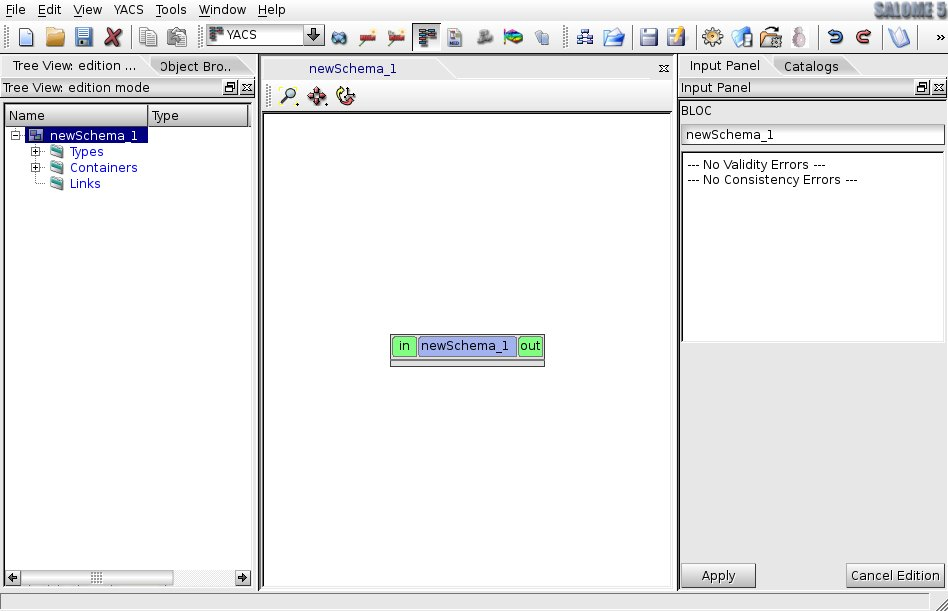
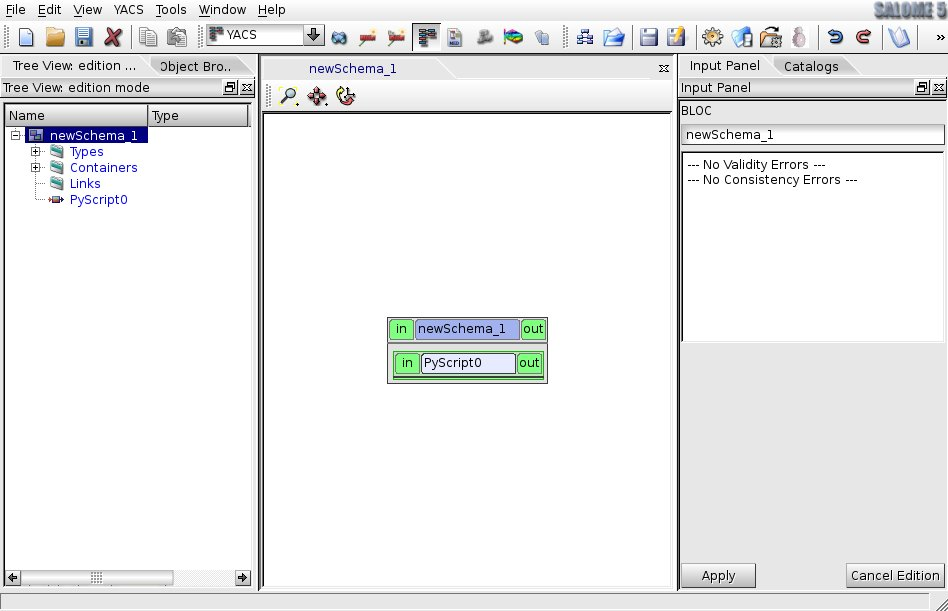
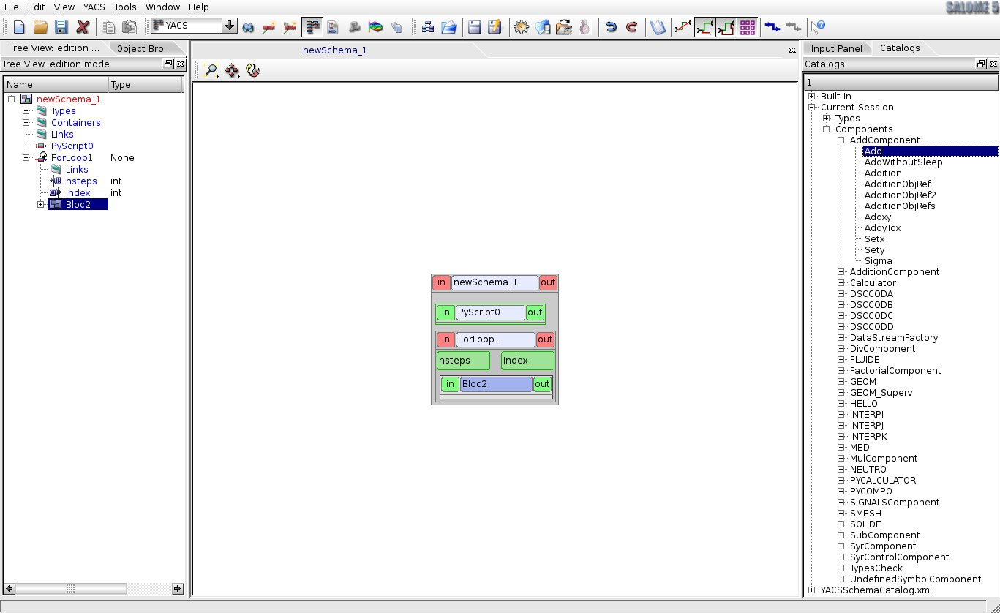
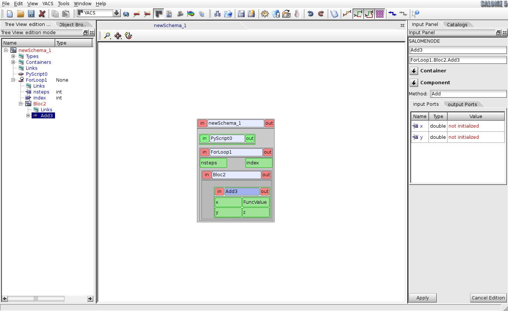
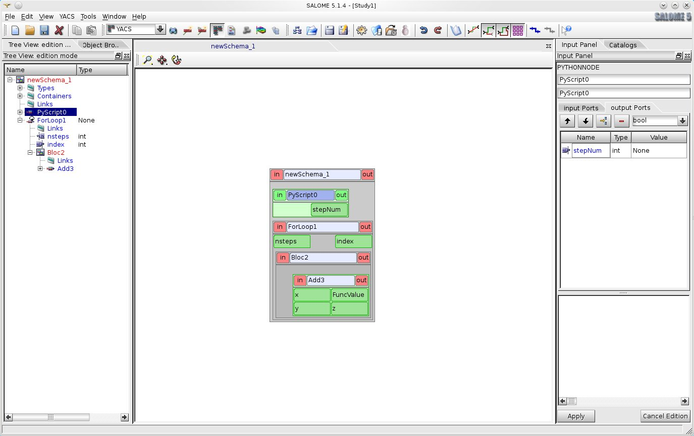
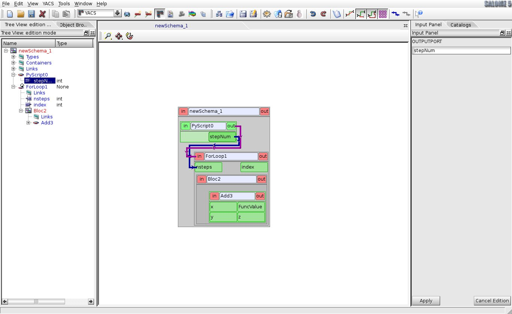
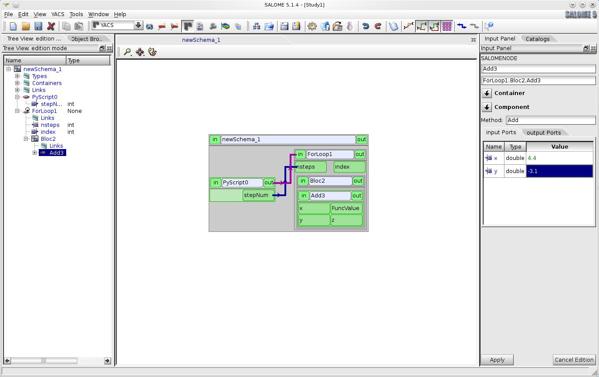

:tocdepth: 3

Creation of a schema from scratch
---------------------------------
In order to describe each main action let's describe step by step the creation of a simple schema from scratch.

After launching of Salome 4.1 activate YACS module with help of :ref:`modules`. In order to create a new schema it is needed to choose **New Schema** command from :ref:`file` or from the corresponding toolbar button on the :ref:`schema`. Having these operations done the state of the Salome
4.1 application would be like the following:

.. centered::
  **A new empty schema is created**

Create an inline script node by calling **Inline script** command from :ref:`creation`. As a result a new inline script node ( **PyScript0** in our example) without ports will be displayed in the 2D Viewer and the corresponding node object will be published in **Nodes** folder in the edition Tree View under the schema object.

.. centered::
  **Schema with a new created inline script node**

Further by the same way it is easy to create, for example, FOR loop node by choosing **FOR loop** command from :ref:`creation`. To simplify schema presentation in the 2D Viewer and makes it easier for the user perception it is recommended to use auto-arrange graph nodes operation which is accessible from :ref:`visualization`.

.. image:: images/functionality_list_85.jpg
  :align: center

.. centered::
  **FOR loop node has been added into the schema and 'Arrange nodes' operation has been applied**

Let's create a block node as a body of a new FOR loop node. For this purpose it is needed to select this node object ( **ForLoop0** in our example) in the Tree View and call **Create a body --> Block** item from its context popup menu.

.. image:: images/functionality_list_86.jpg
  :align: center

.. centered::
  **Creation of a body node**

As a result of this operation a block node with empty content will be added inside FOR loop node as its body node. The presentation of the schema in the 2D Viewer will be changed and block node item ( **Bloc0** in our example) will appear in the Tree View structure under its father FOR loop node.

.. image:: images/functionality_list_87.jpg
  :align: center

.. centered::
  **Tree View structure and presentation in the 2D Viewer after body block node creation**

Now it's time to fill in created block node with a child nodes. Select block node item in the Tree View and call **Create a node --> From catalog** item from context popup menu.

.. image:: images/functionality_list_88.jpg
  :align: center

.. centered::
  **Fill in block node content**

Input Panel with catalogs' content is displayed on the right side of the applications' desktop. Choose **Add** method from **AddComponent** component and press "Apply" button.

.. centered::
  **Choose a SALOME service node from the session catalog**

After closing the Input Panel we can see the following representation of a schema in the 2D Viewer.

.. centered::
  **SALOME service node is created inside the block**

Tree View structure is changed and now block node contains one SALOME service node ( **SalomeNode0** in our case), which executes the method named **Add** from **AddComponent** component of Salome.

So, the structure of the schema is defined and now it is the time to create input/output ports of schemas' nodes.

Firstly, let's consider inline script node **PyScript0** . To show Input Panel with node properties select **PyScript0** object either in the Tree View or in the 2D Viewer. Then activate "Output Ports" tab in the "Edit Ports" group of the Input Panel and click **+** button above the table of output ports. A new line corresponding to a new output port is added to the table. By default a new port is
a dataflow port and has a type of double. Let's input **stepNum** in the "Name" column as a name of a new port, change the type of port to **int** with help of pull-down list of the "Type" column and type

.. sourcecode:: python

    stepNum=3

in the built-in python code editor as an inline python script of the node.

.. centered::
  **Addition of output port and fill in python script for the PyScript0 node**

After pressing "Apply" button on the Input Panel a new output port **stepNum** is added to the **PyScript0** node and the structure of the Tree View and nodes' presentation in the 2D Viewer are changed in order to reflect these modifications.

.. centered::
  **2D Viewer and Tree View updates after port addition**

Further, link **stepNum** output port of the **PyScript0** node with **nsteps** input port of the **ForLoop0** node. For this purpose the user should to select **stepNum** output port object in the Tree View and call **Add dataflow link** command from its context popup menu.

.. centered::
  **Activate command for dataflow link addition**

After that select the **nsteps** input port of the **ForLoop0** node either in the Tree View or in the 2D Viewer. This port is considered as the end port of a new created link. Now the state of the Salome 4.1 application should be as the following:

.. centered::
  **A dataflow link is added**

In order to make the presentation of the schema more convenient from the user point of view the links can be rebuilt with help of **Rebuild links** command from :ref:`visualization`.

.. image:: images/functionality_list_95.jpg
  :align: center

.. centered::
  **A schema 2D Viewer representation after links rebuilding**

To create a valid schema it is needed also to set the values for input ports of the **SalomeNode0** node. For this purpose the user should to activate the Input Panel with SALOME service node properties by selecting **SalomeNode0** node either in the Tree View or in the 2D Viewer and change the content of "Value" column to, for example, **4.4** and **-3.1** double values for **x** and **y** input
port correspondingly.

.. centered::
  **Set input ports values for SALOME service node**

On the figure below the presentation of the schema after applying these changes is represented.

.. centered::
  **Completely created schema**

Now the schema is completely created. The user, for example, can export the schema into XML file (see :ref:`export_schema` section) for future import or execute this schema immediately (see :ref:`execute_schema` section).

