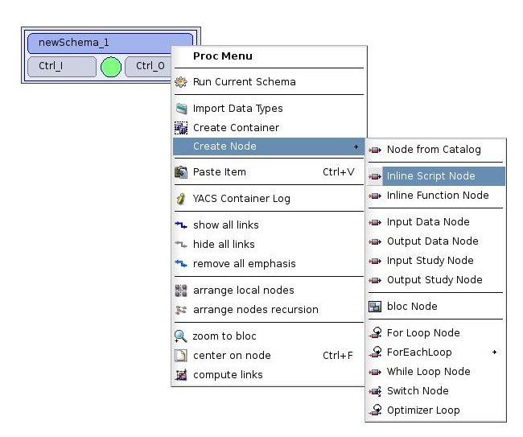
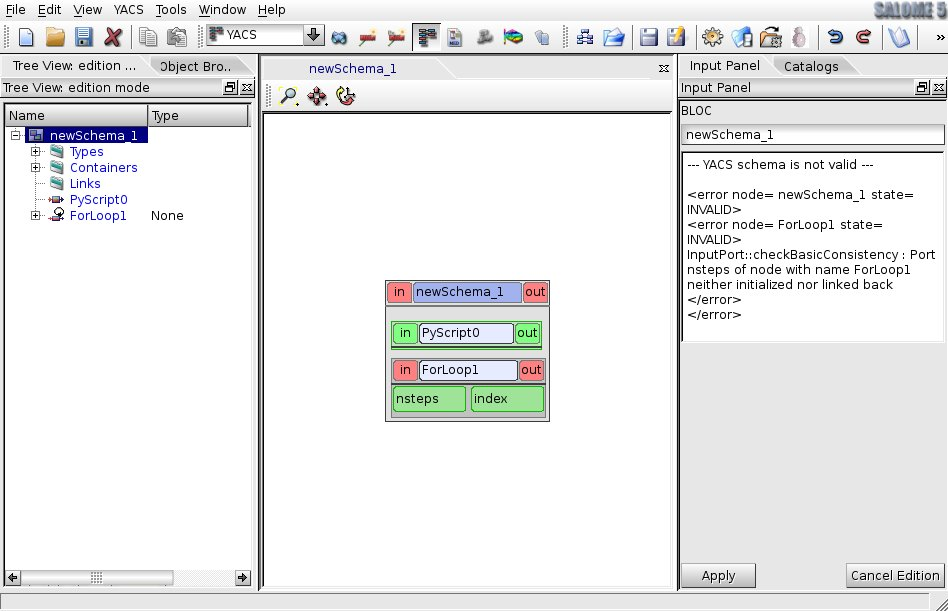
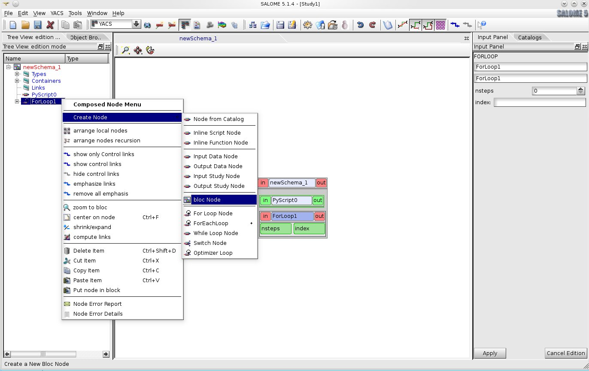
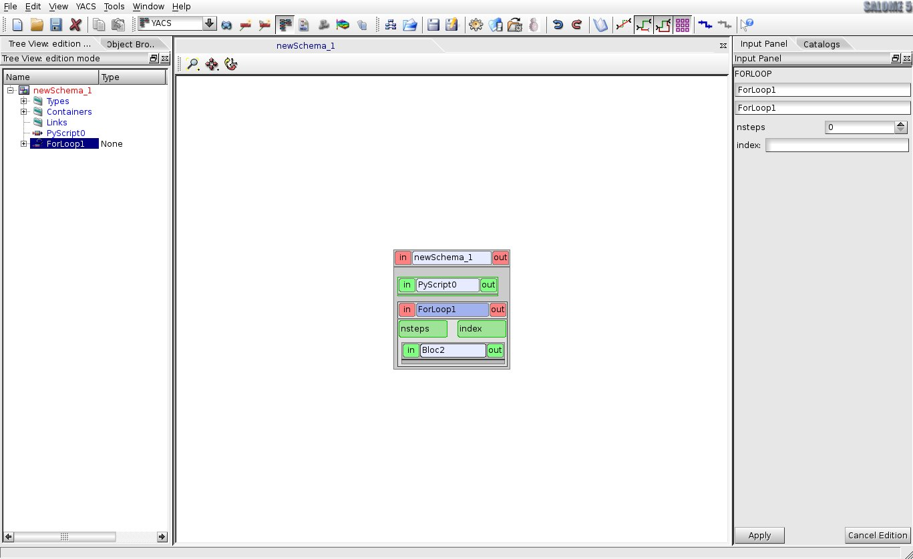
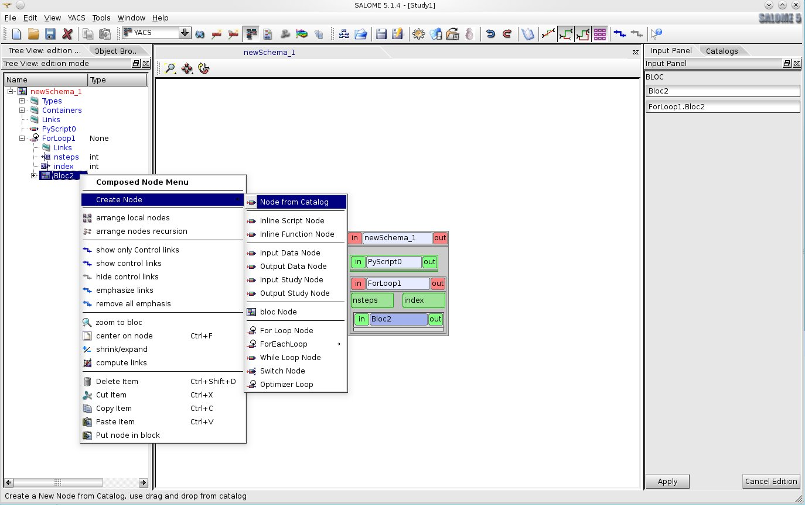
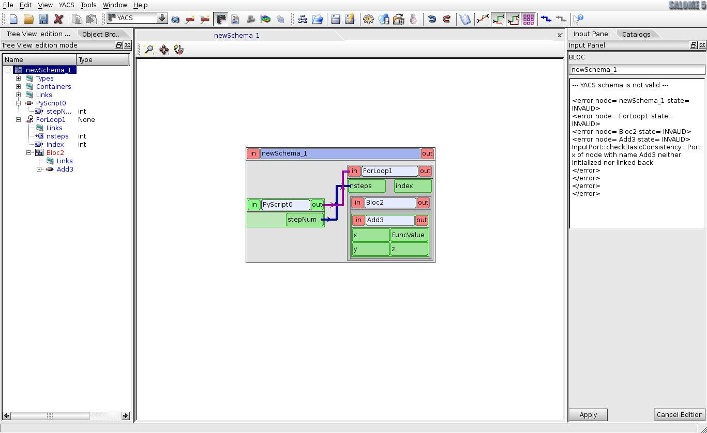

:tocdepth: 3

Creation of a schema from scratch
---------------------------------
In order to describe each main action let's describe step by step the creation of a simple schema from scratch.

After launching of SALOME activate YACS module with help of :ref:`modules`. In order to create a new schema it is needed to choose **New Schema** command from :ref:`file` or from the corresponding toolbar button on the :ref:`schema`. Having these operations done the state of the SALOME
application would be like the following:

.. image:: images/functionality_list_83.jpg
  :align: center

.. centered::
  **A new empty schema is created**

Create an inline script node by using the context menu on the **newSchema_1** node. 

As a result a new inline script node ( **PyScript0** in our example) without ports will be displayed in the 2D Viewer 
and the corresponding node object will be published in the edition Tree View under the schema object **newSchema_1**.

.. image:: images/functionality_list_84.jpg
  :align: center

.. centered::
  **Schema with a new created inline script node**

Further by the same way it is easy to create, for example, a FOR loop node by choosing **For Loop Node** entry 
in the context menu. To simplify schema presentation in the 2D Viewer and makes it easier for the user perception 
it is recommended to use auto-arrange graph nodes operation which is accessible from the context menu : entry **arrange local nodes**
for an automatic placement on one level of nodes or entry **arrange nodes recursion** for an automatic placement
on all levels.

.. centered::
  **FOR loop node has been added into the schema**

Let's create a block node as a body of the new FOR loop node. For this purpose it is needed to select this node object ( **ForLoop1** 
in our example) in the Tree View and call **Create Node --> bloc Node** item from its context popup menu. This operation is also possible
from the node context menu in the 2D Viewer.

.. centered::
  **Creation of a body node**

As a result of this operation a block node with empty content will be added inside FOR loop node as its body node. The presentation of 
the schema in the 2D Viewer will be changed and block node item ( **Bloc2** in our example) will appear in the Tree View structure 
under its father FOR loop node.

.. centered::
  **Tree View structure and presentation in the 2D Viewer after body block node creation**

Now it's time to fill in created block node with a child nodes. Select block node item in the Tree View and call
**Create Node --> Node from Catalog** item from context popup menu.

.. centered::
  **Fill in block node content**

Input Panel with catalogs' content is displayed on the right side of the applications' desktop. Choose **Add** service 
from **AddComponent** component and drag and drop it onto the bloc node.

.. image:: images/functionality_list_89.jpg
  :align: center

.. centered::
  **Choose a SALOME service node from the session catalog**

After the drag and drop, we can see the following representation of a schema in the 2D Viewer.

.. image:: images/functionality_list_90.jpg
  :align: center

.. centered::
  **SALOME service node is created inside the block**

Tree View structure is changed and now block node contains one SALOME service node ( **Add3** in our case), which executes 
the service named **Add** from **AddComponent** component of SALOME.

So, the structure of the schema is defined and now it is time to create input/output ports of schemas' nodes.

Firstly, let's consider inline script node **PyScript0**. To show Input Panel with node properties select **PyScript0** node 
either in the Tree View or in the 2D Viewer. Then activate "Output Ports" tab in the "Edit Ports" group of the Input Panel
and choose a data type (**int**) in the drop down menu. A new line corresponding to a new output port is added to the table. 
This new port is a dataflow port and has a type of int. Let's input **stepNum** in the "Name" column as the name of the 
new port and type

.. sourcecode:: python

    stepNum=3

in the built-in python code editor as an inline python script of the node. Finally, click on the **Apply** button to validate all
the changes. The structure of the Tree View and nodes’ presentation in the 2D Viewer are changed in order to reflect these modifications.

.. image:: images/functionality_list_92.jpg
  :align: center

.. centered::
  **2D Viewer and Tree View updates after port addition**

Further, link **stepNum** output port of the **PyScript0** node with **nsteps** input port of the **ForLoop1** node. For this purpose 
the user should select **stepNum** output port object in the 2D Viewer and drag and drop it onto input port **nsteps** of the **ForLoop1** node.
This port is considered as the end port of the newly created link. Now the state of the SALOME application should be as the following:

.. image:: images/functionality_list_94.jpg
  :align: center

.. centered::
  **A dataflow link is added**

In order to make the presentation of the schema more convenient from the user point of view the links and nodes can be 
automatically placed with help of **arrange nodes recursion** command from the context menu of **newShema_1** node.

.. centered::
  **A schema 2D Viewer representation after nodes placement**

To create a valid schema it is needed also to set the values for input ports of the **Add3** node. For this purpose the user should 
activate the Input Panel with SALOME service node properties by selecting **Add3** node either in the Tree View or in the 2D Viewer 
and change the content of "Value" column to, for example, **4.4** and **-3.1** double values for **x** and **y** input
port correspondingly.

.. image:: images/functionality_list_96.jpg
  :align: center

.. centered::
  **Set input ports values for SALOME service node**

Now the schema is completely created. The user, for example, can export the schema into XML file (see :ref:`export_schema` section) 
for future import or execute this schema immediately (see :ref:`execute_schema` section).

