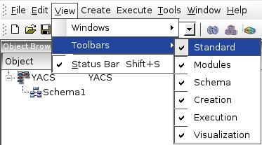
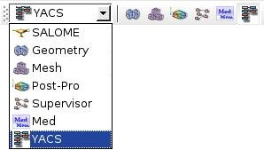
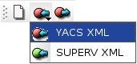
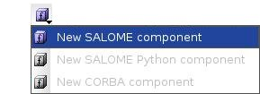
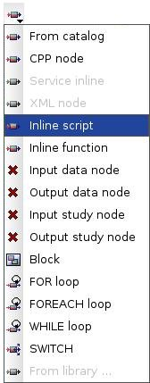
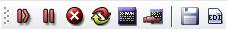
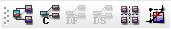

.. _toolbars:

Toolbars
========

The toolbar panel contains buttons for the quick access to the often-used operations. There are several toolbars on the toolbar panel. The user can maintain the toolbar visibility with help of menu **View --> Toolbars** .

Let's describe different types of toolbars in turn.

.. _standard:

Standard toolbar
----------------
Standard toolbar contains buttons for access to standard operations like new, open, save and close document, undo/redo commands.

.. _modules:

Modules toolbar
---------------

Module toolbar contains SALOME GUI module selector with a list of available modules and a set of toolbar buttons, one per module, 
to activate the module.

.. _schema:

Schema toolbar
--------------

Schema toolbar contains functions to import and export a schema. Schema toolbar contains the following toolbar buttons:

+ :ref:`create_new_schema`

+ Import Schema

    + :ref:`import_yacs_schema`

    + :ref:`import_supervisor_graph`

+ :ref:`export_schema`

.. _creation:

Creation toolbar
----------------

Creation toolbar contains functions for creation of container, component and node objects. Creation toolbar contains the following toolbar buttons:

+ :ref:`create_container_definition`

+ :ref:`create_component_instance_definition`

+ :ref:`create_node`

.. _execution_toolbar:

Execution toolbar
-----------------
Execution toolbar provides the means to control schemas' execution process. The content of the Execution toolbar depends on the current schema mode.

If the current mode is edition schema mode, the Execution toolbar consists of the following toolbar buttons:

+ :ref:`execute_schema`

+ :ref:`save_restore_execution_state` (from a state of execution saved previously)

+ New Batch Execution ( **Will be available in the future version!** )

In such a case there are only possibilities to create execution or load execution state. 'Load execution state' operation means loading state of schemas' execution saved previously into XML file. After that the user has a possibility to continue execution of a schema from the loaded execution state.

If a run schema mode is currently activated, the Execution toolbar looks like

Here is a list of operations available from the Execution toolbar in the run schema mode. Operations are enumerated corresponding to its positions in the toolbar.

+ :ref:`Start/Resume <start_resume>`

+ :ref:`Pause <pause_abort_reset>`

+ :ref:`Abort <pause_abort_reset>`

+ :ref:`Reset <pause_abort_reset>`

+ Execute in batch ( **Will be available in the future version!** )

+ Connect to a running batch session ... ( **Will be available in the future version!** )

+ :ref:`save_restore_execution_state`

+ :ref:`create_new_edition`

.. _visualization:

Visualization toolbar
---------------------
Visualization toolbar contains functions to manage representation of a schema object and access to algorithms to simplify schemas' view (such as arrange nodes and rebuild links algorithms).

Visualization toolbar has the same content both in the edition schema mode and run schema mode. It contains the following toolbar buttons:

+ :ref:`Full View <full_view_of_a_schema>`

+ :ref:`Control View <control_view_of_a_schema>`

+ Data Flow View ( **Will be available in the future version!** )

+ Data Stream View ( **Will be available in the future version!** )

+ :ref:`auto-arrange_nodes`

+ :ref:`rebuild_links`

