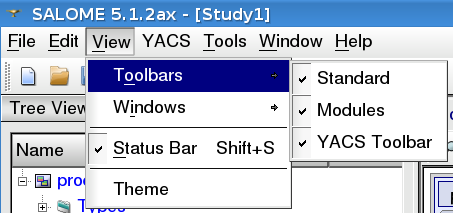
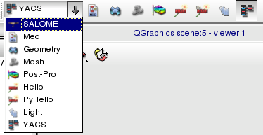

.. _toolbars:

Toolbars
========

The toolbar panel contains buttons for the quick access to the often-used operations. There are several toolbars on the toolbar panel. The user can maintain the toolbar visibility with help of menu **View --> Toolbars** .

Let's describe different types of toolbars in turn.

.. _standard:

Standard toolbar
----------------
Standard toolbar contains buttons for access to standard operations like new, open, save and close document, undo/redo commands.

.. _modules:

Modules toolbar
---------------

Module toolbar contains SALOME GUI module selector with a list of available modules and a set of toolbar buttons, one per module, 
to activate the module.

.. _schema:

YACS toolbar, no schema loaded
------------------------------

YACS toolbar contents depends on the edition or execution mode. Without any schema loaded, the toolbar is restricted to functions to import and export a schema. Schema toolbar contains the following toolbar buttons:

+ :ref:`create_new_schema` : create a new schema from scratch

+ :ref:`import_yacs_schema` : load a YACS schema saved on an XML file 

+ Load a Schema in run mode (without edition)

+ What's this mode : detailled help on a few items

.. _edition_toolbar:

YACS toolbar, edition mode
------------------------------

YACS toolbar in edition mode contains functions to import and export schemas, to switch to execution mode, to import catalogs, and to adjust behaviour of the 2D view:

+ :ref:`create_new_schema` : create a new schema from scratch

+ :ref:`import_yacs_schema` : load a YACS schema saved on an XML file 

+ Save Schema : save in the current opened file

+ :ref:`export_schema` : save with file dialog box to choose a new filename

+ :ref:`execute_schema` : switch from edition to run mode

+ :ref:`save_restore_execution_state` (from a state of execution saved previously)

+ Load a Schema in run mode (without edition)

+ Load a Schema to be executed on a batch system

+ Undo last edition (modification of nodes positions in 2D view are not undoable)

+ Redo last edition

+ Import Catalog : to import specific data types or nodes

+ Straight/Orthogonal : toggle between straight lines or orthogonal links

+ Automatic Links: toggle behaviour for automatic link reconstruction when 2D View layout changes

+ Simplify Links: toggle behaviour for link simplification (less segments)

+ Separate Links: toggle behaviour to try to avoid or not superposition of links 

+ Show all links: some links may have been selectively hidden

+ Hide all links

+ What's this mode : detailled help on a few items

.. _execution_toolbar:

YACS toolbar, execution mode
------------------------------

YACS toolbar in execution mode contains functions to import and export schemas, to execute the schema, step by step, with breakpoints or straightforward, to save state of execution, to reedit the schema:

+ :ref:`create_new_schema` : create a new schema from scratch

+ :ref:`import_yacs_schema` : load a YACS schema saved on an XML file 

+ Load a Schema in run mode (without edition)

+ :ref:`Start/Resume <start_resume>`

+ :ref:`Abort <pause_abort_reset>`

+ :ref:`Pause <pause_abort_reset>`

+ :ref:`Restart <pause_abort_reset>`

+ :ref:`save_restore_execution_state`

+ Set/reset Execution mode without stops

+ Set/reset Execution mode with breakpoints

+ Set/reset Execution mode step by step

+ Set/reset Stop execution on the first error

+ Straight/Orthogonal : toggle between straight lines or orthogonal links

+ Automatic Links: toggle behaviour for automatic link reconstruction when 2D View layout changes

+ Simplify Links: toggle behaviour for link simplification (less segments)

+ Separate Links: toggle behaviour to try to avoid or not superposition of links 

+ Show all links: some links may have been selectively hidden

+ Hide all links

 
+ What's this mode : detailled help on a few items

