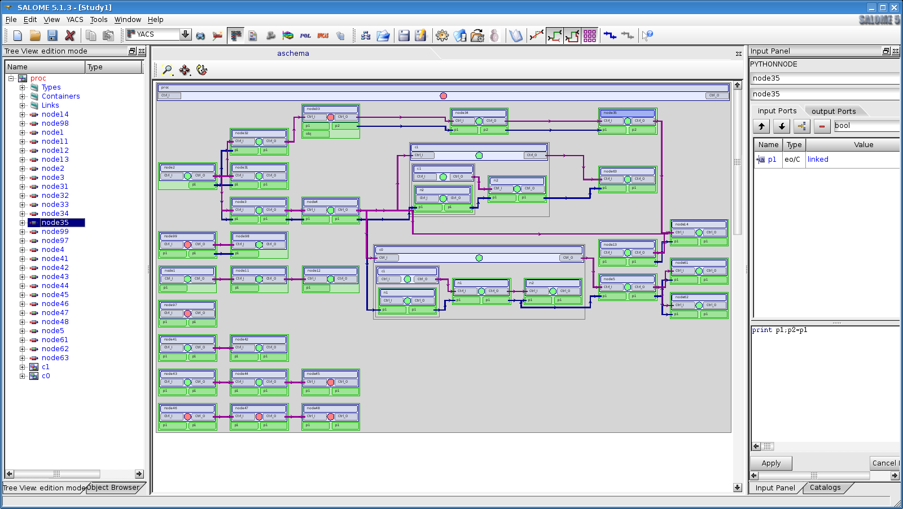

.. _using-index:

###############################
  The YACS User Guide 
###############################

There is an increasing need for multidisciplinary parametric simulations in various research and engineering fields. 
Examples are fluid-structure interaction and thermal coupling.
The simulation tools have become very sophisticated in their own domains, so multidisciplinary simulation can be achieved 
by coupling the existing codes.

YACS is a tool for managing multidisciplinary simulations through calculation schemes.

The YACS module can be used to build and execute calculation schemes.  A calculation scheme is a more or less complex 
assembly of calculation components (SALOME components or calculation codes or python scripts).
Therefore, a calculation scheme provides a means of defining a chain or coupling of calculation codes (see :ref:`principes`).

.. centered::
   YACS GUI

A calculation scheme can be built either using a graphic tool (see :ref:`gui`), 
or by editing an XML file directly (see :ref:`schemaxml`), or by using 
an application programming interface (API) in Python (see :ref:`schemapy`).
In this phase, chaining of components is defined with the associated dataflows.

Many examples of YACS schemas are installed with SALOME. They can be found in
the directory SALOME_APPLICATION/share/salome/yacssample (SALOME_APPLICATION
is the path where SALOME application is installed).

The calculation scheme can be executed from the graphic tool (see :ref:`execution`), but also in console 
mode (see :ref:`execxml`), or by using the Python interface (see :ref:`execpy`).

Executing a calculation scheme includes:

  - running and distributing components
  - managing data distribution
  - monitoring execution
  - stopping / suspending / restarting the execution

A calculation scheme can also be executed using a batch system such as LSF or PBS (see :ref:`batch`).

Finally, it is essential that calculation codes should be transformed into SALOME components, so that they can 
be coupled with YACS. In general, this operation requires good knowledge of SALOME principles (see :ref:`integration`).

For C++ calculation codes, the :ref:`hxx2salome` tool automates this operation to a large extent.

For Fortran, C and Python calculation codes that use CALCIUM type coupling, the :ref:`yacsgen` tool automatically 
generates the necessary SALOME embedment starting from a brief description of the selected coupling interface.

.. toctree::
   :maxdepth: 2

   rappels
   principes
   gui
   console
   python
   batch
   optimizer
   resource
   pmml

